############################################################################
APIs - Export Client Registration of an MQTT Topic Example (Using CloudMQTT)
############################################################################

============
Introduction
============

This page demonstrates how to register an MQTT topic as an endpoint of Export Distribution using the Export Client API.  That is, it demonstrates how to get Event/Reading sensor and device data collected by EdgeX services and get them to your designated MQTT topic.  For completeness of the example, the MQTT topic is created in CloudMQTT.  If you have your own MQTT Broker or alternate cloud provider, the general configuration steps will remain the same, but some properties (and property names) may vary from this document.

=================================
Establish the MQTT Topic Endpoint
=================================

For the purposes of this tutorial, it is assumed you have no MQTT Broker and no MQTT topic already created.  If you do, you can skip to the next section.  In this section, you create an MQTT topic in the "Cloud".  Specifically, you set up an MQTT topic with CloutMQTT.  CloudMQTT allows you to create a free topic for up to 5 user connections and at a rate of 10Kbit/second (sufficient for development and experimentation with EdgeX).  Production environments will require a different level of account or your own MQTT Broker to be established, but the steps and configuraion as shown here should be similar if not the exact same.

---------------------------
Create an CloudMQTT Account
---------------------------

Open a browser and go to https://customer.cloudmqtt.com/login, enter your email address under the "Create an Account" data field area, and then push the "Sign-up" button.

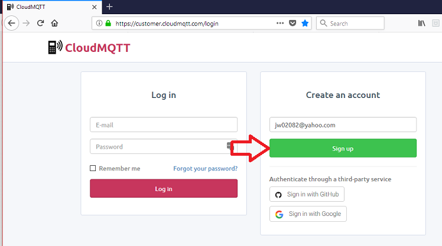

CloudMQTT will send you an email to complete the registration of a new CloudMQTT account.

-----------------------
Create an MQTT Instance
-----------------------

With your CloudMQTT account now established, you can create an MQTT instance in the cloud.  If not already logged in, return to https://customer.cloudmqtt.com/login and login to your account.  Next, push on the "Create New Instance" button on the Instances page to start the process to create a new instance.

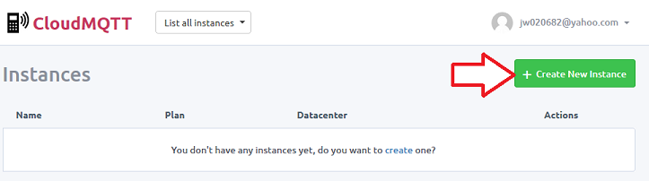

On the "Create new instance" page, enter EdgeXData as the name of your instance and then push the "Create New Instance" button (see #1 and #2 in the picture below).  Note that you are creating a "Cute Cat" free instance.  This instance will have limitations in the number of connections, speed and throughput to your MQTT topics.  The Cute Cat instance size is fine for the purposes of exploration in this demo.  For production environments, you will probably want a paid acount (and larger/ supported instance) or you will want to setup a topic via alternate provider (or even setup a topic on your own MQTT broker).

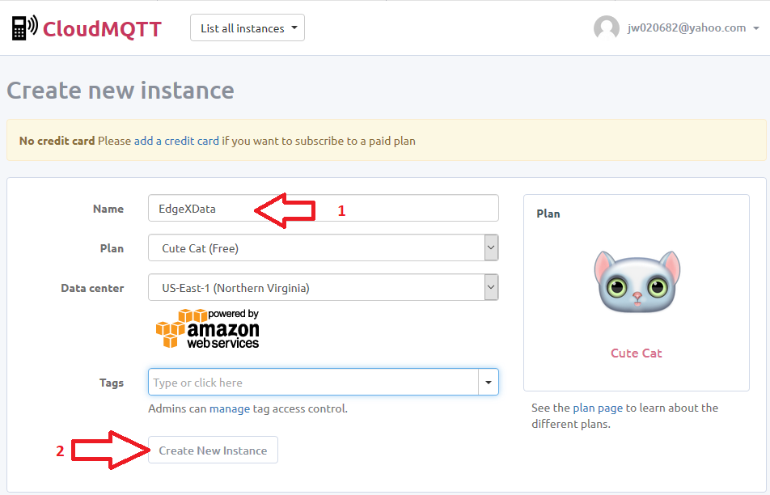

-----------------------------
Configure the User and Topic
-----------------------------

With the MQTT istance now created, you need to configure the MQTT topic and users with access to the topic.  On the Instances page displayed after creating the MQTT instance, click on the EdgeXData instance name in the instances listing.  

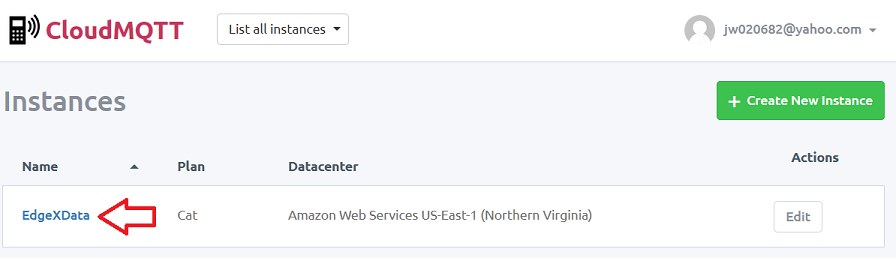

On the resulting Details page (note the instance info displayed on this page which will be used shortly), click on the "USERS & ACL" link in the tabs on the left hand navigational column.

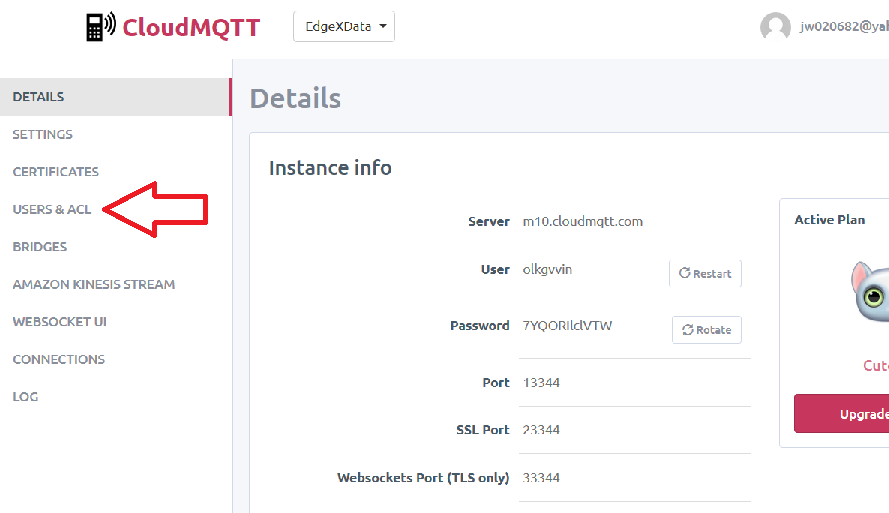

In the Users section, enter a name and password for your message publishing user.  For the purposes of this example, the username and password combination entered was "exportpublisher" and "mypassword".  After entering the username and password, push the +Add button.

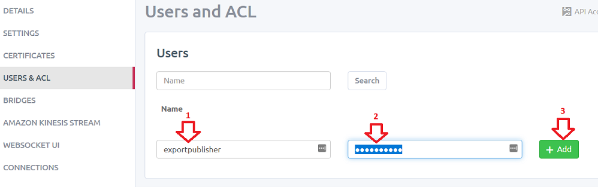

Now setup the topic and access rights to allow the exportpublisher to push messages into the MQTT topic.  On the same page, 
under the ACL section, follow these steps:

1. push on the "Topic" tab
2. from the Pattern dropdown, select exportpublisher
3. enter "edgexdatatopic" name in the Pattern field
4. check the Read Access? and Write Access? checkboxes
5. push the +Add button

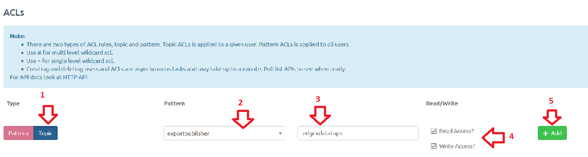

Your CloudMQTT topic is now ready for EdgeX to receive sensor data published by the Export Distribution service.

=================
Run EdgeX Foundry
=================

Obtain and start EdgeX Foundry.  In particular, per :doc:`../getting-started/Ch-GettingStartedUsers`, get Docker, Docker Compose setup and then pull the EdgeX docker containers.  After pulling the EdgeX containers, start these containers with the following commands in order:
+------------------------------------+-------------------------------------------------------------------------------------+------------------------------------------------+
|   **Docker Command**               |   **Description**                                                                   |  **Suggested Waiti Time After Completing**     |
+====================================+=====================================================================================+================================================+
| **docker-compose pull**            |  Pull down, but don't start, all the EdgeX Foundry microservices                    | Docker Compose will indicate when all the      |
|                                    |                                                                                     | containers have been pulled successfully       |     
+------------------------------------+-------------------------------------------------------------------------------------+------------------------------------------------+
| docker-compose up -d volume        |  Start the EdgeX Foundry file volume--must be done before the other services are    | A couple of seconds.  In the time it takes to  |
|                                    |  started                                                                            | type the next command it shoud be ready.       |   
+------------------------------------+-------------------------------------------------------------------------------------+------------------------------------------------+
| docker-compose up -d consul        |  Start the configuration and registry microservice which all services must          | A couple of seconds                            |
|                                    |  register with and get their configuration from                                     |                                                | 
+------------------------------------+-------------------------------------------------------------------------------------+------------------------------------------------+
| docker-compose up -d config-seed   |  Populate the configuration/registry microservice                                   | A couple of seconds                            |
+------------------------------------+-------------------------------------------------------------------------------------+------------------------------------------------+
| docker-compose up -d mongo         |  Start the NoSQL MongoDB container                                                  | 10 seconds                                     | 
+------------------------------------+-------------------------------------------------------------------------------------+------------------------------------------------+
| docker-compose up -d logging       |  Start the logging microservice - used by all micro services that make log entries  | A couple of seconds                            | 
+------------------------------------+-------------------------------------------------------------------------------------+------------------------------------------------+
| docker-compose up -d notifications |  Start the notifications and alerts microservice--used by many of the microservices | 30 seconds                                     |
|                                    |  Note: this service is still implemented in Java and takes more time to start       |                                                |
+------------------------------------+-------------------------------------------------------------------------------------+------------------------------------------------+
| docker-compose up -d metadata      |  Start the Core Metadata microservice                                               | A couple of seconds                            | 
+------------------------------------+-------------------------------------------------------------------------------------+------------------------------------------------+
| docker-compose up -d data          |  Start the Core Data microservice                                                   | A couple of seconds                            | 
+------------------------------------+-------------------------------------------------------------------------------------+------------------------------------------------+
| docker-compose up -d command       |  Start the Core Command microservice                                                | A couple of seconds                            | 
+------------------------------------+-------------------------------------------------------------------------------------+------------------------------------------------+
| docker-compose up -d scheduler     |  Start the scheduling microservice -used by many of the microservices               | 1 minute                                       |
|                                    |  Note: this service is still implemented in Java and takes more time to start       |                                                |
+------------------------------------+-------------------------------------------------------------------------------------+------------------------------------------------+
| docker-compose up -d export-client |  Start the Export Client registration microservice                                  | A couple of seconds                            |
+------------------------------------+-------------------------------------------------------------------------------------+------------------------------------------------+
| docker-compose up -d export-distro |  Start the Export Distribution microservice                                         | A couple of seconds                            |
+------------------------------------+-------------------------------------------------------------------------------------+------------------------------------------------+
| docker-compose up -d device-virtual|  Start the virtual device service                                                   | 1 minute                                       |
|                                    |  Note: this service is still implemented in Java and takes more time to start       |                                                |
|                                    |  This service mocks a sensor sending data to EdgX and is used for demonstration     |                                                |
+------------------------------------+-------------------------------------------------------------------------------------+------------------------------------------------+

============================================
Register Your MQTT Topic as an Export Client
============================================

With EdgeX now running and your MQTT topic created in the cloud (CloudMQTT), you can now register your MQTT endpoint as a recipient of EdgeX's data via Export Services.  Specifically, you need to register the CloudMQTT topic as a client through the Export Client service.

----------------------------
Check Existing Registrations
----------------------------
Using Postman or your favorite REST client tool to issue a GET request at the Export Client registration endpoint to see what clients are already registered to receive EdgeX data.  The REST address for registration is [host]:48071/api/v1/registration.  Unless you are returning to an existing instance of EdgeX with prior registrations, you should see an empty array returned by this request.

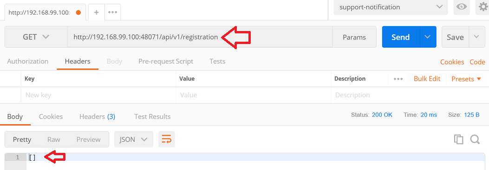

-----------------------------------------------------
Record the MQTT Topic Details Needed For Registration
-----------------------------------------------------

In the next step, you'll register your MQTT topic for receipt of EdgeX sensor data.  You will need details about your CloudMQTT account instance and topic to be able to register.

Return to the CloudMQTT Instances page (https://customer.cloudmqtt.com/instance).  Click on the EdgeXData link on the list of your instances to display the details of your MQTT instance.  Write down or otherwisre record the following information from your instance:

Server
User
Password
Port

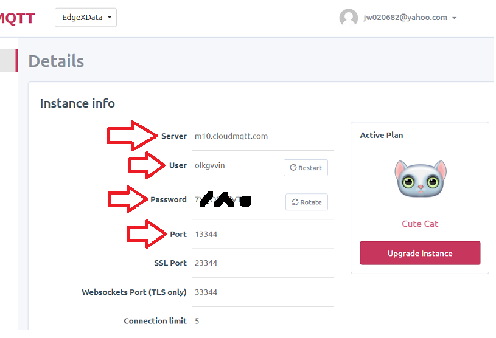

After recording this information, click on the USERS & ACL link on the left hand navigation bar and record the publisher and topic you created earlier.

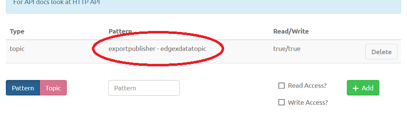

----------------------
Register the New Topic
----------------------

Now use Postman or your favorite REST client tool to issue a POST request at the Export Client registration endpoint to add your CloudMQTT topic as a recipient of EdgeX sensor data.  The REST address for registration is again [host]:48071/api/v1/registration, but this time make sure you add the following JSON to the body.

In the body of the POST request add JSON information about your MQTT topic.

*General Information*

* name: the name you want to give your Export client registration.  MyMQTTEndpoint is used here.
* format: JSON or XML are your options at this time
* enable:  true.  If set to false, data will cease being sent to the endpoint by Export distro
* destination:  set to MQTT_TOPIC.  This is used to designate the type of endpoint.  REST_ENDPOINT is used to designate that the endpoint is an HTTP endpoint.

*Addressable information*

* name: the name of the addressable.  MyMQTTTopicAddress is used here for example sake.
* protocol: TCP
* address:  this should be your Server address recorded from CloudMQTT details above.  In the example here, it is m10.cloudmqtt.com but your Server address may vary.
* port: this is the Server port recorded from CloudMQTT details above.  In the example here, it is 13344.
* publisher:  this is the publisher name from your USERS & ACL details recorded above.  In the example here, it is exportpublisher.
* user:  this is the Server user recorded from CloudMQTT details above.  In the example here, it is olkgvvin.
* password:  this is the Server password recorded from CloudMQTT details above.
* topic:  this is the topic name from your USERS & ACL details recorded above.  In the example here, it is edgexdatatopic.

The complete JSON body used for the example is below.  Make sure you supply your CloudMQTT server, user and topic details in place of the example details.

{"name":"MyMQTTEndpoint","addressable":{"name":"MyMQTTTopicAddress","protocol":"TCP","address":"m10.cloudmqtt.com","port":13344,"publisher":"exportpublisher","user":"olkgvvin", "password":"yourpasshere","topic":"edgexdatatopic"},"format":"JSON","enable":true,"destination":"MQTT_TOPIC"}

After submitting the POST request, you should get an ID response back from the Export Client service indicating that your registration was successful (see image below).  The ID is the database of the client registration.

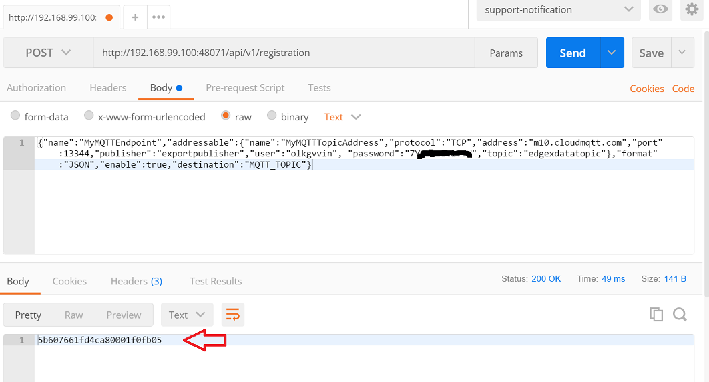

------------------------------
Recheck Existing Registrations
------------------------------

Again using Postman or your favorite REST client tool, re-issue a GET request at the Export Client registration endpoint to see what clients are now registered to receive EdgeX data.  The REST address for registration is [host]:48071/api/v1/registration.  This time, in the response body, you should see your new MQTT topic regisered as a client.

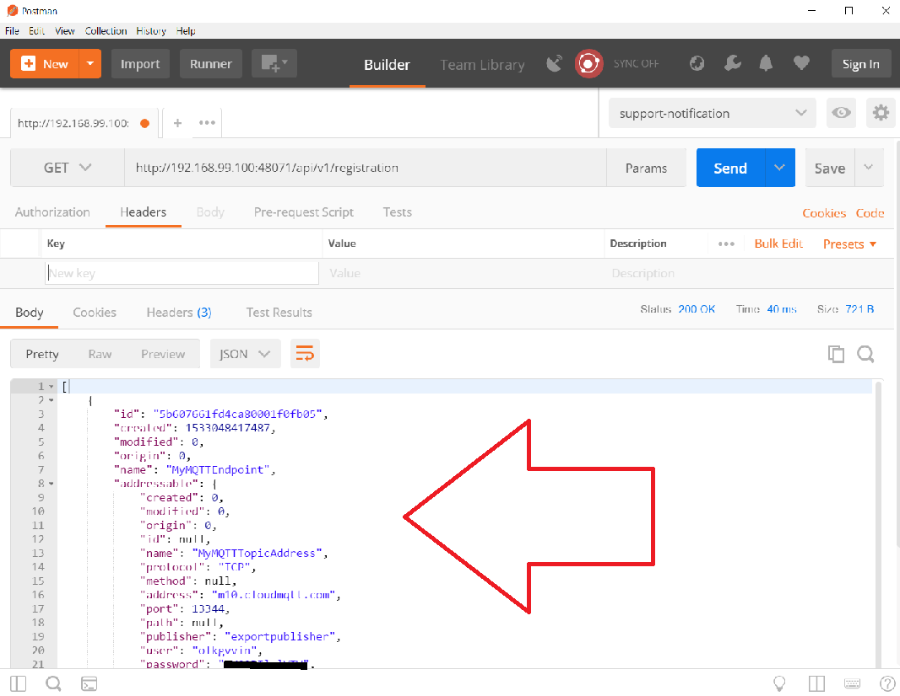

=========================================
See the EdgeX Data in the CloudMQTT Topic
=========================================

With EdgeX running and with your CloudMQTT topic registered as an export client, you can now see the data coming from your EdgeX instance appear in the cloud.

From the CloudMQTT Instances page, click on the EdgeXData instance to get to the instance details.

Find and click on the WEBSOCKET UI link in the navigation list on the left.

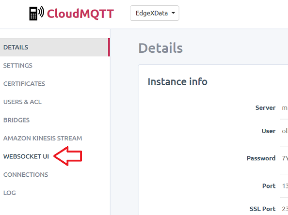

This will cause the Websocket screen to display and depending on the sensor data collection schedule, messages coming from EdgeX will probably already be displaying in the "Received Messages" area on the screen.  Congratulations, you have successfully exported EdgeX data to a topic in the cloud!

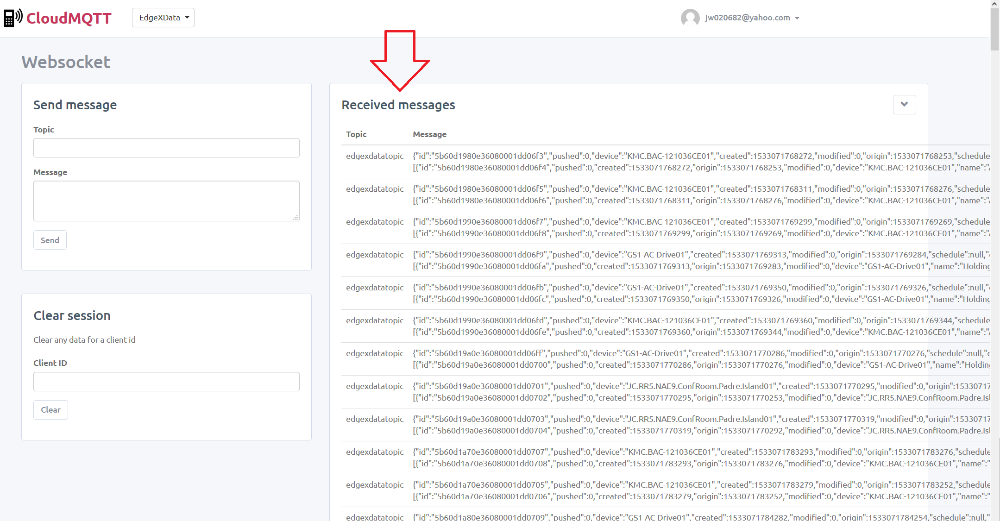

------------------------
Change the Format Output
------------------------

The content currently being exported is in JSON format.  Some systems require the data to be in a different format.  As an example, you can change the format to XML.  In order to update the export registration to change the format sent to your CloudMQTT topic, you can issue a PUT request to registration URL ([host]:48071/api/v1/registration) to change the format for your client.

Specifically, send the following JSON in the body of the PUT request to change the registration from JSON to XML.

{"name":"MyMQTTEndpoint","format":"XML"}

The result of the update should be a "true" response to suggest a successful update.

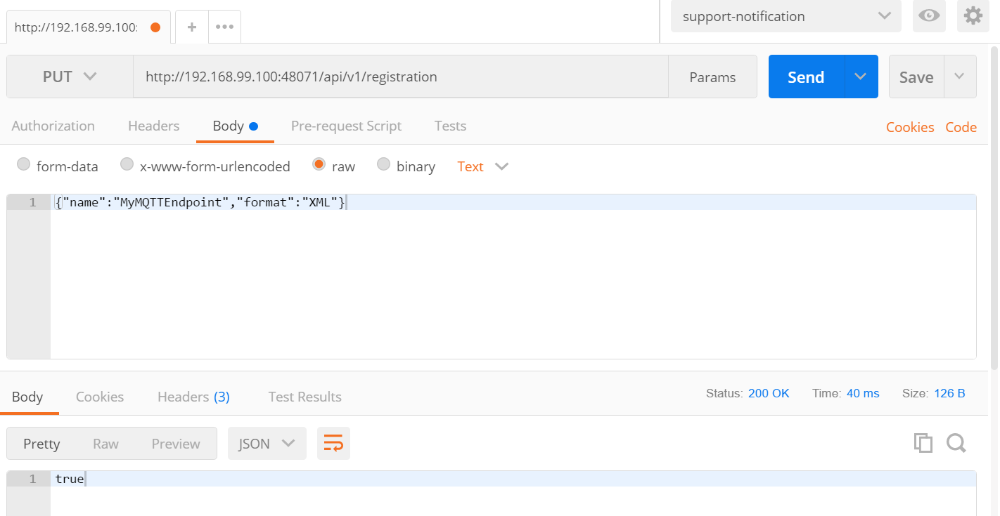

Return to the Websocket screen to see the data now being sent to your topic in XML format.

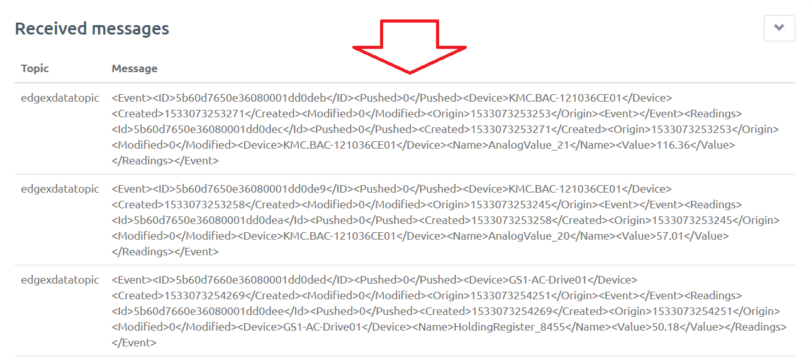
