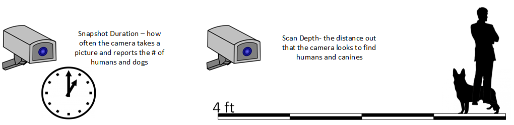
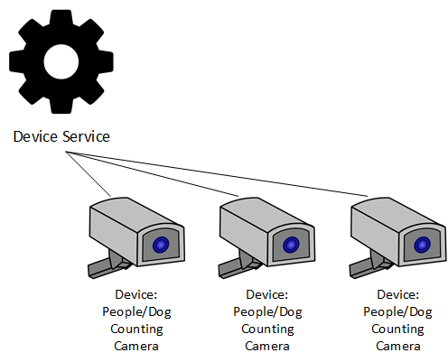
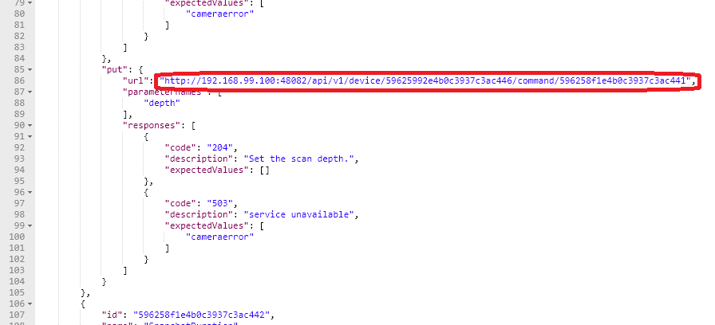
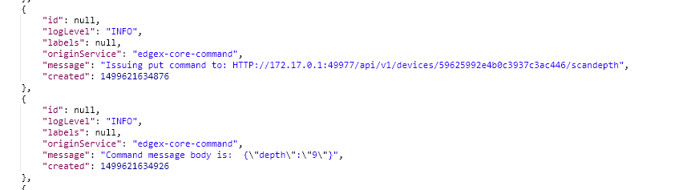
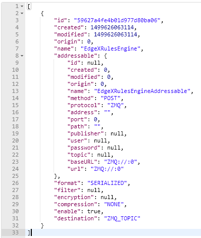

####################################
EdgeX Demonstration API Walk Through
####################################

In order to better appreciate the EdgeX Foundry micro services (what they do and how they work), how they inter-operate with each other, and some of the more important API calls that each micro service has to offer, this demonstration API walk through shows how a device service and device are established in EdgeX, how data is sent flowing through the various services, and how data is then shipped out of EdgeX to the cloud or enterprise system.  In essence, through this demonstration, you will play the part of various EdgeX micro services by manually making REST calls (via your favorite REST client tool - we like Postman for Chrome) in a way that mimics EdgeX system behavior.  After exploring this demonstration, and hopefully exercising the APIs yourself, you should have a much better appreciation of the EdgeX Foundry micro service capabilities.

=====
Setup
=====

If you wish to exercise the APIs in this walk through on your own system, first follow :doc:`../Ch-GettingStartedUsers` to get all the tools and EdgeX containers (you could also run all the services in a development environment, but this usually requires more time to get and setup - see :doc:`Ch-GettingStartedDevelopers` ).  When it comes time to run EdgeX Foundry, run all the services with the exception of any device services, including the device-virtual).  The reason is that many of the API calls you make as part of this walk through are actually accomplished by the virtual device service - or any device service for that matter.  In this walk through, your manual call of the EdgeX APIs often simulate the work that a device service would do to get a new device setup and to send data to/through EdgeX.  So, once you have Docker & Docker Compose installed and you have all the EdgeX Foundry containers, run the following commands to start the core, supporting and export micro services of EdgeX.

Start Edgex by using the following commands

+------------------------------------+-------------------------------------------------------------------------------------+------------------------------------------------+
|   **Docker Command**               |   **Description**                                                                   |  **Suggested Waiti Time After Completing**     |
+====================================+=====================================================================================+================================================+
| **docker-compose pull**            |  Pull down, but don't start, all the EdgeX Foundry microservices                    | Docker Compose will indicate when all the      |
|                                    |                                                                                     | containers have been pulled successfully       |
+------------------------------------+-------------------------------------------------------------------------------------+------------------------------------------------+
| docker-compose up -d volume        |  Start the EdgeX Foundry file volume--must be done before the other services are    | A couple of seconds.  In the time it takes to  |
|                                    |  started                                                                            | type the next command it shoud be ready.       |
+------------------------------------+-------------------------------------------------------------------------------------+------------------------------------------------+
| docker-compose up -d consul        |  Start the configuration and registry microservice which all services must          | A couple of seconds                            |
|                                    |  register with and get their configuration from                                     |                                                |
+------------------------------------+-------------------------------------------------------------------------------------+------------------------------------------------+
| docker-compose up -d config-seed   |  Populate the configuration/registry microservice                                   | A couple of seconds                            |
+------------------------------------+-------------------------------------------------------------------------------------+------------------------------------------------+
| docker-compose up -d mongo         |  Start the NoSQL MongoDB container                                                  | 10 seconds                                     |
+------------------------------------+-------------------------------------------------------------------------------------+------------------------------------------------+
| docker-compose up -d logging       |  Start the logging microservice - used by all micro services that make log entries  | A couple of seconds                            |
+------------------------------------+-------------------------------------------------------------------------------------+------------------------------------------------+
| docker-compose up -d notifications |  Start the notifications and alerts microservice--used by many of the microservices | 30 seconds                                     |
|                                    |  Note: this service is still implemented in Java and takes more time to start       |                                                |
+------------------------------------+-------------------------------------------------------------------------------------+------------------------------------------------+
| docker-compose up -d metadata      |  Start the Core Metadata microservice                                               | A couple of seconds                            |
+------------------------------------+-------------------------------------------------------------------------------------+------------------------------------------------+
| docker-compose up -d data          |  Start the Core Data microservice                                                   | A couple of seconds                            |
+------------------------------------+-------------------------------------------------------------------------------------+------------------------------------------------+
| docker-compose up -d command       |  Start the Core Command microservice                                                | A couple of seconds                            |
+------------------------------------+-------------------------------------------------------------------------------------+------------------------------------------------+
| docker-compose up -d scheduler     |  Start the scheduling microservice -used by many of the microservices               | 1 minute                                       |
|                                    |  Note: this service is still implemented in Java and takes more time to start       |                                                |
+------------------------------------+-------------------------------------------------------------------------------------+------------------------------------------------+
| docker-compose up -d export-client |  Start the Export Client registration microservice                                  | A couple of seconds                            |
+------------------------------------+-------------------------------------------------------------------------------------+------------------------------------------------+
| docker-compose up -d export-distro |  Start the Export Distribution microservice                                         | A couple of seconds                            |
+------------------------------------+-------------------------------------------------------------------------------------+------------------------------------------------+
| docker-compose up -d rulesengine   |  Start the Rules Engine microservice                                                | 1 minute                                       |
|                                    |  Note: this service is still implemented in Java and takes more time to start       |                                                |
+------------------------------------+-------------------------------------------------------------------------------------+------------------------------------------------+

Run a **"docker-compose ps"** command to confirm that all the containers have been downloaded and started.  (Note: initialization or seed containers, like config-seed, will have exited as there job is just to initialize the associated service and then exit.)

===================
Scenario / Use Case
===================

Suppose you had a new device that you wanted to connect to EdgeX.  The device was a camera that took a picture and then had an on-board chip that analyzed the picture and reported the number of humans and canines (dogs) it saw.

How often the camera takes a picture and reports its findings can be configured.  In fact, the camera device could be sent two actuation commands - that is sent two requests for which it must respond and do something.  You could send a request to set its time, in seconds, between picture snapshots (and then calculating the number of humans and dogs it finds in that resulting image).  You could also request it to set the scan depth, in feet, of the camera - that is set how far out the camera looks.  The farther out it looks, the less accurate the count of humans and dogs becomes, so this is something the manufacturer wants to allow the user to set based on use case needs.

In EdgeX, the camera must be represented by a Device.  Each Device is managed by a Device Service micro service.  The Device Service communicates with the underlying hardware - in this case the camera - in the protocol of choice for that Device.  The Device Service collects the data from the Devices it manages and passes that data into EdgeX (into Core Data).  In this case, the Device Service would be collecting the count of humans and dogs that the camera sees.  The Device Service also serves to translate the request for actuation from EdgeX and the rest of the world into protocol requests that the physical Device would understand.  So in this example, the Device Service would take requests to set the duration between snapshots and to set the scan depth and translate those requests into protocol commands that the camera understood.

Exactly how this camera physically connects to the host machine running EdgeX and how the Device Service works under the covers to communicate with the camera Device is immaterial for the point of this demonstration.

**Device and Device Service Setup (aka Device Service Creation and Device Provisioning)**

When a new Device Service is first started in EdgeX, there are many many tasks to perform - all in preparation for the Device Service to manage one or more Devices, which are yet unknown to EdgeX.  In general, the Device Service tasks when it first starts can be categorized into:

* Establish the reference information around the Device Service and Device.
* Make the Device Service itself known to the rest of EdgeX
* Provision the Devices the Device Service will manage with EdgeX

Reference information includes things such as defining the address (called an Addressable) of the Device and Device Service or establishing the new unit of measure (called a Value Descriptor in EdgeX) used by the Device.  The term "provision" is the way we talk about establishing the initial connection to the physical Device and have it be known to and communication with EdgeX.

After the initial start of a Device Service, these steps are not duplicated.  For example, after its initial startup, a Device Service would not need to re-establish the reference information into EdgeX.  Instead,it would simply check that these operations have been accomplished and do not need to be redone.

**Creating Reference Information in EdgeX**

There is a lot of background information that EdgeX needs to know about the Device and Device Service before it can start collecting data from the Device or send actuation commands to the Device.  Say, for example, the camera Device wanted to report its human and canine counts.  If it was just to start sending numbers into EdgeX, EdgeX would have no idea of what those numbers represented or even where they came from.  Further, if someone/something wanted to send a command to the camera, it would not know how to reach the camera without some additional information like where the camera is located on the network.  This background or reference information is what a Device Service must first setup in / with other EdgeX micro services when it comes up.  The API calls here give you a glimpse of this communication between the fledgling Device Service and the other EdgeX micro services.  By the way, the order in which these calls are shown may not be the exact order that a Device Service does them.  As you become more familiar with Device Services and the Device Service SDK, the small nuances and differences will become clear.

.. _`APIs Core Services Metadata`: https://github.com/edgexfoundry/edgex-go/blob/master/core/metadata/raml/core-metadata.raml
..

**Addressables**

See Core Metadata API RAML at `APIs Core Services Metadata`_ 

The Device Service will often establish at least two Addressable objects with the Core Metadata micro service.  An Addressable is a flexible EdgeX object that specifies a physical address of something - in this case the physical address of the Device Service and the Device (the camera).  While an Addressable could be created to suggest a named MQTT pipe or other protocol endpoint, for this example, we will assume that both the Device Service and Device are able to be reached via HTTP REST communications.  So in this case, the Device Service would make two calls to Core Metadata to create the Addressable for the Device Service...

::

   POST to http://localhost:48081/api/v1/addressable

:: 

   BODY: {"name":"camera control","protocol":"HTTP","address":"172.17.0.1","port":49977,"path":"/cameracontrol","publisher":"none","user":"none","password":"none","topic":"none"}

and the Addressable for the Device (the camera in this case).

:: 

   POST to http://localhost:48081/api/v1/addressable

::

   BODY: {"name":"camera1 address","protocol":"HTTP","address":"172.17.0.1","port":49999,"path":"/camera1","publisher":"none","user":"none","password":"none","topic":"none"}

Note that for an Addressable, a unique name must be provided.  Obviously, these address are phony and made up for the purposes of this exercise.  This is OK and it will still allow you to see how your Device and Device Services will work going forward.

**Walk Through Alert**

It is assumed that for the purposes of this walk through demonstration

* all API micro services are running on "localhost".  If this is not the case, substitute your hostname for localhost.
* any POST call has the associated CONTENT-TYPE=application/JSON header associated to it unless explicitly stated otherwise.

.. _`APIs Core Services Core Data`: https://github.com/edgexfoundry/edgex-go/blob/master/core/data/raml/core-data.raml
..

**Value Descriptors** 

See Core Data API RAML at `APIs Core Services Core Data`_

We are on our way through the demo!  Next, the Device Service needs to inform EdgeX about the type of data it will be sending on the behalf of the Devices.  If you are given the number 5, what does that mean to you?  Nothing, without some context and unit of measure.  For example, if I was to say 5 feet is the scan depth of the camera right now, you have a much better understanding about what the number 5 represents.  In EdgeX, Value Descriptors provide the context and unit of measure for and data (or values) sent to and from a Device.  As the name implies, a Value Descriptor describes a value - its unit of measure, its min and max values (if there are any), the way to display the value when showing it on the screen, and more.  Any data obtained from a Device (we call this "get" from the Device) or any data sent to the Device for actuation (we call this "set" or "put" to the Device) requires a Value Descriptor to be associated with that data.

In this demo, there are four Value Descriptors required:  human count, canine count, scan depth, and snapshot duration.  The Device Service would make four POST requests to Core Data to establish these Value Descriptors.

::

   POST to http://localhost:48080/api/v1/valuedescriptor

::

   BODY:  {"name":"humancount","description":"people count", "min":"0","max":"100","type":"I","uomLabel":"count","defaultValue":"0","formatting":"%s","labels":["count","humans"]}

::

   POST to http://localhost:48080/api/v1/valuedescriptor

::

   BODY:  {"name":"caninecount","description":"dog count", "min":"0","max":"100","type":"I","uomLabel":"count","defaultValue":"0","formatting":"%s","labels":["count","canines"]}

::

   POST to http://localhost:48080/api/v1/valuedescriptor

::

   BODY:  {"name":"depth","description":"scan distance", "min":"1","max":"10","type":"I","uomLabel":"feet","defaultValue":"1","formatting":"%s","labels":["scan","distance"]}

::

   POST to http://localhost:48080/api/v1/valuedescriptor

::

   BODY:  {"name":"duration","description":"time between events", "min":"10","max":"180","type":"I","uomLabel":"seconds","defaultValue":"10","formatting":"%s","labels":["duration","time"]}

An error can occur when communication with the camera.  Therefore a fifth Value Descriptor is created for this eventuality.

:: 

   POST to http://localhost:48080/api/v1/valuedescriptor

::
 
   BODY:  {"name":"cameraerror","description":"error response message from a camera", "min":"","max":"","type":"S","uomLabel":"","defaultValue":"error","formatting":"%s","labels":["error","message"]}

Again, the name of each Value Descriptor must be unique (within all of EdgeX).  The type of a Value Descriptor indicates the type of the associated value and is I (integer), F (floating point number), S (character or string), B (boolean), or J (JSON object).  Formatting is used by UIs and should follow the printf formatting standard for how to represent the associated value.

**Device Profile** 

See Core Metadata API RAML at `APIs Core Services Metadata`_ 

A Device Profile can be thought of as a template or as a type or classification of Device.  General characteristics about the type of Device, the data theses Devices provide, and how to command them is all provided in a Device Profile.  Other pages within this Wiki provide more details about a Device Profile and its purpose (see :doc:`../Ch-Metadata` to start).  It is typical that as part of the reference information setup sequence, the Device Service provides the Device Profiles for the types of Devices it manages to Core Metadata.  Since our fictitious Device Service will manage only the human/dog counting camera, it needs only make one POST request to create the monitoring camera Device Profile in Metadata.

Since Device Profiles are often represented in YAML, make a muti-part form-data POST with the Device Profile file below to create the Camera Monitor profile.

::

   POST to http://localhost:48081/api/v1/deviceprofile/uploadfile

No headers

FORM-DATA:

key:  "file"

value:  CameraMonitorProfile.yml

Each profile has a unique name along with a description, manufacturer, model and collection of labels to assist in queries for particular profiles.  These are relatively straightforward attributes of a profile.

**Understanding Commands**

The Device Profile defines how to communicate with any Device that abides by the profile.  In particular, it defines the Commands that can be sent to the Device (via the Device Service).  Commands are named and have either a get (for retrieving data from the Device) or put (to send data to the Device) or both.  Each Command can have a single get and single put.  Both get and put are optional, but it would not make sense to have a Command without at least one get or at least one put.  The Command name must be unique for that profile (the Command name does not have to be unique across all of EdgeX - for example, many profiles may contain a "status" Command).

**Understanding Command Gets and Puts**

The get and put each have a path which is used by EdgeX to call on the specific Command get or put at the URL address provided for the service.  Hypothetically, if the address to a Device Service was "http://abc:9999" and the get Command had a path of "foo", then internally, EdgeX would know to use "http://abc:9999/foo" to call on the get Command.

Get and puts then have response objects (an array of response objects).  A get must have at least one response object.  A put is not required to have a response.  Responses might be "good" or "error" responses.  Each get should have at least one "good" response, but it may have several error responses depending on what problems or issues the Device Service may need to reply with.  Each response is made up of a code (which suggests if it is a good or error response), a description (human readable information about what is in the response), and an array of expected values.  For practical purposes, the code is usually an HTTP status code like 200 (for good responses), 404 or 503 (examples of bad responses).

The expected values in a response are an array of Value Descriptor names.  If a call to an get Command is expected to return back the human and dog count data, then the response's expected values would be:  [humancount, caninecount].  When the actual call to the Device Service is made, the body of the return response from the service is expected to return a value for each of the expected values in a map where the Value Descriptor names are used as keys.  Again, using the human and dog counts as an example, if the expected values were [humancount, caninecount] then the body of a good response from the service would contain a map that looks something like this:

::

   {

     humancount: 5,
     caninecount: 2

   }

Here is an example set of responses that might be used for a get Command in the camera example.  Note that one response is coded as the "good" response (code 200) while the other is for "error" response (code 404).  The expected values for the good response are the Value Descriptor names for the camera's count data.  The expected values for the "error" response is the Value Descriptor name for an error message.

::

   "responses":[

               {"code":"200","description":"ok","expectedValues":["humancount", "caninecount"]},
               {"code":"404","description":"bad request","expectedValues":["cameraerror"]}

              ]

          }

**Understanding Command Parameters**

Commands are used to send data to Devices (via Device Services) as much as they are used to get data from Devices.  Therefore, any Command may have a set of parameters associated with its call.  Parameter data is added to the body of the Command request. Parameters are defined via an array of parameterNames on a Command.  Here again, this array is just an array of Value Descriptor names.  Each Value Descriptor defines the name and type of information to be supplied as a parameter to the Command call.  For example, if a Command had a parameterNames array of [speed, direction], then the receiving command is expecting values that match the speed and direction Value Descriptors.  Similar to the way expected values are used to set the keys of the response body, the paremater names are used as keys in a map to pass parameter values in a Command call that has parameters.  Here might be what is populated in the body of the Command call when the parameterNames are [speed, direction].

::

  {
    speed: 120,
    direction: 75
  }

If you open the CameraMonitoryProfile.yml file, see that there are Commands to get people and dog counts (and a command called Counts, which provides both values).  There are also commands to get/put the snapshot duration and scan depth.  Also note the expected values for the Commands.  The expected values should match the name of the Value Descriptors from above that give context to the returned values.  In real implementations, the Device Profile may contain many more details (like device resource and resource elements) to assist the Device Service in its communications with Devices.

**Expected Values Alert**

* Metadata does not currently check that the expected values match an existing Value Descriptor by name.  Therefore, make sure you provide the expected values array carefully when creating Device Profiles.

**Create the Device Service in EdgeX**

Once the reference information is established by the Device Service in Core Data and Meta Data, the Device Service can register or define itself in EdgeX.  That is, it can proclaim to EdgeX that "I have arrived and am functional."

.. _`APIs Core Services Configuration and Registry`: Ch-Configuration.html
..

**Register with Core Configuration and Registration Micro Service** 

See `APIs Core Services Configuration and Registry`_

Part of that registration process of the Device Service, indeed any EdgeX micro service, is to register itself with the Core Configuration & Registration.  In this process, the micro service provides its location to the Config/Reg micro service and picks up any new/latest configuration information from this central service.  Since there is no real Device Service in this demonstration, this part of the inter-micro service exchange is not explored here.  //Documentation TO-DO, show API exchange of registration and retrieval of config information//

**Create the Device Service in Metadata**

See `APIs Core Services Metadata`_ 

The Device Service must then create an instance of itself in Core Metadata. It is in this registration, that the Device Service is associated to the Addressable for the Device Service that is already Core Metadata. Make this POST to Core Metadata to create the Device Service (using the Addressable's unique name to establish the association)

::

   POST to http://localhost:48081/api/v1/deviceservice

::

   BODY: {"name":"camera control device service","description":"Manage human and dog counting cameras","labels":["camera","counter"],"adminState":"unlocked","operatingState":"enabled","addressable":  
   {"name":"camera control"}}

The name of the Device Service must be unique across all of EdgeX.  Note the admin and operating states.  The administrative state (aka admin state) provides control of the Device Service by man or other systems.  It can be set to locked or unlocked.  When a Device Service is set to locked, it is not suppose to respond to any Command requests nor send data from the Devices.  The operating state (aka op state) provides an indication on the part of EdgeX about the internal operating status of the Device Service.  The operating state is not set externally (as by another system or man), it is a signal from within EdgeX (and potentially the Device Service itself) about the condition of the service.  The operating state of the Device Service may be either enabled or disabled.  When the operating state of the Device Service is disabled, it is either experiencing some difficulty or going through some process (for example an upgrade) which does not allow it to function in its normal capacity.

**Provision a Device** 

See `APIs Core Services Metadata`_ 

In the last act of setup, a Device Service often discovers and provisions new Devices it finds and is going to manage on the part of EdgeX.  Note the word "often" in the last sentence.  Not all Device Services will discover new Devices or provision them right away.  Depending on the type of Device and how the Devices communicate, it is up to the Device Service to determine how/when to provision a Device.  In some rare cases, the provisioning may be triggered by a human request of the Device Service once everything is in place and once the human can provide the information the Device Service needs to physically connect to the Device.  For the sake of this demonstration, the call to Core Metadata below will provision the human/dog counting monitor camera as if the Device Service discovered it (by some unknown means) and provisioned the Device as part of some startup process.  To create a Device, it must be associated to a Device Profile (by name or id), a Device Service (by name or id), and Addressable (by name or id).  When calling each of the POST calls above, the ID was returned by the associated micro service and used in the call below.  In this example, the names of Device Profile, Device Service, and Addressable are used.

::

   POST to http://localhost:48081/api/v1/device

::

   BODY:  {"name":"countcamera1","description":"human and dog counting camera #1","adminState":"unlocked","operatingState":"enabled","addressable":{"name":"camera1 address"},"labels":
   ["camera","counter"],"location":"","service":{"name":"camera control device service"},"profile":{"name":"camera monitor profile"}}

**Test the Setup**

With the Device Service and Device now appropriately setup/provisioned in EdgeX, let's try a few of the micro service APIs out to confirm that things have been configured correctly.

**Check the Device Service** 

See `APIs Core Services Metadata`_

To begin, check out that the Device Service is available via Core Metadata.

::

   GET to http://localhost:48081/api/v1/deviceservice

Note that the associated Addressable is returned with the Device Service.  There are many additional APIs on Core Metadata to retrieve a Device Service.  As an example, here is one to find all Device Services by label - in this case using the label that was associated to the camera control device service.

::

   GET to http://localhost:48081/api/v1/deviceservice/label/camera

**Check the Device**

See `APIs Core Services Metadata`_

Ensure the monitor camera is among the devices known to Core Metadata.

::

   GET to http://localhost:48081/api/v1/device

Note that the associated Device Profile, Device Service and Addressable is returned with the Device.  Again, there are many additional APIs on Core Metadata to retrieve a Device.  As an example, here is one to find all Devices associated to a given Device Profile - in this case using the camera monitor profile Device Profile name.

::

   GET to http://localhost:48081/api/v1/device/profilename/camera monitor profile

.. _`APIs Core Services Command`: https://github.com/edgexfoundry/edgex-go/blob/master/core/command/raml/core-command.raml
..

**Check the Commands** 

See `APIs Core Services Command`_

Recall that the Device Profile (the camera monitor profile) included a number of Commands to get and put information from any Device of that type.  Also recall that the Device (the countcamera1) was associated to the Device Profile (the camera monitor profile) when the Device was created/provisioned with Core Metadata.  Now with all the setup complete, you can ask the Core Command micro service for the list of Commands associated to the Device (the countcamera1).

::

   GET to http://localhost:48082/api/v1/device/name/countcamera1

Note all of the URLs returned as part of this response!  These are the URLs that clients (internal or external to EdgeX) can call to trigger the various get and put offerings on the Device.

**Check the Value Descriptors** 

See `APIs Core Services Core Data`_

See that the Value Descriptors are in Core Data.  There should be a total of 5 Value Descriptors in Core Data.  Note that Value Descriptors are stored in Core Data, yet referenced in Metadata.  This is because as data coming from a Device is sent to Core Data, Core Data may need to validate the incoming values against the associated Value Descriptor parameters (like min, max, etc.) but without having to make a trip to Core Metadata to do that validation.  Getting data into Core Data is a key function of EdgeX and must be accomplished as quickly as possible (without having to make additional REST requests).

::

   GET to http://localhost:48080/api/v1/valuedescriptor

While we're at it, check that no data has yet been shipped to Core Data.  Since the Device Service and Device are in this demonstration wholly manually driven by you, no sensor data should yet have been collected.  You can test this theory by asking for the count of Events in Core Data.

::

   GET to http://localhost:48080/api/v1/event/count

**Execute a Command (sort of)**

While there is no real Device or Device Service in this walk through, EdgeX doesn't know that.  Therefore, with all the configuration and setup you have performed, you can ask EdgeX to set the scan depth or set the snapshot duration to the camera, and EdgeX will dutifully try to perform the task. Of course, since no Device Service or Device exists, as expected EdgeX will ultimately responds with an error. However, through the log files, you can see a Command made of the Core Command micro service, attempts to call on the appropriate Command of the fictitious Device Service that manages our fictitious camera.

For example sake, let's launch a Command to set the scan depth of countcamera1 (the name of the single human/dog counting camera Device in EdgeX right now). The first task to launch a request to set the scan depth is to get the URL for the Command to "PUT" or set a new scan depth on the Device.  As seen above request a list of the Commands by the Device name with the following API on Core Command

::

   GET to http://localhost:48082/api/v1/device/name/countcamera1

Now locate and copy the URL for the PUT Depth Command.  Because of the IDs used, this will be different on each system so a generic API call will not suffice here.  Below is a picture containing a slice of the JSON returned by the GET request above and desired PUT Command URL highlighted - yours will vary based on IDs.

Copy this URL into your REST client tool of choice and make a PUT to that URL on Core Command with the new depth as the parameter with that request.

::

   PUT to http://localhost:48082/api/v1/device/<system specific device id>/command/<system specific command id>

::

   BODY:  {"depth":"9"}

Again, because no Device Service (or Device) actually exists, Core Command will respond with an HTTP 503 Service Unavailable error (Service issue: Connection refused message in the body).  However, invoking the following request of the Support Logging micro service will prove that the Core Command micro service did receive the request and attempted to call on the non-existent Device Service to issue the actuating command.

::

   GET to http://localhost:48061/api/v1/logs/logLevels/INFO/originServices/edgex-core-command/0/9000000000000/100

**Send an Event/Reading** 

See `APIs Core Services Core Data`_

In the real world, the human/dog counting camera would start to take pictures, count beings, and send that data to EdgeX.  To simulate this activity. in this section, you will make Core Data API calls as if you were the camera's Device and Device Service.

Data is submitted to Core Data as an Event.  An Event is a collection of sensor readings from a Device (associated to a Device by its ID or name) at a particular point in time.  A Reading in an Event is a particular value sensed by the Device and associated to a Value Descriptor (by name) to provide context to the reading.  So, the human/dog counting camera might determine that there are current 5 people and 3 dogs in the space it is monitoring.  In the EdgeX vernacular, the Device Service upon receiving these sensed values from the Device would create an Event with two Readings - one Reading would contain the key/value pair of humancount:5 and the other Reading would contain the key/value pair of caninecount:3.

The Device Service, on creating the Event and associated Reading objects would transmit this information to Core Data via REST call.

::

   POST to http://localhost:48080/api/v1/event

::

   BODY: {"device":"countcamera1","readings":[{"name":"humancount","value":"5"},{"name":"caninecount","value":"3"}]}

If desired, the Device Service can also supply an origin property (see below) to the Event or Reading to suggest the time (in Epoch timestamp/milliseconds format) at which the data was sensed/collected.  If an origin is not provided, no origin will be set for the Event or Reading, however every Event and Reading is provided a Created and Modified timestamp in the database to give the data some time context.

::

   BODY: {"device":"countcamera1","origin":1471806386919, "readings":[{"name":"humancount","value":"1","origin":1471806386919},{"name":"caninecount","value":"0","origin":1471806386919}]}

**Origin Timestamp Recommendation**

Note:  Smart devices will often timestamp sensor data and this timestamp can be used as the origin timestamp.  In cases where the sensor/device is unable to provide a timestamp ("dumb" or brownfield sensors), it is recommended that the Device Service create a timestamp for the sensor data that is applied as the origin timestamp for the Device.

**Explore Core Data**

Now that an Event (or two) and associated Readings have been sent to Core Data, you can use the Core Data API to explore that data that is now stored in MongoDB.

Recall from the Test Setup section, you checked that no data was yet stored in Core Data.  Make the same call and this time, 2 Event records should be the count returned.

::

   GET to http://localhost:48080/api/v1/event/count

Retrieve 10 of the Events associated to the countcamera1 Device.

::

   GET to http://localhost:48080/api/v1/event/device/countcamera1/10

Retrieve 10 of the human count Readings associated to the countcamera1 Device (i.e. - get Readings by Value Descriptor)

::

   GET to http://localhost:48080/api/v1/reading/name/humancount/10

**Register an Export Client**

Great, so the data sent by the camera Device makes it way to Core Data.  How can that data be sent to an enterprise system or the Cloud?  How can that data be used by an edge analytics system (like the Rules Engine provided with EdgeX) to actuate on a Device?  Anything wishing to receive the sensor/device data as it comes into EdgeX must register as an "export" client.

In fact, by default, the Rules Engine is automatically registered as a client of the export services and automatically receives all the Events/Readings from Core Data that are sent by Devices.  To see all the existing export clients, you can request a list from the Export Client micro service.

::

   GET to http://localhost:48071/api/v1/registration

The response from Export Client is a list of registered client details - in this case just the Rules Engine is registered.

To register a new client to receive EdgeX data, you will first need to setup a client capable of receiving HTTP REST calls, or an MQTT topic capable of receiving messages from EdgeX.  For the purposes of this demonstration, let's say there is an cloud based MQTT Topic that has been setup ready to receive EdgeX Event/Reading data.  To register this MQTT endpoint to receive all Event/Reading data, in JSON format, but encrypted, you will need to request Export Client to make a new EdgeX client.

:: 

   POST to http://localhost:48071/api/v1/registration

::

   BODY: {"name":"MyMQTTTopic","addressable":{"name":"MyMQTTBroker","protocol":"TCP","address":"tcp://m10.cloudmqtt.com","port":15421,"publisher":"EdgeXExportPublisher","user":"hukfgtoh","password":"mypass","topic":"EdgeXDataTopic"},"format":"JSON","encryption"{"encryptionAlgorithm":"AES","encryptionKey":"123","initializingVector":"123"},"enable":true}
   	 
 		 
Note that the Addressable for the REST address is built into the request.

Now, should a new Event be posted to Core Data, the Export Distro micro service will attempt to sent the encrypted, JSON-formated Event/Reading data to the MQTT client.  Unless you have actually setup the MQTT Topic to receive the messages, Export Distro will fail to deliver the contents and an error will result.  You can check the Export Distro log to see the attempt was made and that the EdgeX Export services are working correctly, despite the non-existence of the receiving MQTT Topic.

MQTTOutboundServiceActivator: message sent to MQTT broker:  

::

   Addressable [name=MyMQTTBroker, protocol=TCP, address=tcp://m10.cloudmqtt.com, port=15421, path=null, publisher=EdgeXExportPublisher, user=hukfgtoh, password=mypass, topic=EdgeXDataTopic, toString()=BaseObject [id=null, created=0, modified=0, origin=0]] : 596283c7e4b0011866276e9

