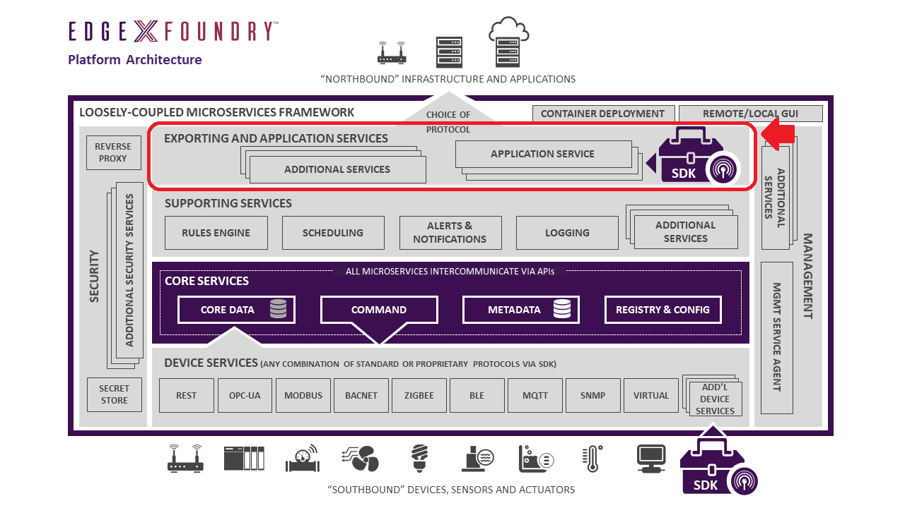

##################################
Application Services Microservices
##################################

Application Services are the means to extract, process/transform and send event/reading data from EdgeX to an endpoint or process of your choice.

Application Services are based on the idea of a "Functions Pipeline". A functions pipeline is a collection of functions that process messages (in this case EdgeX event/reading messages) in the order that you've specified.  The first function in a pipeline is a trigger.  A trigger begins the functions pipeline execution.  A trigger is something like a message landing in a watched message queue.

An SDK is provided (the Applicaiton Functions SDK) to help build Application Services by assembling triggers, pre-existing functions and custom functions of your making into a pipeline.

.. toctree::
   :maxdepth: 1

   Ch-ApplicationServices
   Ch-ApplicationFunctionsSDK

**Note** Application Services will replace Export Services in a future EdgeX release.
