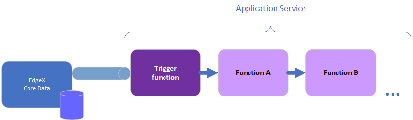
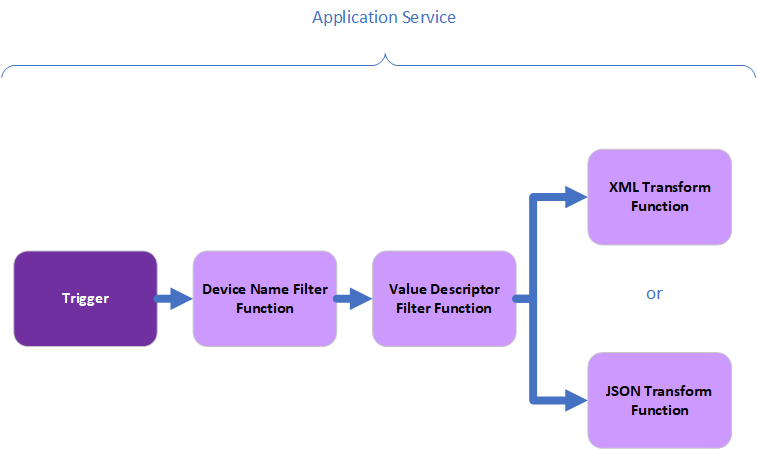

Application Services
====================

Application Services are a means to get data from EdgeX Foundry to external systems and process (be it analytics package, enterprise or on-prem application, cloud systems like Azure IoT, AWS IoT, or Google IoT Core, etc.).  Application Services provide the means for data to be prepared (transformed, enriched, filtered, etc.) and groomed (formatted, compressed, encrypted, etc.) before being sent to an endpoint of choice.  Endpoints supported out of the box today include HTTP and MQTT endpoints, but will include additional offerings in the future and could include a custom endpoints.

The intention of Application Services are to address scalability concerns of the existing EdgeX Export Client and Distribution Services (Export Services) as well as provide a flexible solution for exporting data outside of EdgeX without encumbering the EdgeX development community itself with trying to support all major cloud providers and export solutions. For the Edinburgh release cycle, the existing Client and Export Service remain supported and are still considered the primary way to export data out of EdgeX. However, it is encouraged for new development efforts adopting EdgeX that the App Functions SDK and resulting Application Services be leveraged moving forward with the intention that by the Fuji release, the SDK will be moved into release status and become the primary method of exporting data from EdgeX.

Application Services are based on the idea of a "Functions Pipeline". A functions pipeline is a collection of functions that process messages (in this case EdgeX event/reading messages) in the order that you've specified.  The first function in a pipeline is a trigger.  A trigger begins the functions pipeline execution.  A trigger is something like a message landing in a watched message queue.

An Applications Functions Software Development Kit (or App Functions SDK) is a available to help create Application Services. Currently the only SDK supported language is Golang, with the intention that community developed and supported SDKs will come in the future for other languages. It is currently available as a Golang module to remain operating system (OS) agnostic and to comply with the latest EdgeX guidelines on dependency management.

Export Service Deficiencies
---------------------------

With the current export services, developers register their endpoints or MQTT clients with the provided client registration service and as events are consumed from Core Data, the export service would then relay that information to the registered endpoints in a sequential fashion. Requiring the individual export service to rebroadcast data to all registered endpoints overtime creates a bottleneck and leaves applications with a potential delay in receiving events. Furthermore, the overhead and complexity of managing all registered endpoints becomes an added burden to EdgeX services. Finally, the Export services have also begun to address a bit more than is sustainable in regard to supporting all the major cloud provider endpoints. Providing an SDK and removing cloud specific exports is one way to remain agnostic to cloud providers and enables 3rd parties to support their use of any given cloud solution and eliminates the dependency
on EdgeX to support the ever-changing cloud environment.

Application Service Improvements
---------------------------------

Providing an SDK that connects directly to a message bus by which Core Data events are published eliminates performance issues as well as allow the developers extra control on what happens
with that data as soon as it is available. Furthermore, it emphasizes configuration over registration for consuming the data. The application services can be customized to a client's needs and thereby also removing the need for client registration.

Standard Functions
------------------

As mentioned, an Application Service is a function pipeline.  The SDK provides some standard functions that can be used in a functions pipeline.  In the future, additional functions will be provided "standard" or in other words provided with the SDK.  Additinally, developers can implement their own custom functions and add those to the Application Service functions pipeline.

One of the most common use cases for working with data that come from Core Data is to filter data down to what is relevant for a given application and to format it. To help facilitate this, four primary functions ported over from the existing services today are included in the SDK. The first is the `DeviceNameFilter` function which will remove events that do not match the specified IDs and will cease execution of the pipeline if no event matches. The second is the `ValueDescriptorFilter` which exhibits the same behavior as `DeviceNameFilter` except filtering on Value Descriptor instead of DeviceID. The third and fourth provided functions in the SDK transform the data received to either XML or JSON by calling `XMLTransform` or `JSONTransform`.

Typically, after filtering and transforming the data as needed, exporting is the last step in a pipeline to ship the data where it needs to go. There are two primary functions included in the SDK to help facilitate this. The first is `HTTPPost(string url)` function that will POST the provided data to a specified endpoint, and the second is an `MQTTPublish()` function that will
publish the provided data to an MQTT Broker as specified in the configuration.

There are two primary triggers that have been included in the SDK that initiate the start of the function pipeline. First is via a POST HTTP Endpoint `/trigger` with the EdgeX event data as the body. Second is the MessageBus subscription with connection details as specified in the configuration.

Finally, data may be sent back to the message bus or HTTP response by calling.complete() on the context. If the trigger is HTTP, then it will be an HTTP Response. If the trigger is MessageBus, then it will be published to the configured host and topic.

Examples
--------

There are three example Application Services provided in the app-functions-sdk-go repository in the /examples directory that attempt to show basic structure of building an application with the app functions sdk. They also focus on how to leverage various built in provided functions as mentioned above as well as how to write your own in the case that the SDK does not provide what is needed.

#.
   `Simple Filter XML <https://github.com/edgexfoundry/app-functions-sdk-go/tree/master/examples/simple-filter-xml>`_ -> Demonstrates Filter of data by device ID and
   transforming data to XML

#.
   `Simple Filter XML Post <https://github.com/edgexfoundry/app-functions-sdk-go/tree/master/examples/simple-filter-xml-post>`_ -> Same example as #1, but result published to HTTP
   Endpoint

#.
   `Simple Filter XML MQTT <https://github.com/edgexfoundry/app-functions-sdk-go/tree/master/examples/simple-filter-xml-mqtt>`_ -> Same example as #1, but result published to MQTT
   Broker

The features in the initial implementation of the App Functions SDK should be sufficient to provide the foundation for basic filtering and export needs. There are some functions in the existing export services that are not yet available in application functions and are intended to be included in a later release. This includes the Encryption Transformer, the Compressor Transformer, and Valid Event Check. See `Unsupported existing export service functions`_. The primary purpose for leaving this out was to address core pieces of functionality that would set up the ease of adding additional functions in the future.

Unsupported existing export service functions
^^^^^^^^^^^^^^^^^^^^^^^^^^^^^^^^^^^^^^^^^^^^^

From :doc:`./Ch-Distribution`:

**Compressor Transformer**\ –A transformer component compresses the data string to be delivered to the clients, for any clients that have requested their data be compressed either by GZIP or ZIP methods.

**Encryption Transformer**\ –An encryption component encrypts the data to be sent to the client, using the client provided keys and vectors.

**Valid Event Check**\ –The first component in the pipe and filter, before the copier (described in the previous section) is a filter that can be optionally turned on or off by configuration. This filter is a general purpose data checking filter which assesses the device- or sensor-provided Event, with associated Readings, and ensures the data conforms to the ValueDescriptor associated with the Readings.

* For example, if the data from a sensor is described by its metadata profile as adhering to a “Temperature” value descriptor of floating number type, with the value between -100° F and 200° F, but the data seen in the Event and Readings is not a floating point number, for example if the data in the reading is a word such as “cold,” instead of a number, then the Event is rejected (no client receives the data) and no further processing is accomplished on the Event by the Export Distro service.
