##########################
Configuration and Registry
##########################

============
Introduction
============

The Configuration and Registry microservice provides centralized (that is EdgeX Foundry-wide) management of

* configuration and operating parameters for any and all EdgeX Foundry microservices
* the location and status of EdgeX Foundry micro services

As the configuration manager, the Configuration and Registry microservice provides configuration information to each microservice at startup of the microservice.  This configuration information overrides any built-in configuration the microservice might have and provides a means to meet the dynamic nature of microservice architectures.  For example, the configuration information provided by the Configuration and Registry microservice might provide another EdgeX Foundry microservice with a new operating port number in situations where the default port number is already in use by the system where EdgeX Foundry is to run.  The Configuration and Registry microservice also provides the means to notify EdgeX Foundry microservices of a change to configuration.  This allows other microservices to react dynamically to changes in environment.  Note that while the Configuration and Registry microservice can notify a microservice of any configuration change, the microservice must register for this change and provide facilities to react to the notification.

As the EdgeX Foundry microservice registry, the Configuration and Registry microservice knows the location and operating status of all the EdgeX Foundry microservices.  As each EdgeX Foundry microservice starts, it is requested to register itself with the Configuration and Registry microservice.  The Configuration and Registry microservice then periodically "pings" the other microservices to keep an accurate picture of the health of the collection of microservices.  This provides other EdgeX Foundry microservices, system management systems, and 3rd party applications with a single authoritative place to get EdgeX Foundry status.

EdgeX Foundry microservices can operate without the Configuration and Registry microservice.  When they do, and they initialize/configure themselves with built-in configuration and operate locally instead of globally - that is they do not register their existence with any central authority or other microservice. Without the Configuration and Registry microservice, each of the other microservice can only make assumptions about the location (provided through its own local initialization) and operational status of other microservices. 

=============
Configuration
=============

`Configuration and Registry API Reference`_.

.. _`Configuration and Registry API Reference`: https://wiki.edgexfoundry.org/display/FA/APIs--Core+Services--Configuration+and+Registry
..

.. image:: EdgeX_ConfigurationHighlighted.png

-----------------------------
Introduction to Configuration
----------------------------- 

For Configuration, the Configuration and Registry microservice centralizes and simplifies the growing service configuration data. The Configuration microservice uses as its foundation, the open source service, Consul, which provides a Key and Value Store, and clients can access EdgeX Foundry through the RESTful APIs.  

Please refer to the Consul official web site for more information:  https://www.consul.io

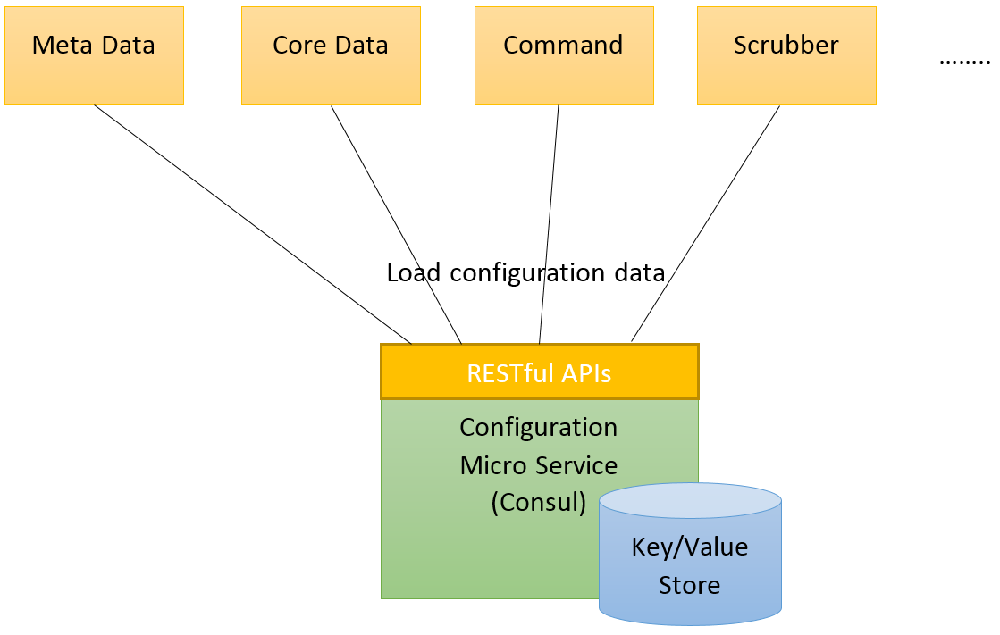

When each microservice starts up, a special “bootstrap” phase occurs in order for it to load its own configuration data. During the “bootstrap” phase, the client microservice attempts to access the Configuration microservice through RESTful APIs and follow the naming convention to retrieve its own configuration data. In addition, the client microservices prepare the default configuration files locally. If the Configuration microservice cannot be reached due to any error, the client microservices continuously retry. The client microservices fail to launch and report error message when the Configuration microservice is unavailable.

Physically, the "configuration" service and "registry" service are combined and running on the same Consul server node.

-----------------
Naming Convention
-----------------

**Key/Value Store**

The Configuration microservice leverages the Key/Value Store provided by Consul to store configuration data, and each key contains a namespace separated by a slash ("/"), for example "/config/core-metadata/server.port" specifies the port number of the Core Metadata microservice.  This section defines the naming convention of the keys.

All configuration keys should be stored under the namespace "/config", followed by the microservice ID as the second-level namespace. When microservices are deployed to different runtime environments, usually some configuration details differ. The details of a database connection, for example, are often different in a development environment than in a quality assurance environment, and different in a production environment. Profile-based configuration can address this issue.

Profiles are a type of conditional configuration where different configuration settings are used or ignored based on what profiles are active at runtime. If the microservice leverages the profile-based configuration, the profile name should append to the second level namespace with a semi colon (";").   As an applicable example:  when EdgeXFoundry microservices are put in Docker containers for deployment, a profile is used to provide configuration specific to Docker environments (e.g. config/core-metadata;docker).  A special global namespace called "/config/application" is applicable to all microservices using the Configuration microservice, and all the global level configuration data can be put under this global namespace, such as "/config/application/logging.level" and "/config/application/logging.path".

For example, a microservice with the ID "testApp" with the "dev" profile loads the following namespace:

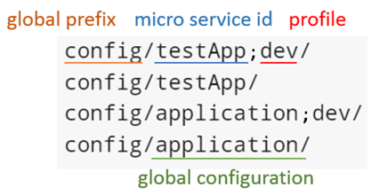

The most specific configuration data is at the top as the highest priority, with the least specific at the bottom. Configuration data in the /config/application namespace are applicable to all microservices using the Configuration microservice. Configuration data in the /config/testApp namespace are only available to the instances of the microservice named "testApp".

The following table shows each configuration data in the Key/Value Store in this example:

+----------------------------------------+----------------+
|   **Key**                              |   **Value**    |
+========================================+================+
| /config/testApp;dev/db.pwd             |   **devpwd**   |
+----------------------------------------+----------------+
| /config/testApp/db.user                |   normaluser   |
+----------------------------------------+----------------+
| /config/testApp/db.pwd                 |   normalpwd    |
+----------------------------------------+----------------+
| /config/testApp/server.port            |    **8585**    |
+----------------------------------------+----------------+
| /config/application;dev/logging.level  |    **DEBUG**   |
+----------------------------------------+----------------+
| /config/application/logging.level.root |     INFO       |
+----------------------------------------+----------------+
| /config/application/logging.path       |**/edgex/logs** |
+----------------------------------------+----------------+

The values highlighted in bold should be adopted in this example, due to the higher priority values that overwrite the lower priority values.

--------------------------
Global Level Configuration
--------------------------

The following table defines the global configuration data, and all microservices have to load and work with this rule.

+----------------------------------------+--------------------------------------------------------------------------------------------+
|   **Key**                              |   **Descrption**                                                                           |
+========================================+============================================================================================+
| /config/application/logging.level.root | This specifies the level of logging mechanism, the value is one of TRACE, DEBUG, INFO      |
+                                        + WARN, ERROR, FATAL, and OFF.                                                               +
+----------------------------------------+--------------------------------------------------------------------------------------------+
| /config/application/logging.level.*    | This is almost the same as logging.level.  The "*" represents the specific package or      |
+				         + module name, and it specifies the logging level of the specific package or module.         +
+					 + For example, logging.level.org.edgexfoundry only affects the classes under                 + 
+					 + org.edgexfoundry package in Java.                                                          +  
+----------------------------------------+--------------------------------------------------------------------------------------------+
| /config/application/ logging.path      | This specifies a folder to put the log files.                                              |
+----------------------------------------+--------------------------------------------------------------------------------------------+

---------------------------
Service Level Configuration
---------------------------

The following table defines some special configuration which should be followed by each microservice.

+------------------------------------------------------+--------------------------------------------------------------------------------------------+
|   **Key**                                            |   **Descrption**                                                                           |
+======================================================+============================================================================================+
| /config/{micro service id}/ config.notification.path | This specifies the path of notifying reloading configuration.  Please see the              | 
+                                                      + “Dynamically Reloading Configuration Data” section for more detail.                        +
+------------------------------------------------------+--------------------------------------------------------------------------------------------+
| /config/{micro service id}/ logging.file             | This specifies the file name of its log file.                                              |
+------------------------------------------------------+--------------------------------------------------------------------------------------------+

------------------
Web User Interface
------------------

The web user interface is also provided by Consul natively. Users can view and set Key/Value data through the web user interface (ACLs can be set).  The web user interface is available at the /ui path on the same port as the HTTP API.  By default, it is http://host:8500/ui.  For more detail, please see:  https://www.consul.io/intro/getting-started/ui.html
Initializing Configuration Data in Consul Key/Value Store

When the Configuration microservice starts up the first time, the Consul Key/Value Store is empty.  An initialization microservice called core-config-seed, can load the default configuration from property or YAML files, and push values to the Consul Key/Value store.  The tool is useful for initializing the default configuration at installation time and running Continuous Integration process.
After building this tool through Maven, execute "Run As > Spring Boot App" in eclipse or "java -jar core-config-seed-{version_number}.jar --configPath={folder_path}" on command line.  Note, the core-config-seed microservice is also provided in Docker container form as are all EdgeX Foundry microservices.  Unlike the other microservices, however, the core-config-seed microservice will do its initialization work and then stop.
Dynamically Reloading Configuration Data

If the client microservice requires reloading the configuration data dynamically at runtime and it is not based on Spring Cloud Consul (if it IS based on Spring, see the next section), it needs to implement a callback API to do the reloading action. The Configuration microservice sends an HTTP GET request to the callback API, when it detects any change which is related to the client microservice on the Key/Value Store.

This function leverages Consul Watches and a simple tool called core-config-watcher. Consul Watches are a way of specifying a view of data (for example, Key/Value pairs or health checks) which is monitored for updates. When an update is detected, an external handler is invoked. A handler can be any executable. In this instance, the external handler is fuse-core-config-watcher which executes the following steps:

#. Accept an argument as the microservice ID.
#. Use this microservice ID to query a specific property named "config.notification.path" from the Key/Value Store, and the URL might be like "/ping?config_changed=true", sending GET request to http://localhost:8500/v1/kv/config/core-data/config.notification.path to retrieve the relative path.
#. Use this microservice ID to discover the address and service port number of the microservice, sending GET request to http://localhost:8500/v1/catalog/service/core-data to retrieve the address and service port variable.
#. Send http request to the completed notification URL from Step 2 and Step 3. In this example: https://core-data:48080/ping?config_changed=true

The path of callback API is stored in a configuration property in the Key/Value Store, and its naming convention is **"config.notification.path"**.  If there is no **"config.notification.path"** configuration for the microservice, fuse-core-config-watcher exits on Step 2.

======================================
Spring Framework Development Guideline
======================================

Since Spring Boot is used in many EdgeX Foundry Java microservices, this section provides some guidelines and references for developing a Spring Boot application with Consul. A sub-project of Spring called Spring Cloud Consul exists which provides Consul integrations for Spring Boot applications through auto-configuration and binding the Spring Environment and other Spring programming model idioms.

With a few steps, enable and configure the common patterns inside your application and build large distributed systems with Consul:

1. Modify pom.xml to add a new <dependency> and <dependencyManagement> tag.

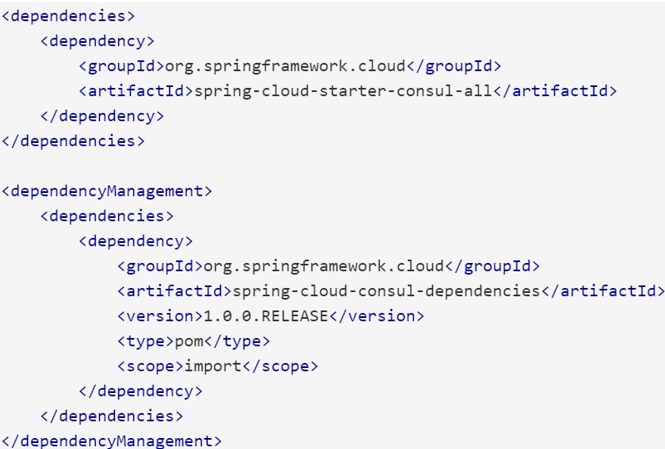

The version of spring-cloud-consul-dependencies should refer to the following page to get the up-to-date stable version: http://cloud.spring.io/spring-cloud-consul/
     
2. Add a bootstrap.properties into the classpath, and at the minimum, it needs to contain a property called "spring.application.name" to define the microservice ID.  In addition, "spring.cloud.consul.host" and "spring.cloud.consul.port" define the address and port number of Consul. Setting "spring.cloud.consul.enabled" as false, can disable Spring Consul client features and load the local configuration file instead.

Following these two steps and the naming convention, the Spring Boot application loads the configuration data from Consul when starting up.

With Spring Boot Actuator dependency to pom.xml, the configuration data can be dynamically reloaded without additional settings if they meet the following three situations:

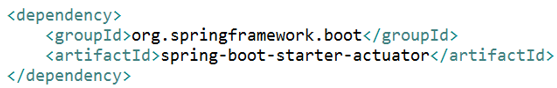

* Beans marked with @ConfigurationProperties
* Beans marked with @RefreshScope (Side-effect: it makes bean lazy and consumes more memory)
* Logging level

Please see the official reference guide:

    http://cloud.spring.io/spring-cloud-consul/spring-cloud-consul.html

-----------------
Running on Docker
-----------------

To make installation and update easier, the microservices of EdgeX Foundry are published as Docker images onto Docker Hub, including the Configuration microservice:

    https://hub.docker.com/r/edgexfoundry/docker-core-consul/

When the Docker engine is ready, users download the latest Consul image by the Docker pull command:

    docker pull edgexfoundry/docker-core-consul

Then, startup Consul using Docker container by the Docker run command:

    docker run -p 8400:8400 -p 8500:8500 -p 8600:8600 --name edgex-core-consul --hostname edgex-core-consul -d edgexfoundry/docker-core-consul

The command steps to startup Consul and import the default configuration data are as follows:

1. Login to Docker Hub:

  $ docker login

2. A Docker network is needed to enable one Docker container to communicate with another. This is preferred over the use of --links that establishes a client-server relationship:

  $ docker network create edgex-network

3. Create a Docker volume container for Fuse:

  $ docker run -it --name edgex-files --net=edgex-network -v /data/db -v /edgex/logs -v /consul/config -v /consul/data -d edgexfoundry/docker-edgex-volume

4. Create the Consul container:

  $ docker run -p 8400:8400 -p 8500:8500 -p 8600:8600 --name edgex-core-consul --hostname edgex-core-consul --net=edgex-network --volumes-from edgex-files -d edgex/docker-edgex-core-consul

5. Create a container to run core-config-seed to import the default configuration data:

  $ docker run --name edgex-core-config-seed --net=edgex-network --volumes-from edgex-files -d edgexfoundry/docker-core-config-seed

6. Verify the result: http://localhost:8500/ui

------------------------
Running on Local Machine
------------------------

To run Consul on the local machine, perform the following steps:

1. Download the binary from Consul official website: https://www.consul.io/downloads.html.  Please choose the correct binary file according to the operation system.

2. Set up the environment variable.  Please refer to https://www.consul.io/intro/getting-started/install.html

3. Execute the following command: 
   
  $ consul agent -data-dir ${DATA_FOLDER} -ui -advertise 127.0.0.1 -server -bootstrap-expect 1

  ${DATA_FOLDER} could be any folder to put the data files of Consul, and it needs the read/write permission.

4. Verify the result: http://localhost:8500/ui

========
Registry
========

.. image:: EdgeX_RegistryHighlighted.png

------------------------
Introduction to Registry
------------------------

The objective of Registry is to enable microservices to find and to communicate with each other.  When each microservice starts up, it registers itself to the Registry, and the Registry continues checking its availability periodically. When one microservice needs to connect to another one, it connects to Registry to retrieve the available host name and port number of the target microservice and then invokes the target microservice. The following figure shows the basic flow.

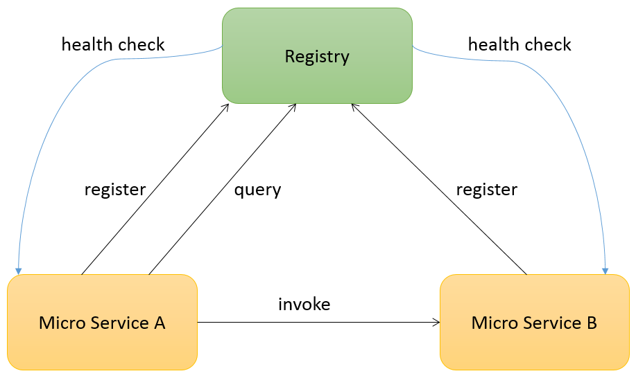

The Registry uses Consul as its implementation. Consul provides native features for service registration, service discovery, and health checking.  Please refer to the Consul official web site for more information:

    https://www.consul.io

Physically, the "registry" and "configuration" management services are combined and running on the same Consul server node.

------------------
Web User Interface
------------------

A web user interface is also provided by Consul natively.  Users can view the available service list and their health status through the web user interface.  The web user interface is available at the /ui path on the same port as the HTTP API.  By default this is http://localhost:8500/ui.  For more detail, please see:

    https://www.consul.io/intro/getting-started/ui.html

-----------------
Running on Docker
-----------------

For ease of use to install and update, the microservices of EdgeX Foundry are also published as Docker images onto Docker Hub, including Registry:

    https://hub.docker.com/r/edgexfoundry/docker-core-consul/

After the Docker engine is ready, users can download the latest Consul image by the docker pull command:

    docker pull edgexfoundry/docker-core-consul

Then, startup Consul using Docker container by the Docker run command:

    docker run -p 8400:8400 -p 8500:8500 -p 8600:8600 --name edgex-core-consul --hostname edgex-core-consul -d edgexfoundry/docker-core-consul

These are the command steps to start up Consul and import the default configuration data:

1. login to Docker Hub:

  $ docker login

2. A Docker network is needed to enable one Docker container to communicate with another. This is preferred over use of --links that establishes a client-server relationship:

  $ docker network create edgex-network

3. Create a Docker volume container for EdgeX Foundry:

  $ docker run -it --name edgex-files --net=edgex-network -v /data/db -v /edgex/logs -v /consul/config -v /consul/data -d edgexfoundry/docker-edgex-volume

4. Create the Consul container:

  $ docker run -p 8400:8400 -p 8500:8500 -p 8600:8600 --name edgex-core-consul --hostname edgex-core-consul --net=edgex-network --volumes-from edgex-files -d edgexfoundry/docker-core-consul

5. Verify the result: http://localhost:8500/ui

------------------------
Running on Local Machine
------------------------

To run Consul on the local machine, requires the following steps:

1. Download the binary from Consul official website: https://www.consul.io/downloads.html.  Please choose the correct binary file according to the operation system.
2. Set up the environment variable.  Please refer to https://www.consul.io/intro/getting-started/install.html.
3. Execute the following command: 
    
  $ consul agent -data-dir ${DATA_FOLDER} -ui -advertise 127.0.0.1 -server -bootstrap-expect 1
  
  ${DATA_FOLDER} could be any folder to put the data files of Consul, and it needs the read/write permission.

4. Verify the result: http://localhost:8500/ui

--------------------------------------
Spring Framework Development Guideline
--------------------------------------

Since Spring Boot is used in many EdgeX Foundry Java microservices, this section provides some guidelines and references for developing Spring Boot application with Consul. A sub-project of Spring called Spring Cloud Consul exists, which provides Consul integrations for Spring Boot applications through auto-configuration and binding the Spring Environment and other Spring programming model idioms.

With a few steps, enable and configure the common patterns inside your application and build large distributed systems with Consul:

1. Modify pom.xml to add a new <dependency> and <dependencyManagement> tag.

The version of spring-cloud-consul-dependencies should refer to the following page to get the up-to-date stable version: http://cloud.spring.io/spring-cloud-consul/

2. Define the microservice ID by specifying "spring.application.name" property.=  In addition, "spring.cloud.consul.host" and "spring.cloud.consul.port" define the address and port number of Consul.  They can be put in boostrap.properties, or in application.properties this microservice doesn’t load consul Key/Value Store for its configuration. 

3. Put @EnableDiscoveryClient onto the Spring Boot application class.  @EnableDiscoveryClient makes the app into both a Consul "service" that registers itself, and a "client" that can query Consul to locate other services.

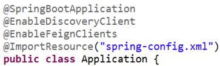

4. When a client registers with Consul, it provides metadata about itself such as host and port, ID, name, and tags. An HTTP Check is created by default that Consul reaches the /health endpoint every 10 seconds. If the health check fails, the service instance is marked as critical. Users can change these by specifying the "spring.cloud.consul.discovery.healthCheckPath" and "spring.cloud.consul.discovery.healthCheckInterval" properties in configuration. For the interval that Consul uses to check the health endpoint, "10s" and "1m" represent 10 seconds and 1 minute respectively. For example, when configuration is put in Consul Key/Value Store:

|   config/core-command/spring.cloud.consul.discovery.healthCheckPath = /ping
|   config/core-command/spring.cloud.consul.discovery.healthCheckInterval = 15s

Following these four steps, the Spring Boot application should register itself when starting up and have its health status be monitored by Consul.

With Spring Cloud Feign dependency in pom.xml and annotating @FeignClients onto the Spring Boot application class. 

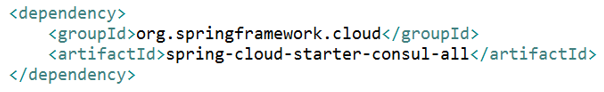

The Spring Boot application can implement the client for the RESTful interface of the other microservices and discover their physical URLs by microservice ID.
 

Define the client interfaces with the microservice ID with Spring annotations at the instance variable injection point in code that uses that service. Spring Cloud Feign generates the appropriate implementation and injects it.

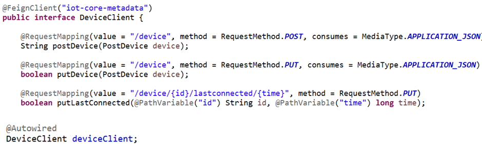

Please see the official reference guide:

* http://cloud.spring.io/spring-cloud-consul/spring-cloud-consul.html
* http://projects.spring.io/spring-cloud/spring-cloud.html#spring-cloud-feign

--------------------------
Python Development Example
--------------------------

Two client libraries are available for Python:

    consulate: https://github.com/gmr/consulate
    doc: http://consulate.readthedocs.io
    python-consul: https://github.com/cablehead/python-consul 
    doc: https://python-consul.readthedocs.io

This section shows an example using consulate to register, query, and deregister microservices in Consul. 

First, install consulate through the Python package index with the tool of your choice.  For instance, use pip:

  pip install consulate

Then, consulate can be imported on each .py file when needed:

 **import** consulate

During the application initialization, it should register itself onto Consul. The following code snippet demonstrates how to register using 

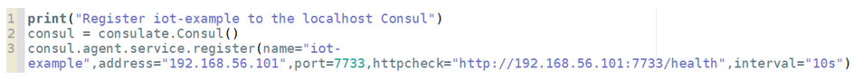

Line 2 connects to the localhost Consul server on the default port number (8500), and line 3 invokes Consul Agent RESTful API to register the endpoint information. The consulate library makes developer easy to cooperate with Consul.

The following code snippet demonstrates how to deregister from Consul, and it should be put in the application shutdown phase.

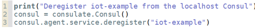

The following code snippet demonstrates how to find an endpoint information by microservice ID from Consul:

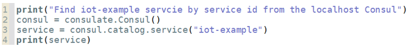

The following code snippet demonstrates how to list all available microservices from Consul:

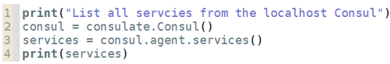

The sample can be downloaded from here:

