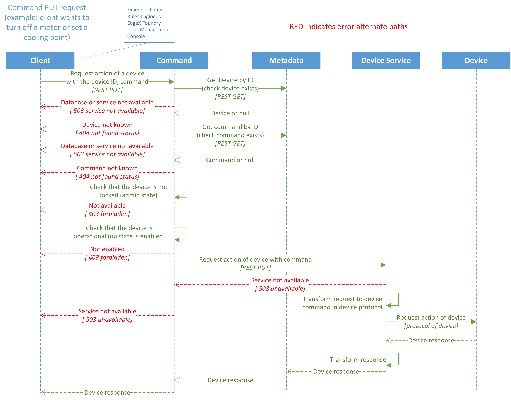
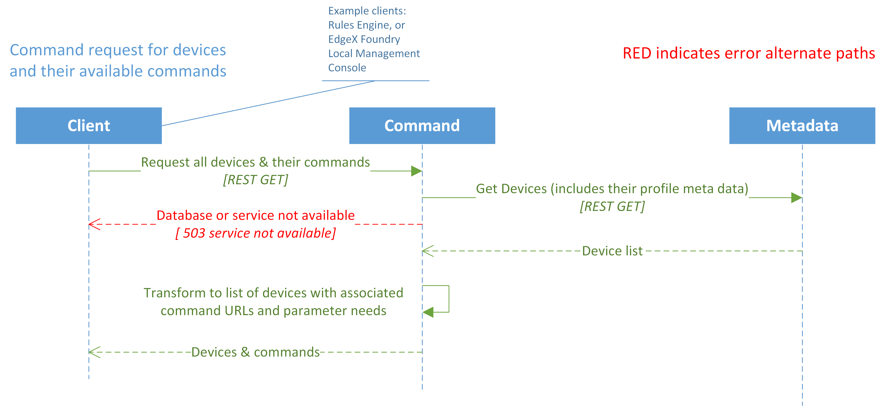

#######
Command
#######

.. image:: EdgeX_Command.png

============
Introduction
============

The Core Services Layer microservice Command (often called the Command and Control microservice) enables the issuance of commands or actions to devices and sensors on behalf of:

* other microservices within EdgeX Foundry (for example, a local edge analytics or rules engine microservice)
* other applications that may exist on the same system with EdgeX Foundry (for example, a system management agent that needs to shutoff a sensor)
* To any external system that needs to command those devices (for example, a cloud-based application that had determined the need to modify the settings on a collection of devices)

The Command microservice exposes the commands in a common, normalized way to simplify communications with the devices. Commands to devices are made through the command GET, a request for data from the device or sensor, and the command PUT, a request to take action or receive new settings or data from EdgeX Foundry.

The Command microservice gets its knowledge about the devices and sensors from the Metadata service. The Command service always relays commands and actions to the devices and sensors through the Device Service and never communicates directly to a device or sensor. Therefore, the Command microservice is a translator of command or action requests from the north side of EdgeX Foundry, such as the rules engine and export facilities, to the protocol-specific device or sensor and associated Device Service side of EdgeX Foundry and the gateway.  

The Command service provides a layer of protection around devices and sensors by not allowing unwarranted interaction with the devices and sensors through the Device Service.

===============
Data Dictionary
===============

+---------------------+--------------------------------------------------------------------------------------------+
|   **Class Name**    |   **Descrption**                                                                           | 
+=====================+============================================================================================+
| CommandResponse     | Contains the target and parameters and expected responses, that describe a REST call.      | 
+---------------------+--------------------------------------------------------------------------------------------+

===============================
High Level Interaction Diagrams
===============================

The two following High Level Diagrams show:

* EdgeX Foundry Command PUT Request 
* EdgeX Foundry Command Request for Devices and Their Available Commands

**EdgeX Foundry Command PUT Request** 

**EdgeX Foundry Command Request for Devices and Their Available Commands**

