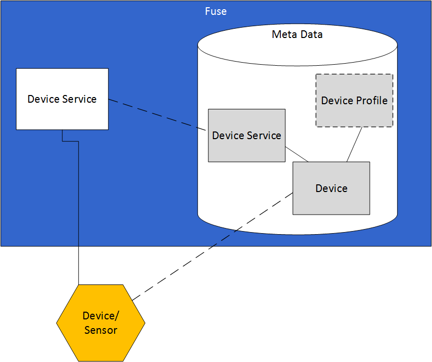
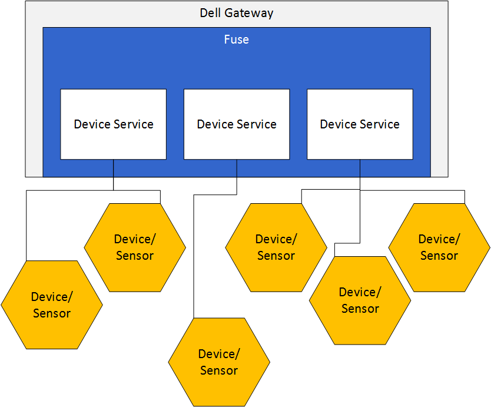
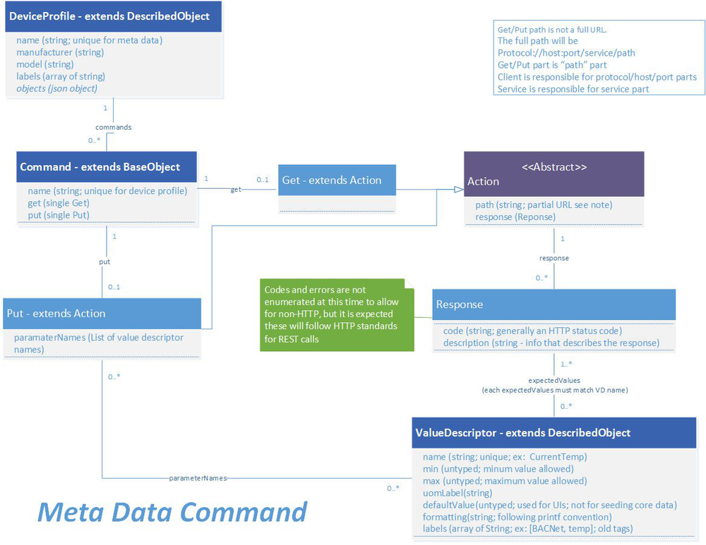
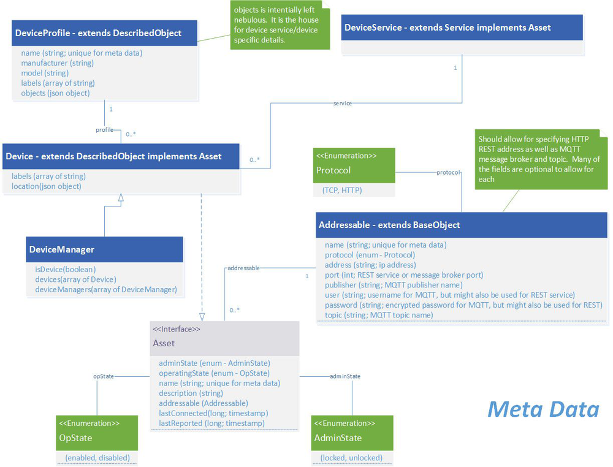
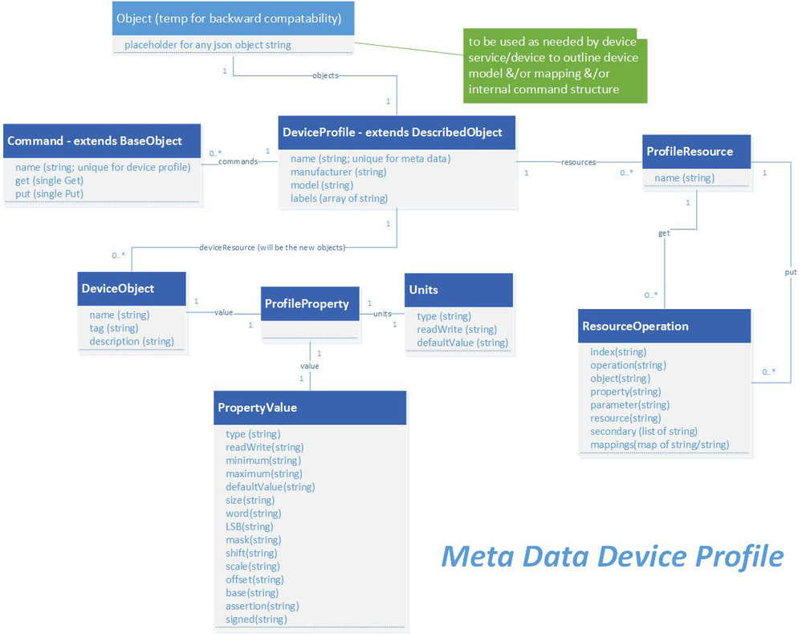
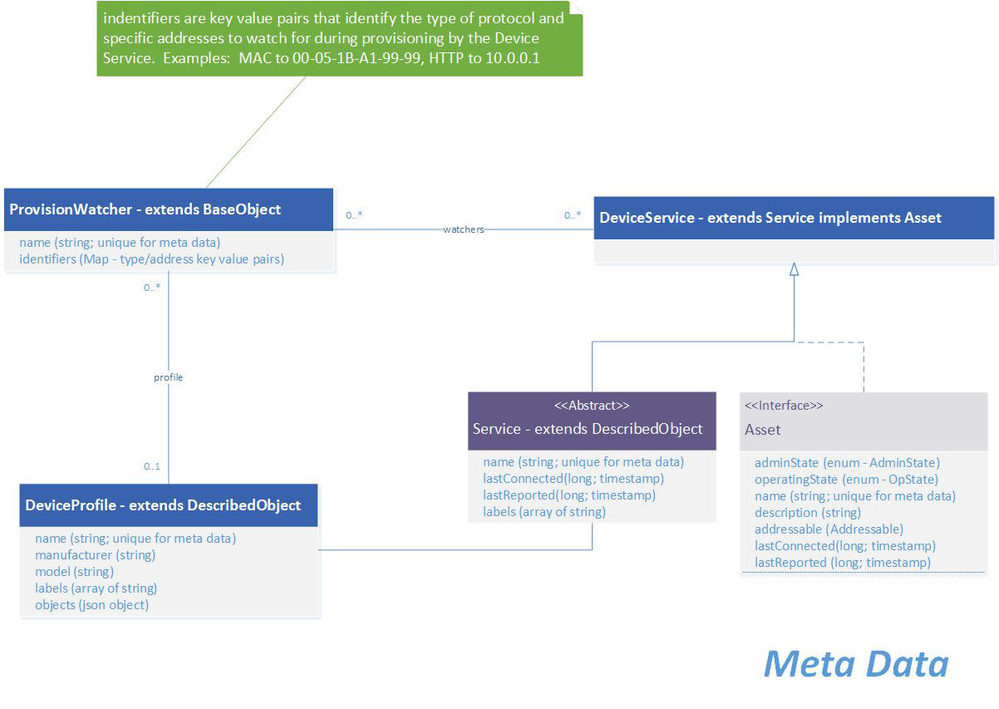
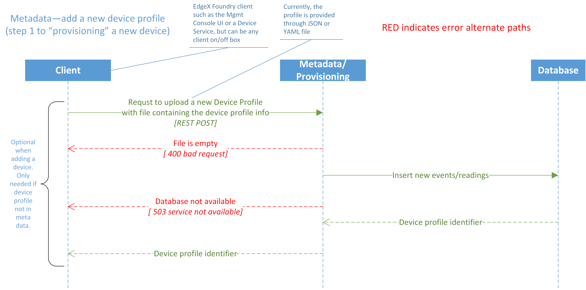
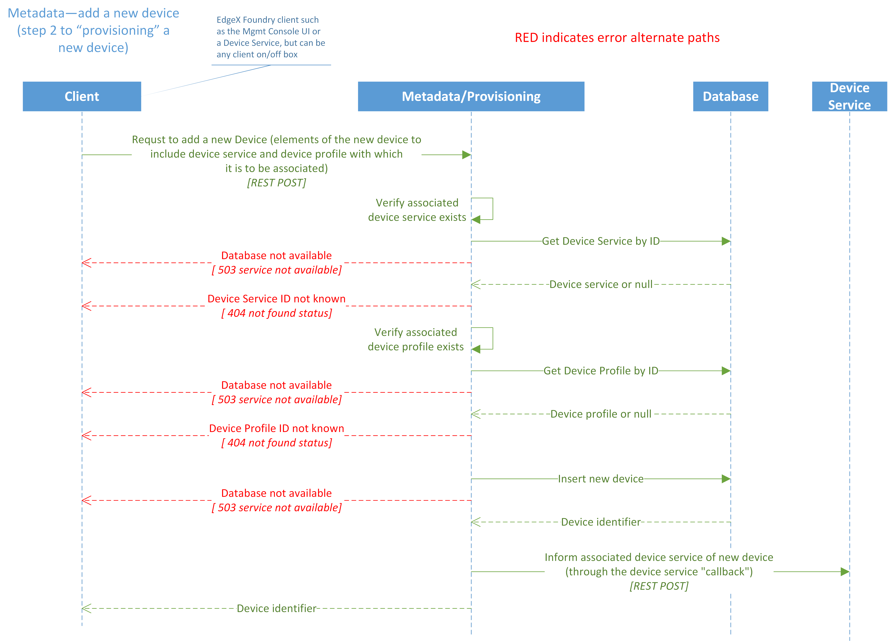
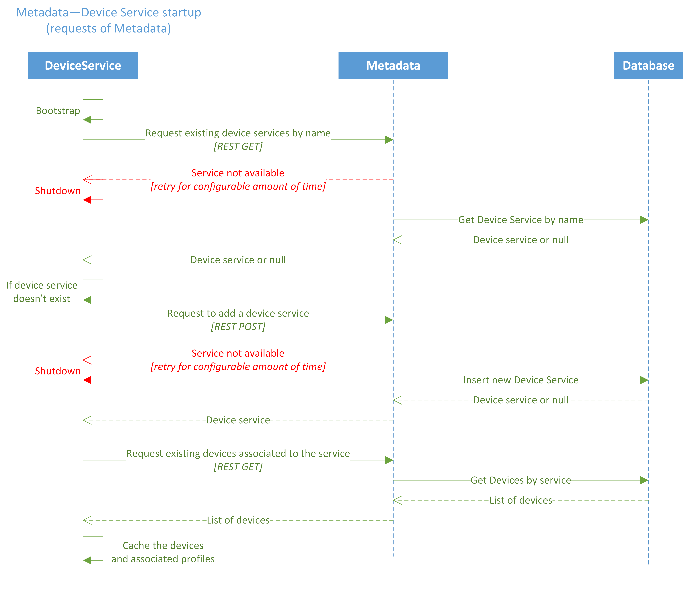

########
Metadata
########

.. image:: EdgeX_Metadata.png

============
Introduction
============

The Metadata microservice has the knowledge about the devices and sensors and how to communicate with them that is used by the other services, such as Core Data, Command, and so forth.

Specifically, Metadata has the following abilities:

* Manages information about the devices and sensors connected to, and operated by, EdgeX Foundry
* Knows the type, and organization of data reported by the devices and sensors
* Knows how to command the devices and sensors

The Metadata does not do the following activities:

* Does not do, and is not responsible for actual data collection from devices and sensors, which is performed by Device Services and Core Data
* Does not do, and is not responsible for issuing commands to the devices and sensors, which is performed by Command and Device Service

General characteristics about Devices, the data they provide, and how to command them is shown in Device Profiles in EdgeX Foundry.  A Device Profile can be thought of as a template of a type or classification of Device. For example, a device profile for BACnet thermostats provides general characteristics for the types of data a BACnet thermostat sends, such as current temperature, and which types of commands or actions can be sent to the BACnet thermostat, such as cooling set point, or heating set point. Therefore, Device Profiles are the first item that the Metadata service must be able to store or manage in local persistence, and provide to the other services of EdgeX Foundry.

Data about actual devices and sensors is another type of information that the Metadata microservice stores and manages. Each specific device and sensor that is managed by EdgeX Foundry must be registered with Metadata and have a unique ID associated to it. Information, such as the device's or sensor's address is stored with that identifier. Each device and sensor is also associated to a device profile. This association enables Metadata to apply generic knowledge provided by the device profile to each device and sensor. For example, a specific device such as the BACNet thermostat located in the CTO Solutions lab in Dell's building, is associated to the BACnet thermostat device profile described above and this connection would imply that this specific BACnet thermostat provides current temperature data and responds to commands to set the cooling and heating points.

Metadata stores and manages information about the device services that serve as EdgeX Foundry's interfaces to the actual devices and sensors. Device services are other microservices that communicate directly with the device or sensor in the device or sensor protocol of choice, and normalize information and communications with the device or sensor for the rest of EdgeX Foundry. A single Device Service facilitates the communications between EdgeX Foundry and one or more actual devices or sensors. Typically, a Device Service is built to communicate through a particular protocol with devices and sensors that use that protocol. For example, a Modbus Device Service that facilitates the communications among all types of Modbus devices such as motor controllers, proximity sensors, thermostats, power meters, and so forth.

-----------
Data Models
-----------

**Metadata Command Model**

**Metadata Device and Device Profile Model**

**Metadata Device Profile Model**

**Metadata Provision Watcher Model**

===============
Data Dictionary
===============

+---------------------+--------------------------------------------------------------------------------------------+------------------------+
|   **Class Name**    |   **Descrption**                                                                           | **Dependencies**       |
+=====================+============================================================================================+========================+
| Action              | Contains the target and parameters and expected responses, that describe a REST call.      |                        |
+---------------------+--------------------------------------------------------------------------------------------+------------------------+
| Addressable         | The metadata required to make a request to an EdgeX Foundry target. For example, the       |                        |
|                     | Addressable could be HTTP and URL address details to reach a device service by REST and    |                        |
|                     | might include attributes such as HTTP Protocol, URL host of edgex-modbus-device-service,   |                        |
|                     | port of 49090.                                                                             |                        |
+---------------------+--------------------------------------------------------------------------------------------+------------------------+
| AdminState          | An object's current administrative state of "Locked" or"Unlocked."                         |                        |
+---------------------+--------------------------------------------------------------------------------------------+------------------------+
| CallbackAlert       | The object used by the system to alert regarding a change to a system object.              |                        |
+---------------------+--------------------------------------------------------------------------------------------+------------------------+
| Command             | The REST description of an interface.                                                      |                        |
+---------------------+--------------------------------------------------------------------------------------------+------------------------+
| Device              | The object that contains information about the state, position, reachability, and methods  | Top Level object       |
|                     | of interfacing with a Device                                                               |                        |
+---------------------+--------------------------------------------------------------------------------------------+------------------------+
| DeviceManager       | An object that groups other Devices and groups of Devices.                                 |                        |
+---------------------+--------------------------------------------------------------------------------------------+------------------------+
| DeviceResource      | The atomic description of a particular protocol level interface for a class of Devices.    |                        |        
+---------------------+--------------------------------------------------------------------------------------------+------------------------+
| DeviceProfile       | The description of both the protocol level interface, device service interface, and        | Top Level object       |
|                     | mapping and interpretation logic that describe communication to a class of devices.        |                        |
+---------------------+--------------------------------------------------------------------------------------------+------------------------+
| DeviceReport        |                                                                                            |                        |
+---------------------+--------------------------------------------------------------------------------------------+------------------------+
| DeviceService       |  The current state and reachability information for a registered Device Services           |                        |
+---------------------+--------------------------------------------------------------------------------------------+------------------------+
| OperatingState      |  An object's current operating state of "Enabled" or "Disabled."                           |                        |
+---------------------+--------------------------------------------------------------------------------------------+------------------------+
| ProfileProperty     |  The transformation, constraint, and unit properties for a class of Device data.           |                        |
+---------------------+--------------------------------------------------------------------------------------------+------------------------+
| ProfileResource     |  The set of operations that is executed by a Service for a particular Command.             |                        |
+---------------------+--------------------------------------------------------------------------------------------+------------------------+
| PropertyValue       |  The transformation and constraint properties for a class of data.                         |                        |
+---------------------+--------------------------------------------------------------------------------------------+------------------------+
| ProvisionWatcher    |  The metadata used by a Service for automatically provisioning matching Devices.           |                        |
+---------------------+--------------------------------------------------------------------------------------------+------------------------+
| ResourceOperation   |  An Operation or set of Operations executed by the Device Service on a Device.             |                        |
+---------------------+--------------------------------------------------------------------------------------------+------------------------+
| Response            |  A description of a possible REST response for a Command.                                  |                        |
+---------------------+--------------------------------------------------------------------------------------------+------------------------+
| Schedule            |  An object defining a timer or alarm.                                                      | Top Level object       |
+---------------------+--------------------------------------------------------------------------------------------+------------------------+
| ScheduleEvent       |  The action taken by a Service when the schedule triggers.                                 | Top Level object       |
+---------------------+--------------------------------------------------------------------------------------------+------------------------+
| Service             |  The current state and reachability information registered for a Service.                  |                        |
+---------------------+--------------------------------------------------------------------------------------------+------------------------+
| Units               |  The unit metadata about a class of Device data.                                           |                        |
+---------------------+--------------------------------------------------------------------------------------------+------------------------+

===============================
High Level Interaction Diagrams
===============================

Sequence diagrams for some of the more critical or complex events regarding Metadata.

The three following High Level Interaction Diagrams show:

1. EdgeX Foundry Metadata Add a New Device Profile (Step 1 to provisioning a new device)
2. EdgeX Foundry Metadata Add a New Device Profile (Step 2 to provisioning a new device)
3. EdgeX Foundry Metadata Device Service Startup

Metadata Add a New Device Profile (Step 1 to provisioning a new device)

