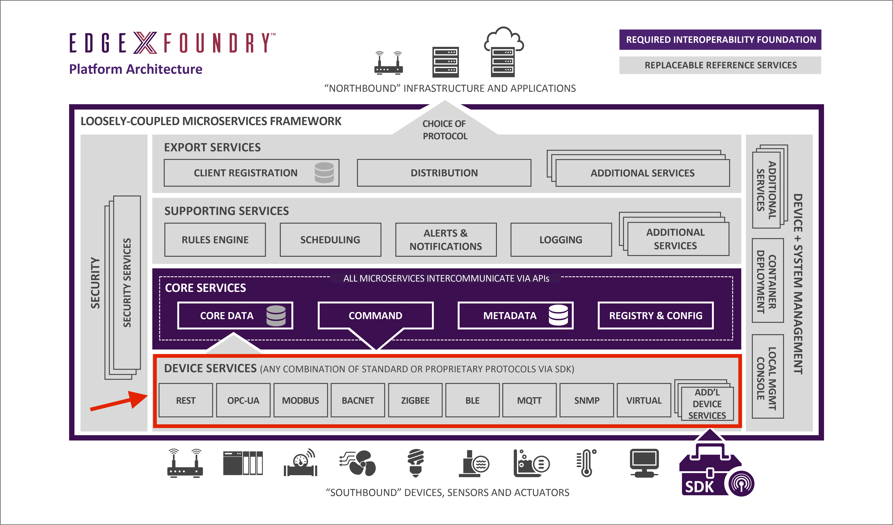

#############################
Device Services Microservices
#############################

The Device Services Layer interacts with Device Services.  

Device Services (DS) are the edge connectors interacting with the devices or IoT objects that include, but are not limited to: appliances in your home, alarm systems, HVAC equipment, lighting, machines in any industry, irrigation systems, drones, traffic signals, automated transportation, and so forth.

Device services may service one or a number of devices, including sensors, actuators, and so forth, at one time. A "device" that a DS manages, could be something other than a simple single physical device and could be another gateway and all of that gateway's devices, a device manager, or a device aggregator that acts as a device, or collection of devices, to EdgeX Foundry.

The Device Services layer's microservices communicate with the devices, sensors, actuators, and other IoT objects through protocols native to the IoT object. The DS Layer converts the data produced and communicated by the IoT object, into a common EdgeX Foundry data structure, and sends that converted data into the Core Services layer, and to other microservices in other layers of EdgeX Foundry. 

The EdgeX Foundry Device Services layer at this time, includes the following microservice:

    APIs--Device Services--Virtual Device Service

**Device Service Requirements**

Requirements for the device service are provided below.  These requirements are being used to define what functionality needs to be offered via any Device Service SDK to produce the device service scaffolding code.  They may also help the reader understand the duties and role of a device service.

.. _`DS-SDK Requirements`: https://wiki.edgexfoundry.org/display/FA/Architecture--Device+Services+Microservices?preview=/328052/4587926/DS-SDK-Requirements-v3.xlsx
..

`DS-SDK Requirements`_

**Device Service Design**

Sequence Diagrams that outline the objects and process of each of the requirements.

.. _`Design for Requirements #1-4`: https://wiki.edgexfoundry.org/display/FA/Architecture--Device+Services+Microservices?preview=/328052/4588068/DS-SDK-Design-SequenceDiagrams.vsdx
..

`Design for Requirements #1-4`_

.. toctree::
   :maxdepth: 1

   Ch-VirtualDevice
   Ch-DeviceSDK
   Ch-DeviceProfile

