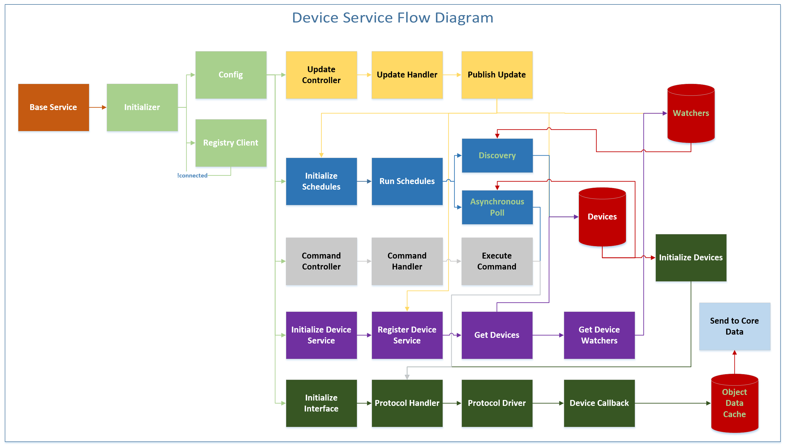

###################
Device Services SDK
###################

=======================
Introduction to the SDK
=======================

The EdgeX Foundry Device Service Software Development Kit (SDK) takes the Developer through the step-by-step process to create an EdgeX Foundry Device Service microservice.  Then setup the SDK and execute the code to generate the Device Service scaffolding to get you started using EdgeX.

The EdgeX Foundry Software Development Kit (SDK) is written in Java. Other languages will be available in the future from the open source community. If you are creating your own SDK, use this one as an example.

The Device Service SDK supports:

* Synchronous read and write operations
* Asynchronous Device data
* Initialization and deconstruction of Driver Interface
* Initialization and destruction of Device Connection
* Framework for automated Provisioning Mechanism
* Support for multiple classes of Devices with Profiles
* Support for sets of actions triggered by a command
* Cached responses to queries

=======================
Device Service Workflow
=======================

Key to diagram

+---------------------+-------------------------------------------------------------------------------------------------------------------------------------------+
|  **Colour of Box**  |   **Descrption**                                                                                                                          | 
+=====================+===========================================================================================================================================+
| Orange              | Everything is part of a Base Service.                                                                                                     | 
+---------------------+-------------------------------------------------------------------------------------------------------------------------------------------+
| Light Green         | Initialization.  Gets its own configuration and registers itself.                                                                         | 
+---------------------+-------------------------------------------------------------------------------------------------------------------------------------------+
| Yellow              | Update Controller. receives, processes, and publishes the update.                                                                         | 
+---------------------+-------------------------------------------------------------------------------------------------------------------------------------------+
| Dark Blue           | UInitializing and setting up of schedules.                                                                                                | 
+---------------------+-------------------------------------------------------------------------------------------------------------------------------------------+
| Gray                | Scaffolding code to be receivers into Device Service.  Processes commands.                                                                | 
+---------------------+-------------------------------------------------------------------------------------------------------------------------------------------+
| Purple              | **Initializes itself.**  Set up in metadata. Registers its Device Service discovery process and registration, and sets up Device Services.| 
|                     |                                                                                                                                           |
|                     | **Gets Device Watchers.**  When a Device Service first comes up it has its initial set of devices.  The Device Watcher waits to receive   |
|                     | information that a new device has occurred.!Then a Device Watcher sends metadata messages out about the new device.                       |
+---------------------+-------------------------------------------------------------------------------------------------------------------------------------------+
| Dark Green          | Send data to Core Data.  How to communicate with the devices, and on what schedule, and to receive information back from the devices.     | 
+---------------------+-------------------------------------------------------------------------------------------------------------------------------------------+

========================
Writing a Device Service
========================

`Writing a new Device Service in Go 〉 <Ch-GettingStartedSDK.html>`_

