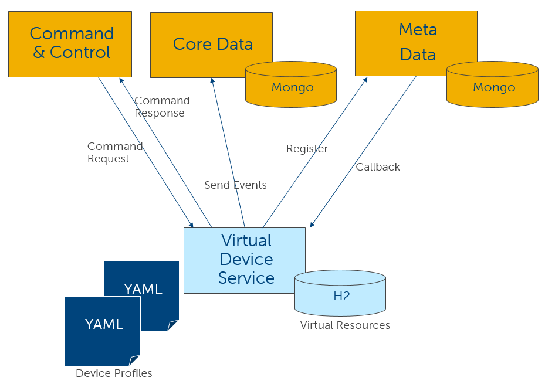
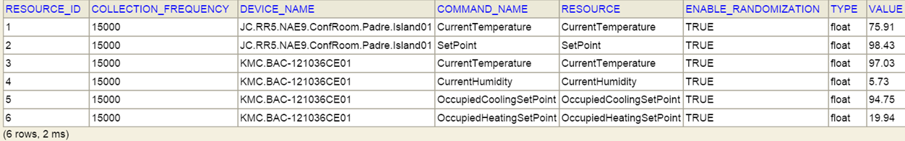
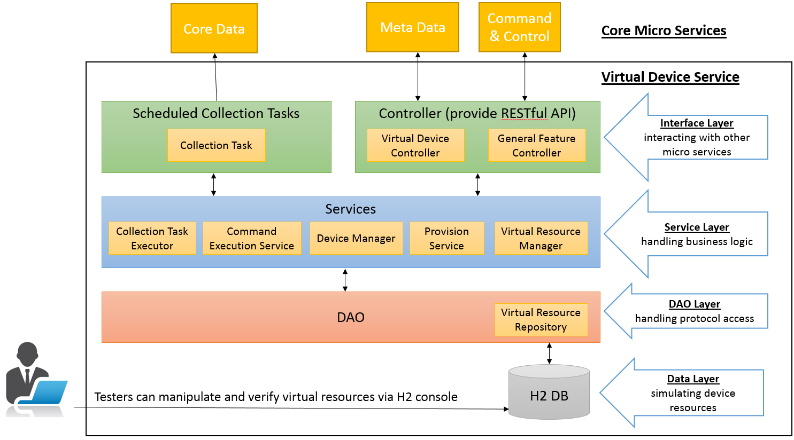
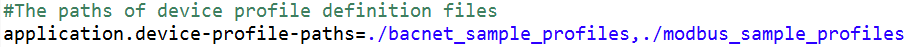
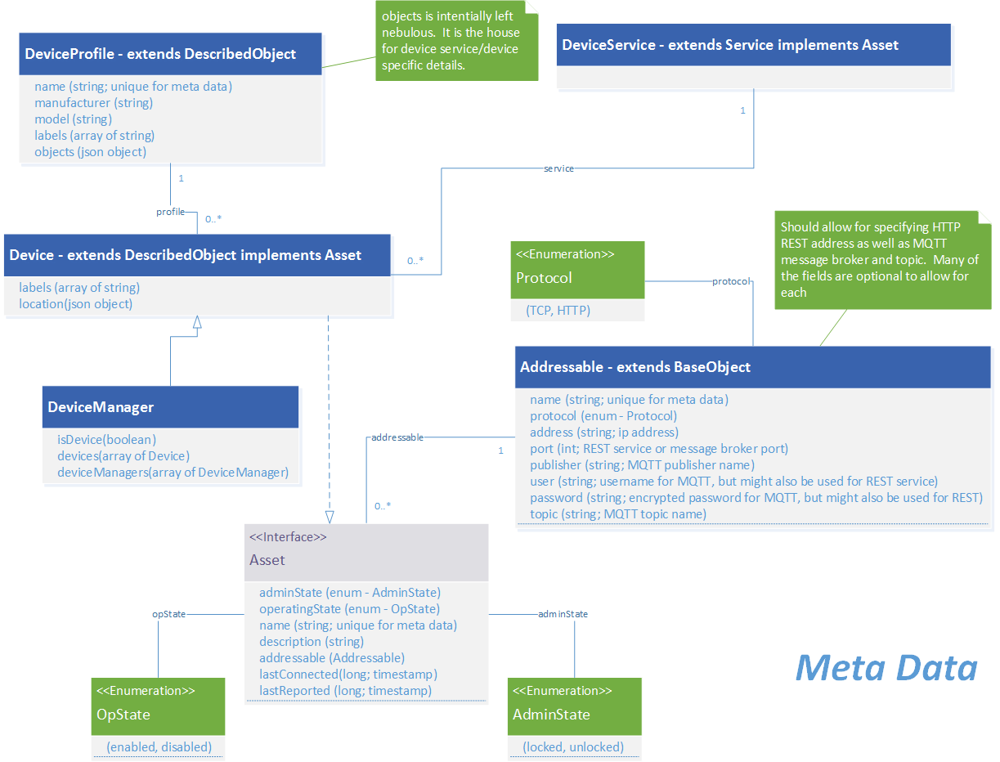
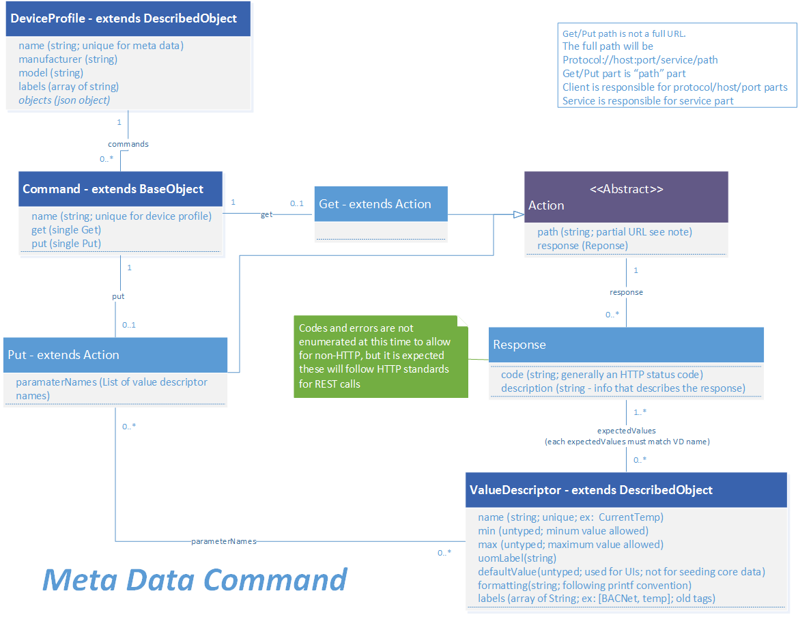
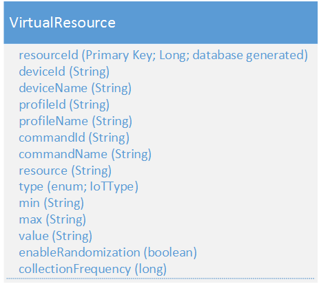

##############
Virtual Device
##############

.. image:: EdgeX_VirtualDevice.png

============
Introduction
============

The Virtual Device Service simulates different kinds of devices to generate Events and Readings to the Core Data Microservice, and Users send commands and get responses through the Command and Control Microservice. These features of the Virtual Device Services are useful when executing functional or performance tests without having any real devices.

**Virtual Device Service Overall Flow**

Virtual Device Service has dependencies on Core Data and Meta Data Microservices, since the initialization process needs to check or register profiles, devices, and value descriptors. Therefore, Core Data and Metadata Microservices have to fully start up before Virtual Device Service initialization. At the beginning of the Virtual Device Service initialization process, the process sends a ping request to Core Data and Metadata Microservices to verify their status until they both fully start up. The fixed time out limit is 600 seconds. After 600 seconds, if Core Data and Metadata Microservices have not fully started up, the initialization process fails.

When the Virtual Device Service starts up, the initialization process loads the definitions of ValueDescriptor, DeviceService, and DeviceProfile from YAML files and creates them in the Metadata Microservice. Some default YAML files exist, and Users can create their own. Please see Device Profile Definition section (on this page) for more detail.  In addition, the Virtual Device Service provides callback APIs for the Metadata Microservice to manage the Device instances.  According to the GET Commands in the DeviceProfile definitions, there is an H2 database (in-memory) storing resource in Virtual Devices, called "Virtual Resources." 

=========================
Virtual Resources Example
=========================

After starting up, the Virtual Device Service reads the H2 database and periodically sends the current value as an Event to the Core Data Microservice. The default frequency is 15 seconds, and that can be modified from the configuration file. The current value of virtual resources is re-generated at a random value before each collection cycle, so the Reading should be different in each Event.

The Virtual Device Service provides APIs for Command and Control Microservice, reads the H2 database, and returns the current value for GET Commands.  At this time, the Virtual Device Service supports two special PUT Commands: “enableRandomization” and “collectionFrequency.” These Commands modify the “ENABLE_RANDOMIZATION” and “COLLECTION_FREQUENCY” column of a specific virtual resource in the H2 database. 

::

   For example, sending an HTTP PUT method to http://localhost:48082/device/56b1acf1d66f9c9762581ea4/command/56b1acedd66f9c9762581e9d/put/0 with the sample payload:

   {

     "enableRandomization": false,
     "collectionFrequency": 6

   }

modifies a virtual resource record whose command ID is "56b1acedd66f9c9762581e9d " and device ID is "56b1acf1d66f9c9762581ea4."  By modifying the “ENABLE_RANDOMIZATION” column to FALSE, the value of the virtual resource will not re-generate a random value anymore. By modifying the “COLLECTION_FREQUENCY” column, the collecting frequency will be changed after next collection cycle. 

::

   They both can be modified manually through H2 Console: http://localhost:49990/console Modify the “JDBC URL” to jdbc:h2:mem:testdb, and click on “Connect.”

=====================
Special Configuration
=====================

The virtual device micro service does contain some unique configuration properties and these often change between development (for example when run from Eclipse) and the containerized version (i.e. Docker container) of the same service.  Here are the list of unique properties you should investigate before running the virtual device service to better understand how it works in your environment:

The path used to locate the Device Profile YAML files used to define the virtual devices managed by the device service (see Device Profile Definition section below).

  **application.device-profile-paths=./bacnet_sample_profiles,./modbus_sample_profiles**

Indicator to the virtual device service to provisioning devices from the YAML profiles in the above directory, creating one device for each profile automatically when set to true.

application.auto-create-device=true
When developing, it is often advantageous to have the virtual device service start afresh and with a clean Meta data database each time the service starts.  The property below indicates whether the device service should clean out any existing virtual devices in the database when it shuts down so a clean environment is available when the service starts backup.  Typically set to true for development and false for runtime/demonstration environments.

 **application.auto-cleanup=true**

How often, in seconds, the virtual device service's scheduler should collect data from the virtual device.

 **application.collection-frequency=15**

**Service Name and Host Name**

In EdgeX device services the service name (which is represented by service.name key in the application.properties file or Consul configuration) is the identity of the Device Service object.  The name is used by EdgeX to attribute all the information about the service (in particular schedules, device ownership, etc.) to this name. However, the service.host parameter is used to describe how to interact with the service. Depending on your operating mode, the following guidelines for configuring the service host apply.

**Deployment Mode (running everything containerized in Docker):**
The Service host (which is represented by the service.host key in the application.properties file or Consul configuration) is the DNS or IP address networking entry of the entity that the service is bound to (container, machine, etc) and reachable from the other microservices. This allows a full location URL for the service to be determined.  In Docker environments, the host name is the name of the Docker container running the microservice (such as edgex-device-virtual).

Use service.host=${service.name} and the docker-compose file for all services (default).

**Important Note:**  be sure to use Docker Compose and docker-compose file (found in the developer-scripts repos) to bring up the containers for all services.  Docker Compose establishes the networking and container naming for you, which can otherwise be difficult to do and prone to errors if bringing up containers manually. 

**Developer Mode** (running everything natively):
When running a service natively, the service names will not resolve to a DNS entry as they will in a Docker environment.

Use service.host=localhost for all services (default).

**Hybrid Mode** (running some services natively with the rest deployed with Docker):
Use service.host=<Host Machine IP Address> for the native services (manual configuration) and the docker-compose file to bring up the containerized services (default). Ensure that Addressable objects for the native services are not accidentally created by bringing them up with the docker-compose file, otherwise conflicts may arise. This issue is being addressed in future versions.

===================
System Architecture
===================

The Virtual Device Service adopts a normal MVC design pattern, separating logic into different layers.

**System Architecture Graphic**

**Interface Layer**--interacting with other microservices.
Controllers provide the RESTful API. The implementation is located in org.edgexfoundry.device.virtual.controller package.
Scheduled Collection Tasks is a set of async tasks which is executed periodically, and they are created for each virtual resource (GET Command).
See org.edgexfoundry.device.virtual.scheduling package for the detailed implementation. Also, org.edgexfoundry.device.virtual.scheduling.Scheduler reads Schedule and ScheduleEvent from Meta Data Microservice and arranges the collection tasks.

Tasks execution logic is located in org.edgexfoundry.device.virtual.service.impl.CollectionTaskExecutorImpl, and the tasks creation behavior is located in org.edgexfoundry.device.virtual.service.impl.VirtualResourceManagerImpl.createDefaultRecords().

**Service Layer**--processing business logic, such as, executing collection tasks and commands, managing profiles and devices, and so forth.
See org.edgexfoundry.device.virtual.service.impl package for more details.

**DAO Layer**--processing protocol access.
For Virtual Device Services, a Spring Data JPA interface in org.edgexfoundry.device.virtual.dao package.
Spring framework will process the communication effort to access H2 DB. 

**Data Layer**--an H2 DB to simulate device resources.

=========================
Device Profile Definition
=========================

Users can define any virtual device profile in YAML format, if the structure is in accordance with the "Device and Device Profile Model" (in the graphic 3 paragraphs below).  By assigning the file path to application property **"application.device-profile-paths"**, Virtual Device Service loads all the YAML files under this folder, and this property accepts multiple values separated by comma (,).  For instance, the following setting causes Virtual Device Service to load all YAML files under **./bacnet_sample_profiles** and **./modbus_sample_profiles** folders.

In addition to Profile Definition, ValueDescriptors are defined in the "deviceResources.properties" part of the profile definition.  The structure needs to conform with the ProfileProperty in "Device Profile" (in the graphic below the "Device and Device Profile Model"), and the ValueDescriptors will be created and send to the Core Data Microservice during the Device creation callback process.

By assigning the application property "application.auto-create-device" = true (the default value is true), the Virtual Device Service creates Device instances for each profile automatically during starting up, and the Device instances start sending events and readings to Core Data Microservice.

==========
Data Model
==========

Virtual Device Service Data Model--Device and Device Profile Model

**Virtual Device Service Data Model--Command Model**

**VirtualResource**

VirtualResource is the data object generated from Device instances and persisted in H2 database.

===============
Data Dictionary
===============

+---------------------+----------------------------------------------------------------------------------------------+
|   **Class Name**    |   **Descrption**                                                                             | 
+=====================+==============================================================================================+
| ScanList            | The object containing a protocol discovery method query.                                     | 
+---------------------+----------------------------------------------------------------------------------------------+
| Transaction         | The asynchronous helper object used for gathering sets of device responses.                  | 
+---------------------+----------------------------------------------------------------------------------------------+

