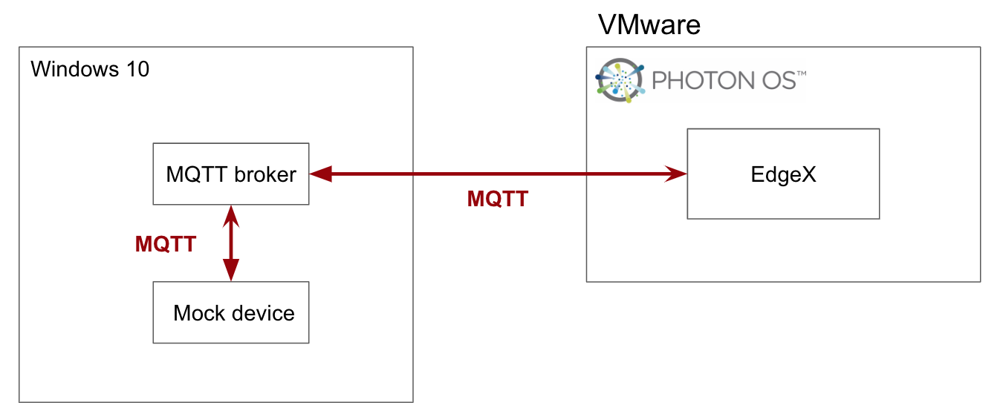
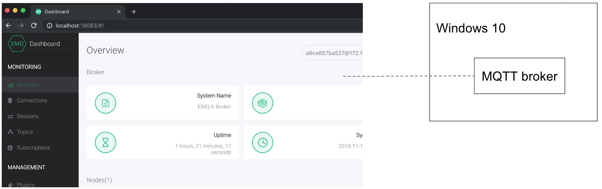
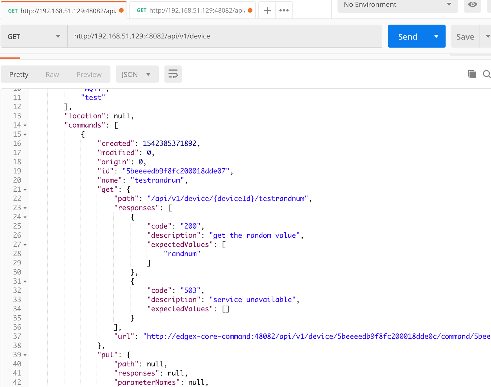

###############################
MQTT - Adding a Device to EdgeX
###############################

In this example, we use the simulator instead of a real device. This provides a straight-forward way to test the device-mqtt features.

Environment
-----------

You can use any operating system that can install docker and docker-compose. In this example, we use Photon OS to deploy EdgeX using docker. The system requirements can be found at https://docs.edgexfoundry.org/Ch-GettingStartedUsers.html#what-you-need.

.. image:: PhotonOS.png
    :scale: 50%
    :alt: Photon Operating System

.. image:: PhotonOSversion.png
    :scale: 50%
    :alt: Version Information

MQTT Broker
-----------

EMQ is a MQTT broker that is easy to configure and use. You can download it from http://emqtt.io. It’s fully open source and licensed under Apache Version 2.0. 

Run using the following docker command::

    docker run -d --rm --name emqx -p 18083:18083 -p 1883:1883 emqx/emqx

After the MQTT broker has started, login to the dashboard using the default account details (name = admin, password = public)

MQTT Device (Simulator)
-----------------------

The device-mqtt source code provides a mock device that can send async values and handle commands. You must implement these two functions when using the device-mqtt service as described below.

.. image:: MQTTDeviceService.png
    :scale: 50%
    :alt: MQTT Device Service

To set up the service:

1. Download the source code::

    git clone git@github.com:edgexfoundry/device-mqtt-go.git

2. Modify the broker connection

   The broker connection information must be modified to meet our requirement. 

    .. image:: devicegoSetup.png
        :scale: 50%
        :alt: device.go Set Up

3. Run the device simulator

   Run the following command in your terminal::
 
    go run ./mock/device.go

Set Up
------

The following sections describe how to complete the set up.

Set Up Device Profile
=====================

The DeviceProfile defines the device's values and operation method, which can be Read or Write. 

    .. image:: deviceprofile.png
        :scale: 50%
        :alt: Device profile

You can download and use the provided :download:`modbus.test.device.profile.yml
<modbus.test.device.profile.yml>`.

Set Up Device Service Configuration
===================================

Use this configuration file to define devices and schedule jobs. The device-mqtt generates a relative instance on startup.

MQTT is subscribe/publish pattern, so we must define the MQTT connection information in the addressable.

    .. image:: configuration_MQTT.png
        :scale: 50%
        :alt: configuration.toml File

You can download and use the provided :download:`EdgeX_ExampleMQTT_configuration.toml
<EdgeX_ExampleMQTT_configuration.toml>`.

MQTT Driver Configuration
=========================

In the MQTT driver configuration:

* Incoming defines DataTopic for receive async value from device
* Response defines ResponseTopic for receive command response from device

    .. image:: IncomingResponse.png
        :scale: 50%
        :alt: configuration.toml Incoming and Response Entries

Add Device Service to docker-compose File
=========================================

Because we deploy EdgeX using docker-compose, we must add the device-mqtt to the docker-compose file ( https://github.com/edgexfoundry/developer-scripts/blob/master/compose-files/docker-compose-delhi-0.7.0.yml ). If you have prepared configuration files, you can mount them using volumes and change the entrypoint for device-mqtt internal use.

::

    device-mqtt
      image: docker.edgexfoundry.org/device-mqtt-go-x86_64:test ports:
        - "49982:49982"
      container_name: edgex-device-mqtt
      hostname: edgex-device-mqtt
      networks:
        edgex-network:
          aliases:
          - edgex-device-mqtt
      priviledged: true
      volumes:
        - db-data:/data/db
        - log-data:/edgex/logs
        - consul-config:/consul/data
        - /device-service-demo/mqtt:/custom-config
      depends_on:
        - data
        - command
      entrypoint:
        - /device-mqtt
        - --registry
        - --confdir=/custom-config

    networks:
      edgex-network:
        driver: "bridge"

Start EdgeX Foundry on Docker
-----------------------------

Finally, we can deploy EdgeX in the Photon OS.

1. Prepare configuration files by moving the files to the Photon OS

2. Deploy EdgeX using the following commands::

    docker-compose pull
    docker-compose up -d

  .. image:: startEdgeX.png
      :scale: 50%
      :alt: Start EdgeX

3. Check the consul dashboard

    .. image:: consul_MQTT.png
        :scale: 50%
        :alt: Consul Dashboard

Execute Commands
----------------

Now we're ready to run some commands.

Find Executable Commands
========================

Use the following query to find executable commands::

    <server-ip>:48082/api/v1/device

Execute GET command
===================

Replace *<host>* with the server IP when running the edgex-core-command.

    .. image:: getcommand_MQTT.png
        :scale: 50%
        :alt: GET Command

Execute PUT command
===================

Execute PUT command according to ``url`` and ``parameterNames``.

    .. image:: putcommand_MQTT.png
        :scale: 50%
        :alt: PUT Command

    .. image:: putbody.png
        :scale: 50%
        :alt: PUT Command Body

Schedule Job
------------

After service startup, query core-data's reading API. The results show that the service auto-executes the ping command every 10 seconds and the readRandnum command every 30 seconds.

    .. image:: scheduleconfig_MQTT.png
        :scale: 50%
        :alt: Schedule Configuration

    .. image:: getreading_MQTT.png
        :scale: 50%
        :alt: GET Readings

Async Device Reading
--------------------

    .. image:: asyncreading.png
        :scale: 50%
        :alt: Async Device Reading

``device-mqtt`` subscribes to a ``DataTopic``, which is *wait* *for* *real *device* *to* *send* *value* *to* *broker*, then ``device-mqtt`` parses the value and sends it back to ``core-data``.

The data format contains the following values:

* name = device name
* cmd = deviceResource name
* method = get or put
* cmd = device reading

You must define this connection information in the driver configuration file.

    .. image:: connection.png
        :scale: 50%
        :alt: Connection Information

