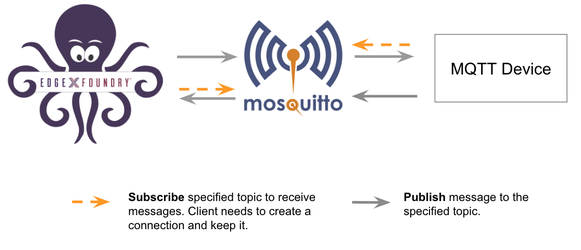
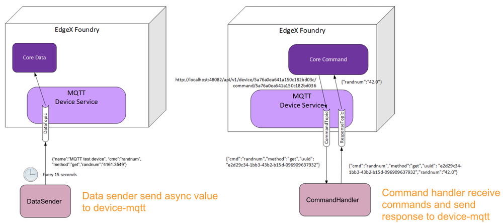

##################################
Connecting EdgeX to an MQTT Device
##################################

EdgeX - Edinburgh Release

Overview
--------

In this example, we use the simulator instead of real device. This provides a straight-forward way to test the device-mqtt features.

Run an MQTT Broker
------------------

Eclipse Mosquitto is an open source (EPL/EDL licensed) message broker that implements the MQTT protocol versions 5.0, 3.1.1 and 3.1. 

Run Mosquitto using the following docker command::

    docker run -d --rm --name broker -p 1883:1883 eclipse-mosquitto

Run an MQTT Device Simulator
----------------------------

This simulator has three behaviors:

1. Publish random number data every 15 seconds
2. Receive the reading request, then return the response
3. Receive the put request, then change the device value

We created the following script to simulate the MQTT device::

    // mock-device.js
    function getRandomFloat(min, max) {
        return Math.random() * (max - min) + min;
    }

    const deviceName = "MQ_DEVICE";
    let message = "test-message";

    // 1. Publish random number every 15 seconds
    schedule('*/15 * * * * *', ()=>{
        let body = {
            "name": deviceName,
	           "cmd": "randnum",
            "randnum": getRandomFloat(25,29).toFixed(1)
        };
        publish( 'DataTopic', JSON.stringify(body));
    });

    // 2. Receive the reading request, then return the response
    // 3. Receive the put request, then change the device value
    subscribe( "CommandTopic" , (topic, val) => {
        var data = val;
            if (data.method == "set") {
            message = data[data.cmd]
        }else{
            switch(data.cmd) {
                case "ping":
                  data.ping = "pong";
                  break;
                case "message":
                  data.message = message;
                  break;
                case "randnum":
                    data.randnum = 12.123;
                    break;
              }
        }
        publish( "ResponseTopic", JSON.stringify(data));
    });

To run the device simulator, enter the commands shown below with the following changes:

1. Replace the /path/to/mqtt-scripts in the example mv command with the correct path
2. Replace the mqtt-broker-ip in the example docker run command with the correct broker IP::

    mv mock-device.js /path/to/mqtt-scripts
    docker run -d --restart=always --name=mqtt-scripts \
      -v /path/to/mqtt-scripts:/scripts  \
      dersimn/mqtt-scripts --url mqtt://mqtt-broker-ip --dir /scripts

Setup
=====

In this section, we create a folder that contains files required for deployment::

    - device-service-demo
      |- docker-compose.yml
      |- mqtt
         |- configuration.toml
         |- mqtt.test.device.profile.yml

Device Profile (mqtt.test.device.profile.yml)
---------------------------------------------

The DeviceProfile defines the device's values and operation method, which can be Read or Write. 

Create a device profile, named mqtt.test.device.profile.yml, with the following content::

    # mqtt.test.device.profile.yml
    name: "Test.Device.MQTT.Profile"
    manufacturer: "iot"
    model: "MQTT-DEVICE"
    description: "Test device profile"
    labels:
      - "mqtt"
      - "test"
    deviceResources:
      -
        name: randnum
        description: "device random number"
        properties:
          value:
            { type: "Float64", size: "4", readWrite: "R", floatEncoding: "eNotation"  }
          units:
            { type: "String", readWrite: "R", defaultValue: "" }
      -
        name: ping
        description: "device awake"
        properties:
          value:
            { type: "String", size: "0", readWrite: "R", defaultValue: "pong" }
          units:
            { type: "String", readWrite: "R", defaultValue: "" }
      -
        name: message
        description: "device message"
        properties:
          value:
            { type: "String", size: "0", readWrite: "W" ,scale: "", offset: "", base: ""  }
          units:
            { type: "String", readWrite: "R", defaultValue: "" }

    deviceCommands:
      -
        name: testrandnum
        get:
        - { index: "1", operation: "get", object: "randnum", parameter: "randnum" }
      -
        name: testping
        get:
        - { index: "1", operation: "get", object: "ping", parameter: "ping" }
      -
        name: testmessage
        get:
        - { index: "1", operation: "get", object: "message", parameter: "message" }
        set:
        - { index: "1", operation: "set", object: "message", parameter: "message" }

    coreCommands:
      -
        name: testrandnum
        get:
          path: "/api/v1/device/{deviceId}/testrandnum"
          responses:
          -
            code: "200"
            description: "get the random value"
            expectedValues: ["randnum"]
          -
            code: "503"
            description: "service unavailable"
            expectedValues: []
      -
        name: testping
        get:
          path: "/api/v1/device/{deviceId}/testping"
          responses:
          -
            code: "200"
            description: "ping the device"
            expectedValues: ["ping"]
          -
            code: "503"
            description: "service unavailable"
            expectedValues: []
      -
        name: testmessage
        get:
          path: "/api/v1/device/{deviceId}/testmessage"
          responses:
          -
            code: "200"
            description: "get the message"
            expectedValues: ["message"]
          -
            code: "503"
            description: "service unavailable"
            expectedValues: []
        put:
          path: "/api/v1/device/{deviceId}/testmessage"
          parameterNames: ["message"]
          responses:
          -
            code: "204"
            description: "set the message."
            expectedValues: []
          -
            code: "503"
            description: "service unavailable"
            expectedValues: []

Device Service Configuration (configuration.toml)
-------------------------------------------------

Use this configuration file to define devices and schedule jobs. device-mqtt generates a relative instance on start-up.

MQTT is subscribe/publish pattern, so we must define the MQTT connection information in the [DeviceList.Protocols] section of the configuration file.

Create the configuration file, named configuration.toml, as shown below replacing the host IP with your host address::

    # configuration.toml
    [Writable]
    LogLevel = 'DEBUG'
    
    [Service]
    Host = "edgex-device-mqtt"
    Port = 49982
    ConnectRetries = 3
    Labels = []
    OpenMsg = "device mqtt started"
    ReadMaxLimit = 256
    Timeout = 5000
    EnableAsyncReadings = true
    AsyncBufferSize = 16

    [Registry]
    Host = "edgex-core-consul"
    Port = 8500
    CheckInterval = "10s"
    FailLimit = 3
    FailWaitTime = 10
    Type = "consul"

    [Logging]
    EnableRemote = false
    File = "./device-mqtt.log"

    [Clients]
      [Clients.Data]
      Name = "edgex-core-data"
      Protocol = "http"
      Host = "edgex-core-data"
      Port = 48080
      Timeout = 50000

      [Clients.Metadata]
      Name = "edgex-core-metadata"
      Protocol = "http"
      Host = "edgex-core-metadata"
      Port = 48081
      Timeout = 50000

      [Clients.Logging]
      Name = "edgex-support-logging"
      Protocol = "http"
      Host ="edgex-support-logging"
      Port = 48061

    [Device]
      DataTransform = true
      InitCmd = ""
      InitCmdArgs = ""
      MaxCmdOps = 128
      MaxCmdValueLen = 256
      RemoveCmd = ""
      RemoveCmdArgs = ""
      ProfilesDir = "/custom-config"

    # Pre-define Devices
    [[DeviceList]]
      Name = "MQ_DEVICE"
      Profile = "Test.Device.MQTT.Profile"
      Description = "General MQTT device"
      Labels = [ "MQTT"]
      [DeviceList.Protocols]
        [DeviceList.Protocols.mqtt]
           Schema = "tcp"
           Host = "192.168.16.68"
           Port = "1883"
           ClientId = "CommandPublisher"
           User = ""
           Password = ""
           Topic = "CommandTopic"
      [[DeviceList.AutoEvents]]
        Frequency = "30s"
        OnChange = false
        Resource = "testrandnum"

    # Driver configs
    [Driver]
    IncomingSchema = "tcp"
    IncomingHost = "192.168.16.68"
    IncomingPort = "1883"
    IncomingUser = ""
    IncomingPassword = ""
    IncomingQos = "0"
    IncomingKeepAlive = "3600"
    IncomingClientId = "IncomingDataSubscriber"
    IncomingTopic = "DataTopic"
    ResponseSchema = "tcp"
    ResponseHost = "192.168.16.68"
    ResponsePort = "1883"
    ResponseUser = ""
    ResponsePassword = ""
    ResponseQos = "0"
    ResponseKeepAlive = "3600"
    ResponseClientId = "CommandResponseSubscriber"
    ResponseTopic = "ResponseTopic"
    In the Driver configs section:

* IncomingXxx defines the DataTopic for receiving an async value from the device
* ResponseXxx defines  the ResponseTopic for receiving a command response from the device

Add Device Service to docker-compose File (docker-compose.yml)
--------------------------------------------------------------

Download the docker-compose file from https://github.com/edgexfoundry/developer-scripts/blob/master/compose-files/docker-compose-edinburgh-1.0.0.yml.

Because we deploy EdgeX using docker-compose, we must add device-mqtt to the docker-compose file. If you have prepared configuration files, you can mount them using volumes and change the entrypoint for device-mqtt internal use.

This is illustrated in the following docker-compose file snippet::

    device-mqtt:
      image: edgexfoundry/docker-device-mqtt-go:1.0.0
      ports:
        - "49982:49982"
      container_name: edgex-device-mqtt
      hostname: edgex-device-mqtt
      networks:
        - edgex-network
      volumes:
        - db-data:/data/db
        - log-data:/edgex/logs
        - consul-config:/consul/config
        - consul-data:/consul/data
        - ./mqtt:/custom-config
      depends_on:
        - data
        - command
      entrypoint:
        - /device-mqtt
        - --registry=consul://edgex-core-consul:8500
        - --confdir=/custom-config

When using Device Services, the user has to provide the registry URL in --registry argument.

Start EdgeX Foundry on Docker
=============================

Once the following folder has been populated, we can deploy EdgeX::

    - device-service-demo
      |- docker-compose.yml
      |- mqtt
         |- configuration.toml
         |- mqtt.test.device.profile.yml

Deploy EdgeX using the following commands::

    cd path/to/device-service-demo
    docker-compose pull
    docker-compose up -d

After the services start, check the consul dashboard as follows:

    .. image:: consul_MQTT.png
        :scale: 50%
        :alt: Consul Dashboard

Execute Commands
=================

Now we’re ready to run some commands.

Find Executable Commands
-------------------------

Use the following query to find executable commands::

    $ curl http://your-edgex-server-ip:48082/api/v1/device | json_pp
      % Total    % Received % Xferd  Average Speed   Time    Time     Time  Current
                                     Dload  Upload   Total   Spent    Left  Speed
    100  1972  100  1972    0     0  64349      0 --:--:-- --:--:-- --:--:-- 65733
    [
       {
          "location" : null,
          "adminState" : "UNLOCKED",
          "commands" : [
             {
                ...
             },
             {
                ...
             },
             {
                "get" : {
                   "responses" : [
                      {
                         "code" : "503",
                         "description" : "service unavailable"
                      }
                   ],
                   "path" : "/api/v1/device/{deviceId}/testmessage",
                   "url" : "http://edgex-core-command:48082/api/v1/device/ddb2f5cf-eec2-4345-86ee-f0d87e6f77ff/command/0c257a37-2f72-4d23-b2b1-2c08e895060a"
                },
                "modified" : 1559195042046,
                "name" : "testmessage",
                "put" : {
                   "parameterNames" : [
                      "message"
                   ],
                   "path" : "/api/v1/device/{deviceId}/testmessage",
                   "url" : "http://edgex-core-command:48082/api/v1/device/ddb2f5cf-eec2-4345-86ee-f0d87e6f77ff/command/0c257a37-2f72-4d23-b2b1-2c08e895060a"
                },
                "created" : 1559195042046,
                "id" : "0c257a37-2f72-4d23-b2b1-2c08e895060a"
             }
          ],
          "lastReported" : 0,
          "operatingState" : "ENABLED",
          "name" : "MQ_DEVICE",
          "lastConnected" : 0,
          "id" : "ddb2f5cf-eec2-4345-86ee-f0d87e6f77ff",
          "labels" : [
             "MQTT"
          ]
       }
    ]

Execute put Command
--------------------

Execute a put command according to the url and parameterNames, replacing [host] with the server IP when running the edgex-core-command. This can be done in either of the following ways::

    $ curl http://your-edgex-server-ip:48082/api/v1/device/ddb2f5cf-eec2-4345-86ee-f0d87e6f77ff/command/0c257a37-2f72-4d23-b2b1-2c08e895060a \
        -H "Content-Type:application/json" -X PUT  \
        -d '{"message":"Hello!"}'

or

    $ curl "http://your-edgex-server-ip:48082/api/v1/device/name/MQ_DEVICE/command/testmessage" \
        -H "Content-Type:application/json" -X PUT  \
        -d '{"message":"Hello!"}'

Execute get Command
--------------------

Execute a get command as follows::

    $ curl "http://your-edgex-server-ip:48082/api/v1/device/name/MQ_DEVICE/command/testmessage" | json_pp
      % Total    % Received % Xferd  Average Speed   Time    Time     Time  Current
                                     Dload  Upload   Total   Spent    Left  Speed
    100   139  100   139    0     0    132      0  0:00:01  0:00:01 --:--:--   132
    {
       "readings" : [
          {
             "name" : "message",
             "device" : "MQ_DEVICE",
             "value" : "Hello!",
             "origin" : 1559196276732
          }
       ],
       "device" : "MQ_DEVICE",
       "origin" : 1559196276738
    }

Schedule Job
-------------

The schedule job is defined in the [[DeviceList.AutoEvents]] section of the TOML configuration file::

    # Pre-define Devices
    [[DeviceList]]
      Name = "MQ_DEVICE"
      Profile = "Test.Device.MQTT.Profile"
      Description = "General MQTT device"
      Labels = [ "MQTT"]
      [DeviceList.Protocols]
        [DeviceList.Protocols.mqtt]
           Schema = "tcp"
           Host = "192.168.16.68"
           Port = "1883"
           ClientId = "CommandPublisher"
           User = ""
           Password = ""
           Topic = "CommandTopic"
      [[DeviceList.AutoEvents]]
        Frequency = "30s"
        OnChange = false
        Resource = "testrandnum"

After the service starts, query core-data's reading API. The results show that the service auto-executes the command every 30 secs, as shown below::

    $ curl http://your-edgex-server-ip:48080/api/v1/reading | json_pp
      % Total    % Received % Xferd  Average Speed   Time    Time     Time  Current
                                     Dload  Upload   Total   Spent    Left  Speed
    100  1613  100  1613    0     0   372k      0 --:--:-- --:--:-- --:--:--  393k
    [
       {
          "value" : "1.212300e+01",
          "origin" : 1559197206092,
          "modified" : 1559197206104,
          "id" : "59f2a768-ad72-49a1-9df9-700d8599a890",
          "created" : 1559197206104,
          "device" : "MQ_DEVICE",
          "name" : "randnum"
       },
       {
          ...
       },
       {
          "name" : "randnum",
          "device" : "MQ_DEVICE",
          "modified" : 1559197175109,
          "created" : 1559197175109,
          "id" : "f9dc39e0-5326-45d0-831d-fd0cd106fe2f",
          "origin" : 1559197175098,
          "value" : "1.212300e+01"
       },
    ]

Async Device Reading
====================

    .. image:: asyncreading.png
        :scale: 50%
        :alt: Async Device Reading

``device-mqtt`` subscribes to a ``DataTopic``, which is *wait* *for* *real *device* *to* *send* *value* *to* *broker*, then ``device-mqtt`` parses the value and sends it back to ``core-data``.

The data format contains the following values:

* name = device name
* cmd = deviceResource name
* method = get or put
* cmd = device reading

You must define this connection information in the driver configuration file, as follows::

    [Driver]
    IncomingSchema = "tcp"
    IncomingHost = "192.168.16.68"
    IncomingPort = "1883"
    IncomingUser = ""
    IncomingPassword = ""
    IncomingQos = "0"
    IncomingKeepAlive = "3600"
    IncomingClientId = "IncomingDataSubscriber"
    IncomingTopic = "DataTopic"

The following results show that the mock device sent the reading every 15 secs::

    $ curl http://your-edgex-server-ip:48080/api/v1/reading | json_pp
      % Total    % Received % Xferd  Average Speed   Time    Time     Time  Current
                                     Dload  Upload   Total   Spent    Left  Speed
    100   539  100   539    0     0   169k      0 --:--:-- --:--:-- --:--:--  175k
    [
       {
          ...
       },
       {
          "name" : "randnum",
          "created" : 1559197140013,
          "origin" : 1559197140006,
          "modified" : 1559197140013,
          "id" : "286cc305-42f6-4bca-ad41-3af52301c9f7",
          "value" : "2.830000e+01",
          "device" : "MQ_DEVICE"
       },
       {
          "modified" : 1559197125011,
          "name" : "randnum",
          "created" : 1559197125011,
          "origin" : 1559197125004,
          "device" : "MQ_DEVICE",
          "value" : "2.690000e+01",
          "id" : "c243e8c6-a904-4102-baff-8a5e4829c4f6"
       }
    ]

