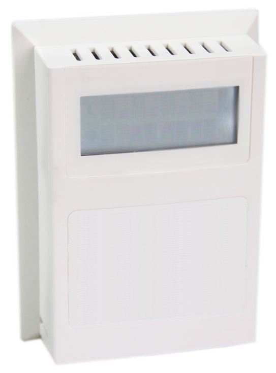

#################################
Modbus - Adding a Device to EdgeX
#################################

EdgeX - Barcelona Release

Ubuntu Desktop 16.04 with Docker/Docker-Compose

Adding a new Modbus RTU Device 

Datanab Modbus Enabled Room Temperature & Humidity Sensor w/ LCD

=========================
Project Components Needed
=========================

**Hardware needed**

X86 computer with native RS485 communication device or RS485 adapter

Datanab Modbus Enabled Room Temp/Humidity Sensor w/ LCD

-- http://www.datanab.com/sensors/modbus_rth_lcd.php

**Software needed**

Ubuntu Desktop 16.04 - new installation

The following software was installed via the “apt-get install” command (ubuntu default)

* git
* curl
* vim (or your favorite editor)
* java (I used openjdk-8-jdk - 1.8.0_131)
* maven
* docker
* docker-compose

The following software was installed from 3rd parties

Postman (Linux 64bit)

-- https://www.getpostman.com/

EdgeX - barcelona-docker-compose.yaml

-- https://github.com/edgexfoundry/developer-scripts/blob/master/docker-compose.yml

**Modbus - Device documentation**

-- http://www.datanab.com/zc/docs/sensors/MBus_RTH_LCD.pdf

Modbus - Device communication settings

Modbus device Baud rate = 19200

Modbus device Parity = N (none)

Modbus device Data bits = 8

Modbus device Stop bits = 1
Modbus device address: 254 (device specific)
Modbus device register: 100, 101, 102 (device specific)
Modbus device register data type: Integer/Floating point (device specific)

**Gateway RS485 Port Configuration**

For the Dell Edge Gateway 5000:

* Port = “COM 3 (/dev/ttyS5)”
* Port pin 1 = DATA +
* Port pin 2 = DATA -
* Port pin 3 = GND

**Ensuring success**

Verify the following, prior to following the instruction on the following pages

Is the COM port set to RS485?

Does the Modbus device power on?

With a separate utility, can you read(from)/write(to) the modbus device?

**Creating the Modbus yaml file**

.. _`Modbus device yaml`: https://github.com/edgexfoundry/device-modbus/blob/master/src/main/resources/GS1-10P5.profile.yaml
..

An example Modbus device yaml file can be found here: `Modbus device yaml`_. 

.. _`this example Modbus device yaml`: https://github.com/chadbyoung/edgexfoundry-modbus-profiles/blob/master/datanab-modbus-temp-humidity/MBUS_RTH_LCD.yaml
..

The Modbus device yaml file used in this example can be found here: `this example Modbus device yaml`_. 

When you are creating your yaml file you will need to know what command options are available to use, they can be found here:

https://github.com/edgexfoundry/core-domain/blob/master/src/main/java/org/edgexfoundry/domain/meta/PropertyValue.java

With your favorite file editor, open the file

Modify the following fields

* name <-- A/a ~Z/z and 0 ~ 9 && this will be needed in the future
* manufacturer <-- A/a ~Z/z and 0 ~ 9
* model <-- A/a ~Z/z and 0 ~ 9
* description <-- A/a ~Z/z and 0 ~ 9
* labels <-- A/a ~Z/z and 0 ~ 9

deviceResources

* name: <-- A/a ~Z/z and 0 ~ 9
* description: <-- A/a ~Z/z and 0 ~ 9
* attributes: only edit the text inside the parenthesis
* value: only edit the text inside the parenthesis
* units: only edit the text inside the parenthesis

resources

* name: <-- A/a ~Z/z and 0 ~ 9
* get : only edit the text inside the parenthesis
* set: only edit the text inside the parenthesis

commands

* name: <-- A/a ~Z/z and 0 ~ 9
* path: "/api/v1/device/{deviceId}/OnlyEditThisWord" <-- A/a ~Z/z and 0 ~ 9
* Code ”200”

  * expectedvalues: [make same as OnlyEditThisWord]
* Code ”500”

  * Do not edit this section 

**Bringing up EdgeX via Docker**

Starting with following system configuration:

* A fresh installation of Ubuntu Desktop 16.04 with all the available system updates.
* A working directory > /home/tester/Development/edgex

**Verify your Docker installation**

Verify that Docker is installed and working as expected.

>$ sudo docker run hello-world

Verify that the image is on the system

>$ sudo docker ps -a

**Download docker-compose file**

* Download the barcelona-docker-compose.yaml file from the EdgeX Wiki
* Go to “https://wiki.edgexfoundry.org/display/FA/Barcelona”
* Scroll to the bottom a look for the “barcelona-docker-compose.yml” file. Once downloaded, rename the file to “docker-compose.yml”
* Once the file is download, move the file into your desired working directory.
* Create a copy of the file and rename the copy “docker-compose.yml”

**Verify the version of dockerized EdgeX that you will be running**

* With your favorite file editor, open the docker-compose.yml file
* Within the first couple of lines you will see the word “Version”, next to that you will see a number - it should  be “2”.
* Version 2 refers to the Barcelona release

**Enable Modbus in the Docker Compose file**

With your favorite file editor, open the docker-compose file

Find the section “device-modbus” section, which will be commented out with “#” symbols.

Uncomment the entire section

Save your changes and exit out of the editor
Starting EdgeX Docker components

Start Edgex by using the following commands

+------------------------------------+-------------------------------------------------------------------------------------+------------------------------------------------+
|   **Docker Command**               |   **Description**                                                                   |  **Suggested Waiti Time After Completing**     |
+====================================+=====================================================================================+================================================+
| **docker-compose pull**            |  Pull down, but don't start, all the EdgeX Foundry microservices                    | Docker Compose will indicate when all the      |
|                                    |                                                                                     | containers have been pulled successfully       |     
+------------------------------------+-------------------------------------------------------------------------------------+------------------------------------------------+
| docker-compose up -d volume        |  Start the EdgeX Foundry file volume--must be done before the other services are    | A couple of seconds                            |
|                                    |  started                                                                            |                                                |   
+------------------------------------+-------------------------------------------------------------------------------------+------------------------------------------------+
| docker-compose up -d config-seed   |  Start and populate the configuration/registry microservice which all services must | 60 seconds                                     |
|                                    |  register with and get their configuration from                                     |                                                | 
+------------------------------------+-------------------------------------------------------------------------------------+------------------------------------------------+
| docker-compose up -d mongo         |  Start the NoSQL MongoDB container                                                  | 10 seconds                                     | 
+------------------------------------+-------------------------------------------------------------------------------------+------------------------------------------------+
| docker-compose up -d logging       |  Start the logging microservice - used by all micro services that make log entries  | 1 minute                                       | 
+------------------------------------+-------------------------------------------------------------------------------------+------------------------------------------------+
| docker-compose up -d notifications |  Start the notifications and alerts microservice--used by many of the microservices | 30 seconds                                     | 
+------------------------------------+-------------------------------------------------------------------------------------+------------------------------------------------+
| docker-compose up -d metadata      |  Start the Core Metadata microservice                                               | 1 minute                                       | 
+------------------------------------+-------------------------------------------------------------------------------------+------------------------------------------------+
| docker-compose up -d data          |  Start the Core Data microservice                                                   | 1 minute                                       | 
+------------------------------------+-------------------------------------------------------------------------------------+------------------------------------------------+
| docker-compose up -d command       |  Start the Core Command microservice                                                | 1 minute                                       | 
+------------------------------------+-------------------------------------------------------------------------------------+------------------------------------------------+
| docker-compose up -d scheduler     |  Start the scheduling microservice -used by many of the microservices               | 1 minute                                       |
+------------------------------------+-------------------------------------------------------------------------------------+------------------------------------------------+
| docker-compose up -d export-client |  Start the Export Client registration microservice                                  | 1 minute                                       |
+------------------------------------+-------------------------------------------------------------------------------------+------------------------------------------------+
| docker-compose up -d export-distro |  Start the Export Distribution microservice                                         | 1 minute                                       |
+------------------------------------+-------------------------------------------------------------------------------------+------------------------------------------------+
| docker-compose up -d rulesengine   |  Start the Rules Engine microservice                                                | 1 minute                                       |
+------------------------------------+-------------------------------------------------------------------------------------+------------------------------------------------+
| docker-compose up -d device-virtual|  Start the virtual device service                                                   | 1 minute                                       |
+------------------------------------+-------------------------------------------------------------------------------------+------------------------------------------------+
| docker-compose up -d device-modbus |  Start the Modbus device service                                                    | 1 minute                                       |
+------------------------------------+-------------------------------------------------------------------------------------+------------------------------------------------+

Check the containers status

Run a "docker ps -a" command to confirm that all the containers have been downloaded and started

Show containers

To get a list of all the EdgeX containers, you can use “docker-compose config --services”

Stop Containers

To stop (but not remove) all containers, issue “docker-compose stop”.

To stop an individual container, you can use “docker-compose stop [compose-container-name]”.

Start Containers

To start all the containers (after a stop) issue "docker-compose start" to re-start

To start an individual container, you can use "docker-compose start [compose-container-name]" (after that container has been stopped).

Delete Containers *** DANGER ***

To stop all the containers running and DELETE them, you can use “docker-compose down”

**EdgeX Foundry Container Logs**

To view the log of any container, use the command:

"docker-compose logs -f compose-contatainer-name"

(ex. docker-compose logs -f edgex-device-snmp)

At this point the Dockerized version of EdgeX is running.

**Adding the Device to EdgeX**

**Importing APIs**

In this section you will be using the program Postman to interact with EdgeX. You will also need to have the file “core-metadata.raml” available to load into the Postman application.  The file “core-metadata.raml” can be found here: “edgex/core-metadata…./src/test/resources/raml/core-metadata.raml”

**Viewing available APIs**

* Open Postman
* Click on the Import button
* Add the file to the import dialog box - the application will take a about 30 seconds to digest the file you added.
* If a list of API commands do not show up on the left hand side of the application then click on the “Collections” tab to the right of the “History” tab.

**Create an addressable**

* In the “Collections” tab, select the option “POST /addressable action
* Open the body tab
* Modify its contents

  * name: mbus-rth-lcd-address
  * protocol: OTHER (needs to be in ALL CAPS)
  * address: /dev/ttyS5,19200,8,1,0

    * (actual path to device, baud rate, data bits, stop bits, parity)
    * (parity - none = 0, odd = 1, even = 2)

  * port: leave unchanged (since using OTHER, it is ignored)
  * path: 254 (this is where you enter the Modbus Slave ID)
  * publisher, user, password, topic - do not need to be modified

* Press the “Send” button when you are finished
* Note the addressable id

**Upload the profile**

* In the “Collections” tab select the option “POST /deviceprofile/uploadfile
* Open the body tab

  * Under “Key”, look for the drop down menu for “text”. Be sure to write “file” in the open box.
  * Under “Value” click  “Choose Files”, locate your profile file.

* Press Upload
* Press the “Send” button when you are finished
* Note the profile id

**Post the device**

* In the “Collections” tab select the option “POST /device
* Click on the “Body” tab
* Modify its contents

  * There are three components that are required to be modified. They are:

    * “Service”
    * “Profile”
    * “Addressable”
    * The others can be modified, however they are not required for operation

  * name: mbus-rth-lcd-device
  * description: modbus-thermostat
  * addressable:

    * name: mbus-rth-lcd-address (same as used in addressable)
    * labels: “temperature”, “modbus”,”industrial” (same as used in modbus device profile)

  * service:

    * name: edgex-device-modbus

  * profile:

    * name: mbus-rth-lcd (same as used in modbus device profile)

* Press the “Send” button when you are finished
* Note the addressable id

**What if a Mistake is Made**

* Get device id
* Delete device id
* Get device profile id
* Delete device profile id
* Get addressable id
* Delete addressable id

**Verify Device Added**

Check the edgex-device-modbus logs to see if the device was added without issue

“sudo docker logs -f --tail 100 edgex-device-modbus”

**Creating a Scheduled Event**

This is used to regularly get & push data to another service or for regularly viewing data.
Gathering information for the addressable

Got to http://localhost:48082/api/v1/device

Look for the id or the device that you want to schedule an event for

[

   {

       "name": "mbus-rth-lcd-device",

       "id": "5a1dd585e4b0c3936013123d",  <--- This

       "description": "living room HVAC thermostat",

       "labels": [

           "temperature",

           "modbus",

           "industrial"

       ],

       "adminState": "unlocked",

In this example the id is “5a1dd585e4b0c3936013123d”

Next you want to get the “name” of the command you want to schedule an event for

"commands": [
           {
               "id": "5a1dcdfce4b0c39360131239",
               "name": "TemperatureDegF", <--- This
               "get": {
                   "url": "http://localhost:48082/api/v1/device/5a1dd585e4b0c3936013123d/command/5a1dcdfce4b0c39360131239",
                   "responses": [
                       {
                           "code": "200",
                           "description": "Get the temperature in degrees F",
                           "expectedValues": [
                               "TemperatureDegF"
                           ]

In this example the name is "TemperatureDegF".

**Create addressable**

In this section you will need to supply a path the the item you want to schedule.

The path outline is:

/api/v1/device/{device id}/{command name}

In this case, the address would be

/api/v1/device/5a1dd585e4b0c3936013123d/TemperatureDegF

\/POST addressable

    “name”: “schedule-mbus-rth-lcd”

    “protocol”: “HTTP”

    “address”: “edgex-device-modbus”

    “port”: “49991”

    “path”: “/api/v1/device/5a1dd585e4b0c3936013123d/TemperatureDegF”

    “method”: “GET”  *** This will need to be added ***

**Create a schedule**

\/POST schedule

    “name”: “interval-mbus-rth-lcd”

    “start”: null (remove parenthesis and replace)

    “end”: null (remove parenthesis and replace)

    “frequency”: “PT5S”

**Create an event that will use the schedule**

\/POST scheduleevent

    “name”: “device-mbus-rth-lcd”

    “addressable”:{“name”:”schedule-mbus-rth-lcd”}

    “schedule”: “interval-mbus-rth-lcd”

    “service”: “edgex-device-modbus” *** This will need to be added ***

