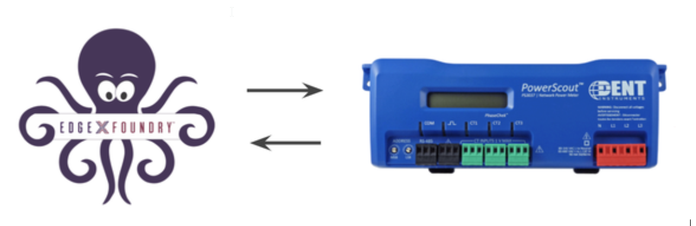

###################################
Connecting EdgeX to a Modbus Device
###################################

EdgeX - Edinburgh Release

PowerScout 3037 Power Submeter

https://shop.dentinstruments.com/products/powerscout-3037-ps3037
https://www.dentinstruments.com/hs-fs/hub/472997/file-2378482732-pdf/Pdf_Files/PS3037_Manual.pdf

In this example, we use a simulator instead of a real device to allow use to test our device-modbus features.

Run a Modbus Device (Simulator)
===============================

https://www.modbusdriver.com/diagslave.html

::

    sudo ./diagslave -m tcp

Set Up: Method One
==================

In this section, we create a folder that contains the files required for deployment::

    - device-service-demo
    |- docker-compose.yml
    |- modbus
    |- configuration.toml
    |- DENT.Mod.PS6037.profile.yaml

Device Profile (DENT.Mod.PS6037.profile.yaml)
---------------------------------------------

The DeviceProfile defines the device's values and operation method, which can be Read or Write. 

In the Modbus protocol, we must define attributes: 

* ``primaryTable``: HOLDING_REGISTERS, INPUT_REGISTERS, COILS, DISCRETES_INPUT
* ``startingAddress`` specifies the address in Modbus device

    .. image:: attributes.png
        :scale: 50%
        :alt: DeviceProfile Attributes

The Property value type decides how many registers will be read. Like Holding registers, a register has 16 bits. If the device manual specifies that a value has two registers, define it as FLOAT32 or INT32 or UINT32 in the deviceProfile.

When we execute a command, device-modbus knows its value type, register type, and startingAddress. Then, it determines the register length according to the known information. So it can read or write value using the modbus protocol.

    .. image:: properties.png
        :scale: 50%
        :alt: Properties

|
|

    .. image:: holdingregisters.png
        :scale: 70%
        :alt: Holding Registers

Create the device profile, as shown below::

    # DENT.Mod.PS6037.profile.yaml
    name: "Network Power Meter"
    manufacturer: "Dent Instruments"
    model: "PS3037"
    description: "Power Scout Meter"
    labels:
      - "modbus"
      - "powerscout"
    deviceResources:
        -
            name: "DemandWindowSize"
            description: "Demand window size in minutes; default is 15 min"
            attributes:
                { primaryTable: "HOLDING_REGISTERS", startingAddress: "4603" }
            properties:
                value:
                    { type: "UINT16", readWrite: "R", size: "1", scale: "1", minimum: "0", maximum: "65535", defaultValue: "0"}
                units:
                    { type: "String", readWrite: "R", defaultValue: "min"}
        -
        name: "LineFrequency"
        description: "Line frequency setting for metering: 50=50 Hz, 60=60Hz"
        attributes:
            { primaryTable: "HOLDING_REGISTERS", startingAddress: "4609" }
        properties:
            value:
                { type: "UINT16", readWrite: "R", size: "1", scale: "1", minimum: "0", maximum: "65535",  defaultValue: "0"}
            units:
                { type: "String", readWrite: "R", defaultValue: "Hz"}
    deviceCommands:
        -
            name: "Configuration"
            set:
                - { index: "1", operation: "set", object: "DemandWindowSize", parameter: "DemandWindowSize" }
                - { index: "2", operation: "set", object: "LineFrequency", parameter:  "LineFrequency" }
            get:
                - { index: "1", operation: "get", object: "DemandWindowSize", parameter:  "DemandWindowSize" }
                - { index: "2", operation: "get", object: "LineFrequency", parameter: "LineFrequency" }
    coreCommands:
        -
            name: "Configuration"
            get:
                path: "/api/v1/device/{deviceId}/Configuration"
                responses:
                    -
                        code: "200"
                        description: "Get the Configuration"
                        expectedValues: ["DemandWindowSize","LineFrequency"]
                    -
                        code: "503"
                        description: "service unavailable"
                        expectedValues: []
            put:
                path: "/api/v1/device/{deviceId}/Configuration"
                parameterNames: ["DemandWindowSize","LineFrequency"]
                responses:
                    -
                        code: "204"
                        description: "Set the Configuration"
                        expectedValues: []
                    -
                        code: "503"
                        description: "service ununavailable"
                        expectedValues: []

Device Service Configuration (configuration.toml)
--------------------------------------------------

We define devices and schedule job (auto events) in the TOML configuration file, and then device-modbus creates the corresponding instances
on startup.
device-modbus offers two types of protocol, Modbus TCP and Modbus RTU, which can be defined as shown below:

   .. csv-table:: Modbus Protocols
       :header: "protocol", "Addess", "Port", "UnitID", "BaudRate", "DataBits", "StopBits", "Parity"
       :widths: 20, 20, 10, 10, 20, 10, 10, 10

       "Modbus TCP", "10.211.55.6", "502", "1", "", "", "", ""
       "Modbus RTU", "/tmp/slave", "", "2", "19200", "8", "1", "N"

Path defines the Modbus device's unit ID (or slave ID).

In the RTU protocol, parity  is as follows: N - None is 0, O - Odd is 1, E - Even is 2, default is E.

Create the configuration file, as shown below::

    [Service]
    Host = "edgex-device-modbus"
    Port = 49991
    ConnectRetries = 3
    Labels = ["modbus"]
    OpenMsg = "device modbus started"
    ReadMaxLimit = 256
    Timeout = 5000
    EnableAsyncReadings = true
    AsyncBufferSize = 16

    [Registry]
    Host = "edgex-core-consul"
    Port = 8500
    CheckInterval = "10s"
    FailLimit = 3
    FailWaitTime = 10
    Type = "consul"

    [Clients]
      [Clients.Data]
      Name = "edgex-core-data"
      Protocol = "http"
      Host = "edgex-core-data"
      Port = 48080
      Timeout = 50000

      [Clients.Metadata]
      Name = "edgex-core-metadata"
      Protocol = "http"
      Host = "edgex-core-metadata"
      Port = 48081
      Timeout = 50000

      [Clients.Logging]
      Name = "edgex-support-logging"
      Protocol = "http"
      Host = "edgex-support-logging"
      Port = 48061

    [Writable]
    LogLevel = "INFO"

    [Logging]
    EnableRemote = false
    File = "./device-modbus.log"

    [Device]
      DataTransform = true
      InitCmd = ""
      InitCmdArgs = ""
      MaxCmdOps = 128
      MaxCmdValueLen = 256
      RemoveCmd = ""
      RemoveCmdArgs = ""
      ProfilesDir = "/custom-config"

    # Pre-define Devices
    [[DeviceList]]
      Name = "Modbus-TCP-Device"
      Profile = "Network Power Meter"
      Description = "This device is a product for monitoring and controlling digital inputs and outputs over a LAN."
      labels = [ "Air conditioner","modbus TCP" ]
      [DeviceList.Protocols]
        [DeviceList.Protocols.modbus-tcp]
           Address = "192.168.214.129"
           Port = "502"
           UnitID = "1"
      [[DeviceList.AutoEvents]]
        Frequency = "50s"
        OnChange = false
        Resource = "Configuration"

    [[DeviceList]]
      Name = "Modbus-RTU-Device"
      Profile = "Network Power Meter"
      Description = "This device is a product for monitoring and controlling digital inputs and outputs over a LAN."
      labels = [ "Air conditioner","modbus RTU" ]
      [DeviceList.Protocols]
        [DeviceList.Protocols.modbus-rtu]
           Address = "/tmp/slave"
           BaudRate = "19200"
           DataBits = "8"
           StopBits = "1"
           Parity = "N"

Note that ProfilesDir points to "/custom-config", so the Device Service loads the device profile YAML files from this folder.

Add Device Service to docker-compose File (docker-compose.yml)
---------------------------------------------------------------

Download the docker-compose file from https://github.com/edgexfoundry/developer-scripts/blob/master/compose-files/docker-compose-edinburgh-1.0.0.yml .

Because we deploy EdgeX using docker-compose, we must add the device-modbus to the docker-compose file. If you have prepared configuration files, you can mount them using volumes and change the entrypoint for device-modbus internal use.

This is illustrated in the following docker-compose file snippet::

    device-modbus:
        image: edgexfoundry/docker-device-modbus-go:1.0.0
        ports:
          - "49991:49991"
        container_name: edgex-device-modbus
        hostname: edgex-device-modbus
        networks:
          - edgex-network
        volumes:
          - db-data:/data/db
          - log-data:/edgex/logs
          - consul-config:/consul/config
          - consul-data:/consul/data
          - ./modbus:/custom-config
        depends_on:
          - data
         - command
        entrypoint:
          - /device-modbus
          - --registry=consul://edgex-core-consul:8500
          - --confdir=/custom-config

When using Device Services, users must provide the registry URL in the ``--registry`` argument.

Start EdgeX Foundry on Docker
=============================

Once the following folder has been populated, we can deploy EdgeX::

    - device-service-demo
    |- docker-compose.yml
    |- modbus
    |- configuration.toml
    |- DENT.Mod.PS6037.profile.yaml

Deploy EdgeX using the following commands::

    cd path/to/device-service-demo
    docker-compose pull
    docker-compose up -d

After the service start, check the consul dashboard

    .. image:: consul.png
        :scale: 50%
        :alt: Consul Dashboard

Set-up: Method Two
==================

Instead of using the configuration described above, you can create the Device Profile and Device using the Core Metadata API after the services start up. To do this, complete the following: 

1. Upload the device profile, illustrated above, to metadata with a POST to http://localhost:48081/api/v1/deviceprofile/uploadfile and add the file as key “file” to the body in form-data format. The created ID is returned.  The following  example command uses curl to send the request::

    $ curl localhost:48081/api/v1/deviceprofile/uploadfile \ -F "file=@modbus.device.profile.yml"

2. Ensure that the Modbus Device Service is running, and then adjust the service name in the code shown below to match if necessary or if using other Device Services.

3. Add the device with a POST to http://localhost:48081/api/v1/device, and the body of the command similar to the following::

    $ curl localhost:48081/api/v1/device -H
    "Content-Type:application/json" -X POST \
    -d '{
     "name" :"AWS IOT Button1",
     "description":"Home automation system",
     "adminState":"UNLOCKED",
     "operatingState":"ENABLED",
     "protocols":{
        "modbus-tcp":{
        "host":"localhost",
        "port":"1234",
        "unitID":"1"
      }
    },
    "labels":[
      "home",
      "hvac",
    ],
    "service":{
      "name":"edgex-device-modbus",
      "adminState": "unlocked",
      "operatingState": "enabled",
      "addressable": {
        "name": "test addressable for Google Home device service"
     }
    },
    "profile":{
       "name":"Google Home profile"
    },
    "autoEvents":[
       {
        "frequency":"300ms",
        "onChange":true,
        "resource":"CurrentHumidity"
       }
      ]
    }'

The profile name must match the name of the device profile being used.

Execute Commands
================

Now we're ready to run some commands.

Find Executable Commands
------------------------

Use the following query to find executable commands::

    $ curl http://your-edgex-server-ip:48082/api/v1/device | json_pp
      % Total % Received % Xferd Average Speed Time Time Time
    Current
                                 Dload Upload Total Spent Left Speed
    100 1718 100 1718 0 0 14081 0 --:--:-- --:--:-- --:--:--14081
    [
       {
        "id" : "56dcf3ad-52d8-4d12-a2d0-ae53c177ae3d",
        "commands" : [
           {
             "put" : {
                "url" :
    "http://edgex-core-command:48082/api/v1/device/56dcf3ad-52d8-4d12-a2d0-ae53c177ae3d/command/67b35f63-8f94-427b-a60c-188bf9e0633a",
                "parameterNames" : [
                   "DemandWindowSize",
                   "LineFrequency"
                 ],
                 "path" : "/api/v1/device/{deviceId}/Configuration"
            },
            "id" : "67b35f63-8f94-427b-a60c-188bf9e0633a",
            "get" : {
               "url" :
    "http://edgex-core-command:48082/api/v1/device/56dcf3ad-52d8-4d12-a2d0-ae53c177ae3d/command/67b35f63-8f94-427b-a60c-188bf9e0633a",
               "responses" : [
                  {
                     "description" : "service unavailable", "code" : "503"
                  }
                ],
                "path" : "/api/v1/device/{deviceId}/Configuration"
             },
             ...
             "name" : "Configuration"
          }
        ],
        ...
      },
      {
        ....
      }
    ]

Execute put Command
-------------------

Execute a put command according to the url and parameterNames, replacing [host] with the server IP when running the edgex-core-command.

This can be done in either of the following ways::

    $ curl
    http://your-edgex-server-ip:48082/api/v1/device/56dcf3ad-52d8-4d12-a2d0-ae53c177ae3d/command/67b35f63-8f94-427b-a60c-188bf9e0633a \
      -H "Content-Type:application/json" -X PUT \
      -d '{"DemandWindowSize":"1122","LineFrequency":"1012"}'

or::

    $ curl
    "http://your-edgex-server-ip:48082/api/v1/device/name/Modbus-TCP-Device/command/Configuration" \
      -H "Content-Type:application/json" -X PUT \
      -d '{"DemandWindowSize":"1122","LineFrequency":"1012"}'

Execute get Command
-------------------

Execute a get command as follows::

    $ curl
    "http://your-edgex-server-ip:48082/api/v1/device/name/Modbus-TCP-Device/command/Configuration" | json_pp
      % Total % Received % Xferd Average Speed Time Time Time Current
                                 Dload Upload Total Spent Left Speed
        100 254 100 254 0 0 2956 0 --:--:-- --:--:-- --:--:--2988
    {
        "readings" : [
           {
              "device" : "Modbus-TCP-Device",
              "name" : "DemandWindowSize",
              "value" : "1122",
              "origin" : 1559141214212
            },
            {
              "name" : "LineFrequency",
              "device" : "Modbus-TCP-Device",
              "value" : "1012",
              "origin" : 1559141214239
            }
          ],
          "device" : "Modbus-TCP-Device",
          "origin" : 1559141214258
    }

Schedule Job
============

The schedule job is defined in the [[DeviceList.AutoEvents]] section of the TOML configuration file::

    # Pre-define Devices
    [[DeviceList]]
      Name = "Modbus-TCP-Device"
      Profile = "Network Power Meter"
      Description = "This device is a product for monitoring and controlling digital inputs and outputs over a LAN."
      labels = [ "Air conditioner","modbus TCP" ]
      [DeviceList.Protocols]
        [DeviceList.Protocols.modbus-tcp]
           Address = "192.168.214.131"
           Port = "502"
           UnitID = "1"
      [[DeviceList.AutoEvents]]
        Frequency = "50s"
        OnChange = false
        Resource = "Configuration"

After the service starts, query core-data's reading API. The results show that the service automatically executes the command every 50 secs, as shown below:

    $ curl http://your-edgex-server-ip:48080/api/v1/reading | json_pp
      % Total % Received % Xferd Average Speed Time Time Time Current
                                 Dload Upload Total Spent Left Speed
        100 1115 100 1115 0 0 73340 0 --:--:-- --:--:-- --:--:--74333
     [
       {
         "value" : "1122",
         "created" : 1559140272386,
         "device" : "Modbus-TCP-Device",
         "name" : "DemandWindowSize",
         "modified" : 1559140272386,
         "id" : "bd966c85-af0d-4981-a93c-595a95eef25a",
         "origin" : 1559140272339
        },
        {
         "modified" : 1559140272386,
         "origin" : 1559140272367,
         "id" : "deaf0863-8dc5-47b0-9ce9-d9a405c0b356",
         "value" : "1012",
         "name" : "LineFrequency",
         "device" : "Modbus-TCP-Device",
         "created" : 1559140272386
        },
        {
         "value" : "0",
         "device" : "Modbus-TCP-Device",
         "created" : 1559140222335,
         "name" : "DemandWindowSize",
         "modified" : 1559140222335,
         "id" : "f4808bc6-a9ee-4e82-99f5-7e15c501fb7d",
         "origin" : 1559140222272
        },
        {
         "device" : "Modbus-TCP-Device",
         "created" : 1559140222335,
         "name" : "LineFrequency",
         "value" : "0",
         "origin" : 1559140222299,
         "id" : "d3af8e81-c627-45d7-8e39-ad1c1a0a582d",
         "modified" : 1559140222335
        }
    ]

