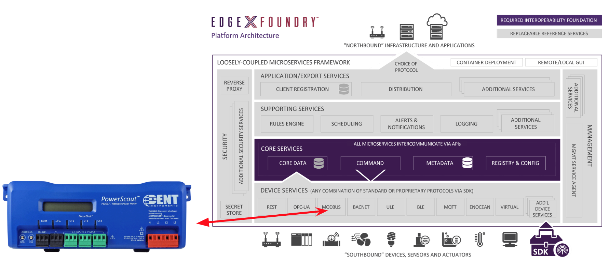
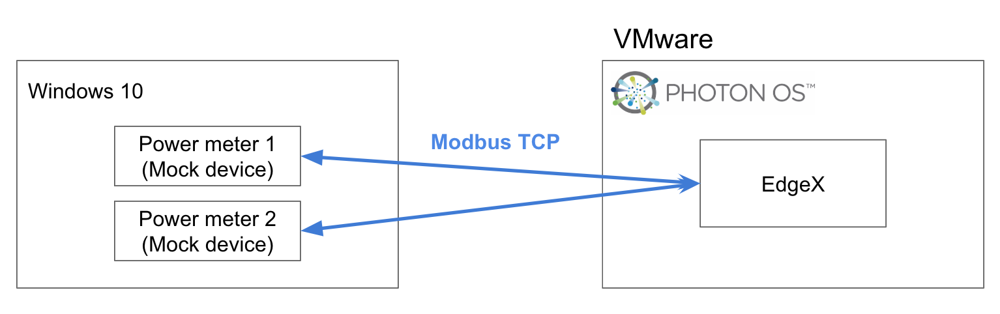
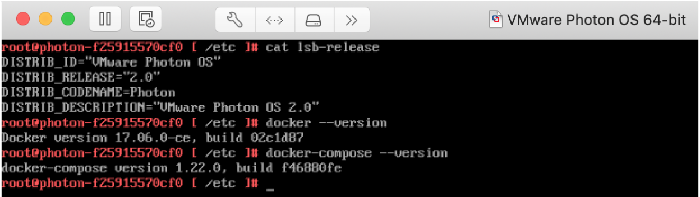
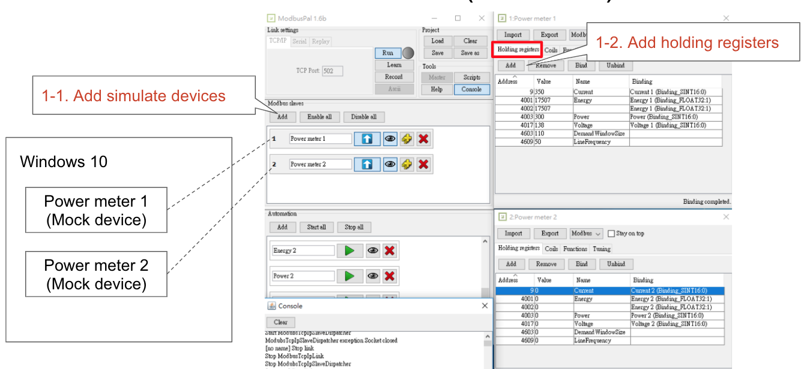

#################################
Modbus - Adding a Device to EdgeX
#################################

EdgeX - Delhi Release

PowerScout 3037 Power Submeter

https://shop.dentinstruments.com/products/powerscout-3037-ps3037
https://www.dentinstruments.com/hs-fs/hub/472997/file-2378482732-pdf/Pdf_Files/PS3037_Manual.pdf

In this example, we simulate the PowerScout meter instead of using a real device. This provides a straight-forward way to test the device-modbus features.

Environment
===========

You can use any operating system that can install docker and docker-compose. In this example, we use Photon OS to delpoy EdgeX using docker. The system requirements can be found at https://docs.edgexfoundry.org/Ch-GettingStartedUsers.html#what-you-need.

Modbus Device (Simulator)
=========================

http://modbuspal.sourceforge.net/

To simulate sensors, such as temperature and humidity, do the following:

1. Add two mock devices:

2. Add registers according to the device manual:

    .. image:: addregisters.png
        :scale: 50%
        :alt: Add Registers

3. Add the ModbusPal support value auto-generator, which can bind to registers:

    .. image:: addvaluegen.png
        :scale: 50%
        :alt: Add Device Value Generators

    .. image:: bindvalue.png
        :scale: 50%
        :alt: Bind Value Generator

Set Up Before Starting Services
===============================

The following sections describe how to complete the set up before starting the services. If you prefer to start the services and then add the device, see `Set Up After Starting Services`_

Set Up Device Profile
---------------------

The DeviceProfile defines the device's values and operation method, which can be Read or Write. 

You can download and use the provided :download:`mqtt.test.device.profile.yml
<mqtt.test.device.profile.yml>`.

In the Modbus protocol, we must define attributes: 

* ``primaryTable``: HOLDING_REGISTERS, INPUT_REGISTERS, COILS, DISCRETES_INPUT
* ``startingAddress`` specifies the address in Modbus device

    .. image:: attributes.png
        :scale: 50%
        :alt: DeviceProfile Attributes

The Property value type decides how many registers will be read. Like Holding registers, a register has 16 bits. If the device manual specifies that a value has two registers, define it as FLOAT32 or INT32 or UINT32 in the deviceProfile.

Once we execute a command, device-modbus knows its value type and register type, startingAddress, and register length. So it can read or write value using the modbus protocol.

    .. image:: properties.png
        :scale: 50%
        :alt: Properties

|
|

    .. image:: holdingregisters.png
        :scale: 70%
        :alt: Holding Registers

|
|

    .. image:: profileyaml.png
        :scale: 70%
        :alt: Profile YAML

Set Up Device Service Configuration
-----------------------------------

Use this configuration file to define devices and schedule jobs. The device-modbus generates a relative instance on startup.

device-modbus offers two types of protocol, Modbus TCP and Modbus RTU. An addressable can be defined as shown below:

   .. csv-table:: Modbus Protocols
       :header: "protocol", "Name", "Protocol", "Address", "Port", "Path"
       :widths: 20, 20, 10, 20, 10, 10

       "Modbus TCP", "Gateway address 1", "TCP", "10.211.55.6", "502", "1"
       "Modbus RTU", "Gateway address 2", "RTU", "/tmp/slave,19200,8,1,0", "502", "2"

Path defines the Modbus device's unit ID (or slave ID).

In the RTU protocol, address is defined in five comma-separated parts:

* serial port
* baud rate 
* data bits
* stop bits
* parity (N - None is 0, O - Odd is 1, E - Even is 2, default is E).

::

    [Logging]
    EnableRemote = false
    File = "./device-Modbus.log"
    Level = "DEBUG"

    [Device]
      DataTransform = true
      InitCmd = ""
      InitCmdArgs = ""
      MaxCmdOps = 128
      MaxCmdValueLen = 256
      RemoveCmd = ""
      RemoveCmdArgs = ""
      ProfileDir = "/custom-config"

    # Pre-define Devices
    [[DeviceList]]
      Name = "Modbus TCP test device"
      Profile = "Network Power Meter"
      Description = "This device is a product for monitoring and controlling digital inputs and outputs over a LAN."
      labels = [ "Air conditioner","modbus TCP" ]
      [DeviceList.Addressable]
        name = "Gateway address 1"
        Protocol = "TCP"
        Address = "10.211.55.6"
        Port = 502
        Path = "1"
    
    [[DeviceList]]
      Name = "Modbus TCP test device 2"
      Profile = "Network Power Meter"
      Description = "This device is a product for monitoring and controlling digital inputs and outputs over a LAN."
      labels = [ "Air conditioner","modbus TCP" ]
      [DeviceList.Addressable]
        name = "Gateway address 1"
        Protocol = "TCP"
        Address = "10.211.55.6"
        Port = 502
        Path = "2"

   # Pre-define Schedule Configuration
    [[Schedules]]
    Name = "20sec-schedule"
    Frequency = "PT20S"

    [[ScheduleEvents]]
    Name = "Read Switch status"
    Schedule = "20sec-schedule"
      [ScheduleEvents.Addressable]
      HTTPMethod = "GET"
    Path = "/api/v1/device/name/Modbus TCP test device 1/Configuration"

    [[ScheduleEvents]]
    Name = "Put Configuration"
    Parameters = "[{\"DemandWindowSize\": \"110\"},{\"LineFrequency\": \"50\"}]"
    Schedule = "20sec-schedule"
      [ScheduleEvents.Addressable]
      HTTPMethod = "Put"
      Path = "/api/v1/device/name/Modbus TCP test device 1/Configuration"

You can download and use the provided :download:`EdgeX_ExampleModbus_configuration.toml
<EdgeX_ExampleModbus_configuration.toml>`.

Add Device Service to docker-compose File
-----------------------------------------

Because we deploy EdgeX using docker-compose, we must add the device-modbus to the docker-compose file ( https://github.com/edgexfoundry/developer-scripts/blob/master/compose-files/docker-compose-delhi-0.7.0.yml ). If you have prepared configuration files, you can mount them using volumes and change the entrypoint for device-modbus internal use.

    .. image:: config_changes.png
        :scale: 50%
        :alt: configuration.toml Updates

Start EdgeX Foundry on Docker
=============================

Finally, we can deploy EdgeX in the Photon OS.

1. Prepare configuration files by moving the files to the Photon OS

2. Deploy EdgeX using the following commands::

    docker-compose pull
    docker-compose up -d

 .. image:: startEdgeX.png
      :scale: 50%
      :alt: Start EdgeX

3. Check the consul dashboard

    .. image:: consul.png
        :scale: 50%
        :alt: Consul Dashboard

Set Up After Starting Services
==============================

If the services are already running and you want to add a device, you can use the Core Metadata API as outlined in this section. If you set up the device profile and Service as described in `Set Up Before Starting Services`_, you can skip this section.

To add a device after starting the services, complete the following steps:

1. Upload the device profile above to metadata with a POST to http://localhost:48081/api/v1/deviceprofile/uploadfile and add the file as key “file” to the body in form-data format, and the created ID will be returned.  The following figure is an example if you use Postman to send the request

    .. image:: upload_profile.png
        :scale: 50%
        :alt: Uploading the Profile

2. Add the addressable containing reachability information for the device with a POST to http://localhost:48081/api/v1/addressable: 

    a. If IP connected, the body will look something like: { “name”: “Motor”, “method”: “GET”, “protocol”: “HTTP”, “address”: “10.0.1.29”, “port”: 502 } 
    b. If serially connected, the body will look something like: { “name”: “Motor”, “method”: “GET”, “protocol”: “OTHER”, “address”: “/dev/ttyS5,9600,8,1,1”, “port”: 0 } (address field contains port, baud rate, number of data bits, stop bits, and parity bits in CSV form)

3. Ensure the Modbus device service is running, adjust the service name below to match if necessary or if using other device services.

4. Add the device with a POST to http://localhost:48081/api/v1/device, the body will look something like::

    {
      "description": "MicroMax Variable Speed Motor",
      "name": "Variable Speed motor",
      "adminState": "unlocked",
      "operatingState": "enabled",
      "addressable": {
        "name": "Motor"
 
      },
      "labels": [
 
      ],
      "location": null,
      "service": {
        "name": "edgex-device-modbus"
 
      },
      "profile": {
        "name": "GS1-VariableSpeedMotor"
 
      }
    }

   The addressable name must match/refer to the addressable added in Step 2, the service name must match/refer to the target device service, and the profile name must match the device profile name from Step 1.

Execute Commands
================

Now we're ready to run some commands.

Find Executable Commands
------------------------

Use the following query to find executable commands::

    photon-ip:48082/api/v1/device

|

    .. image:: commands.png
        :scale: 50%
        :alt: Executable Commands

Execute GET command
-------------------

Replace *<host>* with the server IP when running the edgex-core-command.

    .. image:: getcommand.png
        :scale: 50%
        :alt: GET Command

Execute PUT command
-------------------

Execute PUT command according to ``url`` and ``parameterNames``.

    .. image:: putcommand.png
        :scale: 50%
        :alt: PUT Command

|
|

    .. image:: putModbusPal.png
        :scale: 50%
        :alt: PUT ModbusPal

Schedule Job
============

After service startup, query core-data's reading API. The results show that the service auto-executes the command every 20 seconds.

    .. image:: scheduleconfig.png
        :scale: 50%
        :alt: Schedule Configuration

|
|

    .. image:: getreading.png
        :scale: 50%
        :alt: GET Readings

