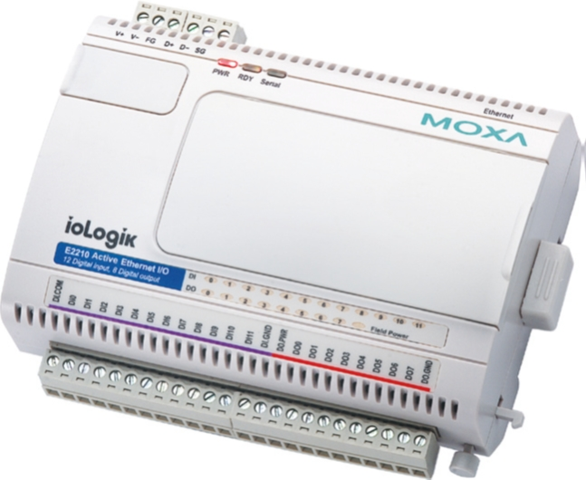

#################################
SNMP - Adding a Device to EdgeX
#################################

EdgeX - Barcelona Release

Ubuntu Desktop 16.04 with Docker/Docker-Compose

Adding a new SNMP Device 

Moxa ioLogik E2210 Smart Ethernet Remote I/O with 12 DIs, 8 Dos

=========================
Project Components Needed
=========================

**Hardware needed**

X86 computer with native RS485 communication device or RS485 adapter

Moxa E2210 Ethernet IO

-- https://www.moxa.com/product/ioLogik-E2210.htm

**Software needed**

Ubuntu Desktop 16.04 - new installation

The following software was installed via the “apt-get install” command (ubuntu default)

* git
* curl
* vim (or your favorite editor)
* java (I used openjdk-8-jdk - 1.8.0_131)
* maven
* docker
* docker-compose

The following software was installed from 3rd parties

Postman (Linux 64bit)

-- https://www.getpostman.com/

EdgeX - barcelona-docker-compose.yaml

-- https://github.com/edgexfoundry/developer-scripts/blob/master/docker-compose.yml

**SNMP - Device documentation**

Device: Moxa E2210 (Smart Ethernet Remote I/O with 12 DIs, 8 DOs)

https://www.moxa.com/product/ioLogik-E2210.htm

**Ensuring success**

Verify the following, prior to following the instruction on the following pages

Do you know the IP address of the E2210?

Do you know what port number of the E2210 is using?

Does the E2210 power on?

With a separate utility, can you read(from)/write(to) the E2210?

**Creating the Modbus yaml file**

.. _`SNMP device yaml`: https://github.com/edgexfoundry/device-snmp/blob/master/src/main/resources/patlite.NHL-FBL.profile.yaml
..

An example SNMP device yaml file can be found here: `SNMP device yaml`_. 

.. _`this example SNMP device yaml`: https://github.com/chadbyoung/edgexfoundry-snmp-profiles/blob/master/moxa.e2210.profile.yaml
..

The SNMP device yaml file used in this example can be found here: `this example SNMP device yaml`_. 

When you are creating your yaml file you will need to know what command options are available to use, they can be found here:

https://github.com/edgexfoundry/core-domain/blob/master/src/main/java/org/edgexfoundry/domain/meta/PropertyValue.java

With your favorite file editor, open the file

Modify the following fields

* name <-- A/a ~Z/z and 0 ~ 9 && this will be needed in the future
* manufacturer <-- A/a ~Z/z and 0 ~ 9
* model <-- A/a ~Z/z and 0 ~ 9
* description <-- A/a ~Z/z and 0 ~ 9
* labels <-- A/a ~Z/z and 0 ~ 9

deviceResources

* name: <-- A/a ~Z/z and 0 ~ 9
* description: <-- A/a ~Z/z and 0 ~ 9
* attributes: only edit the text inside the parenthesis
* value: only edit the text inside the parenthesis
* units: only edit the text inside the parenthesis

resources

* name: <-- A/a ~Z/z and 0 ~ 9
* get : only edit the text inside the parenthesis
* set: only edit the text inside the parenthesis

commands

* name: <-- A/a ~Z/z and 0 ~ 9
* path: "/api/v1/device/{deviceId}/OnlyEditThisWord" <-- A/a ~Z/z and 0 ~ 9
* Code ”200”

  * expectedvalues: [make same as OnlyEditThisWord]
* Code ”500”

  * Do not edit this section 

**Bringing up EdgeX via Docker**

Starting with following system configuration:

* A fresh installation of Ubuntu Desktop 16.04 with all the available system updates.
* A working directory > /home/tester/Development/edgex

**Verify your Docker installation**

Verify that Docker is installed and working as expected.

>$ sudo docker run hello-world

Verify that the image is on the system

>$ sudo docker ps -a

**Download docker-compose file**

* Download the barcelona-docker-compose.yaml file from the EdgeX Wiki
* Go to “https://wiki.edgexfoundry.org/display/FA/Barcelona”
* Scroll to the bottom a look for the “barcelona-docker-compose.yml” file. Once downloaded, rename the file to “docker-compose.yml”
* Once the file is download, move the file into your desired working directory.
* Create a copy of the file and rename the copy “docker-compose.yml”

**Verify the version of dockerized EdgeX that you will be running**

* With your favorite file editor, open the docker-compose.yml file
* Within the first couple of lines you will see the word “Version”, next to that you will see a number - it should  be “2”.
* Version 2 refers to the Barcelona release

**Enable SNMP in the Docker Compose file**

With your favorite file editor, open the docker-compose file

Find the section “device-snmp” section, which will be commented out with “#” symbols.

Uncomment the entire section

Save your changes and exit out of the editor
Starting EdgeX Docker components

Start Edgex by using the following commands

+------------------------------------+-------------------------------------------------------------------------------------+------------------------------------------------+
|   **Docker Command**               |   **Description**                                                                   |  **Suggested Waiti Time After Completing**     |
+====================================+=====================================================================================+================================================+
| **docker-compose pull**            |  Pull down, but don't start, all the EdgeX Foundry microservices                    | Docker Compose will indicate when all the      |
|                                    |                                                                                     | containers have been pulled successfully       |     
+------------------------------------+-------------------------------------------------------------------------------------+------------------------------------------------+
| docker-compose up -d volume        |  Start the EdgeX Foundry file volume--must be done before the other services are    | A couple of seconds                            |
|                                    |  started                                                                            |                                                |   
+------------------------------------+-------------------------------------------------------------------------------------+------------------------------------------------+
| docker-compose up -d config-seed   |  Start and populate the configuration/registry microservice which all services must | 60 seconds                                     |
|                                    |  register with and get their configuration from                                     |                                                | 
+------------------------------------+-------------------------------------------------------------------------------------+------------------------------------------------+
| docker-compose up -d mongo         |  Start the NoSQL MongoDB container                                                  | 10 seconds                                     | 
+------------------------------------+-------------------------------------------------------------------------------------+------------------------------------------------+
| docker-compose up -d logging       |  Start the logging microservice - used by all micro services that make log entries  | 1 minute                                       | 
+------------------------------------+-------------------------------------------------------------------------------------+------------------------------------------------+
| docker-compose up -d notifications |  Start the notifications and alerts microservice--used by many of the microservices | 30 seconds                                     | 
+------------------------------------+-------------------------------------------------------------------------------------+------------------------------------------------+
| docker-compose up -d metadata      |  Start the Core Metadata microservice                                               | 1 minute                                       | 
+------------------------------------+-------------------------------------------------------------------------------------+------------------------------------------------+
| docker-compose up -d data          |  Start the Core Data microservice                                                   | 1 minute                                       | 
+------------------------------------+-------------------------------------------------------------------------------------+------------------------------------------------+
| docker-compose up -d command       |  Start the Core Command microservice                                                | 1 minute                                       | 
+------------------------------------+-------------------------------------------------------------------------------------+------------------------------------------------+
| docker-compose up -d scheduler     |  Start the scheduling microservice -used by many of the microservices               | 1 minute                                       |
+------------------------------------+-------------------------------------------------------------------------------------+------------------------------------------------+
| docker-compose up -d export-client |  Start the Export Client registration microservice                                  | 1 minute                                       |
+------------------------------------+-------------------------------------------------------------------------------------+------------------------------------------------+
| docker-compose up -d export-distro |  Start the Export Distribution microservice                                         | 1 minute                                       |
+------------------------------------+-------------------------------------------------------------------------------------+------------------------------------------------+
| docker-compose up -d rulesengine   |  Start the Rules Engine microservice                                                | 1 minute                                       |
+------------------------------------+-------------------------------------------------------------------------------------+------------------------------------------------+
| docker-compose up -d device-virtual|  Start the virtual device service                                                   | 1 minute                                       |
+------------------------------------+-------------------------------------------------------------------------------------+------------------------------------------------+
| docker-compose up -d device-snmp   |  Start the SNMP device service                                                      | 1 minute                                       |
+------------------------------------+-------------------------------------------------------------------------------------+------------------------------------------------+

Check the containers status

Run a "docker ps -a" command to confirm that all the containers have been downloaded and started

Show containers

To get a list of all the EdgeX containers, you can use “docker-compose config --services”

Stop Containers

To stop (but not remove) all containers, issue “docker-compose stop”.

To stop an individual container, you can use “docker-compose stop [compose-container-name]”.

Start Containers

To start all the containers (after a stop) issue "docker-compose start" to re-start

To start an individual container, you can use "docker-compose start [compose-container-name]" (after that container has been stopped).

Delete Containers *** DANGER ***

To stop all the containers running and DELETE them, you can use “docker-compose down”

**EdgeX Foundry Container Logs**

To view the log of any container, use the command:

"docker-compose logs -f compose-contatainer-name"

(ex. docker-compose logs -f edgex-device-snmp)

At this point the Dockerized version of EdgeX is running.

**Adding the Device to EdgeX**

**Importing APIs**

In this section you will be using the program Postman to interact with EdgeX. You will also need to have the file “core-metadata.raml” available to load into the Postman application.  The file “core-metadata.raml” can be found here: “edgex/core-metadata…./src/test/resources/raml/core-metadata.raml”

**Viewing available APIs**

* Open Postman
* Click on the Import button
* Add the file to the import dialog box - the application will take a about 30 seconds to digest the file you added.
* If a list of API commands do not show up on the left hand side of the application then click on the “Collections” tab to the right of the “History” tab.

**Create an addressable**

* In the “Collections” tab, select the option “POST /addressable action
* Open the body tab
* Modify its contents

  * name: moxa-e2210-address
  * protocol: HTTP (needs to be in ALL CAPS)
  * address: 192.168.1.103 (IPV4 address)
  * port: 161 (port # of snmp)
  * path: empty (remove all text between parentheses)
  * publisher, user, password, topic - do not need to be modified
  
* Press the “Send” button when you are finished
* Note the addressable id

**Upload the profile**

* In the “Collections” tab select the option “POST /deviceprofile/uploadfile
* Open the body tab

  * Under “Key”, look for the drop down menu for “text”. Be sure to write “file” in the open box.
  * Under “Value” click  “Choose Files”, locate your profile file.

* Press Upload
* Press the “Send” button when you are finished
* Note the profile id

**Post the device**

* In the “Collections” tab select the option “POST /device
* Click on the “Body” tab
* Modify its contents

  * There are three components that are required to be modified. They are:

    * “Service”
    * “Profile”
    * “Addressable”
    * The others can be modified, however they are not required for operation

  * name: moxa-e2210-device
  * description: snmp smart ethernet io
  * addressable:

    * name: moxa-e2210-address (same as used in addressable)
    * labels: labels: “snmp”, “rtu”,”io” (same as used in snmp device profile)

  * service:

    * name: edgex-device-snmp

  * profile:

    * name:     name: moxa-iologik-e2210 (same as used in snmp device profile)

* Press the “Send” button when you are finished
* Note the addressable id

**What if a Mistake is Made**

* Get device id
* Delete device id
* Get device profile id
* Delete device profile id
* Get addressable id
* Delete addressable id

**Verify Device Added**

Check the edgex-device-snmp logs to see if the device was added without issue

“sudo docker logs -f --tail 100 edgex-device-snmp”

**Verify device is sending data**

In the “Collections” tab select the option “GET /device

Change the port number form “48081” http://localhost:48081/api/v1/device to port number “48082” http://localhost:48082/api/v1/device

Press Send

You should see something similar to 

::

   {

               "id": "5a1d6f8ae4b0c3936013120f",
  
               "name": "diStatus0",

               "get": {

                   "url": "http://localhost:48082/api/v1/device/5a1d7134e4b0c39360131212/command/5a1d6f8ae4b0c3936013120f", <-- This

                   "responses": [

                       {

                           "code": "200",

                           "description": "Get di 0 Status.",

                           "expectedValues": [

                               "diStatus0"

                           ]

                       },

                       {

                           "code": "503",

                           "description": "service unavailable",

                           "expectedValues": []

                       }

                   ]

               },

               "put": null

    },

Double click on the “url” and a new tab within Postman should open, Press Send

If all went well you should see something similar to the following:

{"diStatus0":"0"}

If all did not go well the you will see an error or may “{ }” then you will need check the information you entered.  If the data/result displayed was as expected, go ahead and proceed to creating a scheduled event

**Creating a Scheduled Event**

This is used to regularly get & push data to another service or for regularly viewing data.

Gathering information for the addressable

Got to http://localhost:48082/api/v1/device

Look for the id or the device that you want to schedule an event for

::

  [

     {

         "name": "moxa-e2210-device",

         "id": "5a280a0be4b0c39393ec7780",  <--- This

         "description": "snmp smart ethernet io",

         "labels": [

             "snmp",

             "rtu",

             "io"

         ],

         "adminState": "unlocked",

In this case the id is “5a280a0be4b0c39393ec7780”

Next you want to get the “name” of the command you want to schedule an event for

::

  "commands": [

             {

                 "id": "5a2808e6e4b0c39393ec777c",

                 "name": "serverModel",

                 "get": {

                     "url": "http://localhost:48082/api/v1/device/5a280a0be4b0c39393ec7780/command/5a2808e6e4b0c39393ec777c",

                     "responses": [

                         {

                             "code": "200",

                             "description": "Get server model number.",

                             "expectedValues": [

                                 "serverModel"

                             ]

                         },

                         {

                             "code": "503",

                             "description": "service unavailable",

                             "expectedValues": []

                         }

                     ]

                 },

                 "put": null

             },

             {

                 "id": "5a2808e6e4b0c39393ec777d",

                 "name": "diStatus0",  <--- This

                 "get": {

                     "url": "http://localhost:48082/api/v1/device/5a280a0be4b0c39393ec7780/command/5a2808e6e4b0c39393ec777d",

                     "responses": [

                         {

                             "code": "200",

                             "description": "Get di 0 Status.",

                             "expectedValues": [

                                 "diStatus0"

                             ]

In this example the name is "diStatus0".

**Create addressable**

In this section you will need to supply a path the the item you want to schedule.

The path outline is:

/api/v1/device/{device id}/{command name}

In this case, the address would be

::

  /api/v1/device/XXXX/diStatus0

  /POST addressable

      “name”: ”schedule-moxa-di”

      “protocol”: “HTTP”

      “address”: “edgex-device-snmp”

      “port”: “xxxxx”

      “path”: ”/api/v1/device/{device id}/{command name}”

      “method”: “GET”  *** This will need to be added ***

**Create a schedule**

::

  /POST schedule

      “name”: ”interval-moxa-di0”

      “start”: null (remove parenthesis and replace)

      “end”: null (remove parenthesis and replace)

      “frequency”: “PT5S”

**Create an event that will use the schedule**

::

  /POST scheduleevent

      “name”: “device-moxa-di0”

      “addressable”:{“name”:”schedule-moxa-di”}

      “schedule”: ”interval-moxa-di0”

      “service”: “edgex-device-snmp” *** This will need to be added ***

