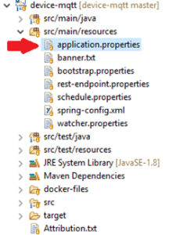
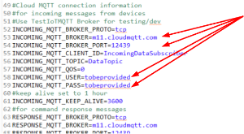
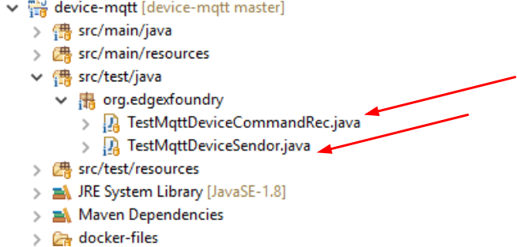
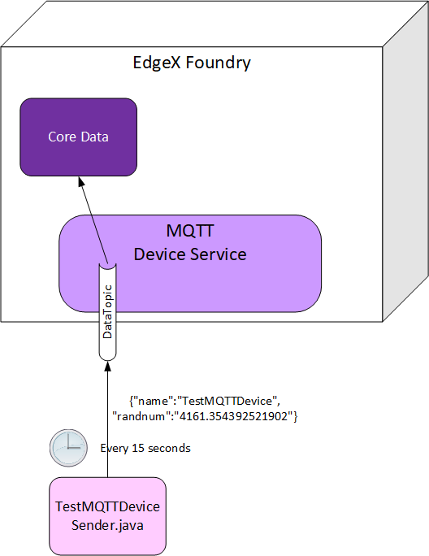
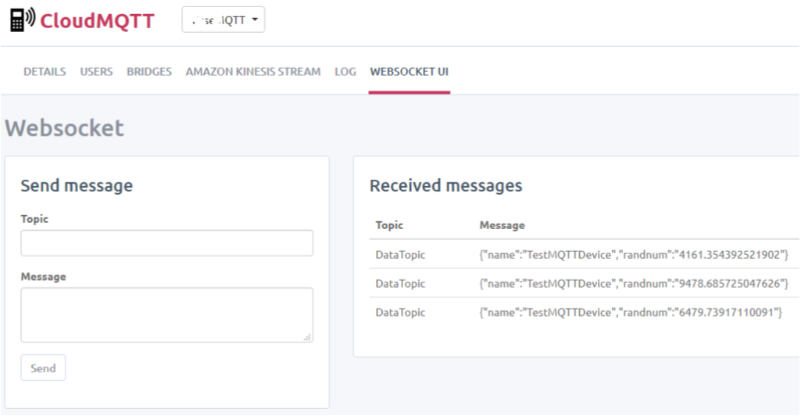
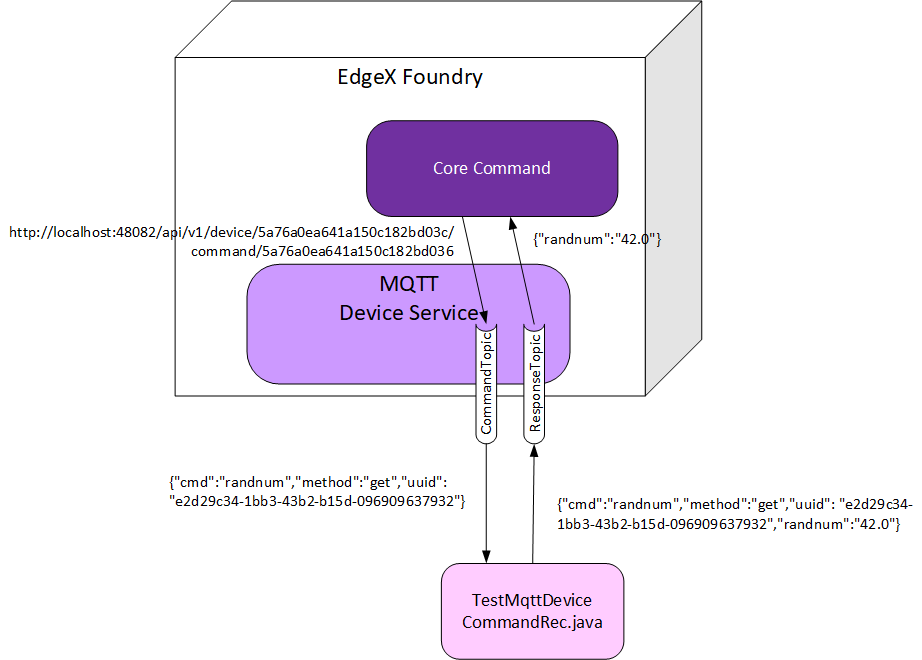
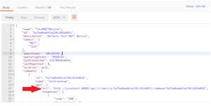
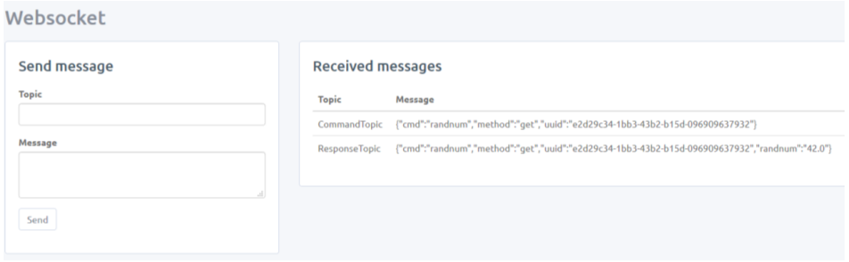
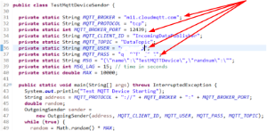

##################################################################
MQTT Device Service - How to Use, Configure and Where to Customize
##################################################################

The MQTT Device Service is designed to allow a sensor, another system, a mobile device, or other “thing” to pass reading data into EdgeX via the asynchronous MQTT protocol.  It also allows EdgeX to communicate commands to a “thing” via MQTT and receive responses back again via MQTT.

This device service requires three (3) MQTT topics to work.  One of the topics is used to receive reading data into the device service where it is then turned into event/reading REST requests to Core Data.  The second topic is used to publish messages to the “thing” after the device service has received a REST command request from Core Command to actuate or get/set data from the thing.  After the “thing” has processed the command request, if it has a response to return to the Core Command service, it responds by publishing a response message into the third topic.  The device service then interprets the response and makes a REST response back to Core Command.

.. image:: EdgeX_ExamplesMQTTDeviceService.png

=================================
Demonstration MQTT Device Service
=================================

This MQTT Device Service is an example of how to use MQTT to communicate with EdgeX on the “south side” - that is via Device Service on EdgeX’s “thing” negotiating layer.  It is setup, by default, to communicate some trivial information such as a randomly generated number, status ping, and a message string.  The device service andr the default device profile built into the service would need to be modified to communicate different data or actuate on different commands for real life implementations.
Setup

In your MQTT Server of choice, configure three topics and publishers and subscriber users for each.  By default, the MQTT Device Service is setup to use CloudMQTT topics and publisher/subscriber users listed below. 

+------------------------------------+------------------------------------------------------------+------------------------------------------------+
|                                    |   **Key**                                                  |  **Value**                                     |
+====================================+============================================================+================================================+
| Data Topic                         |  INCOMING_MQTT_TOPIC                                       | DataTopic                                      |     
+------------------------------------+------------------------------------------------------------+------------------------------------------------+
| Receiving Data Subscriber          |  INCOMING_MQTT_CLIENT_ID                                   | IncomingDataSubscriber                         |     
+------------------------------------+------------------------------------------------------------+------------------------------------------------+
| Command Topic                      |  request.topic                                             | CommandTopic                                   |     
+------------------------------------+------------------------------------------------------------+------------------------------------------------+
| Command Topic Publisher            |  request.client.id                                         | OutgoingCommandPublisher                       |     
+------------------------------------+------------------------------------------------------------+------------------------------------------------+
| Response Topic                     |  RESPONSE_MQTT_TOPIC                                       | ResponseTopic                                  |     
+------------------------------------+------------------------------------------------------------+------------------------------------------------+
| Response Topic Subscriber          |  RESPONSE_MQTT_CLIENT_ID                                   | CommandResponseSubscriber                      |     
+------------------------------------+------------------------------------------------------------+------------------------------------------------+
| **For Testing**                    |                                                            |                                                |     
+------------------------------------+------------------------------------------------------------+------------------------------------------------+
| Command Topic Subscriber           |  REQ_MQTT_CLIENT_ID                                        | OutgoingCommandSubscriber                      |  
+------------------------------------+------------------------------------------------------------+------------------------------------------------+
| Response Topic Publisher           |  RESP_MQTT_CLIENT_ID                                       | CommandResponsePublisher                       |  
+------------------------------------+------------------------------------------------------------+------------------------------------------------+
| Data Topic Publisher               |  MQTT_CLIENT_ID                                            | IncomingDataPublisher                          |  
+------------------------------------+------------------------------------------------------------+------------------------------------------------+

Whether you have your own MQTT Broker or decide to set up your own MQTT account in a cloud provider such as Cloud MQTT, you’ll need to modify the application.properties file to supply these and other configuration elements specific to your MQTT account and topics.

Please note that if even if you wish to use the MQTT Device Service as-is and even use CloudMQTT as your topic provider, you will still need to provide username and passwords in application.properties and will likely have to change the broker address and port number to match those provided by your account in CloudMQTT. 

To create a Cloud MQTT account and setup your three topics and various publishers/subscriber users, go to https://www.cloudmqtt.com/.

===================
Running Device MQTT
===================

With all the MQTT topics, subscribers and publishers in place, you can now start up the required EdgeX micro services to take the device service for a spin.

To begin, start the following EdgeX infrastructure or other micro services in Eclipse.  Note: the MQTT Device Service has been Dockerized, so you can run everything from Docker as well.  This document assists with running and experimenting in Eclipse but the exercise can easily be done in Docker as well.  However, keep in mind that you need to get all the configuration for all the MQTT topics, publishers, subscribers, etc. correct, which is typically easier to debug and correct in Eclipse.

* MongoDB (started externally to Eclipse)
* Core Metadata
* Core Data
* Core Command

With these in place, start the Device MQTT micro service.  It will, by default, configure itself with Metadata using the MQTTTestDeviceProfile.  Find the MQTTTestDeviceProfile.yml profile in the base of the device-mqtt project.  The default device setup using this profile, is assumed to provide access to the following properties/commands:

* randnum (get only)
* ping (get only)
* message (set and get – when set, it changes the message returned by get)

=======================
Test the Device Service
=======================

With all the services now up, you can begin to test the service.  Two Java applications in the device-mqtt project have been provided to help you test and see how the MQTT device service works.  Both are found in the src/test/java folder under the org.edgexfoundry package.

The TestMQTTDeviceSendor.java application sends new random numbers into Core Data via the MQTT Device Service.  It does this by publishing to the DataTopic every 15 seconds.  The random numbers represent some data a sensor or device would typically send.  The MQTT Device Service, as you read above, is subscribed to this DataTopic and turns the messages coming in on this topic to REST requests to Core Data.

If you are using CloudMQTT, you can use the WebSocke UI console to see the JSON randnum messages being sent through the DataTopic to Core Data.

The second test application is the TestMqttDeviceCommandRec.java.  This application subscribes to messages on the CommandTopic.  When an EdgeX Core Command request is received by the MQTT Device Service, it will publish the request via MQTT message to the CommandTopic where this application will receive it and publish a satisfactory response (depending on the request) back to the ResponseTopic. 

The TestMqttDeviceCommandRec application knows how to handle requests for the random number, ping and message get/set messages that come from Core Command.  To test commands, use a browser or Postman tool to first get the TestMQTTDevice commands.  

::

    Make a Get request to http://localhost:48082/api/v1/device/name/TestMQTTDevice to get all the commands for the device.  Find the URL for the testrandnum. 

Copy and paste this URL into the browser or Postman tool to send the random number request through Core Command down to the CommandTopic and into the MQTT Device Service.  If using Cloud MQTT, you can again use the WebSocket UI to see the command request enter the CommandTopic. 

The test receiver application will pickup this request and formulate an appropriate message response to send back into the ResponseTopic where the MQTT Device Service will interpret the message and turn it into a JSON response back to the Core Command service.

Note in both the TestMqttDeviceSendor and TestMqttDeviceCommandRec cases, there is internal configuration necessary at the top of these classes to connect them to the correct topics (with required credentials, etc.).  Note, while these applications use the same topics as the device service, they also require additional publishers and a subscriber user respectively (in addition to those setup for the device service itself).

===============
What To Do Next
===============

The MQTT Device Service can be easily customized to handle other data.  You can provide your own Device Profile to specify other or alternate types of data to send through the MQTT Device Service.  You can also use the configuration files (like application.properties) to alter things like the device name (currently called TestMQTTDevice).  You will certainly have to provide applications or additions to the device service itself to collect data and send it to Core Data – in a manner similar to the TestMqttDeviceSendor application.  If your real device needs to respond to commands, you must provide an application or additions to the device service to respond to command requests in a fashion similar to the TestMqttDeviceComandRec.

