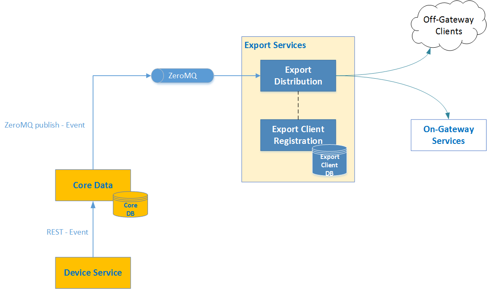
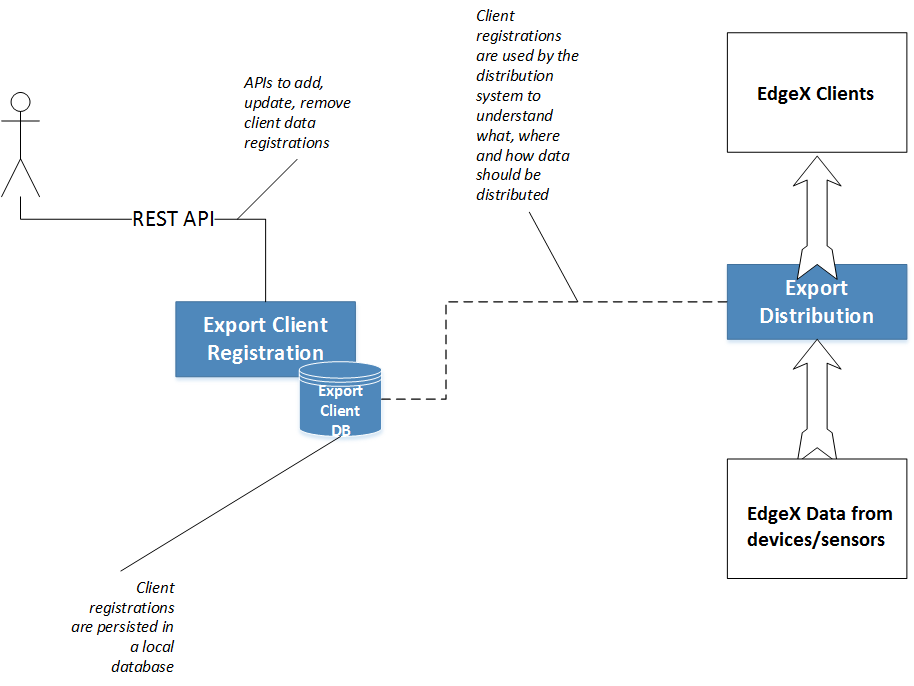
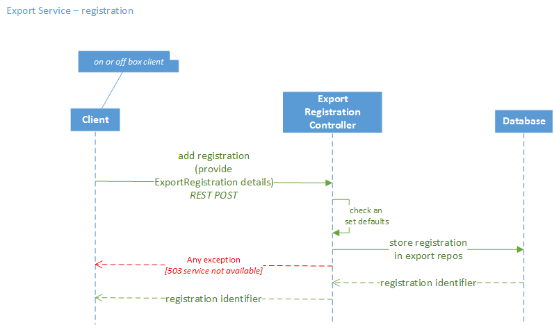

###################
Client Registration
###################

.. image:: EdgeX_ClientRegistration.png

============
Introduction
============

The EdgeX Foundry Export Client Registration microservice enables clients, whether they are on-gateway or off-gateway, to register as recipients of data coming through Core Data.  

Data is sent by sensors and devices into the Edge of the Network, into EdgeX Foundry. The data then travels through EdgeX Foundry's Device Services Layer and into Core Data in the Core Services Layer, then the data is funneled, through a message queue, to an Export facility. The Export facility is comprised of two microservices: 

* A microservice to enable clients to register for data of interest to them
* A microservice to filter and transform the data as needed and then physically get the data to the registered clients, called the Export Distro microservice

Clients on-gateway, include local analytics services, critical event processors, rules engine services, and so forth. These local clients often need to actuate back to the sensors/devices through the Command microservice based on the data examined, as it is received through the Export Facility.  

Clients off-gateway are typically enterprise and cloud-based systems or aggregating gateway systems. These systems are often the historical repository for the data and may also provide deeper analytics capability.

The client registration microservice offers a REST API to enable clients to establish new requests, update existing requests, and remove requests for Core Data. While there is no user interface directly associated to this service, UI consoles and other system management systems can provide this capability using the APIs provided.

==========
Data Model
==========

.. image:: EdgeX_ExportServicesDataModel.png

===============
Data Dictionary
===============

This Data Dictionary has the same content as the Data Dictionary for Export Services–Distribution.

+---------------------+----------------------------------------------------------------------------------------------+
|   **Class Name**    |   **Descrption**                                                                             | 
+=====================+==============================================================================================+
| EncryptionDetails   | The object describing the encryption method and initialization vector.                       | 
+---------------------+----------------------------------------------------------------------------------------------+
| ExportFilter        | The object containing device and data filter information.                                    | 
+---------------------+----------------------------------------------------------------------------------------------+
| ExportMessage       | The object containing the data from an Event sent by Export.                                 | 
+---------------------+----------------------------------------------------------------------------------------------+
| ExportRegistration  | The object containing the reachability method and transport parameters for an Export client. | 
+---------------------+----------------------------------------------------------------------------------------------+
| ExportString        | The object sent to a registered Export client containing an Event.                           | 
+---------------------+----------------------------------------------------------------------------------------------+

==============================
High Level Interaction Diagram
==============================

===========================
Client Registration Details
===========================

The Client Registration service enables clients to provide several details about "what," "how," and "where" they want the data.  

**"What" Data**

The "what" is designating filters of the data: filtering and sending only data of interest to the client. By default, all data collected by the gateway that passes through core data is sent to each client. However, clients today can establish two filters.

* Filter by Device ID or Device Name.  A collection of Device IDs or Device Names specified with a client registration enables clients to get data only from those devices and sensors.
* Filter by Value Descriptor ID or Value Descriptor Name. Value descriptors describe the type and content of data. For example, a value descriptor named "temperature" would describe thermostat or other temperature reading data. A collection of Value Descriptor IDs or names specified with a client registration enables clients to get data only tagged with those value descriptors.

When no filters are supplied with the registration, all data is forwarded to the client. One or both filters provided with the registration, limit the data sent to the client to the data that matches the device orgination or value descriptor tag of the data.

**"How" it is to be Formatted**

How the data is delivered to the clients is also dictated by the client registration. Clients can request data be sent in a particular format, have the data encrypted, compressed, or both encrypted and compressed.

* Format - JSON and XML options are supported
* Encryption - no encryption or AES can be specified
* Compression - no compression, GZIP, or ZIP options are available

**"Where" it is to be Delivered**

EdgeX Foundry clients can ask data to be pushed to an endpoint of their choice. Details about the endpoint (URL, credentials, and so forth) need to be provided when registering. EdgeX Foundry supports two types of destinations: push to a REST endpoint, or publish to a designated MQTT broker's topic.

REST Endpoint delivery must provide with their client registration:

* REST address (URL and port)
* REST path
* POST HTTP method is assumed
* No reply is expected by the EdgeX Foundry services

MQTT Endpoint deliver must provide with their client registration:

* Broker address (URL and port)
* Client ID
* Username and password
* Destination topic
* QOS is assumed to be 0 and keepAlive time is assumed to be 60 seconds.

Data can also be sent through Zero MQ to a 0MQ endpoint of choice, but that is normally used for local client receivers, such as a local rules engine service, rather than an external client.

