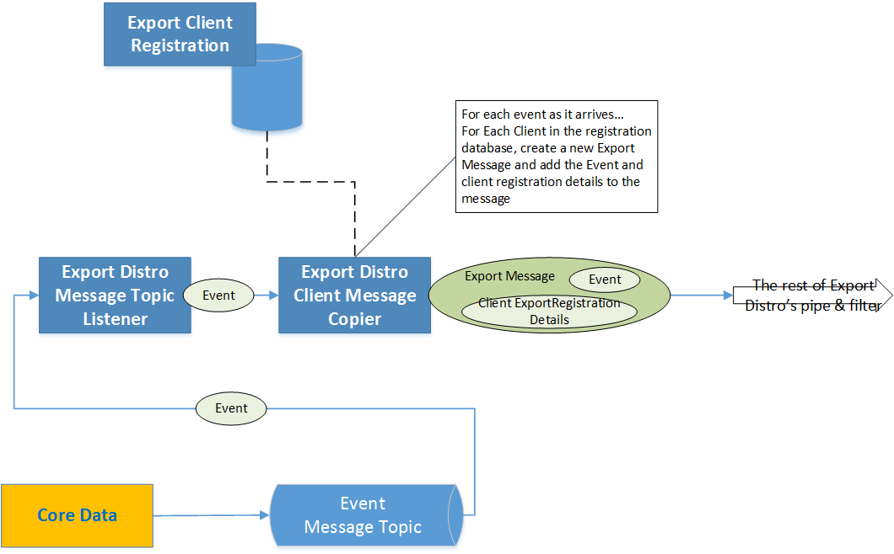
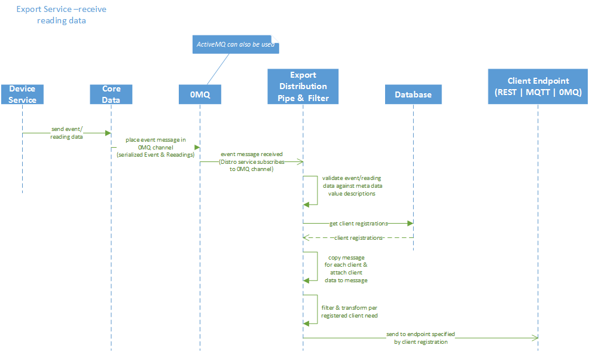
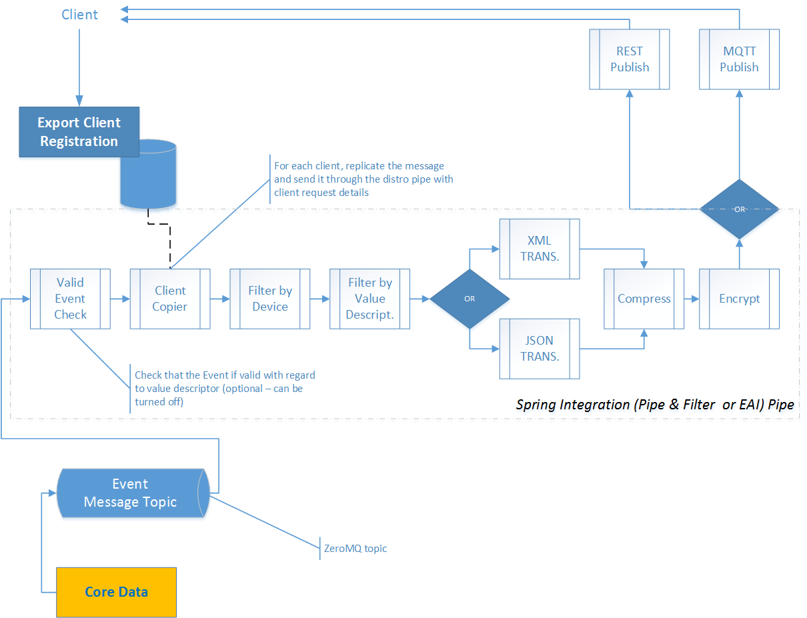

############
Distribution
############

.. image:: EdgeX_ExportServicesDistribution.png

============
Introduction
============

The EdgeX Foundry Export Distribution microservice, also known as "Export Distro," built on Spring Integration (EAI or pipe and filter) technology, receives data from Core Data, through a message queue, then filters, transforms, and formats the data per client request, and then distributes it through REST, MQTT, or 0MQ to client endpoints of choice.

The Export Distribution service is a pipe and filter architecture based on Enterprise Application Integration patterns. Data goes to the front of the pipe through the message queue. By default, Core Data asynchronously pushes each device or sensor Event, with Readings, into a ZeroMQ topic.  As an alternate configuration, Core Data can publish each device or sensor Event with Readings, into a gateway ActiveMQ brokered topic. The Export Distro service listens to that topic for incoming Events. When an Event is received, the Event is treated as a message and sent through the Export Distro pipe and filter to be distributed to registered clients.

==================================================
Client Registration and Distro Service Cooperation
==================================================

The Export Distro service does not have any direct connections to the client registration service. However, the client registration service is responsible for populating client data requests into a database which the Export Distro service reads to know which data is sent to which clients, and how it is to be sent.

.. image:: EdgeX_ExportServicesDistributionCoop1.png

As each Event message is read from the Core Data message queue, the client registration data is read, either directly from the database or from a local cache, and a copying function, ClientMessageCopier, of the Export Distro service occurs. The copying creates a "super" message by combining the information of the client export registration with the information of the new Event data, and pushes that combined message into the Export Distro's pipe and filter for preparation and to send to the client. This interaction enables a single data Event collected by a device or sensor to be treated and handled individually per client.

==============================
High Level Interaction Diagram
==============================

===============
Data Dictionary
===============

This Data Dictionary has the same content as the Data Dictionary for Export Services–Client Registration.

+---------------------+----------------------------------------------------------------------------------------------+
|   **Class Name**    |   **Descrption**                                                                             | 
+=====================+==============================================================================================+
| EncryptionDetails   | The object describing the encryption method and initialization vector.                       | 
+---------------------+----------------------------------------------------------------------------------------------+
| ExportFilter        | The object containing device and data filter information.                                    | 
+---------------------+----------------------------------------------------------------------------------------------+
| ExportMessage       | The object containing the data from an Event sent by Export.                                 | 
+---------------------+----------------------------------------------------------------------------------------------+
| ExportRegistration  | The object containing the reachability method and transport parameters for an Export client. | 
+---------------------+----------------------------------------------------------------------------------------------+
| ExportString        | The object sent to a registered Export client containing an Event.                           | 
+---------------------+----------------------------------------------------------------------------------------------+

===================
The Pipe and Filter
===================

Inside the Export Distribution service, a Spring Integration set of components, filter and transform the data of the Event based on each client's registered preference. This diagram shows a list of the components and operations included in the distribution service pipe.

* **Valid Event Check**--The first component in the pipe and filter, before the copier (described in the previous section) is a filter that can be optionally turned on or off by configuration. This filter is a general purpose data checking filter which assesses the device- or sensor-provided Event, with associated Readings, and ensures the data conforms to the ValueDescriptor associated with the Readings. 
 * For example, if the data from a sensor is described by its metadata profile as adhering to a "Temperature" value descriptor of floating number type, with the value between -100° F and 200° F, but the data seen in the Event and Readings is not a floating point number, for example if the data in the reading is a word such as "cold," instead of a number, then the Event is rejected (no client receives the data) and no further processing is accomplished on the Event by the Export Distro service.
* **Client Copier**--As described above, the client copier creates a "super message" made from a copy of the incoming Event message and the details for each client registration. For two clients registered for all data received, for each Event coming from Core Data, the copier produces two copies of a super message, one for each of the two clients, through all of the Export Distro pipe and filter.
* **Filter By Device**--Clients register interest in data only from certain sensors. The Filter by Device component looks at the Event in the message and looks at the devices of interest list, provided by the client registration, and filters out those messages whose Event is for devices not on the client's list of devices of interest. Therefore data generated by a motor does not go to clients only interested in data from a thermostat.
* **Filter By Value Descriptor**--Clients register interest in data from certain types of IoT objects, such as temperatures, motion, and so forth, that may come from an array of sensors or devices. The Filter by Value Descriptor assesses the data in each Event and Reading, and removes readings that have a value descriptor that is not in the list of value descriptors of interest for the client. Therefore, pressure reading data does not go to clients only interested in motion data. 
* **XML and JSON Transformers**--Clients must dictate, in their registration, the format of data to be delivered to them. Current options include JSON and XML formats. Transformation components. one each for each format, convert the data from the Events and Readings supplied by Core Data, into JSON or XML strings. A router looks at the client registration in the message and determines which transformer is to transform the data for the client.
* **Compressor Transformer**--A transformer component compresses the data string to be delivered to the clients, for any clients that have requested their data be compressed either by GZIP or ZIP methods.
* **Encryption Transformer**--An encryption component encrypts the data to be sent to the client, using the client provided keys and vectors.
* **REST and MQTT Adapters**--At the end of the Export Distribution pipe and filter, is a pair of components that deliver the Event and Reading data, that may have been transformed based on client request, to the client's destination of choice. The client registration provides the URL, authentication information, and so forth, to enable the adapter components to know how and where to send the data to its destination. Future endpoint adapters can be created to enable use of other protocols or destinations. A router determines which endpoint adapter to use based on the client registration information.

