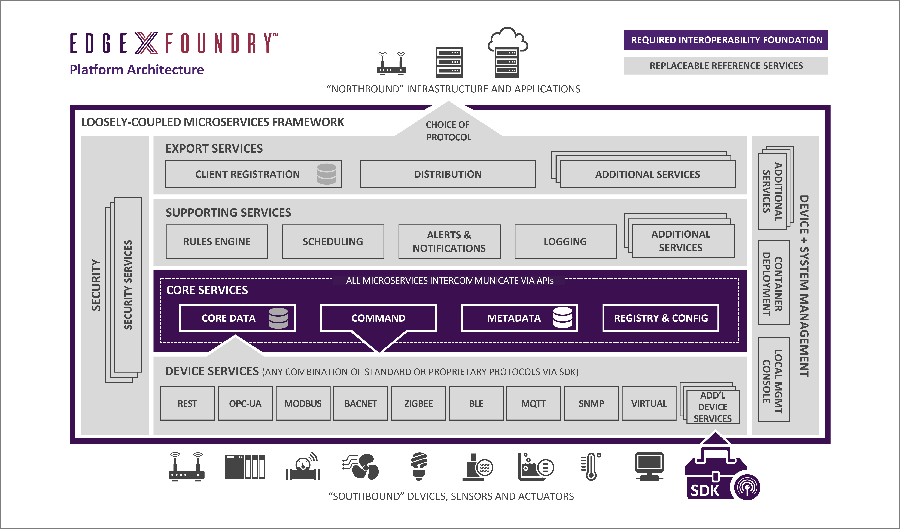
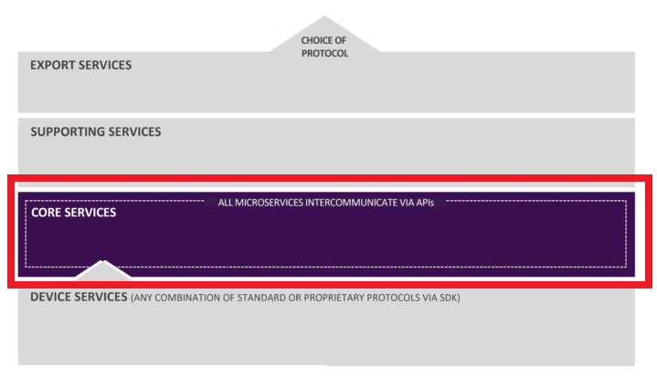
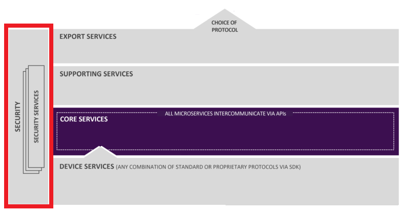
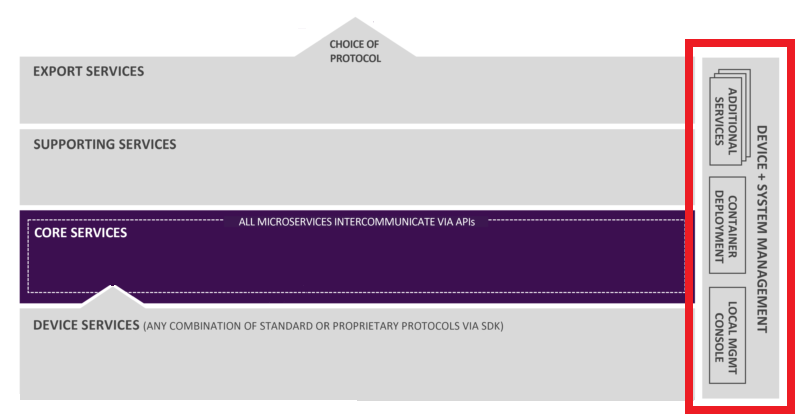

############
Introduction
############

EdgeX Foundry is a vendor-neutral open source software platform at the edge of the network, that interacts with the physical, every day working world of devices, sensors, actuators, and other IoT objects. The intent is to build a common framework for Industrial IoT edge computing. The EdgeX platform enables and encourages the rapidly growing community of IoT solution providers to work together in an ecosystem of interoperable components to reduce uncertainty, accelerate time to market, and facilitate scale. 

By bringing this much-needed interoperability, EdgeX makes it easier to monitor physical world items, send instructions to them, collect data from them, move the data across the fog up to the cloud where it may be stored, aggregated, analyzed, and turned into information, actuated, and acted upon. So EdgeX enables data to travel northwards towards the Cloud and also laterally to other gateways, or back to devices, sensors, and actuators.

The initiative is aligned around a common goal: the simplification and standardization of the foundation for tiered edge computing architectures in the industrial IoT market while still enabling the ecosystem to provide significant value-added differentiation. 

If you don't need further description and want to immediately use EdgeX Foundry use this link:  Getting Started Guide

==========================================
Definitions: "South Side" and "North Side"
==========================================

South Side: All IoT objects, within the physical realm, and the edge of the network that communicates directly with those devices, sensors, actuators, and other IoT objects, and collects the data from them, is known collectively as the "South Side."

North Side: The Cloud (or Enterprise system) where data is collected, stored, aggregated, analyzed, and turned into information, and the part of the network that communicates with the Cloud, is referred to as the "north side" of the network.

EdgeX enables data to be sent "north," "south," or laterally as needed and as directed.

==================================
EdgeX Foundry Architectural Tenets
==================================

**EdgeX Foundry was conceived with the following tenets guiding the overall architecture:**

**EdgeX Foundry must be platform agnostic with regard to**

    Hardware
    Operating system (Linux, Windows, etc.)
    Distribution - it must allow for the distribution of functionality through microservices at the edge, on a gateway, in the fog, on cloud, etc.
    Protocol and sensor agnostic

**EdgeX Foundry must be extremely flexible**

    Any part of the platform may be upgraded, replaced or augmented by other micro services or software components
    Allow services to scale up and down based on device capability and use case
    EdgeX Foundry should provide “reference implementation” services but encourages best of breed solutions

**EdgeX Foundry must provide for store and forward capability (to support disconnected/remote edge systems)**
**EdgeX Foundry must support and facilitate “intelligence” moving closer to the edge in order to address**

    Actuation latency concerns
    Bandwidth and storage concerns
    Operating remotely concerns

**EdgeX Foundry must support brown and green device/sensor field deployments**
**EdgeX Foundry must be secure and easily managed**

============================
EdgeX Foundry Service Layers
============================

EdgeX Foundry is a collection of open source microservices. These microservices are organized into 4 service layers, and 2 underlying augmenting system services. The Service Layers traverse from the edge of the physical realm from the Device Services Layer, to the edge of the information realm of the Export Services Layer, with the Core Services Layer at the center.

The 4 Service Layers of EdgeX Foundry are as follows:

* Core Services Layer
* Supporting Services Layer
* Export Services Layer
* Device Services Layer

The 2 underlying System Services of EdgeX Foundry are as follows:

* Security
* System Management

===================
Core Services Layer
===================

The Core Services (CS) Layer separates the north side and south side layers at the edge. Core services include the following components:

* Core data: a persistence repository and associated management service for data collected from the south side objects.
*  Command: a service that facilitates and controls actuation requests from the north side to the south side.
* Metadata: a repository and associated management service of metadata about the objects that are connected to EdgeX Foundry.  Provides the capability to provision new devices and pair them with their owning device services.
* Registry and Configuration:  provides other EdgeX Foundry microservices with information about associated services within EdgeX Foundry and microservices configuration properties (i.e. - a repository of initialization values).

=========================
Supporting Services Layer
=========================

.. image:: EdgeX_SupportingServicesLayer.png

The Supporting Services (SS) Layer encompass a wide range of microservices that provide the edge analytics and intelligence, and provide service to EdgeX Foundry itself. Normal software application duties such as logging, scheduling, and data clean up (scrubbing) are performed by microservices in the SS Layer.  

The rules engines, and alerting and notification microservices are within the SS Layer because they operate on top of the Core Services Layer. The local analytics capability (implemented today as a simple rules engine) is also located in this layer.

=====================
Export Services Layer
=====================

.. image:: EdgeX_ExportServicesLayer.png

EdgeX Foundry operates independently of other systems when necessary. Gateways often operate in isolated and sometimes disconnected environments and monitor and manage a collection of sensors and devices that have little or no outside monitoring or control. Therefore, EdgeX Foundry is able to operate and sustain itself over long periods of time without connection to the "north side" systems. The data and intelligence that is created at the edge, should be collected often and transported to enterprise (cloud) systems.  The transporting is performed by the Export Services (ES) Layer.

The ES Layer provides a set of microservices that performs the following activities:

* Enables off-gateway clients to register for data that interests them, coming from the south side objects
* Informs where and when the data is to be delivered
* Informs the format and shape in which that data is to be delivered

For example, the "where and when" could be sending temperature data to a REST address every hour, and the format and shape could be to supply JSON data in compressed form.

The Export Services Layer at this time, includes the following microservices:

* Client Registration
* Distribution

=====================
Device Services Layer
=====================

.. image:: EdgeX_DeviceServicesLayer.png

The Device Services Layer interacts with Device Services.  

Device Services (DS) are the edge connectors interacting with the Devices or IoT objects (the "things") that include, but are not limited to: alarm systems, heating and air conditioning systems in homes and office buildings, lights, machines in any industry, irrigation systems, drones, currently automated transit such as some rail systems, currently automated factories, and appliances in your home.  In the future, this may include driverless cars and trucks, traffic signals, fully automated fast food facilities, fully automated self-serve grocery stores, devices taking medical readings from patients etc.

Device services may service one or a number of devices (sensor, actuator, and so forth) at one time. A "device" that a DS manages, could be something other than a simple single physical device and could be another gateway (and all of that gateway's devices); a device manager; or a device aggregator that acts as a device, or collection of devices, to EdgeX Foundry.

The DS layer's microservices communicate with the devices, sensors, actuators, and other IoT objects through protocols native to each IoT object. The DS Layer converts the data produced and communicated by the IoT object into a common EdgeX Foundry data structure, and sends that converted data into the Core Services layer, and to other microservices in other layers of EdgeX Foundry. 

EdgeX Foundry provides device service software developer kits (SDK) for generating the shell of a device service.  There are SDKs in Go and C to support the creation of device services in the most convenient language for your use case.  SDKs make the creation of new device services easier and provides connector code to the Core Services Layer (as well as other services).

Please note, EdgeX is in a period of transition with regard to the device service SDKs and device services.  Early versions of EdgeX provide a Java-based SDK and there are a number of legacy Java device services.  The Java SDK and device services are being retired in a future release of EdgeX in favor of the Go and C SDK (and Go/C based device services created from them).  

Examples of what work a Device Service does

* A BACnet DS converts the BACNet device-supplied temperature and humidity readings into a common EdgeX Foundry object data structure. 
* A DS receives and translates commands from other EdgeX Foundry services or enterprise systems, and communicates those requests to the devices for actuation in a programming language that the device understands. 
* A DS may receive a request to turn off a Modbus PLC-controlled motor. The DS would translate the generic EdgeX Foundry "shutoff" request into a Modbus serial command that the PLC-controlled motor understands for actuation. 

=====================
System Services Layer
=====================

**Security Infrastructure** 

Security elements both inside and outside of EdgeX Foundry protect the data and command of devices, sensors, and other IoT objects managed by EdgeX Foundry.

**System Management**

System Management facilities provide the central point of contact for external management systems to 
* start/stop/restart EdgeX services
* get metrics on the EdgeX services (such as memory usage) so that the EdgeX services can be monitored 

In future releases, the EdgeX system management capability will expand to include being able to set service configuration, provide a status/health check of all of the services, and providing other performance and operational information to management platforms.  

