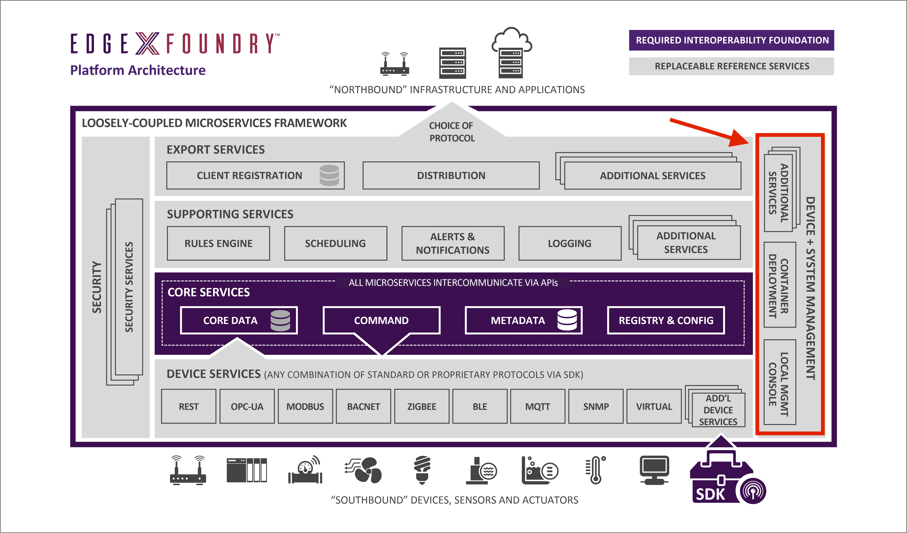
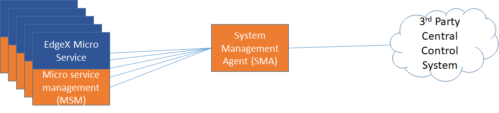
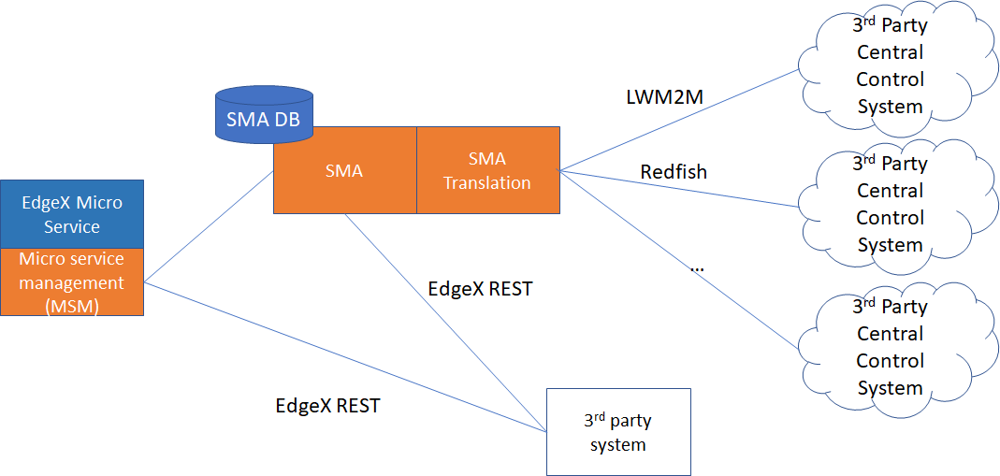

#################
System Management
#################

============
Introduction
============

System management facilities provide the means to

* start, stop, restart the EdgeX micro services
* obtain various metrics from the EdgeX micro services (such as memory usage) so that the operation and performance of the services can be monitored
* get the EdgeX micro service configuration (in the future, system management functionality will offer the ability to set the configuration)

In general, the EdgeX system management functionality is meant to facilitate remote management systems with a single point of access to command, control and monitor the EdgeX micro service set.

The system management capabilities are provided by:

* a System Management Agent (SMA) - which itself is a unique EdgeX micro service.
* a common API (called the micro service management or MSM API) and capability built into each EdgeX micro service that provides the system management functionality per micro service.

===========================
The System Management Agent
===========================
The SMA serves several purposes.  First, it services as the single connection point of management control for an EdgeX instance.  If something want to shutoff all EdgeX micro services, a single REST call to the SMA to stop or "shutdown" all EdgeX services would result in the SMA making a call to each EdgeX micro service to stop.  In essence, the SMA serves to multiplex requests to the other EdgeX services when necessary.  This request may come from an internal request or from an external source - such as a 3rd party management system.

The SMA's second purpose is not yet implemented but is in the EdgeX roadmap.  The SMA can translate 3rd party system management requests to EdgeX management service API calls on EdgeX micro services.  For example, it would take an LwM2M request to get the memory usage of one or all of the micro services and translate that to the EdgeX MSM call to each service.  Just as devices services in EdgeX help translate protocol specific sensor data and device actuation commands into something the rest of EdgeX and the world can understand, the SMA will take control plane commands from a multitute of management protocols and translate that into commands the rest of EdgeX can understand.  Likewise, the SMA will translate the control plane data (metrics, configuration, etc.) and translate that to data schemas/models that other management protocols use and understand.  The SMA acts as the embassor to management/control plane capabilty for all other management capability.

============================
Micro Service Management API
============================
The SMA is just a facilitator.  It doesn't really know how much memory a service is consuming or what configuration is being used in a service. The SMA relies on calls to each service to get this type of information.  Similarly, the SMA must make a call to the service (or some component) to stop or start a service.  What functions the SMA can call on and how the services (or some component acting on behalf of the service) must respond to these calls is dictated by an API - the micro service management (MSM) API.  The MSM API defines how EdgeX services must provide and respond to REST calls to get control plane data like metrics or configuration information.  The MSM API also defines the interface that each service (or other representative component) provides which reacts to calls to start, stop or restart the service.  In many cases, the MSM API defines the interface which is directly implemented in each EdgeX micro service.  However, in other cases, the MSM interface may be wholly or partially fulfilled by some other component on behalf of the micro service.  A micro service that is not running cannot start itself.  So, the "start service" functionality defined by the MSM API would actually be fulfilled by some other component that is outside the service.

.. toctree::

   Ch_SysMgmtAgent

