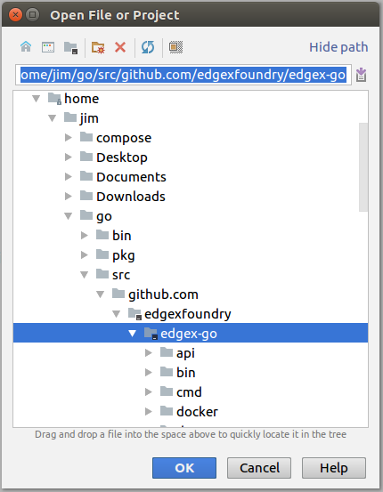
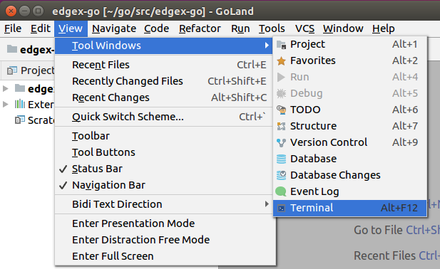
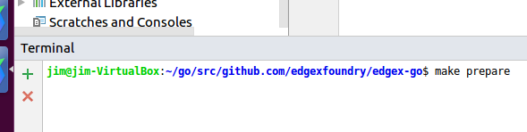
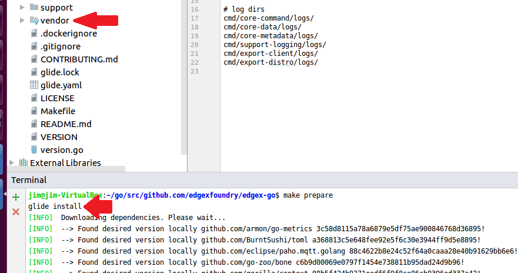
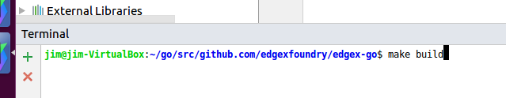
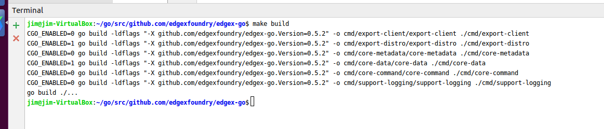
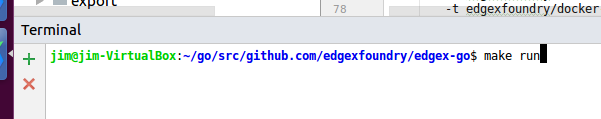

#################################
Get EdgeX Foundry - Go Developers
#################################

============
Introduction
============

These instructions are for Go Lang Developers to obtain and run Go-based EdgeX Foundry microservices. (Users should read: :doc:`../Ch-GettingStartedUsers`) 
It should be noted that EdgeX Foundry is migrating from Java to Go and C (and other compiled languages) in order to improve the performance and footprint of the platform.  While the Java services still function today, the Go versions of the microservices are considered to be the reference implementation.  Java versions of the services will be archived in the future unless organizations and individuals in the community decide to maintain and keep these services consistent with the reference implementations.

================================
What You Need For Go Development
================================

In additional to the hardware and software listed in the Developers page, you will need the following to develop/work with the EdgeX Go-based microservcices.

**Go** - The open sourced microservices of EdgeX Foundry are written in Go 1.9. See https://golang.org/dl/ for download and installation instructions.  Newer versions of Go are available and may work, but the project has not thorougly built and tested to these newer versions of the language.  Older versions of Go, especially 1.6 or older, are likely to cause issues.

It is suggested that you create a set of directories for your Go work (including a /bin and /src folder) and set the GOPATH env variable to that directory. This will assist in getting your environment setup and makes it easier to understand how to find code, tools and 3rd party packages.

**Glide** - Glide is the package manager for Go (actually there are many options in Go, but this is the package manager the EdgeX project is currently using).  Find instructions on how to install it (after installing Go itself) here:  https://glide.readthedocs.io/en/latest/.

**0MQ libraries** - Zero MQ is used between core-data, export-distro and the rules engine.  You will need to get and compile 0MQ on your development system.  The easiet way to do this is to follow the instructions in this script:  https://gist.github.com/katopz/8b766a5cb0ca96c816658e9407e83d00. *Note* that installation/build of Zero MQ libraries is currently not supported on Windows platform.  Therefore the build of core-data and export-distro cannot be done on Windows boxes currently.

**An IDE** - There are many options for writing Go Lang code and one could use a simple text editor.  This guide demonstrates how to get started with JetBrains Go Land.

*Go Land* -   Go Land is a popular although subscription-fee based IDE. Learn how to purchase and download Go Land here:  https://www.jetbrains.com/go/.

*Visual Studio Code (Optional)* - As an alternative to Go Land, Visual Studio Code is a free, open source IDE developed by Microsoft.   Find and download Visual Studio Code here:  https://code.visualstudio.com/.  This guide does not demonstrate how to use Visual Studio Code but the steps would be very similar.

============
Get the code
============

**Pull**

You will need to download the source code from the EdgeX Go repository.  The EdgeX Go-based microservices, unlike the Java-based services, are all available in a single GitHub repository download. Once the code is pulled, the Go lang microservices are built and packaged as platform dependent executables and then also containerized for end user deployment/use.

The EdgeX Foundry Go lang microservice code is hosted at https://github.com/edgexfoundry/edgex-go.

To download or "pull" the EdgeX Go code, use your git tool and request to clone this repository with the following command:

git clone https://github.com/edgexfoundry/edgex-go.git

It is recommended that you clone the edgex-go mono repo to the $GOPATH/src/github.com/edgexfoundry folder.  You will find that the project tools and configuration provided by the EdgeX community will work much better when applied to this structure. 

**Note**, if you plan to make code changes and submit those back to the project, you are going to want to fork the repositories you plan to work with and then pull your fork versus the EdgeX repositories directly.  See https://wiki.edgexfoundry.org/display/FA/Committing+Code+Guidelines for more information on how to commit code to EdgeX.

==============================
EdgeX Foundry's Mongo Database
==============================

**Initializing the Database**

Many of the EdgeX Foundry microservices use a MongoDB instance to persist data or metadata.  The MongoDB database for EdgeX Foundry must be initialized before it can be used by the system.  Unless the database is destroyed, this set of instructions only has to be run one time to initialize the database.

There are several useful scripts in the developer-scripts repository for EdgeX Foundry to help initialize and then run the EdgeX Foundry MongoDB instance.

To begin, start MongoDB in a "no authorization" state.  A sample Windows Batch script has been provided at https://github.com/edgexfoundry/developer-scripts/blob/master/startdb-no-auth.bat.  Make sure you change the script to point to your mongod executable and provide the path to the location of the database instance files (c:\users\Public\mongodb\db in the script).

.. image:: EdgeX_GettingStartedDevMongoStart.png

Once the database has been started, initialize the database with EdgeX Foundry access and schema elements.  The initialization code is located in init_mongo.js file.  You need to run this script using the mongo shell tool.  A sample Windows Batch script has been provided to run the mongo shell with this script at https://github.com/edgexfoundry/developer-scripts/blob/master/init_shell.bat.  Again, make sure you change the script to point to your mongo executable and provide the path to init_mongo.js file.  When the script executes, it will display the commands it is executing against the database.

.. image:: EdgeX_GettingStartedDevMongoCommands.png

Once complete, the database can now be stopped.  In the next step, you restart the database with authentication turned on.  You do not need to re-initialize the database again.

**Running the Database**

Several of the EdgeX Foundry microservices utilize the MongoDB instance.  This includes core-data, core-metadata, support-rulesengine, supporting-logging (in some situations), among others.  Therefore, when working with EdgeX Foundry its a good idea to have the database up and running as a general rule.

After initializing the database (see previous step), start the database with authorization turned on.

Fo Windows, a sample Windows Batch script has been provided at https://github.com/edgexfoundry/developer-scripts/blob/master/startdb.bat to show how to start MongoDB with the mongod executable and pointing it to the location of the database files (c:\users\Public\mongodb\db in the script).  Edit the script so that it points to your mongod location and points to the MongoDB data files as established in the initialization step.  Once ready, just run the script from a terminal window.  Note the use of "–auth" to start the database with authorization turned on.

.. image:: EdgeX_GettingStartedDevMongoRun.png

For Linux systems, you will find a similar shell script to help initialize and start Mongo in a similar fashion at https://github.com/edgexfoundry/developer-scripts/blob/master/linux_setup.sh.

========================
EdgeX Foundry in Go Land
========================

**Import the Project**

The EdgeX Foundry Go mono repo contains the Go Lang source code (and many additional files such as configuration and Docker files) for all the Go-based microservices and supporting packages.  As its name implies, it is the single (or mono) repository for all EdgeX Go source.  To bring in the mono repo into Go Land, use the File → Open... menu option in Go Land to open the Open File or Project Window.

.. image:: EdgeX_GoLandOpenProject.png

In the "Open File or Project" popup, select the location of the folder containing your cloned edgex-go repo.  If you are following the EdgeX recommended standards, the edgex-go folder should be located under $GOPATH/src/github.com/edgexfoundry/edgex-go.

**Open the Terminal**

From the View menu in Go Land, select the Terminal menu option.  This will open a command terminal from which you can issue commands to install the dependencies, build the microservices, run the microservices, etc.

**Install the Dependencies**

After opening the Terminal view, request Glide to install all of the dependency projects by executing the command "make prepare" as shown below.  The edgex-go repo contains a make file that allows issuing all the various project commands (such as glide install, build, run, etc.) against all the target microservice.  In the **"make prepare"** command, you are requesting that Glide be used to install all the required dependencies for all the EdgeX microservices.  

Glide will install the dependent Go projects and place them in the vendor folder in edgex-go.  This step can take several minutes depending on your Internet connection.

**Build the EdgeX Microservices**

With all the dependencies now loaded, you can build the EdgeX Foundry microservices.  Run **"make build"** in the Terminal view (as shown below) to build the services.  This can take a few minutes to build all the services.

The microservice executables that get built will be created under the /cmd/[microservice folder]/[microservice name].  So, for example, core-data would get created as the /cmdcore-data/core-data.

**Run EdgeX**

With all the microservices built, you can now run EdgeX.  You may first want to make sure the database is running.  Then issue the command **"make run"** as shown below.

You can now call on the service APIs to make sure they are running correctly.  Namely, call on localhost:[service port]/api/v1/ping to see each service respond to the simplest of requests.

