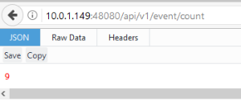

###############################
Working in a Hybrid Environment
###############################

In some cases, as a developer, you want to work on a particular micro service, but you don't want to have to download all the source code for all the micro services and run all the micro services in the development tool(s) like Go Land or Eclipse.  In this case, you can download and run the EdgeX Docker containers for all the micro services you need and run your single micro service (the one you are presumably working on) from the developer tool of choice and have it point to the other micro services by appropriate address.  Within EdgeX, we call this a "hybrid" environment - where part of your EdgeX platform is running from a development environment, while other parts are running from the Dockerized containers.  This page outlines how to do hybrid development.

As an example of this process, let's say you want to do coding work with/on the Virtual Device service in Eclipse.  You want the rest of the EdgeX environment up and running via Docker containers.  How would you set up this hybrid environment?  Let's take a look.

=======================================
Get and Run the EdgeX Docker Containers
=======================================

1. Per :doc:`../Ch-GettingStartedUsers`, get Docker, Docker Compose setup and then pull the EdgeX docker containers.
2. Since you are working with the virtual device, you probably don't need or want to run all the micro services.  You just need the few that the Virtual Device will be communicating with or that will be required to run a minimal EdgeX environment.  So you will need to run Consul, Mongo, Core Data, Core Metadata, Core Command, Support Logging, and Support Notifications.  After pulling the EdgeX containers, start these containers with the following commands in order

+------------------------------------+-------------------------------------------------------------------------------------+------------------------------------------------+
|   **Docker Command**               |   **Description**                                                                   |  **Suggested Waiti Time After Completing**     |
+====================================+=====================================================================================+================================================+
| docker-compose up -d volume        |  Start the EdgeX Foundry file volume--must be done before the other services are    | A couple of seconds.  In the time it takes to  |
|                                    |  started                                                                            | type the next command it shoud be ready.       |
+------------------------------------+-------------------------------------------------------------------------------------+------------------------------------------------+
| docker-compose up -d consul        |  Start the configuration and registry microservice which all services must          | A couple of seconds                            |
|                                    |  register with and get their configuration from                                     |                                                |
+------------------------------------+-------------------------------------------------------------------------------------+------------------------------------------------+
| docker-compose up -d config-seed   |  Populate the configuration/registry microservice                                   | A couple of seconds                            |
+------------------------------------+-------------------------------------------------------------------------------------+------------------------------------------------+
| docker-compose up -d mongo         |  Start the NoSQL MongoDB container                                                  | 10 seconds                                     |
+------------------------------------+-------------------------------------------------------------------------------------+------------------------------------------------+
| docker-compose up -d logging       |  Start the logging microservice - used by all micro services that make log entries  | A couple of seconds                            |
+------------------------------------+-------------------------------------------------------------------------------------+------------------------------------------------+
| docker-compose up -d notifications |  Start the notifications and alerts microservice--used by many of the microservices | 30 seconds                                     |
|                                    |  Note: this service is still implemented in Java and takes more time to start       |                                                |
+------------------------------------+-------------------------------------------------------------------------------------+------------------------------------------------+
| docker-compose up -d metadata      |  Start the Core Metadata microservice                                               | A couple of seconds                            |
+------------------------------------+-------------------------------------------------------------------------------------+------------------------------------------------+
| docker-compose up -d data          |  Start the Core Data microservice                                                   | A couple of seconds                            |
+------------------------------------+-------------------------------------------------------------------------------------+------------------------------------------------+
| docker-compose up -d command       |  Start the Core Command microservice                                                | A couple of seconds                            |
+------------------------------------+-------------------------------------------------------------------------------------+------------------------------------------------+

Run a **"docker-compose ps"** command to confirm that all the containers have been downloaded and started.  (Note: initialization or seed containers, like config-seed, will have exited as there job is just to initialize the associated service and then exit.)

Note:  If you prefer, you can also use the run-it.sh script found in the developer-scripts repository to start these containers.  Just note that you will need to edit run-it.sh and remove any containers (like the device-virtual container) that you don't want running.

Get and Run the Code In Eclipse

1. Per :doc:`../Ch-GettingStartedJavaDevelopers`, get your development environment (Eclipse et. al) setup and pull the micro service code you want to work on from GitHub.  In this example, we assume you want to get the device-virtual project and import that as a Maven project into Eclipse.

2. Next, configure the device-virtual project loaded into Eclipse to use the other Dockerized micro services and allow the other containers to see/find your Eclipse-based micro service (in this case the device-virtual micro service) running in Eclipse.

	a. Open the application.properties file in the src/main/resources folder of the device-virtual project in Eclipse.  Change the service.host property to be the IP address of the machine running your Eclipse environment.  Because the Docker containers will not know how to resolve the service host name inside the Docker container (Eclipse is not on the Docker network), the host needs to be the IP address of the Eclipse environment.  In the example below, my Eclipse is running on a machine at: 10.0.1.118.
		* #default device service settings
		* service.host=10.0.1.118

	b. Open the rest-endpoint.properties file in the src/main/resources folder of the device-virtual project in Eclipse.  If the endpoints for meta data and core data URLs use localhost, and these services are running on same machine as the service you're running from Eclipse, then no change is necessary.  If however you're running the core services on a different machine, then change the endpoints to point to the IP address of the machine running these services.  For example, my Dockerized micro services are all running on another machine at 10.0.1.149.  So the meta and core URLs in rest-endpoint.properties would all be changed to reflect that location.

::

   #------------------- REST Endpoints ---------------------------------------
   # EdgeX metadata database service connection information
   meta.db.addressable.url=http://10.0.1.149:48081/api/v1/addressable
   meta.db.deviceservice.url=http://10.0.1.149:48081/api/v1/deviceservice
   meta.db.deviceprofile.url=http://10.0.1.149:48081/api/v1/deviceprofile
   meta.db.device.url=http://10.0.1.149:48081/api/v1/device
   meta.db.devicemanager.url=http://10.0.1.149:48081/api/v1/devicemanager
   meta.db.devicereport.url=http://10.0.1.149:48081/api/v1/devicereport
   meta.db.command.url=http://10.0.1.149:48081/api/v1/command
   meta.db.event.url=http://10.0.1.149:48081/api/v1/scheduleevent		
   meta.db.schedule.url=http://10.0.1.149:48081/api/v1/schedule
   meta.db.provisionwatcher.url=http://10.0.1.149:48081/api/v1/provisionwatcher
   meta.db.ping.url=http://10.0.1.149:48081/api/v1/ping
   #IOT core database service connection information
   core.db.event.url=http://10.0.1.149:48080/api/v1/event
   core.db.reading.url=http://10.0.1.149:48080/api/v1/reading
   core.db.valuedescriptor.url=http://10.0.1.149:48080/api/v1/valuedescriptor		
   core.db.ping.url=http://10.0.1.149:48080/api/v1/ping

Now you can run the device-virtual in Eclipse.  Right click on the device-virtual project and select Run As → Java Application from the resulting menu.  Pick the main application class from the resulting "Select Java Application" window and watch the Console view for errors.

**Check the Results**

At this time, your virtual device micro service running in Eclipse should be communicating with the other EdgeX micro services running in their Docker containers.  Give the virtual device a minute or so to initialize itself and start sending data to Core Data.  To check that it is working properly, open a browser and point your browser to Core Data to check that events are being deposited.  You can do this by calling on the Core Data API that checks the count of events in Core Data (http://[host].48080/api/v1/event/count).
 

