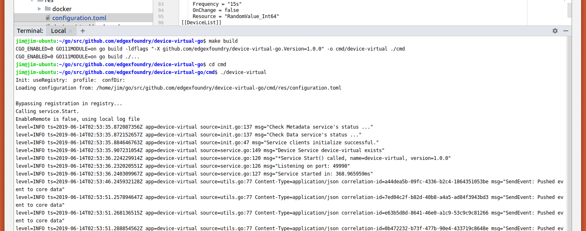

###############################
Working in a Hybrid Environment
###############################

In some cases, as a developer, you want to work on a particular micro service, but you don't want to have to download all the source code for all the micro services and run all the micro services in the development tool(s) like Go Land.  In this case, you can download and run the EdgeX Docker containers for all the micro services you need and run your single micro service (the one you are presumably working on) from the developer tool of choice and have it point to the other micro services by appropriate address.  Within EdgeX, we call this a "hybrid" environment - where part of your EdgeX platform is running from a development environment, while other parts are running from the Dockerized containers.  This page outlines how to do hybrid development.

As an example of this process, let's say you want to do coding work with/on the Virtual Device service in Go Land.  You want the rest of the EdgeX environment up and running via Docker containers.  How would you set up this hybrid environment?  Let's take a look.

=======================================
Get and Run the EdgeX Docker Containers
=======================================

1. Per :doc:`Ch-GettingStartedUsers`, get Docker, Docker Compose setup and then pull the EdgeX docker containers.
2. Since you are working with the virtual device, you probably don't need or want to run all the micro services.  You just need the few that the Virtual Device will be communicating with or that will be required to run a minimal EdgeX environment.  So you will need to run Consul, Mongo, Core Data, Core Metadata, Core Command, Support Logging, and Support Notifications.  After pulling the EdgeX containers, start these containers with a docker-compose up -d command or by starting each of the services individually with the following commands in order

+------------------------------------+--------------------------------------------------------------------------------------+------------------------------------------------+
|   **Docker Command**               |   **Description**                                                                    |  **Notes**                                     |
+====================================+======================================================================================+================================================+
| docker-compose up -d volume        | | Start the EdgeX Foundry file volume--must be done before the other services        |                                                |
|                                    | | are started                                                                        |                                                |
+------------------------------------+--------------------------------------------------------------------------------------+------------------------------------------------+
| docker-compose up -d consul        | | Start the configuration and registry microservice which all services must          |                                                |
|                                    | | register with and get their configuration from                                     |                                                |
+------------------------------------+--------------------------------------------------------------------------------------+------------------------------------------------+
| docker-compose up -d config-seed   |  Populate the configuration/registry microservice                                    |                                                |
+------------------------------------+--------------------------------------------------------------------------------------+------------------------------------------------+
| docker-compose up -d mongo         |  Start the NoSQL MongoDB container                                                   | | An embedded initialization script configures |
|                                    |                                                                                      | | the database for EdgeX documents             |
+------------------------------------+--------------------------------------------------------------------------------------+------------------------------------------------+
| docker-compose up -d logging       |  Start the logging microservice - used by all micro services that make log entries   |                                                |
+------------------------------------+--------------------------------------------------------------------------------------+------------------------------------------------+
| docker-compose up -d notifications |  Start the notifications and alerts microservice--used by many of the microservices  |                                                |
+------------------------------------+--------------------------------------------------------------------------------------+------------------------------------------------+
| docker-compose up -d metadata      |  Start the Core Metadata microservice                                                |                                                |
+------------------------------------+--------------------------------------------------------------------------------------+------------------------------------------------+
| docker-compose up -d data          |  Start the Core Data microservice                                                    |                                                |
+------------------------------------+--------------------------------------------------------------------------------------+------------------------------------------------+
| docker-compose up -d command       |  Start the Core Command microservice                                                 |                                                |
+------------------------------------+--------------------------------------------------------------------------------------+------------------------------------------------+

Run a **"docker-compose ps"** command to confirm that all the containers have been downloaded and started.  (Note: initialization or seed containers, like config-seed, will have exited as there job is just to initialize the associated service and then exit.)

===============================
Get and Run the Code In Go Land
===============================

1. Per :doc:`../Ch-GettingStartedGoDevelopers`, get your development environment (GoLand et. al) setup and pull the micro service code you want to work on from GitHub.  In this example, we assume you want to get the device-virtual-go project and import it into Go Land.

2. Next, import the device-virtual-go project into Go Land.  Follow the instructions in the Import the Project section of :doc:`../Ch-GettingStartedGoDevelopers` if you need help getting the project into Go Land.

3. Now configure the device-virtual-go project in Go Land to use the other micro services running in Docker.

- Open the configuration.toml file in the cmd/res folder of the device-virtual-go project in Go Land.  Note that the Registry (located in the [Registry] section of the configuration) and all the "clients" (located in the [clients] section of the configuration file) suggest that the "Host" of these services is "localhost".
- When everything - including the device-virtual service - are running all together on the same host or in the same Docker environment, the host is assumed to be localhost.  The services running in Docker are not running on "localhost".  Instead, they are running in the Docker Engine.  Therefore, the "Host" configuration setting needs to be modified in the configuration.toml for the Registry and other client services to be the IP address of the Docker Engine hosting the services.  The Docker Engine IP address varies by environment.  For Linux based systems, the IP address for the Docker Engine is typically 172.17.0.1.  In Windows environments, the IP address of Docker Engine is typically 192.168.99.100.  Docker networking configurations vary so check your system for the appropriate Docker network.  Find information on Docker container network here: `Docker Network <https://docs.docker.com/v17.09/engine/userguide/networking/>`_.
- In the configuration.toml file in the cmd/res folder of the device-virtual-go project in Go Land, change the Host property for the Registry Clients.Data, Clients.Metadata, and  Clients.Logging from "localhost" to the IP address for the Docker Engine of your system.  Below, localhost is changed to the 172.17.0.1 IP address for the Docker Engine.

.. code::

		[Registry]
		Type = "consul"
		Host = "172.17.0.1"
		Port = 8500
		CheckInterval = "10s"
		FailLimit = 3
		FailWaitTime = 10

		[Logging]
		EnableRemote = false
		File = "./device-virtual.log"

		[Writable]
		LogLevel = 'INFO'

		[Clients]
		[Clients.Data]
		Name = "edgex-core-data"
		Protocol = "http"
		Host = "172.17.0.1"
		Port = 48080
		Timeout = 5000

		[Clients.Metadata]
		Name = "edgex-core-metadata"
		Protocol = "http"
		Host = "172.17.0.1"
		Port = 48081
		Timeout = 5000

		[Clients.Logging]
		Name = "edgex-support-logging"
		Protocol = "http"
		Host = "172.17.0.1"
		Port = 48061

Save the configuration.toml file after making these changes.

**Run device-virtual**

Now you can run device-virtual-go in Go Land that uses the rest of EdgeX Dockerized services.  For example, in the Go Land terminal, make sure you are in the device-virtual-go directory and first build the service with a call to make build.  After successfully building the service, run the service by going into the cmd folder and executing ./device-virtual (as shown below).

**Check the Results**

At this time, your virtual device micro service running in Go Land should be communicating with the other EdgeX micro services running in their Docker containers.  Give the virtual device a few seconds or so to initialize itself and start sending data to Core Data.  To check that it is working properly, open a browser and point your browser to Core Data to check that events are being deposited.  You can do this by calling on the Core Data API that checks the count of events in Core Data (http://[host].48080/api/v1/event/count).

.. image:: EdgeX_GettingStartedHybridResults.png
