###################################
Get EdgeX Foundry - Java Developers
###################################

============
Introduction
============

These instructions are for Java Developers to obtain and run Java-based EdgeX Foundry microservices.  (Users should read: :doc:`../Ch-GettingStartedUsers`) 
It should be noted that EdgeX Foundry is migrating from Java to Go and C (and other compiled languages) in order to improve the performance and footprint of the platform.  While the Java services still function today, the Go versions of the microservices are considered to be the reference implementation.  Java versions of the services will be archived in the future unless organizations and individuals in the community decide to maintain and keep these services consistent with the reference implementations.

==================================
What You Need For Java Development
==================================

In additional to the hardware and software listed in the Developers page, you will need the following to develop/work with the EdgeX Java-based microservcices.

**Java** - The Java-based open sourced microservices of EdgeX Foundry are written in Java 8.  See http://www.oracle.com/technetwork/java/javase/downloads/index.html for download and installation instructions.  Please note you will need the JDK and not just the JRE.  OpenJDK has been used to run EdgeX Foundry, but development using OpenJDK has not been tested thoroughly.  Alternate versions of the JDK (version 7 or 9 for example) have not been tested but may work with some reconfiguration of the microservice projects.

**Eclipse** - The Java-based EdgeX Foundry microservices were created in Eclipse using Java Maven projects.  See http://www.eclipse.org/downloads/eclipse-packages/ for download and installations instructions.  Please note to download and use Eclipse IDE for Java EE Developers.  Alternate Java integrated development environments (IDE) could be used, but this document assumes use of Eclipse and leaves how to use alternate IDEs to the reader.  Depending on which microservices you intended to download the source code and work on, you may require or desire additional Eclipse IDE plugins.

============
Get the code
============

**Pull**

You may need to download the source code from several library or microservice projects depending on which EdgeX Foundry microservices you wish to explore, build, or run. Library projects contain code used by one or more microservices.  The code in a library is packaged as a JAR and is then used by other microservices.  Library projects are not executable by themselves.  Microservice projects contain the code for an EdgeX Foundry microservice.  The code in a microservice is packaged as an executable JAR and then also containerized for end user deployment/use.

The EdgeX Foundry library and microservice projects are hosted at https://github.com/edgexfoundry.

To download or "pull" any of the library or microservice projects, use your git tool and request to clone your the required repository with the following command:

git clone https://github.com/edgexfoundry/<library or microservice repos name>

For example, to pull the support-logging microservice repository, execute the following command:

git clone https://github.com/edgexfoundry/support-logging.git

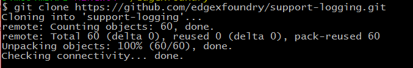

**Note**, if you plan to make code changes and submit those back to the project, you are going to want to fork the repositories you plan to work with and then pull your fork versus the EdgeX repositories directly.  See https://wiki.edgexfoundry.org/display/FA/Committing+Code+Guidelines for more information on how to commit code to EdgeX.

============
Dependencies
============

Many of the libraries and microservices are dependent on other libraries and microservices.  If you wish to build or run an EdgeX Foundry library or microservice project, you will need its dependent library/microservices to be pulled and built first.  The following set of diagrams can help you determine dependent library and microservices repositories you need to pull and build any single EdgeX Foundry project.

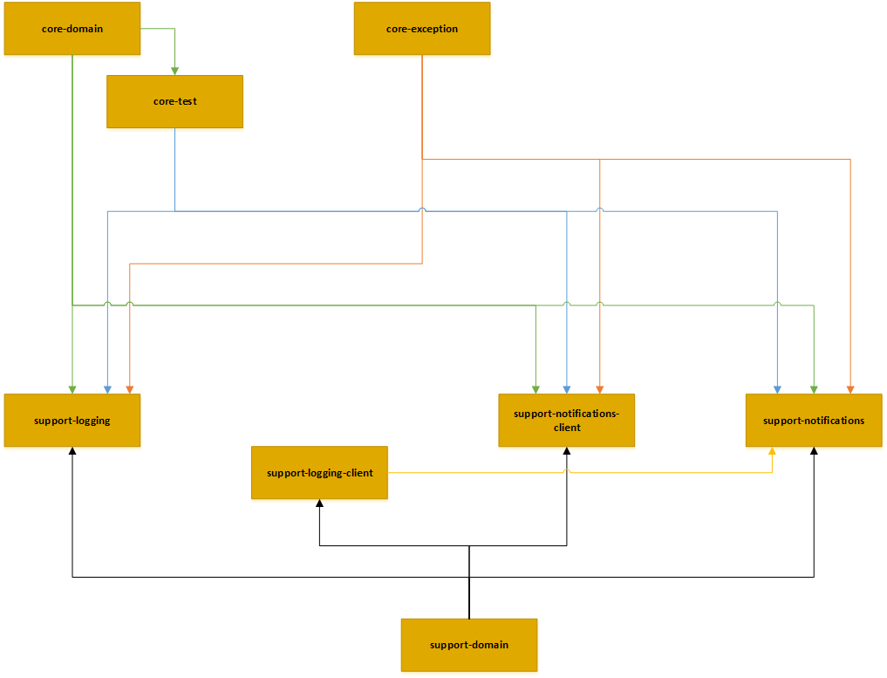
 
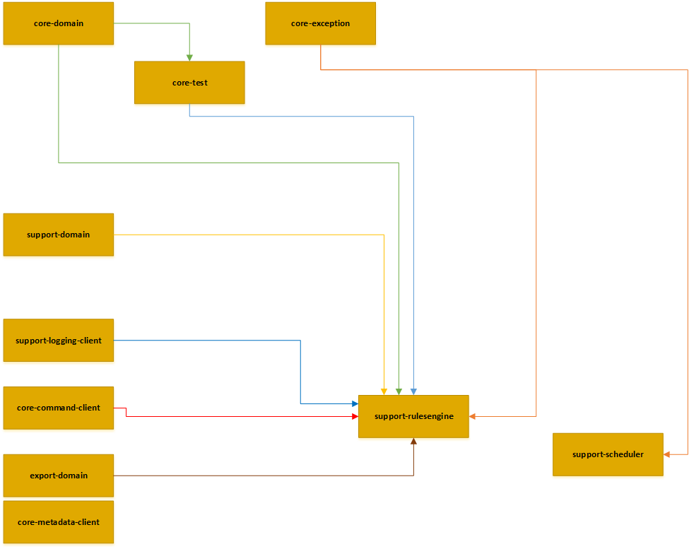

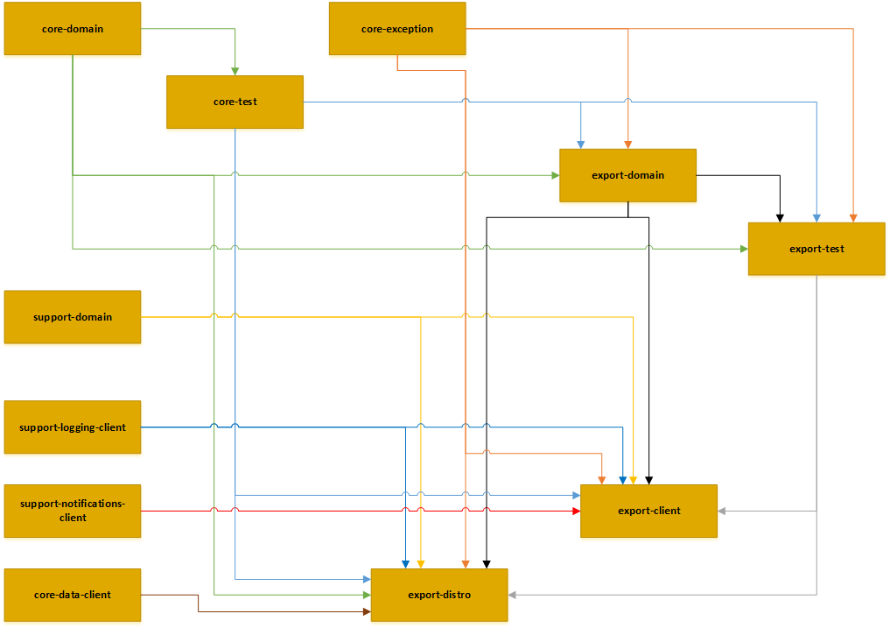

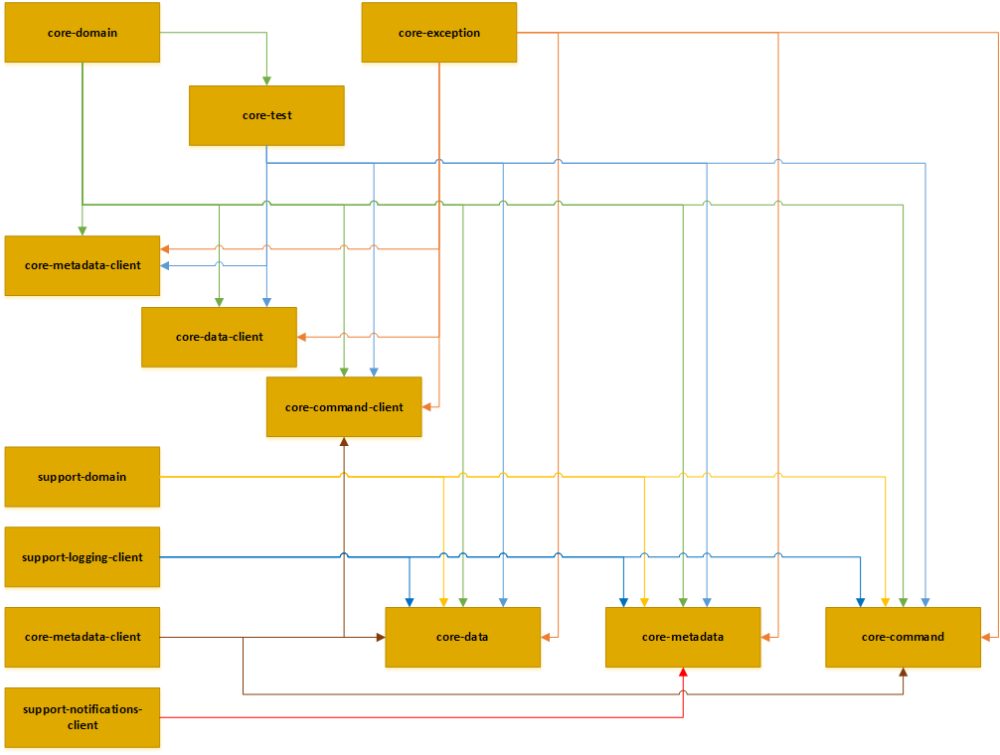
   
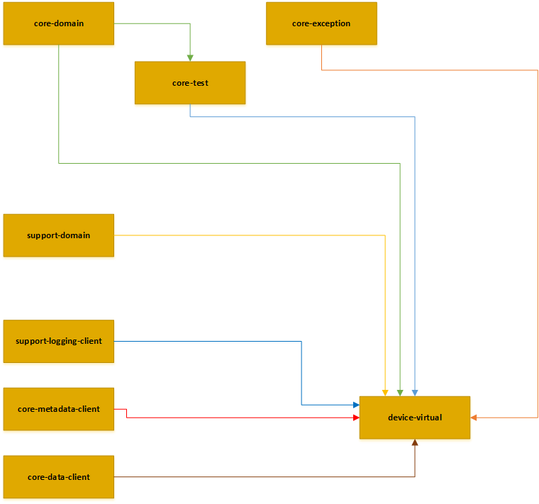

==============================
EdgeX Foundry's Mongo Database
==============================

**Initializing the Database**

Many of the EdgeX Foundry microservices use a MongoDB instance to persist data or metadata.  The MongoDB database for EdgeX Foundry must be initialized before it can be used by the system.  Unless the database is destroyed, this set of instructions only has to be run one time to initialize the database.

There are several useful scripts in the developer-scripts repository for EdgeX Foundry to help initialize and then run the EdgeX Foundry MongoDB instance.

To begin, start MongoDB in a "no authorization" state.  A sample Windows Batch script has been provided at https://github.com/edgexfoundry/developer-scripts/blob/master/startdb-no-auth.bat.  Make sure you change the script to point to your mongod executable and provide the path to the location of the database instance files (c:\users\Public\mongodb\db in the script).

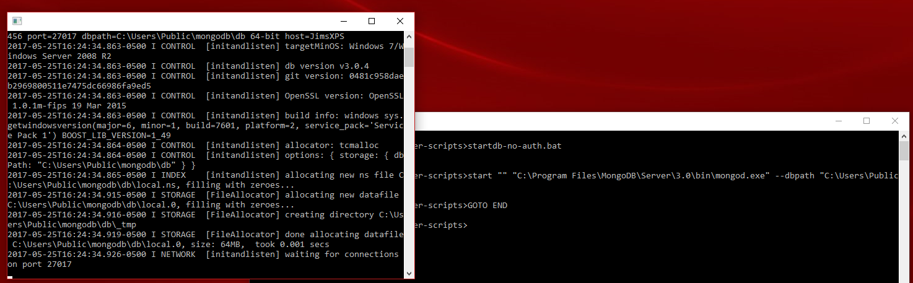

Once the database has been started, initialize the database with EdgeX Foundry access and schema elements.  The initialization code is located in init_mongo.js file.  You need to run this script using the mongo shell tool.  A sample Windows Batch script has been provided to run the mongo shell with this script at https://github.com/edgexfoundry/developer-scripts/blob/master/init_shell.bat.  Again, make sure you change the script to point to your mongo executable and provide the path to init_mongo.js file.  When the script executes, it will display the commands it is executing against the database.

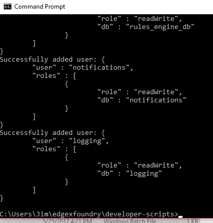

Once complete, the database can now be stopped.  In the next step, you restart the database with authentication turned on.  You do not need to re-initialize the database again.

**Running the Database**

Several of the EdgeX Foundry microservices utilize the MongoDB instance.  This includes core-data, core-metadata, support-rulesengine, supporting-logging (in some situations), among others.  Therefore, when working with EdgeX Foundry its a good idea to have the database up and running as a general rule.

After initializing the database (see previous step), start the database with authorization turned on.  A sample Windows Batch script has been provided at https://github.com/edgexfoundry/developer-scripts/blob/master/startdb.bat to show how to start MongoDB with the mongod executable and pointing it to the location of the database files (c:\users\Public\mongodb\db in the script).  Edit the script so that it points to your mongod location and points to the MongoDB data files as established in the initialization step.  Once ready, just run the script from a terminal window.  Note the use of "–auth" to start the database with authorization turned on.

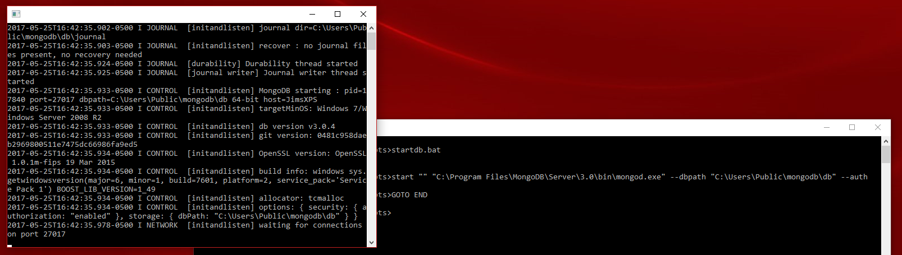

========================
EdgeX Foundry in Eclipse
========================

**Import the Project**

Each of the EdgeX Foundry repositories containing source code is also an Eclipse project, specifically a Maven project (except for device-sdk-tools).  To bring one one of these projects into Eclipse, use the File → Import... menu option in Eclipse to open the Import Window.

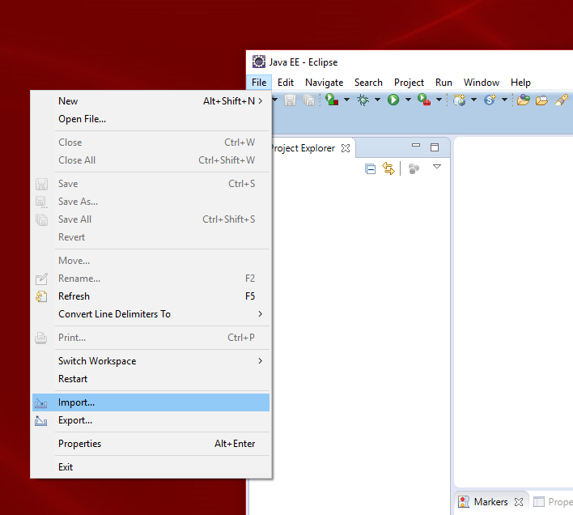

From the Import window that appears, request to import a Maven → Existing Maven Projects and then push the Next> button. 

Note - if the Maven options are not provided as import options, you either may be using a Java versus Java EE version of Eclipse, or you do not have the required Maven plugins loaded into your IDE.  See http://www.vogella.com/tutorials/EclipseMaven/article.html for help.

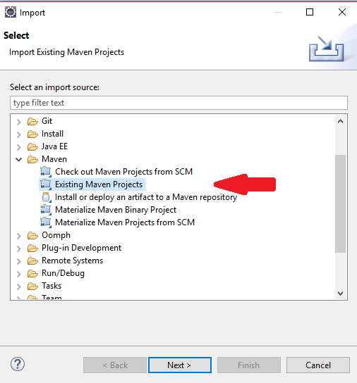

In the resulting Import Maven Projects window, browse to the location of the pulled repository.  Eclipse should detect the Maven project at that location and indicate that it has found the project's pom.xml at that location.  Press the Finish button when you are ready to import the project into Eclipse.

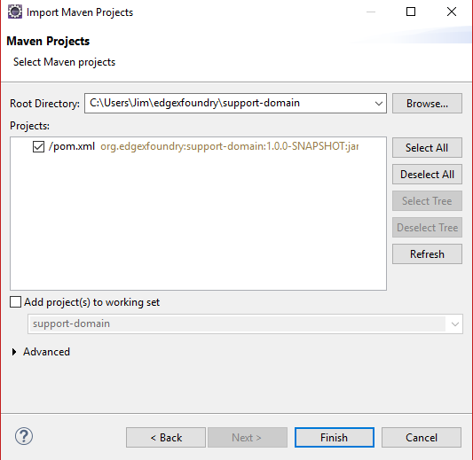

The project should appear in the Project Explorer if imported successfully.

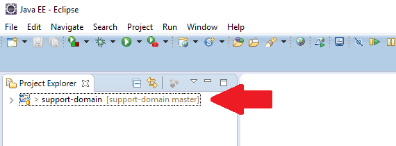

**Import device-sdk-tools**

As mentioned above, device-sdk-tools is not a Maven project.  It should be imported using File → Import → General, Existing Project into Workspace.

**Build and Install**

To build any of the EdgeX Foundry library or microservice projects once imported into Eclipse, right click on the project and select Run As → Maven Install from the resulting menu.  This will cause the project to be built (into a JAR file) and then have the JAR file installed into a local Maven repository.

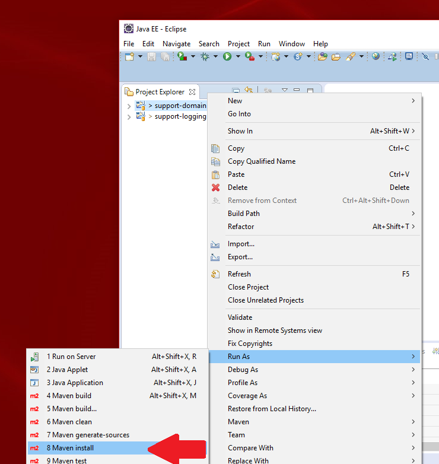

Note - as the various projects have cross dependencies, it's recommended that you run the Maven Install step for the projects in the following order:

* core-domain 
* core-test
* core-exception
* support-domain
* support-logging-client
* core-metadata-client
* core-data-client
* support-notifications-client
* core-command-client
* support-logging
* support-notifications
* core-metadata
* core-data
* core-command
* device-sdk
* device-virtual

Check the Eclipse Console view to make sure the project successfully built (as shown below).  If not successful, leading causes for failure include:

* check that you have configured your Eclipse environment to point to an available JDK on your development machine
* check that you have build/installed any dependent library or microservice project first
* check that you have the Maven plugin installed in your environment

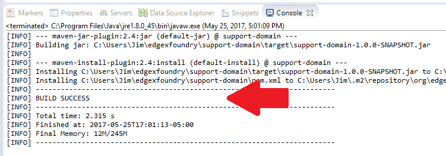

**Running in Eclipse**

With the database running (and initialized) and with all the libraries and services built and installed, you can run any (or all) of the EdgeX Foundry microservices right in Eclipse. Each microservice is implemented to run as a Java application.  Simply right click on the EdgeX Foundry microservice that you want to run and select Run As → Java Application from the resulting menu.

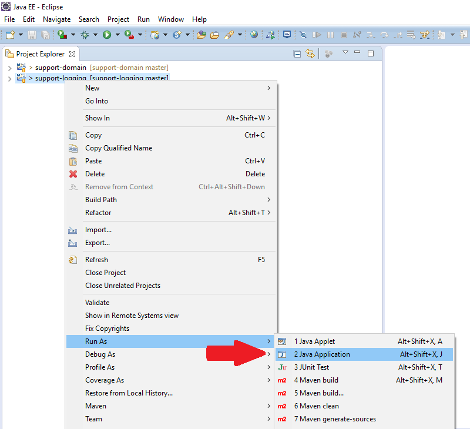

Eclipse will need some assistance in identifying the main class or starting point of the application.  It will prompt you with a window to select the application class to execute.  Locate the application class located in the base org.edgexfoundry package (EdgeXSupportLoggingApplication in the example below) and then hit the OK button to launch the microservice.

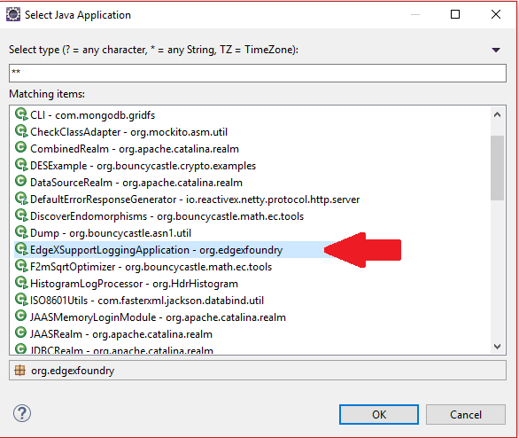

**Minimal EdgeX Running in Eclipse**

If you want to bring up a minimal EdgeX application in Eclipse to see data created by the Virtual Device enter into Core Data and be available via REST API call, here are the items you need to bring up:

1. Mongo (started and initialized per the documentation above)
2. Import the EdgeX projects into Eclipse (building and installing all the projects per documentation above)
3. Start core-metadata (per documentation above) and wait for it to complete its startup/initialization (look for "This is the Core Metadata Micro Service." in the Console view)
4. Start core-data (per documentation above) and wait for it to complete its startup/initialization (look for "This is the Core Data Micro Service." in the Console view)
5. Start core-command (per documentation above) and wait for it to complete its startup/initialization (look for "This is the Core Command Micro Service." in the Console view)
6. Edit the application.properties of the device-virtual and change the service.name and service.host name to both match your systems name.  In the example below, the PC's name is Test-PC

	\#default device service settings\

	\service.name=Test-PC\

	\service.host=Test-PC\

7. Start device-virtual (per the documentation above).  Watch the Console view to see that the service starts without issues and starts to send data to core-data
8. Check that event/reading data are being sent to core-data (and Mongo) by opening a browser and going to localhost:48080/api/v1/event/count.  The count should slowly rise with subsequent hits of this URL as the virtual device continues to send new simulated sensor data to core-data.

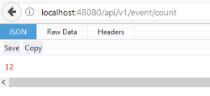

Run additional services from Eclipse as needed to export data, collect logs locally, etc.
