#################################
SDK that generates Device Service
#################################

=======================
Introduction to the SDK
=======================

The EdgeX Foundry Device Service Software Development Kit (SDK) takes the Developer through the step-by-step process to create an EdgeX Foundry Device Service microservice.  Then setup the SDK and execute the code to generate the Device Service scaffolding to get you started using EdgeX.

The EdgeX Foundry Software Development Kit (SDK) is written in Java. Other languages will be available in the future from the open source community. If you are creating your own SDK, use this one as an example.

The Device Service SDK supports:

* Synchronous read and write operations
* Asynchronous Device data
* Initialization and deconstruction of Driver Interface
* Initialization and destruction of Device Connection
* Framework for automated Provisioning Mechanism
* Support for multiple classes of Devices with Profiles
* Support for sets of actions triggered by a command
* Cached responses to queries

**Setup**

This SDK can be run directly via Eclipse or can also be exported as a Runnable JAR and run from the command line.

**NOTE:  Images in this documentation still contain references to Fuse (the Dell project that was contributed to EdgeX Foundry).  The images are still accurate and helpful if you can ignore any place you see "fuse-" in the image.   In the future, these references will be removed.**

**Run configuration requires two parameters**

1. Output directory name where files are generated.
2. Device Service configuration file. By default the file is expected to be in the project root directory. Examples are included in the tools project root directory.

**To generate a New Device Service**

1. Create a new service configuration file using the included file 'Demo' as a template.
	a. Set the Service name field of the new service. Convention is device-<protocol name>
	b. Set the profile attributes that will be generated in the domain.<Protocol name>Attribute.java file. These fields are passed to the driver layer and must also be included in each deviceResource attribute field of every device profile for a service. These are protocol specific metadata objects characteristics of a protocol (such as uuid for BLE, oid and community for SNMP, and so forth). The first column is the Attribute name, the second is the java type.

**Component Diagram of a Service Generated from the SDK**

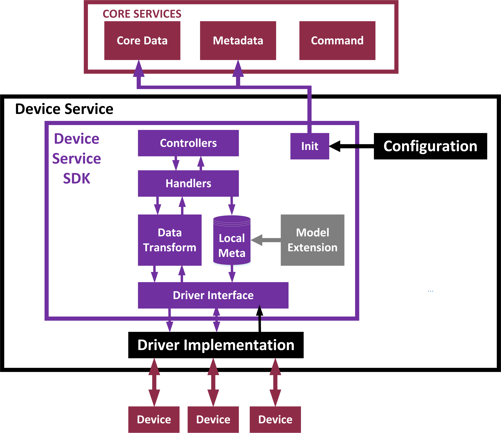

Step 1. Clone the Projects

  Clone from the Bitbucket repository the following projects:

* `device-sdk`_.
* `device-sdk-tools`_.

.. _`device-sdk`: https://github.com/edgexfoundry/device-sdk
..

.. _`device-sdk-tools`: https://github.com/edgexfoundry/device-sdk-tools
..

Step 2. Import the Projects

Import the two projects in to your IDE of choice; the images in this guide were generated with Eclipse Mars.2 Release (4.5.2) 
See Figure 1. "Import the device-sdk and device-sdk-tools projects"

* device-sdk
* device-sdk-tools

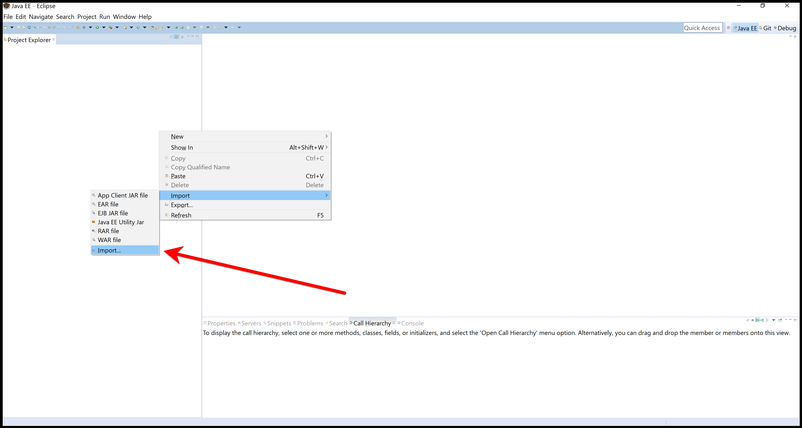

Figure 1 (above).  Import the device-sdk and device-sdk-tools projects

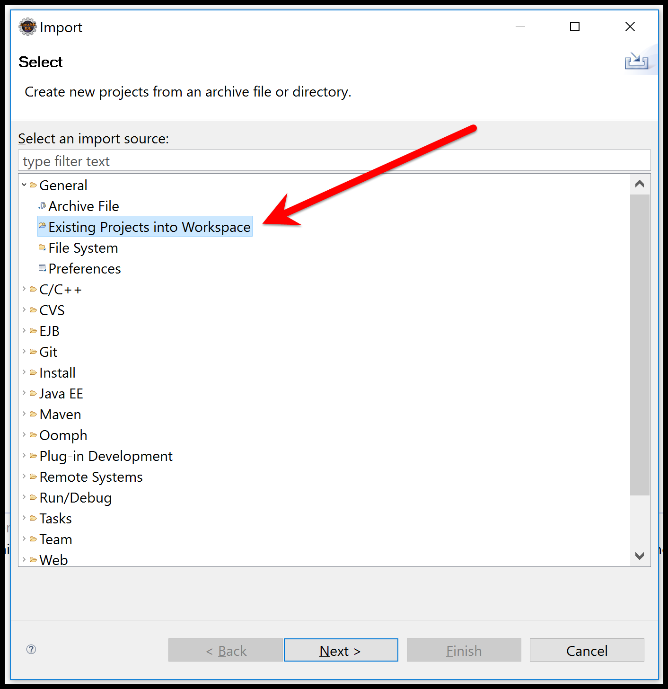

Figure 2 (above).  Import the device-sdk and device-sdk-tools projects, continued

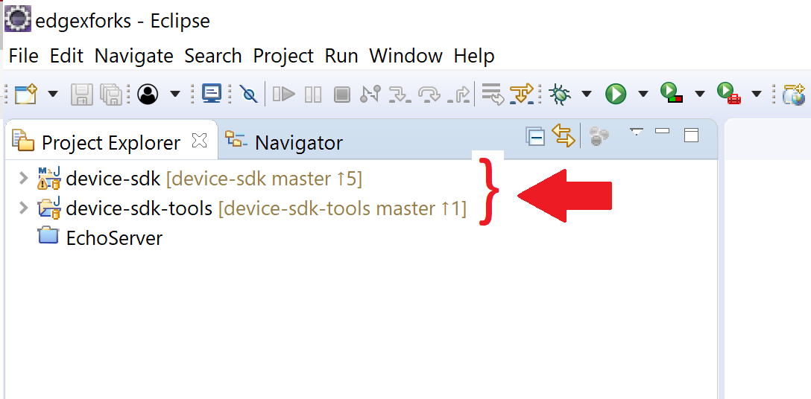

Figure 3 (above).  The device-sdk and device-sdk-tools projects have been imported

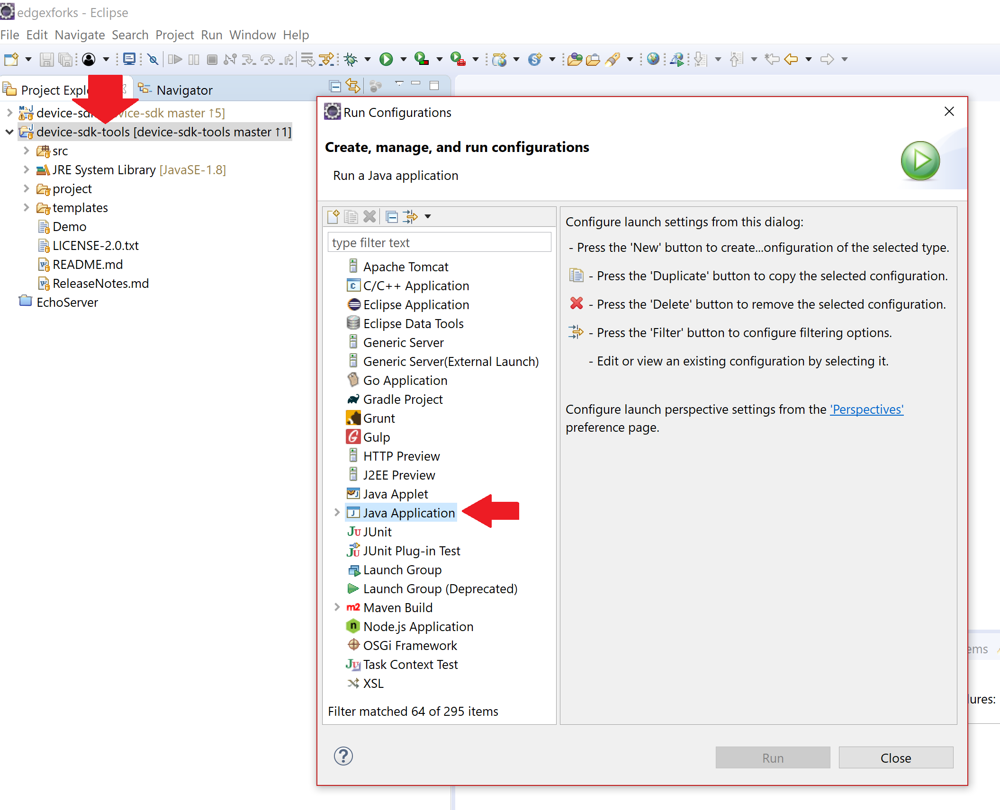

Figure 4 (above).  Set up the Run Configuration

Step 3. Set up the Run Configuration

Set up the Run Configuration for the Device Service Generation. (device-sdk-tools → Run As → Run Configurations...) See Figure 4. "Set up the Run Configuration."

Add a new Java application targeting the device-sdk-tools project. See Figure 5. "Create Run Configuration"

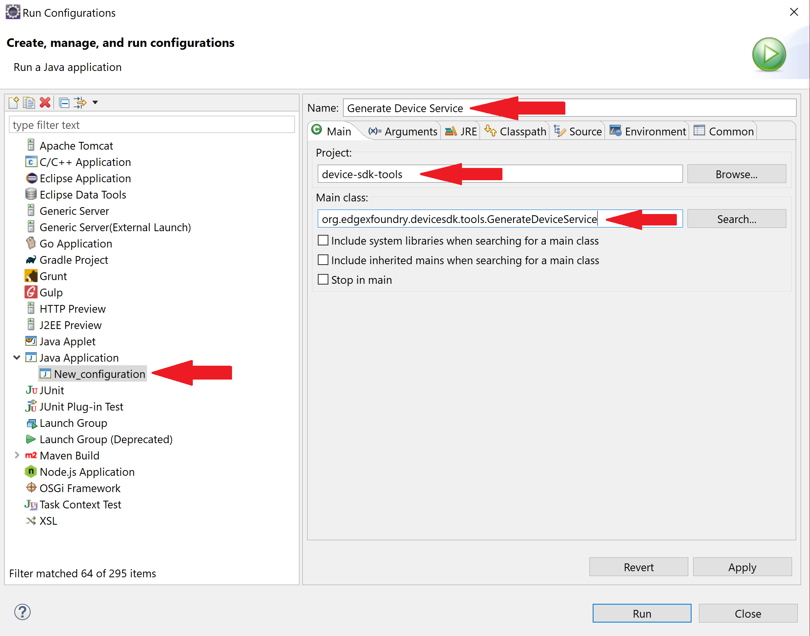

Figure 5 (above).  Create Run Configuration

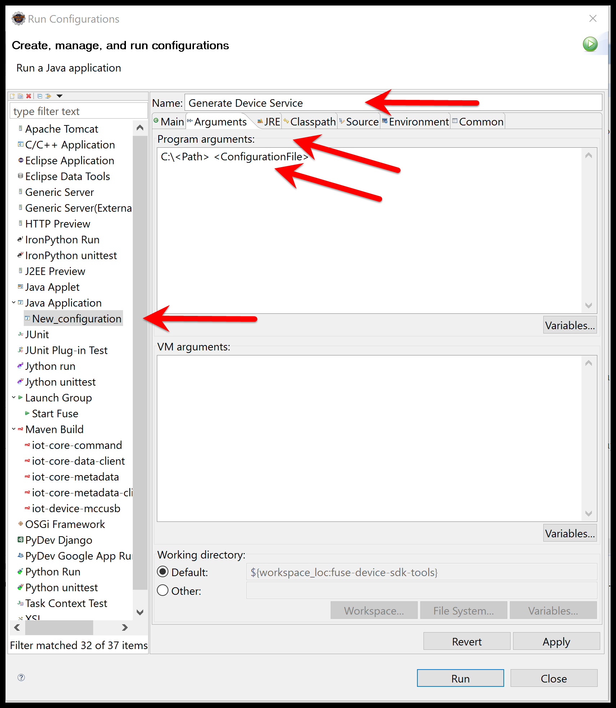

Figure 6 (above).  Configure Run Parameters

Step 4. Set the Arguments

Set the arguments. See Figure 6. "Configure Run Parameters"

C:\<Path> Demo 

Enter the Generation Target Parent Path and the Demo Service Configuration File. 

Step 5. Run the Newly Created Configuration to Generate your New Device Service

Run the newly created Configuration to generate your new Device Service.

.. image:: EdgeX_GettingStartedSDKRun3.png

Figure 7 (above).  Results of Running Generate Device Service

Step 6. A New Service Has Been Created

Check the console output, see Figure 7. "Results of Running Generate Device Service"

Now a new service has been created from the Device Service SDK template code. The Demo Service Configuration File generates a service called device-sdk-generated.

Step 7. Import the Service

Import your newly generated Device Service.

See Figure 8. "Import the Demo Service"

The root directory is the path from Step 4 plus the new service name. 

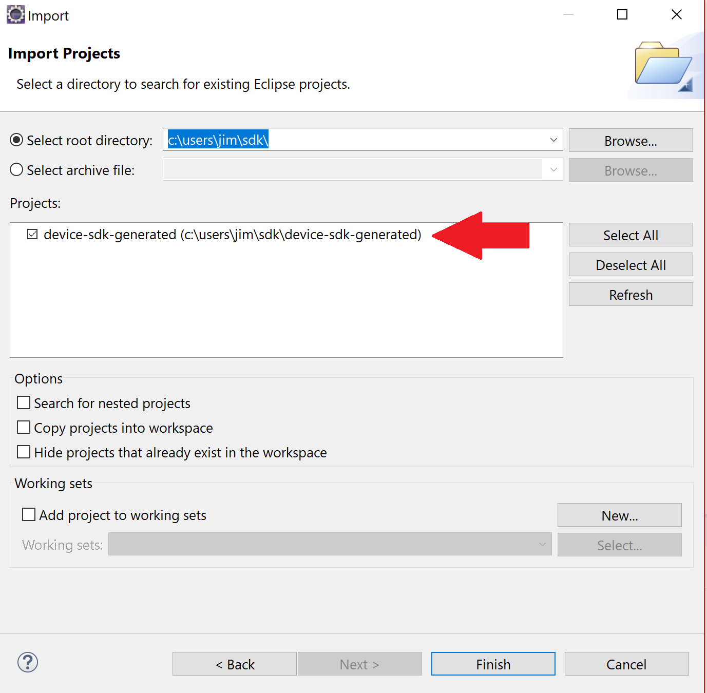

Figure 8 (above).  Import the Demo Service

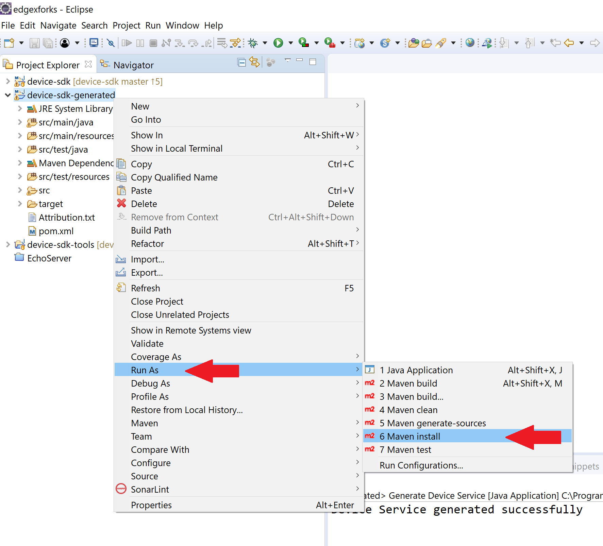

Figure 9 (above).  Run a Maven Install on the New Service

Step 8. Run a Maven Install on the New Service

Run a Maven Install on the new service to install the project dependencies. See Figure 9. "Run a Maven Install on the New Service"

This will get packages needed as dependencies. See Figure 10. "The Results of Running as a Maven Install"

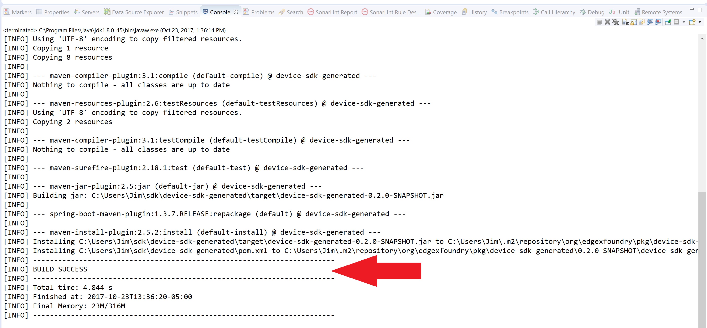

Figure 10 (above).  Results of Running as a Maven Install

Step 9. Run the New Service as a Java Application

Bug Note:  Before running the service, the current implementation of the SDK contains a small but in the application.properties file.  Open application.properties and add the following default logging configuration to the file to avoid an issue when running the application:

logging.remote.url=http://localhost:48061/api/v1/logs

Run the new service as a Java Application. See Figure 11. "Run the Demo as a Java Application"

.. image:: EdgeX_GettingStartedSDKRunDemoJavaApp.png

Figure 11 (above).  Run the Demo Service as a Java Application

Step 10. Run Configuration Application

The Application--run the Device Service Demo.  See Figure 12. "Run Configuration Application."

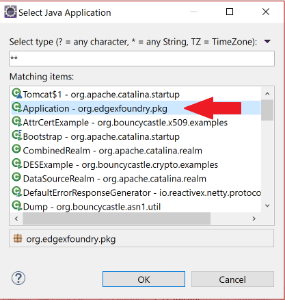

Figure 12 (above).  Run Configuration Application

The result: when the Device Service has nothing to which to connect, it fails.  If EdgeX Foundry is running locally it will connect and initialize with Metadata.

Note: when running the service at this time, you will see the a default scheduling event fail if you watch the log output from the new device service.  It will look something like the following:

::

   2018-02-03 16:28:19.456 DEBUG 18672 --- [ool-16-thread-1] o.edgexfoundry.pkg.scheduling.Scheduler  : executing schedule 5a763773641a47658e75ebed 'Interval-15s' at 2018-02-03T16:28:19-06:00[America/Chicago]
   2018-02-03 16:28:19.456 DEBUG 18672 --- [ool-16-thread-1] o.e.p.scheduling.ScheduleEventExecutor   : schedule event list contains 1 events
   2018-02-03 16:28:19.456 DEBUG 18672 --- [ool-16-thread-1] o.e.p.scheduling.ScheduleEventExecutor   : executing event 5a763773641a47658e75ebef 'device-sdk-generated-Discovery'
   2018-02-03 16:28:20.286 ERROR 18672 --- [ool-16-thread-1] o.e.p.s.ScheduleEventHttpExecutor        : exception executing event 5a763773641a47658e75ebef 'device-sdk-generated-Discovery' url 'HTTP://device-sdk-generated:49997/api/v1/discovery' body '' exception device-sdk-generated
  java.net.UnknownHostException: device-sdk-generated
    at java.net.AbstractPlainSocketImpl.connect(AbstractPlainSocketImpl.java:184)
    at java.net.PlainSocketImpl.connect(PlainSocketImpl.java:172)
    at java.net.SocksSocketImpl.connect(SocksSocketImpl.java:392)
    at java.net.Socket.connect(Socket.java:589)
    at sun.net.NetworkClient.doConnect(NetworkClient.java:175)
    at sun.net.www.http.HttpClient.openServer(HttpClient.java:432)
    at sun.net.www.http.HttpClient.openServer(HttpClient.java:527)
    at sun.net.www.http.HttpClient.<init>(HttpClient.java:211)
    at sun.net.www.http.HttpClient.New(HttpClient.java:308)
    at sun.net.www.http.HttpClient.New(HttpClient.java:326)
    at sun.net.www.protocol.http.HttpURLConnection.getNewHttpClient(HttpURLConnection.java:1168)
    at sun.net.www.protocol.http.HttpURLConnection.plainConnect0(HttpURLConnection.java:1104)
    at sun.net.www.protocol.http.HttpURLConnection.plainConnect(HttpURLConnection.java:998)
    at sun.net.www.protocol.http.HttpURLConnection.connect(HttpURLConnection.java:932)
    at sun.net.www.protocol.http.HttpURLConnection.getOutputStream0(HttpURLConnection.java:1282)
    at sun.net.www.protocol.http.HttpURLConnection.getOutputStream(HttpURLConnection.java:1257)
    at org.edgexfoundry.pkg.scheduling.ScheduleEventHttpExecutor.execute(ScheduleEventHttpExecutor.java:67)
    at org.edgexfoundry.pkg.scheduling.ScheduleEventExecutor.execute(ScheduleEventExecutor.java:57)
    at org.edgexfoundry.pkg.scheduling.ScheduleEventExecutor.execute(ScheduleEventExecutor.java:48)
    at org.edgexfoundry.pkg.scheduling.Scheduler.schedule(Scheduler.java:131)
    at sun.reflect.GeneratedMethodAccessor33.invoke(Unknown Source)
    at sun.reflect.DelegatingMethodAccessorImpl.invoke(DelegatingMethodAccessorImpl.java:43)
    at java.lang.reflect.Method.invoke(Method.java:497)
    at org.springframework.scheduling.support.ScheduledMethodRunnable.run(ScheduledMethodRunnable.java:65)
    at org.springframework.scheduling.support.DelegatingErrorHandlingRunnable.run(DelegatingErrorHandlingRunnable.java:54)
    at java.util.concurrent.Executors$RunnableAdapter.call(Executors.java:511)
    at java.util.concurrent.FutureTask.runAndReset(FutureTask.java:308)
    at java.util.concurrent.ScheduledThreadPoolExecutor$ScheduledFutureTask.access$301(ScheduledThreadPoolExecutor.java:180)
    at java.util.concurrent.ScheduledThreadPoolExecutor$ScheduledFutureTask.run(ScheduledThreadPoolExecutor.java:294)
    at java.util.concurrent.ThreadPoolExecutor.runWorker(ThreadPoolExecutor.java:1142)
    at java.util.concurrent.ThreadPoolExecutor$Worker.run(ThreadPoolExecutor.java:617)
    at java.lang.Thread.run(Thread.java:745)
  2018-02-03 16:28:20.293 DEBUG 18672 --- [ool-16-thread-1] o.edgexfoundry.pkg.scheduling.Scheduler  : queueing schedule 5a763773641a47658e75ebed 'Interval-15s'

To avoid this issue, you can comment out the default schedule properties in the schedule.properties file:

| # Add comma separated schedule and scheduleEvent initializations, may be partially specified, used by SimpleSchedule and SimpleScheduleEvent for initialization
| # TODO 9: [Required] Set up default schedules. Each property set must be equal width. Run the schedule in the service by leaving the scheduleEvent.scheduler property blank,
| # or run on the scheduler service by defining the scheduleEvent.scheduler=scheduler,...
| #default.schedule.name=Interval-15s
| #default.schedule.frequency=PT15S

| #default.scheduleEvent.name=device-sdk-generated-Discovery
| #default.scheduleEvent.path=/api/v1/discovery
| #default.scheduleEvent.service=device-sdk-generated
| #default.scheduleEvent.schedule=Interval-15s

Step 11. Generate the Users' Service

New Service is a copy of Demo Service.  See Figure 13. "New Device Service Configuration."

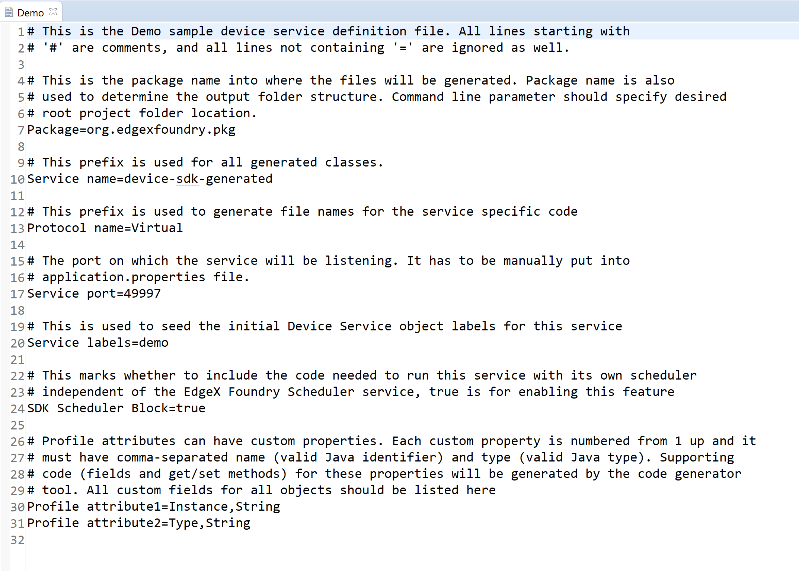

Figure 13 (above).  New Device Service Configuration

Enter the following information (see Figure 14 to see these examples):

+---------------+-----------------------------+--------------------------------------------------------------------------------------------+
| Line 7        |  The package text           |   Example:  Package=org.edgexfoundry.newservice                                            |
+---------------+-----------------------------+--------------------------------------------------------------------------------------------+
| Line 10       |  Service name               |   Example:  Service name=device-new-service                                                |
+---------------+-----------------------------+--------------------------------------------------------------------------------------------+
| Line 13       |  Protocol name              |   Example:  Protocol name=NewService                                                       |
|               |                             |   For example, BLE, modbus, Virtual.                                                       |
+---------------+-----------------------------+--------------------------------------------------------------------------------------------+
| Line 17       |  Service port               |   Example:  Service port=49000                                                             |
|               |                             |   Project conventions place device services in the 49000-49999 port range at this time.    |
+---------------+-----------------------------+--------------------------------------------------------------------------------------------+
| Line 20       |  Service labels             |   Example:  Service labels=newService                                                      |
|               |                             |   Used as metadata for upstream services.                                                  |                  
+---------------+-----------------------------+--------------------------------------------------------------------------------------------+
| Line 24       |  SDK Scheduler Block        |   * "true"  = includes scheduling code and runs locally (adds support for the Scheduling   |
|               |                             |     APIs and implementation).                                                              |
|               |                             |   * "false" = does not include scheduling capabilities in the service.                     |
+---------------+-----------------------------+--------------------------------------------------------------------------------------------+
| Lines 30, 31  |  Profile attributes         |   Completely dependent on what the underlying Protocol Driver needs and is Service         |
| and so forth  |                             |   dependent. Enter as many attributes as needed. Java type is comma separated.             |
+---------------+-----------------------------+--------------------------------------------------------------------------------------------+

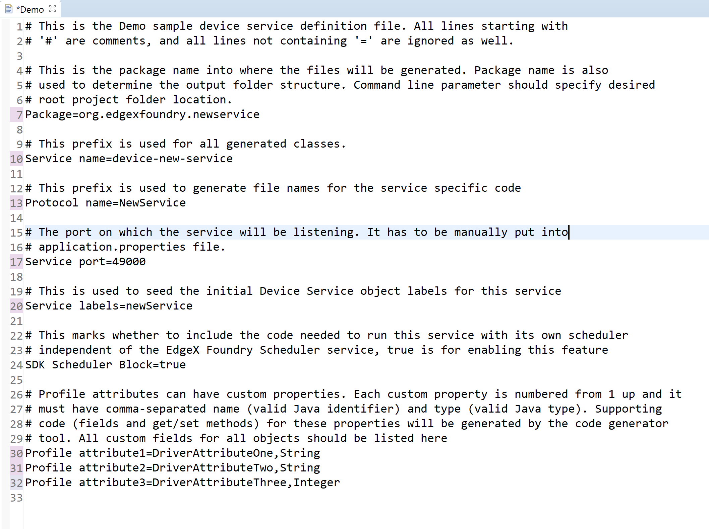

Figure 14 (above).  Results of New Device Service Configured

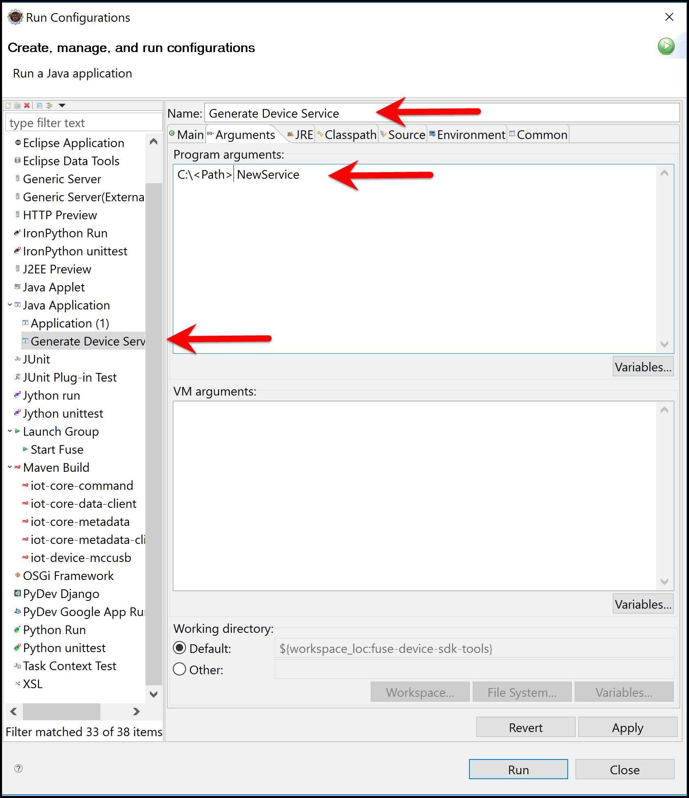

Figure 15 (above).  Run New Device Service Generation

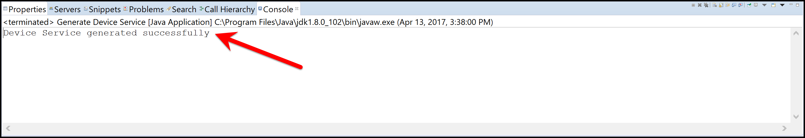

Figure 16 (above).  Results of Running New Device Service Generation

Step 12. Run New Device Service Generation 

| See Figure 15. "Run New Device Service Generation" for the settings.  
| See Figure 16. "Results of Running New Device Service Generation" for the results.

Step 13. Import New Device Service

| See Figure 17. "Import New Device Service" for the settings.  
| See Figure 18. "Results of Importing New Device Service" for the results. 

.. image:: EdgeX_GettingStartedSDKImportNewDeviceService.png

Figure 17 (above).  Import New Device Service

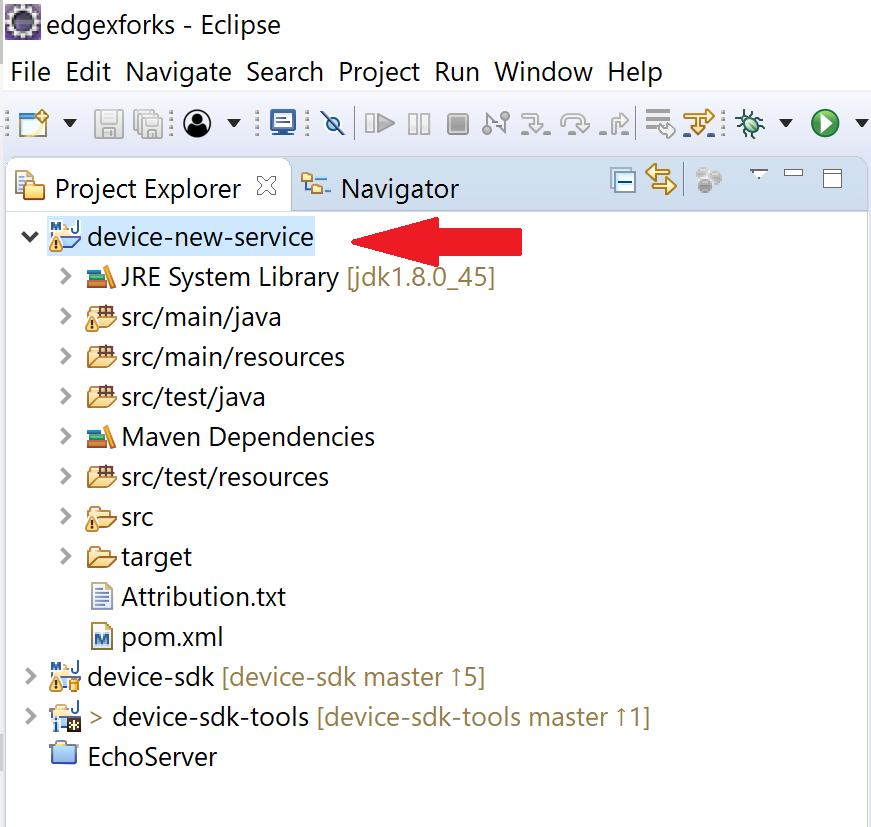

Figure 18 (above).  Results of Importing New Device Service

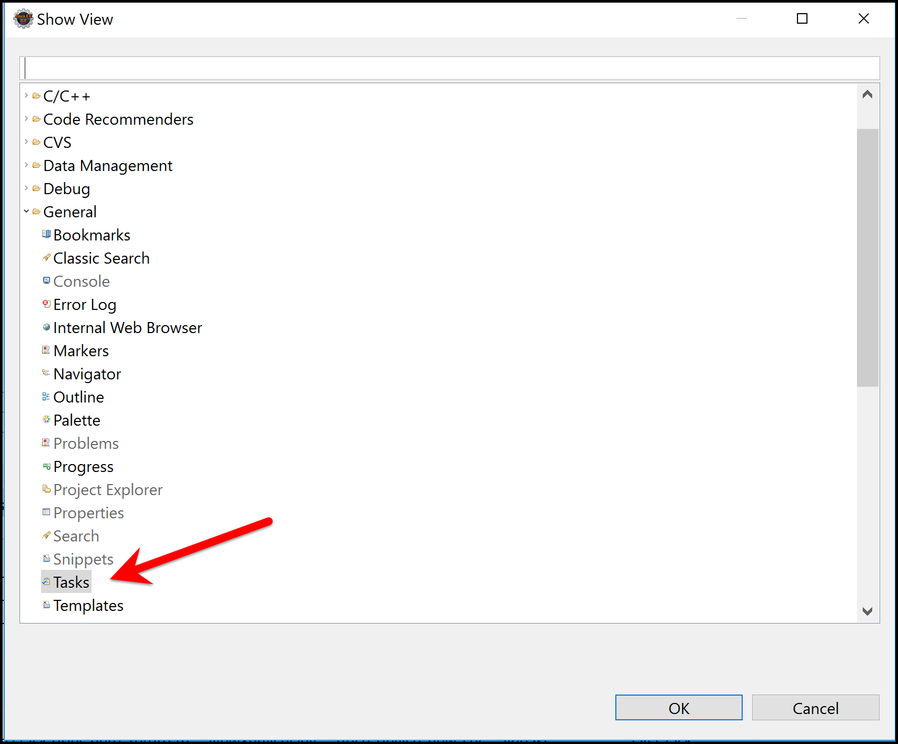

Figure 19 (above).   New Service Tasks

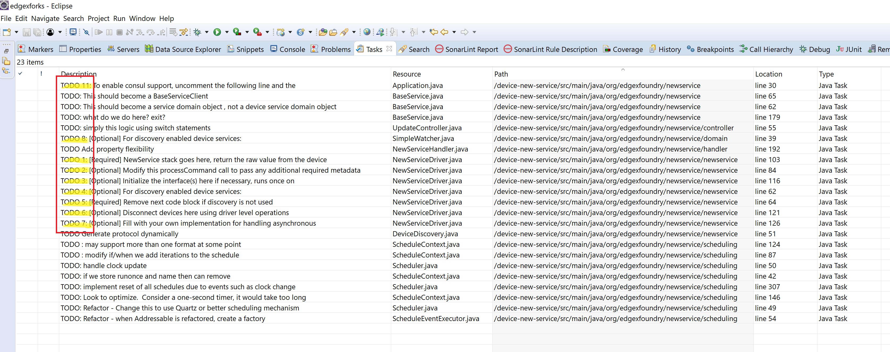

Figure 20 (above).  New Service Task List With Highlights of Tasks 1 - 8, and 11

Step 14. Show Developer Tasks

Show Developer Tasks (Window → Show View → Other... → General → Tasks)
See Figure 19. "New Service Tasks"
See Figure 20. "New Service Task List With Highlights of Tasks 1 - 8, and 11" to see most of the list of tasks. Tasks 9 & 10 are in the src main resources properties files.

Step 15. TO DOs #1 to #4

Perform and complete the required TO DO #1 and perform and complete the optional TO DOs that meet your needs.

| In <Protocol name>.<Protocol name>Driver.java:
| TO DO #1 (REQUIRED)–Creating or implementing or integrating the Device Driver Interface for the Service. Depending on which Device Service you are creating, you may be importing libraries, or creating your own device interface.

| Replace the sample code with your Driver or Protocol stack. See Figure 21. "New Service Task #1."
| TO DO #2 (Optional)–Redefining or modifying the Driver Interface from TO DO #1. Expanding the scope of metadata passed for a driver operation call.

| Modify the interface between process and processCommand to expose additional information from the Device Object if required.
| TO DO #3 (Optional)–Initialize the interface or driver stack (includes things such as port initialization or dongle capture). The service has no knowledge of associated devices at this stage in execution.
| TO DO #4 (Optional)–Implement your service or protocol-specific device discovery mechanism if needed or if it exists.

Step 16. TO DOs #5 to #8

| Perform and complete the required TO DO #5 and perform and complete the optional TO DOs that meet your needs.
| TO DO #5 (REQUIRED)–If you did TO DO #4 and implemented a discovery mechanism, then you have completed TO DO #5. If you did not need to do TO DO #4, then you need to remove this block of sample discovery code (lines 64 to 71), which is here for reference.
| TO DO #6 (Optional)–Implement Device disconnection mechanism.  For clean up, closing ports, clearing caches, and so forth. 
| TO DO #7 (Optional)–Tying the driver asynchronous callback mechansism to this function in TO DO #7. Asynchronous received data from the device which is where it would institute callback mechanism.

| In domain.SimpleWatcher.java
| TO DO #8 (Optional)–If you implement a protocol specific device discovery mechanism you may want to modify the reference device matching model here in this file. Redefine or extend the device discovery attributes for your service.

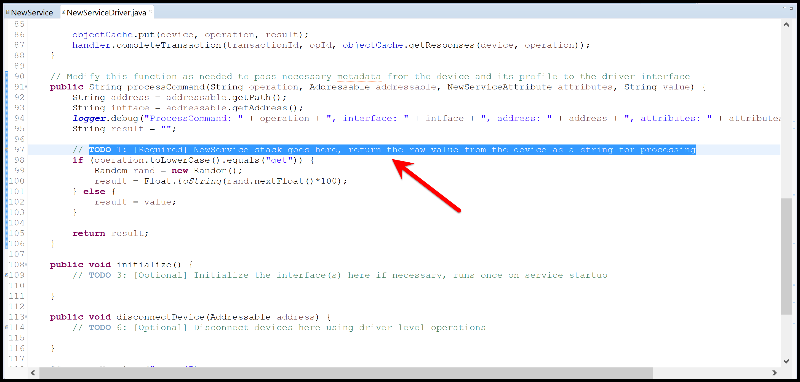

Figure 21 (above).  New Service Task #1

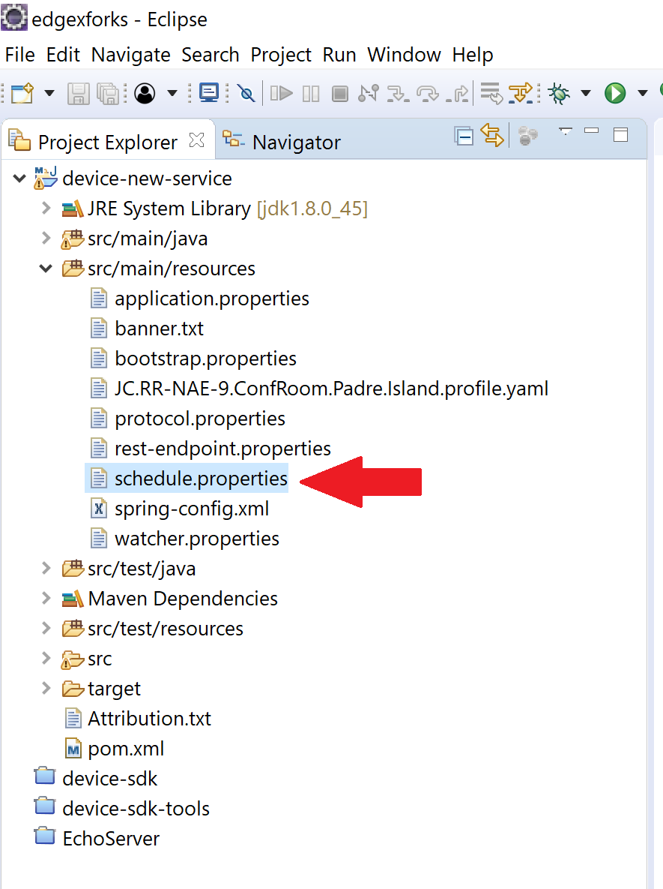

Figure 22 (above).  New Service Task #9  Schedule.properties

Step 17. TO DOs #9 to #11

Perform and complete the required TO DO #9, and perform and complete the optional TO DOs that meet your needs.
Go to the file src/main/resources/schedule.properties  (See Figure 22. New Service Task #9 Schedule.properties)

TO DO #9 (REQUIRED)–Initializing the default schedules for a service. Change the schedule.properties configuration file to configure the default schedules seeded by the service on startup.

In EdgeX Foundry there are 2 Scheduling classes:

    schedule– which is name and frequency such as a clock
    schedule events – contains the REST call that occurs when the associated schedule fires.  Multiple schedule events can refer to the same one schedule. 

See Figure 23. Schedule.properties

TO DO #10 (Optional)–For configuring default Device Discovery metadata. The info for #10 is used in TO DOs #4 and #5.
Go to the file src/main/resources/watcher.properties just below schedule.properties in TO DO #9.

In Application.java:
TO DO #11 (Optional)–For Consul support. If you want to use Consul in EdgeX Foundry's Registration and Configuration microservice, then uncomment the two lines of code as shown in Figure 24. Task #11 Enabling Consul 

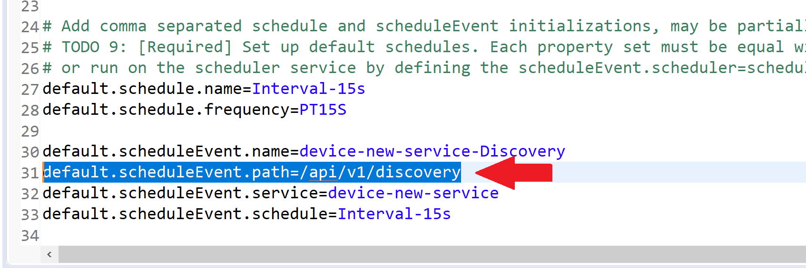

Figure 23 (above).  Schedule.properties

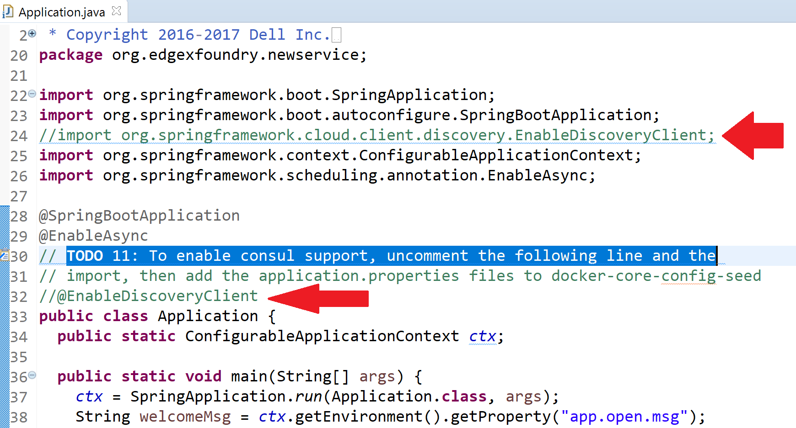

Figure 24 (above).  Task #11–Enabling Consul

**Configuration Notes**

**Service Name and Host Name**

In EdgeX device services the service name (which is represented by service.name key in the application.properties file or Consul configuration) is the identity of the Device Service object.  The name is used by EdgeX to attribute all the information about the service (in particular schedules, device ownership, etc.) to this name. However, the service.host parameter is used to describe how to interact with the service. Depending on your operating mode, the following guidelines for configuring the service host apply.

**Deployment Mode (running everything containerized in Docker):**

The Service host (which is represented by the service.host key in the application.properties file or Consul configuration) is the DNS or IP address networking entry of the entity that the service is bound to (container, machine, etc) and reachable from the other microservices. This allows a full location URL for the service to be determined.  In Docker environments, the host name is the name of the Docker container running the microservice (such as edgex-device-virtual).

Use service.host=${service.name} and the docker-compose file for all services (default).

Important Note:  be sure to use Docker Compose and docker-compose file (found in the compose-files folder in the developer-scripts repos) to bring up the containers for all services.  Docker Compose establishes the networking and container naming for you, which can otherwise be difficult to do and prone to errors if bringing up containers manually.

**Developer Mode (running everything natively):**

When running a service natively, the service names will not resolve to a DNS entry as they will in a Docker environment.

Use service.host=localhost for all services (default).

**Hybrid Mode (running some services natively with the rest deployed with Docker):**

Use service.host=<Host Machine IP Address> for the native services (manual configuration) and the docker-compose file to bring up the containerized services (default). Ensure that Addressable objects for the native services are not accidentally created by bringing them up with the docker-compose file, otherwise conflicts may arise. This issue is being addressed in future versions.

