#########################
Get EdgeX Foundry - Users
#########################
============
Introduction
============
These instructions are for Users to obtain and run EdgeX Foundry. (Developers should read: :doc:`../Ch-GettingStartedDevelopers`) 

EdgeX Foundry is a collection of more than a dozen microservices that are deployed to provide minimal edge platform capability. EdgeX Foundry microservice source code can be downloaded and built into deployment artifacts, but if you are not a Developer, or if you do not have a specific need to run EdgeX Foundry "natively," you do not need to download source code. 

Users have the easier option to use Docker and run EdgeX Foundry in microservice Docker containers.  EdgeX Foundry microservices are automatically built and containerized as new code is checked into the source repository. Therefore, "Dockerized" EdgeX Foundry is not only easier to obtain and deploy to your environment, but can also have the most up-to-date EdgeX Foundry microservices (depending on which container registry is used to get the microservices).

To obtain and run EdgeX Foundry, perform the following steps:

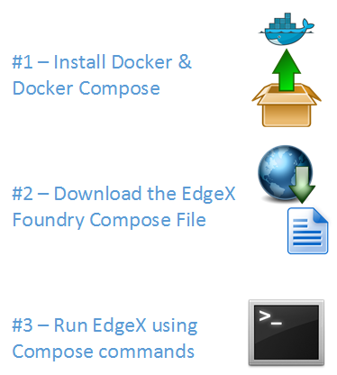

=============
What You Need
=============
EdgeX Foundry is an operating system (OS)-agnostic and hardware (HW)-agnostic edge software platform. Minimum platform requirements are being established. At this time use the following recommended characteristics:

* Memory:  minimum of 4 GB (with the new Go Lang services, much less memory is required, and may be as litle as 1GB of memory)
* Hard drive space:  minimum of 3 GB of space to run the EdgeX Foundry containers, but you may want more depending on how long sensor and device data is retained
* OS: EdgeX Foundry has been run successfully on many systems including, but not limited to the following systems
        * Windows (ver 7 - 10)
        * Ubuntu Desktop (ver 14-16)
        * Ubuntu Server (ver 14)
        * Ubuntu Core (ver 16)
        * Mac OS X 10

=======================
Get & Run EdgeX Foundry
=======================

-------------------------------
Install Docker & Docker Compose
-------------------------------
|
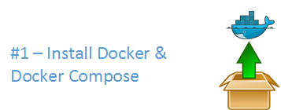

To run Dockerized EdgeX Foundry, you need to install Docker.  See https://docs.docker.com/install/ to learn how to obtain and install Docker.  If you are new to using Docker, the same web site provides you additional information.  The following short video has is also very informative https://www.youtube.com/watch?time_continue=3&v=VhabrYF1nms

Docker Compose is used to orchestrate the fetch (or pull), installation, and the start and stop of the EdgeX Foundry microservice containers. See:  https://docs.docker.com/compose/ to learn more about Docker Compose. 

Docker Compose is automatically installed with Docker for Mac and Windows users. See: https://docs.docker.com/compose/install/ to determine if your Docker installation already contains Docker Compose, and how to install Compose if it does not.

You do not need to be an expert with Docker to obtain and run EdgeX Foundry.  The instructions in this guide provide you with the steps to get EdgeX Foundry running in your environment. Some basic knowledge of these two technologies of Docker and Docker Compose, are nice to have, but not required. Basic Docker and Docker Compose commands, enable you to run, update, and diagnose issues within EdgeX Foundry. 

---------------------------------------
Download the EdgeX Foundry Compose File
---------------------------------------
|
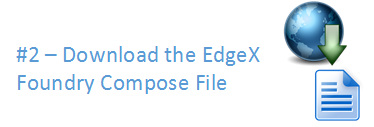

After installing Docker and Docker Compose, you need the Docker Compose file that is a manifest of all the EdgeX Foundry microservices.  EdgeX Foundry has over 12 microservices, each deployed in their own Docker container, in a typical EdgeX Foundry deployment. 

If you know Docker and understand the architecture of EdgeX Foundry and its microservices, you can manually issue Docker commands to download and run each of the EdgeX Foundry containers yourself. Situations exist, particularly in development situations, when you want to have this manual control even though manually issuing commands can be a bit tedious. More instructions are provided in this documentation set if you need to have more control of downloading and running EdgeX Foundry microservices.

Getting and running EdgeX Foundry microservices can also be accomplished more easily provided you have the Docker Compose file that specifies to Docker/Docker Compose which containers you want, and how you want to run those containers. The EdgeX Foundry development team provides you with Docker Compose files for each release through the EdgeX Foundry GitHub repository. To obtain and run EdgeX Foundry, visit the project GitHub and download (or copy the contents) of the EdgeX Foundry Docker Compose file suitable to the version you wish to use - to a local directory.  

The collection of the EdgeX Foundry Docker compose files are found here:  https://github.com/edgexfoundry/developer-scripts/tree/master/compose-files

Note that most of the Docker Compose files carry a specific version identifier (like california-0.6.0) in the file name.  These Compose files help obtain the specific version of EdgeX.  The docker-compose.yml file will pull the latest tagged EdgeX microservices from Docker Hub.  The docker-compose-nexus.yml will pull the latest microservice images from the developer's Nexus registry which contains the latest built artifacts.  These are typically work-in-progress microservice artifacts and should not be used by most end users.  It is recommended that you use the lastest version of EdgeX Foundry.  As of this writing, the latest version can be found here: https://github.com/edgexfoundry/developer-scripts/blob/master/compose-files/docker-compose-california-0.6.0.yml

A Docker Compose file is a manifest file, which lists:

* The Docker containers (or more precisely the Docker container images) that should be downloaded, 
* The order in which the containers should be started
* The parameters under which the containers should be run

-----------------
Run EdgeX Foundry
-----------------
|
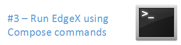

Now that you have the EdgeX Foundry Docker Compose file, you are ready to run EdgeX Foundry. Follow these steps to get the container images and start EdgeX Foundry!

First, unless you downloaded docker-compose.yml, rename the Docker Compose file you downloaded to **"docker-compose.yml"**.  By default, Docker Compose looks for a file by this name when running all Docker Compose commands.  You could use the original file name, but it would require adding more arguments to the Docker Compose commands and creates more circumstances for errors.

Next, open a command terminal to the Docker Compose file location - that is where you download the EdgeX Foundry docker-compose.yml file above.  On some operating systems, there is a special Docker Terminal.  On other platforms, Docker and Docker Compose can be run from a normal terminal window.  See the Docker documentation for more help running Docker and Docker Compose commands on your platform.

Now run the following command in the terminal (in the order provided here.  Because some containers are dependent on others, a suggested wait time is provided before starting the next command.  Note that the actual wait time may vary based on the size and performance of your system.  More advanced users may want to check the notes below to see how to watch the container logs to know when the next container can be started without the wait time.  More advanced users can also script the startup to avoid manual execution of the steps after the wait time.

+------------------------------------+-------------------------------------------------------------------------------------+------------------------------------------------+
|   **Docker Command**               |   **Description**                                                                   |  **Suggested Waiti Time After Completing**     |
+====================================+=====================================================================================+================================================+
| **docker-compose pull**            |  Pull down, but don't start, all the EdgeX Foundry microservices                    | Docker Compose will indicate when all the      |
|                                    |                                                                                     | containers have been pulled successfully       |     
+------------------------------------+-------------------------------------------------------------------------------------+------------------------------------------------+
| docker-compose up -d volume        |  Start the EdgeX Foundry file volume--must be done before the other services are    | A couple of seconds.  In the time it takes to  |
|                                    |  started                                                                            | type the next command it shoud be ready.       |   
+------------------------------------+-------------------------------------------------------------------------------------+------------------------------------------------+
| docker-compose up -d consul        |  Start the configuration and registry microservice which all services must          | A couple of seconds                            |
|                                    |  register with and get their configuration from                                     |                                                | 
+------------------------------------+-------------------------------------------------------------------------------------+------------------------------------------------+
| docker-compose up -d config-seed   |  Populate the configuration/registry microservice                                   | A couple of seconds                            |
+------------------------------------+-------------------------------------------------------------------------------------+------------------------------------------------+
| docker-compose up -d mongo         |  Start the NoSQL MongoDB container                                                  | 10 seconds                                     | 
+------------------------------------+-------------------------------------------------------------------------------------+------------------------------------------------+
| docker-compose up -d logging       |  Start the logging microservice - used by all micro services that make log entries  | A couple of seconds                            | 
+------------------------------------+-------------------------------------------------------------------------------------+------------------------------------------------+
| docker-compose up -d notifications |  Start the notifications and alerts microservice--used by many of the microservices | 30 seconds                                     |
|                                    |  Note: this service is still implemented in Java and takes more time to start       |                                                |
+------------------------------------+-------------------------------------------------------------------------------------+------------------------------------------------+
| docker-compose up -d metadata      |  Start the Core Metadata microservice                                               | A couple of seconds                            | 
+------------------------------------+-------------------------------------------------------------------------------------+------------------------------------------------+
| docker-compose up -d data          |  Start the Core Data microservice                                                   | A couple of seconds                            | 
+------------------------------------+-------------------------------------------------------------------------------------+------------------------------------------------+
| docker-compose up -d command       |  Start the Core Command microservice                                                | A couple of seconds                            | 
+------------------------------------+-------------------------------------------------------------------------------------+------------------------------------------------+
| docker-compose up -d scheduler     |  Start the scheduling microservice -used by many of the microservices               | 1 minute                                       |
|                                    |  Note: this service is still implemented in Java and takes more time to start       |                                                |
+------------------------------------+-------------------------------------------------------------------------------------+------------------------------------------------+
| docker-compose up -d export-client |  Start the Export Client registration microservice                                  | A couple of seconds                            |
+------------------------------------+-------------------------------------------------------------------------------------+------------------------------------------------+
| docker-compose up -d export-distro |  Start the Export Distribution microservice                                         | A couple of seconds                            |
+------------------------------------+-------------------------------------------------------------------------------------+------------------------------------------------+
| docker-compose up -d rulesengine   |  Start the Rules Engine microservice                                                | 1 minute                                       |
|                                    |  Note: this service is still implemented in Java and takes more time to start       |                                                |
+------------------------------------+-------------------------------------------------------------------------------------+------------------------------------------------+
| docker-compose up -d device-virtual|  Start the virtual device service                                                   | 1 minute                                       |
|                                    |  Note: this service is still implemented in Java and takes more time to start       |                                                |
|                                    |  This service mocks a sensor sending data to EdgX and is used for demonstration     |                                                |
+------------------------------------+-------------------------------------------------------------------------------------+------------------------------------------------+

Run a **"docker-compose ps"** command to confirm that all the containers have been downloaded and started.  (Note: initialization or seed containers, like config-seed, will have exited as there job is just to initialize the associated service and then exit.)

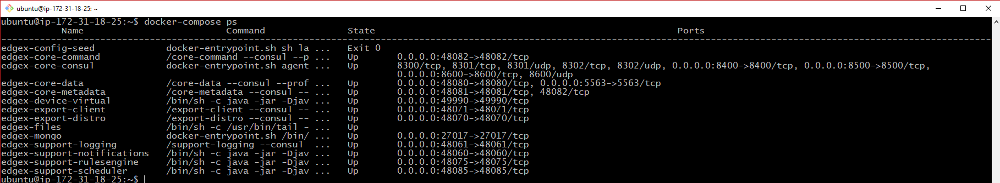

=============================
Stop and Remove EdgeX Foundry
=============================
To stop and deconstruct (remove) all the EdgeX Foundry containers, call on **"docker-compose down"**.  Docker shows the containers being stopped and then removed.  Note, you may wish to stop (versus stop and remove) all the EdgeX Containers.  See more details in the Advanced EdgeX Foundry User Command below.

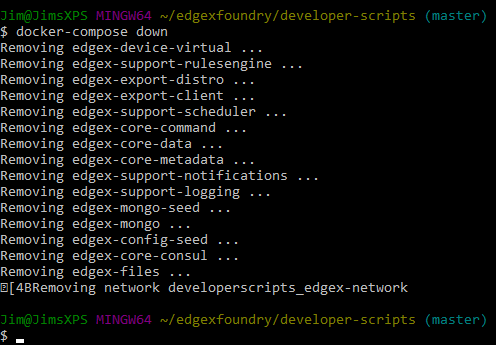

After this operation, calling docker-compose ps shows no running or available containers.

.. image:: EdgeX_GettingStartedUsrNoContainers.png

====================================
Advanced EdgeX Foundry User Commands
====================================
After you have mastered obtaining and running EdgeX Foundry, you may want to take more control of EdgeX Foundry microservices.  These commands provide you the ability to do that.
Pull Images

Use **"docker-compose pull"** to download all the container images listed in the Compose file.  The **"docker-compose pull [compose-container-name]"** to download a specific container image name from the Compose file.  Here, the Export Client image is being pulled.

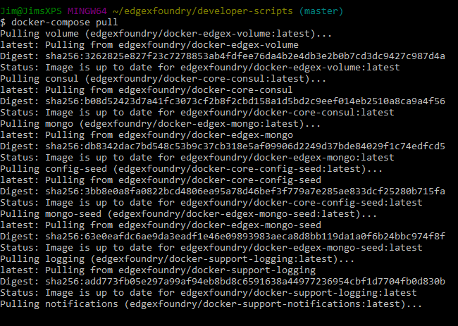

To get a list of the Docker Compose names of the containers (as they are in the docker-compose.yml file), run **"docker-compose config --services"** as shown below.

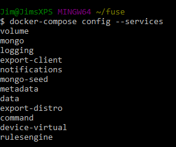

**Start Containers**

Use **"docker-compose start"** to re-start all the containers (after a stop) ...

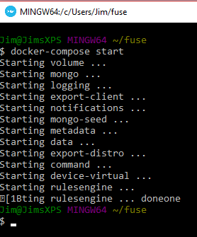

or **"docker-compose start [compose-container-name]"** to start an individual container (after that container has been stopped).  Here, the volume container is started.

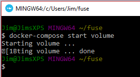

If you have stopped a specific container and updated its image (with **docker-compose pull** above), this command allows you to recreate/start the image without affect to other containers.

**Stop Containers**

To stop an individual container, you can use **docker-compose stop [compose-container-name]**.  Below the rulesengine container is stopped.  Stopped containers can be started again (using docker-compose start above) versus docker-compose down with stops all the containers and then destroys/removes all the containers.

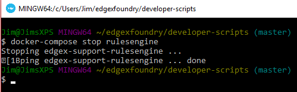

To stop (but not remove) all containers, issue **docker-compose stop**.

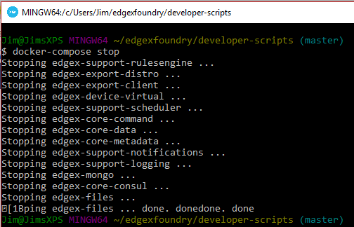

The docker-compose down command stops and then removes all the containers, whereby docker-compose stop just stops the container(s) but does not remove the container image.  For example, if your run **docker ps -a** after a **docker-compose stop**, you would still see the container images in an "exited" state.

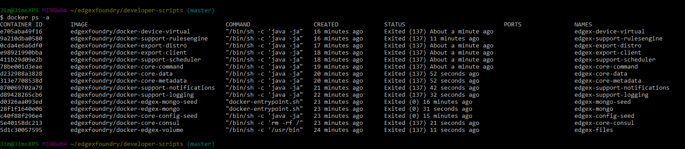

====================================
Checking the Status of EdgeX Foundry
====================================

-----------------------------
Docker Container Status Check
-----------------------------
As shown above, from the terminal, use **docker-compose ps** to get a list of the containers that exist and are running.  In additiona, the standard docker command (**docker ps -a**) can also provide the list of running containers.

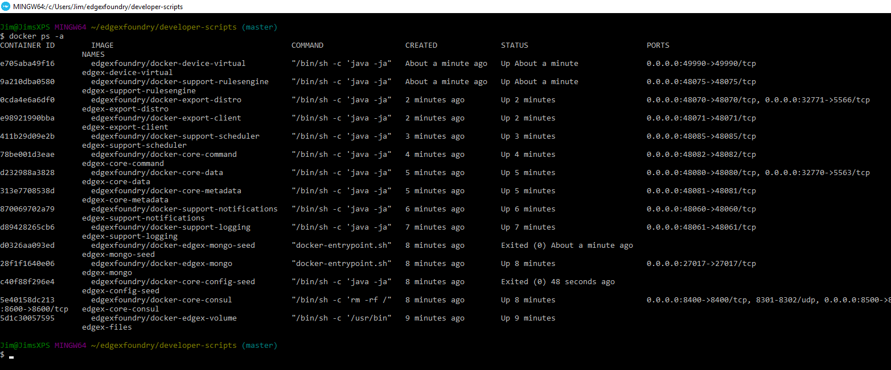

The standard docker command (**docker ps -a**) command also indicates when the container was started, how long it has been running, and many other details.  You can use a --format option to retain only the pertinent information in your list.  See here for more details on formatting the list of containers.

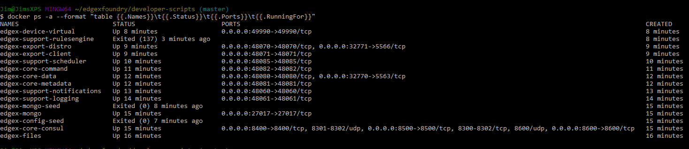

The status above was created using **"docker ps -a --format "table {{.Names}}\t{{.Status}}\t{{.Ports}}\t{{.RunningFor}}"**

**EdgeX Foundry Container Logs**

To view the log of any container, use the command **"docker-compose logs -f [compose-contatainer-name]"**.  The example below shows the log for the data container.

.. image:: EdgeX_GettingStartedUsrLogs.png

When you are done reviewing the content of the log, select **Control-c** to stop the output to your terminal.

**Microservice Ping Check**

Each EdgeX Foundry microservice has been built to respond to a "ping" HTTP request. A ping request or ping utility is used in networking environments to check the reach-ability of a network resource (see here).  EdgeX Foundry uses the same concept to check the availability or reach-ability of a microservice resource. After the EdgeX Foundry microservice containers are running, you can "ping" any one of the microservices to check that it is running. Open a browser or HTTP REST client tool and use the service's ping address (http://[host]:[port]/api/v1/ping) to see if it is available. Below, the Core Data microservice is "pinged."

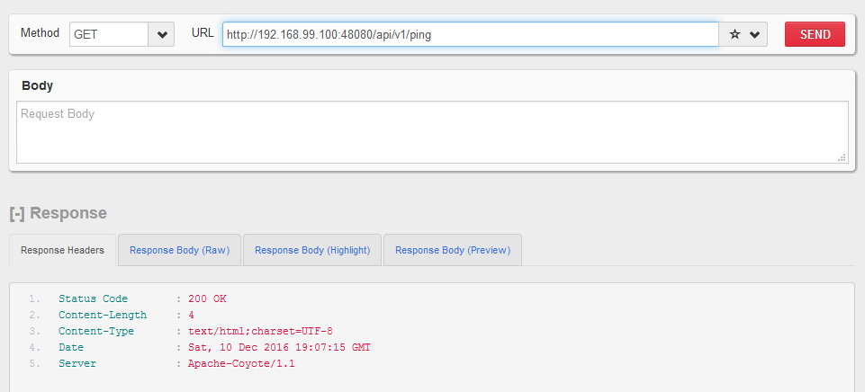

Below is a list of the EdgeX Foundry microservices, their ports, and "ping" URLs.

+---------------------------------+------------------------------+----------------------------+-------------+-----------------------------------+
| **EdgeX Foundry MicroService**  | **Docker Compose Container** | **Container Name**         | **Port**    |  **Ping URL**                     |
+=================================+==============================+============================+=============+===================================+
| Core Command                    |  command                     | edgex-core-command         | 48082       | http://[host]:48082/api/v1/ping   |    
+---------------------------------+------------------------------+----------------------------+-------------+-----------------------------------+
| Core Data                       |  data                        | edgex-core-data            | 48080       | http://[host]:48080/api/v1/ping   |    
+---------------------------------+------------------------------+----------------------------+-------------+-----------------------------------+
| Core Metadata                   |  metadata                    | edgex-core-metadata        | 48081       | http://[host]:48081/api/v1/ping   |    
+---------------------------------+------------------------------+----------------------------+-------------+-----------------------------------+
| Export Client                   |  export-client               | edgex-export-client        | 48071       | http://[host]:48071/api/v1/ping   |    
+---------------------------------+------------------------------+----------------------------+-------------+-----------------------------------+
| Export Distribution             |  export-distro               | edgex-export-distro        | 48070       | http://[host]:48070/api/v1/ping   |    
+---------------------------------+------------------------------+----------------------------+-------------+-----------------------------------+
| Rules Engine                    |  rulesengine                 | edgex-support-rulesengine  | 48075       | http://[host]:48075/api/v1/ping   |    
+---------------------------------+------------------------------+----------------------------+-------------+-----------------------------------+
| Support Logging                 |  logging                     | edgex-support-logging      | 48061       | http://[host]:48061/api/v1/ping   |    
+---------------------------------+------------------------------+----------------------------+-------------+-----------------------------------+
| Support Notifications           |  notifications               | edgex-support-notifications| 48060       | http://[host]:48060/api/v1/ping   |    
+---------------------------------+------------------------------+----------------------------+-------------+-----------------------------------+
| Virtual Device Service          |  device-virtual              | edgex-device-virtual       | 49990       | http://[host]:49990/api/v1/ping   |    
+---------------------------------+------------------------------+----------------------------+-------------+-----------------------------------+

The "host" address for the URLs above is determined by the Docker Engine. The default Docker Engine IP address varies by operating system (this can be configured on your system-see the Docker documentation for details).

-----------------------------
EdgeX Foundry Consul Registry
-----------------------------
EdgeX Foundry uses the open source Consul project as its registry service. All EdgeX Foundry microservices are expected to register with the Consul registry as they come up. Going to Consul's dashboard UI enables you to see which services are up. Find the Consul UI at http://[host]:8500/ui.

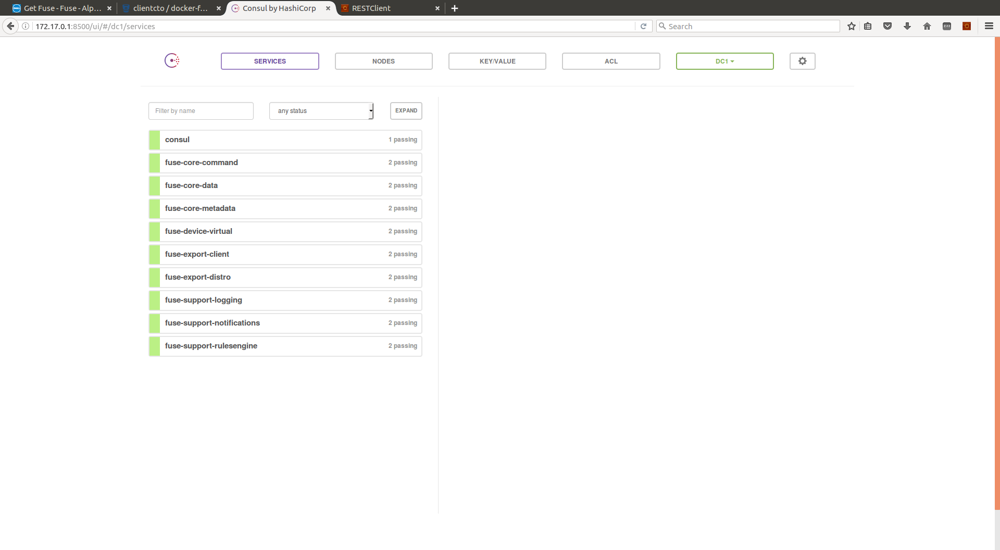
