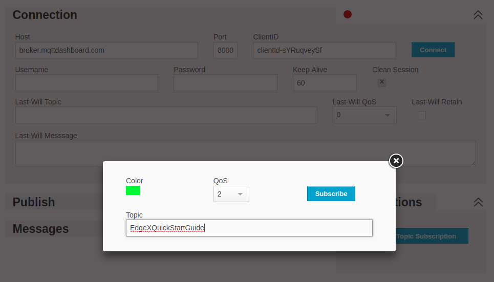

###############
Quick Start
###############

This guide will get EdgeX up and running on your development machine in as little as 5 minutes. We will will skip over lengthy descriptions for now, you can read up on those later. The goal here is to get you a working IoT Edge stack, from device to cloud, as simply as possible.

=====
Setup
=====

The fastest way to start running EdgeX is by using our pre-built Docker images. To use them you'll need to install the following:

* `Docker <https://docs.docker.com/install/>`_
* `Docker Compose <https://docs.docker.com/compose/install/>`_

=============
Running EdgeX
=============

Once you have Docker and Docker Compose installed, you need the configuration file for downloading and running the EdgeX Foundry docker containers. Download the `latest docker-compose file here <https://github.com/edgexfoundry/developer-scripts/raw/master/compose-files/docker-compose-delhi-0.7.1.yml>`_ and save this as ``docker-compose.yml`` in your local directory. This file contains everything you need to deploy EdgeX with docker.

First, use this command to download the EdgeX Foundry Docker images from Docker Hub::

    docker-compose pull

Then start up all of the EdgeX Foundry microservices::

    docker-compose up -d

Finally, verify that the EdgeX containers have all been started::

    docker-compose ps 

**Note:** *Initialization or seed containers, like config-seed, will have exited as their job is just to initialize the associated service and then exit.*

.. image:: EdgeX_GettingStartedUsrActiveContainers.png

===================
Connecting a Device
===================

EdgeX Foundry provides a `Random Number Device Service <https://github.com/edgexfoundry/device-random>`_ which is useful to testing, it returns a random number within a configurable range. Configuration for running this service was included in the `docker-compose.yml` file you downloaded at the start of this guide, but it is disabled by default. To enable it, uncomment the following lines in your `docker-compose.yml`::

    device-random:
      image: edgexfoundry/docker-device-random-go:0.7.1
      ports:
        - "49988:49988"
      container_name: edgex-device-random
      hostname: edgex-device-random
      networks:
        - edgex-network
      volumes:
        - db-data:/data/db
        - log-data:/edgex/logs
        - consul-config:/consul/config
        - consul-data:/consul/data
      depends_on:
        - data
        - command

Then you can start the Random Device Service with::

    docker-compose up -d device-random

The Device Service will automatically register a device named `Random-Integer-Generator01`, which will start sending its random number readings into EdgeX.

You can verify that those readings are being sent by querying the EdgeX Logging service::

    curl http://localhost:48080/api/v1/event/device/Random-Integer-Generator01/10

=========================
Connecting an Application
=========================

EdgeX provides exporters for a variety of cloud services and application. To keep this guide simple, we're going to use a public MQTT broker hosted by HiveMQ, then watch for our EdgeX readings to be pushed to it automatically.

To register the application as an export client, run::

    curl -X POST -d '{
        "name":"QuickStartExport",
        "addressable":{
            "name":"HiveMQBroker",
            "protocol":"tcp",
            "address":"broker.hivemq.com",
            "port":1883,
            "publisher":"EdgeXExportPublisher",
            "topic":"EdgeXQuickStartGuide"
        },
        "format":"JSON",
        "filter":{
            "deviceIdentifiers":["Random-Integer-Generator01"]
        },
        "enable":true,
        "destination":"MQTT_TOPIC"
    }' http://localhost:48071/api/v1/registration
    

You can connect to this broker with any MQTT client to watch the data being sent. HiveMQ provides a `web-based client <http://www.hivemq.com/demos/websocket-client/>`_ that you can use, simply subscribe to the "EdgeXQuickStartGuide" topic and you will begin seeing your random number readings.

You can also use the `Mosquitto CLI <https://mosquitto.org/download/>`_ tool to verify that readings are being sent by running::

    mosquitto_sub -h broker.hivemq.com -p 1883 -t EdgeXQuickStartGuide

======================
Controlling the Device
======================

Reading data from devices is only part of what EdgeX is capable of, you can also use it to control your devices. When a device is registered with the EdgeX services, it provides a `Device Profile <Ch-DeviceProfile.html>`_ that describes both the data readings available from that device, and also the commands that can be called to control it. 

When our Random Number Device Service registered the device `Random-Integer-Generator01`, it used a `profile <https://github.com/edgexfoundry/device-random/blob/master/cmd/res/device.random.yaml>`_ which defines commands for changing the minimum and maximum values for the random numbers it will generate.

You won't call commands on devices directly, instead you use the EdgeX Foundry :doc:`./Ch-Command` Service to do that. The first step is to check what commands are available to be called by asking the Command service about your device::

    curl http://localhost:48082/api/v1/device/name/Random-Integer-Generator01

This will return a lot of JSON, because there are a number of commands you can call on this device, but the one we're going to try in this guide in will look something like this::

    {
        "created":1544456741615,
        "modified":0,
        "origin":0,
        "id":"5c0e8a259f8fc20001a5d22b",
        "name":"GenerateRandomValue_Int8",
        "get":{
            "path":"/api/v1/device/{deviceId}/GenerateRandomValue_Int8",
            "responses":[
                {
                    "code":"200",
                    "description":null,
                    "expectedValues":[
                    "RandomValue_Int8"
                    ]
                },
                {
                    "code":"503",
                    "description":"service unavailable",
                    "expectedValues":[

                    ]
                }
            ],
            "url":"http://edgex-core-command:48082/api/v1/device/5c0e8a259f8fc20001a5d230/command/5c0e8a259f8fc20001a5d22b"
        },
        "put":{
            "path":"/api/v1/device/{deviceId}/GenerateRandomValue_Int8",
            "responses":[
                {
                    "code":"200",
                    "description":null,
                    "expectedValues":[

                    ]
                },
                {
                    "code":"503",
                    "description":"service unavailable",
                    "expectedValues":[

                    ]
                }
            ],
            "parameterNames":[
                "Min_Int8",
                "Max_Int8"
            ],
            "url":"http://edgex-core-command:48082/api/v1/device/5c0e8a259f8fc20001a5d230/command/5c0e8a259f8fc20001a5d22b"
        }
    }

**Note:** *The URLs won't be exactly the same for you, as the generated unique IDs for both the Device and the Command will be different. So be sure to use your values for the following steps.*

You'll notice that this one command has both a **get** and a **put** option. The **get** call will return a random number, and is what is being called automatically to send data into the rest of EdgeX. You can also call it manually using the **get** URL provided::

    curl http://localhost:48082/api/v1/device/5c0e8a259f8fc20001a5d230/command/5c0e8a259f8fc20001a5d22b

Notice that I replaced **edgex-core-command** with **localhost** here. That's because the EdgeX Foundry services are running in docker, which recognizes the internal hostname **edgex-core-command**, but I'm calling it from outside of docker, so I have to use **locahost** to reach it.

This command will return a JSON result that looks like this::

    {
        "id":"",
        "pushed":0,
        "device":"Random-Integer-Generator01",
        "created":0,
        "modified":0,
        "origin":1544457033233,
        "schedule":null,
        "event":null,
        "readings":[
            {
                "id":"",
                "pushed":0,
                "created":0,
                "origin":1544457033233,
                "modified":0,
                "device":"Random-Integer-Generator01",
                "name":"RandomValue_Int8",
                "value":"-92"
            }
        ]
    }

The default range for this reading is -128 to 127. We can limit that to only positive values between 0 and 100 by calling the command as a **put** method with new minimum and maximum values::

    curl -X PUT -d '[
        {"Min_Int8": "0", "Max_Int8": "100"}
    ]' http://localhost:48082/api/v1/device/5c0e8a259f8fc20001a5d230/command/5c0e8a259f8fc20001a5d22b

**Note:** *You can make multiple requests to a Command with a single call, so your paramters need to be in an array (surrounded by [ ] ) as shown above. The parameter names were given in the **put** section of the Command definition we queried at the start of this section.*

Now every time we call **get** on this command, the returned value will be between 0 and 100.

==========
Next Steps
==========

Congratulations! You now have a full EdgeX deployment reading data from a (virtual) device and publishing it to the cloud, and you were able to control your device through commands into EdgeX. 

It's time to continue your journey by reading the :doc:`Ch-Intro` to EdgeX Foundry, what it is and how it's built. From there you can take the :doc:`Ch-Walkthrough` to learn how the microservices work together to control devices and read data from them as you just did.
