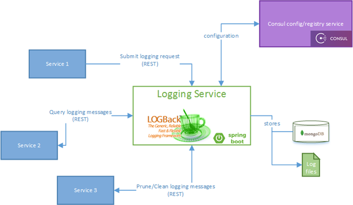
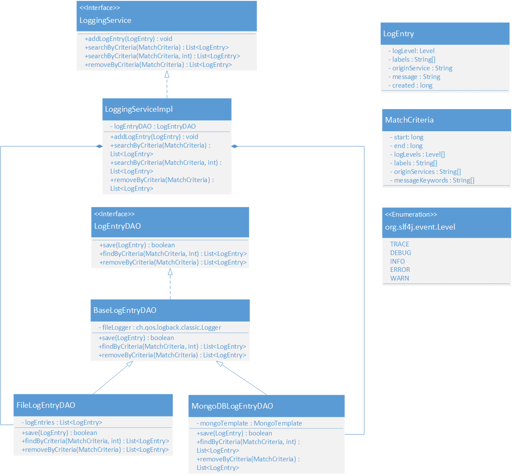
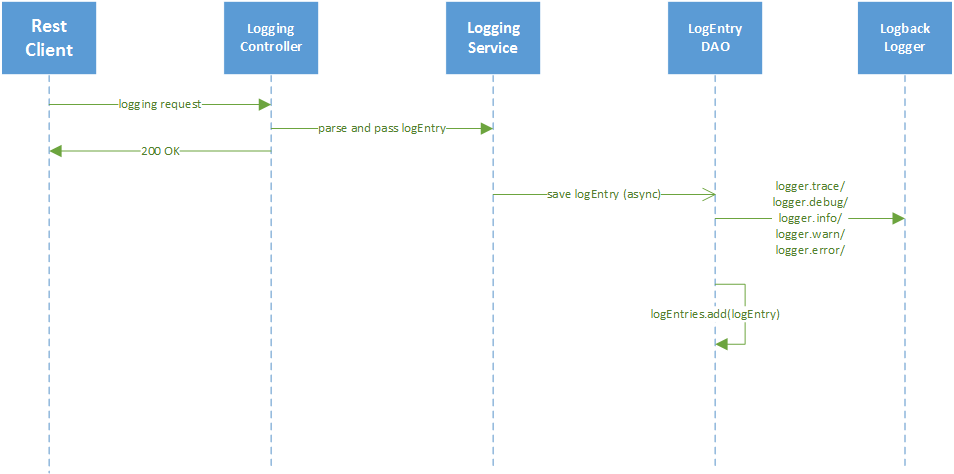
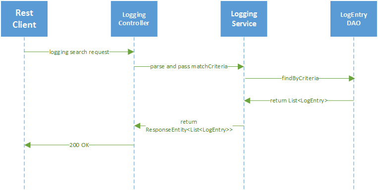
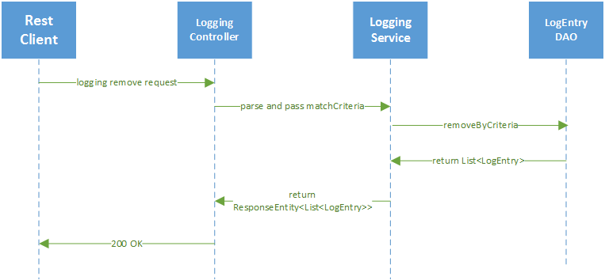
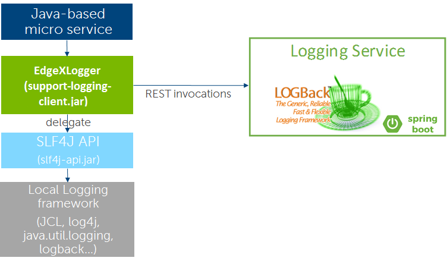
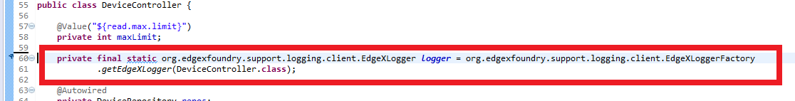
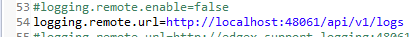
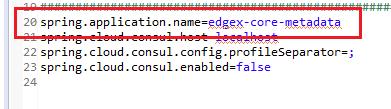

#######
Logging
#######

.. image:: EdgeX_SupportingServicesLogging.png

============
Introduction
============

Logging is critical for all modern software applications. Proper logging provides the users with the following benefits:

* Able to monitor and understand what systems are doing
* Able to understand how services interact with each other
* Problems are detected and fixed quickly
* Performance is improved

The graphic shows the high-level design architecture of EdgeX Foundry including the Logging Service.

===========================
Minimum Product Feature Set
===========================

1. Provides a RESTful API for other microservices to request log entries with the following characteristics:

* The RESTful calls should be non-blocking—meaning calling services should fire logging requests without waiting for any response from the log service—to achieve minimal impact to the speed and performance to the services.
* Support multiple logging levels, for example trace, debug, info, warn, error, fatal, and so forth.
* Support the log entry tagging; tags can be anything dictated by the calling services.
* Each log entry should be associated with its originating service.

2. Provide RESTful APIs to query, clear, or prune log entries based on any combination of following parameters:

* Timestamp from
* Timestamp to
* Log level
* Tag
* Originating service

3. Log entries should be persisted in either file or database, and the persistence storage should be managed at configurable levels
4. Take advantage of an existing logging framework internally and provide the “wrapper” for use by EdgeX Foundry
5. Follow applicable standards for logging where possible and not onerous to use on the gateway

==============================
High Level Design Architecture
==============================

The above diagram shows the high-level architecture for EdgeX Foundry Logging Service, which uses the Spring Boot Application Framework. Other microservices interact with EdgeX Foundry Logging Service through RESTful APIs to submit their logging requests, query historical logging, and remove historical logging. Internally, EdgeX Foundry Logging Service utilizes LOGBack as its underneath logging framework. Two configurable persistence options exist supported by EdgeX Foundry Logging Service: file or MongoDB. 

==========
Data Model
==========

===============
Data Dictionary
===============

+---------------------+--------------------------------------------------------------------------------------------+
|   **Class Name**    |   **Descrption**                                                                           | 
+=====================+============================================================================================+
| LogEntry            | The object describing a particular log message including origin, severity, and content.    | 
+---------------------+--------------------------------------------------------------------------------------------+
| MatchCriteria       | The object describing the search parameters for a log query.                               | 
+---------------------+--------------------------------------------------------------------------------------------+

===============================
High Level Interaction Diagrams
===============================

This section shows the sequence diagrams for EdgeX Foundry Logging Service.

**Sequence Diagram for Logging Request**

**Sequence Diagram for Query Historical Logging**

**Sequence Diagram for Removing Historical Logging**

========================
Configuration Properties
========================

+---------------------------------------------------------+-------------------------------------+---------------------------------------------------------------------------+
|   **Configuration**                                     |   **Default Value**                 |  **Dependencies**                                                         |
+=========================================================+=====================================+===========================================================================+
| Writable Persistence                                    | database                        \*  | "file" to save logging in file;                                           |
|                                                         |                                     | "database" to save logging in MongoDB                                     |
+---------------------------------------------------------+-------------------------------------+---------------------------------------------------------------------------+
| Writable LogLevel                                       | INFO                            \*  | Logs messages set to a level of "INFO" or higher                          |
+---------------------------------------------------------+-------------------------------------+---------------------------------------------------------------------------+
| Service ReadMaxLimit                                    | 100                            \**  | Read data limit per invocation                                            |
+---------------------------------------------------------+-------------------------------------+---------------------------------------------------------------------------+
| Service BootTimeout                                     | 300000                         \**  | Heart beat time in milliseconds                                           |
+---------------------------------------------------------+-------------------------------------+---------------------------------------------------------------------------+
| Service StartupMsg                                      | Logging Service heart beat     \**  | Heart beat message                                                        |
+---------------------------------------------------------+-------------------------------------+---------------------------------------------------------------------------+
| Service Port                                            | 48061                          \**  | Micro service port number                                                 |
+---------------------------------------------------------+-------------------------------------+---------------------------------------------------------------------------+
| Service Host                                            | localhost                      \**  | Micro service host name                                                   |
+---------------------------------------------------------+-------------------------------------+---------------------------------------------------------------------------+
| Service Protocol                                        | http                           \**  | Micro service host protocol                                               |
+---------------------------------------------------------+-------------------------------------+---------------------------------------------------------------------------+
| Service ClientMonitor                                   | 15000                          \**  | The interval in milliseconds at which any service clients will            |
|                                                         |                                     | refresh their endpoint information from the service registry (Consul)                                                                          |
+---------------------------------------------------------+-------------------------------------+---------------------------------------------------------------------------+
| Service CheckInterval                                   | 10s                            \**  | The interval in seconds at which the service registry (Consul) will       |
|                                                         |                                     | conduct a health check of this service.                                   |
+---------------------------------------------------------+-------------------------------------+---------------------------------------------------------------------------+
| Service Timeout                                         | 5000                           \**  | Specifies a timeout (in milliseconds) for handling requests               |                                                                       |
+---------------------------------------------------------+-------------------------------------+---------------------------------------------------------------------------+
| Following config only take effect when Writable.Persistence=file                                                                                                           | 
+---------------------------------------------------------+-------------------------------------+---------------------------------------------------------------------------+
| Logging File                                            | ./logs/edgex-support-logging.log    | File path to save logging entries                                         |
+---------------------------------------------------------+-------------------------------------+---------------------------------------------------------------------------+
| Following config only take effect when logging.persistence=database                                                                                                       |
+---------------------------------------------------------+-------------------------------------+---------------------------------------------------------------------------+
| Databases Database Primary Username                     | [empty string]                 \**  | DB user name                                                              |
+---------------------------------------------------------+-------------------------------------+---------------------------------------------------------------------------+
| Databases Database Password                             | [empty string]                 \**  | DB password                                                               |
+---------------------------------------------------------+-------------------------------------+---------------------------------------------------------------------------+
| Databases Database Host                                 | localhost                      \**  | DB host name                                                              |
+---------------------------------------------------------+-------------------------------------+---------------------------------------------------------------------------+
| Databases Database Port                                 | 27017                          \**  | DB port number                                                            |
+---------------------------------------------------------+-------------------------------------+---------------------------------------------------------------------------+
| Databases Database Database                             | logging                        \**  | database or document store name                                           |
+---------------------------------------------------------+-------------------------------------+---------------------------------------------------------------------------+
| Databases Database Timeout                              | 5000                           \**  | DB connection timeout                                                     |
+---------------------------------------------------------+-------------------------------------+---------------------------------------------------------------------------+
| Databases Database Type                                 | mongodb                        \**  | DB type                                                                   |
+---------------------------------------------------------+-------------------------------------+---------------------------------------------------------------------------+
| Following config only take effect when connecting to the registry for configuraiton info                                                                                  |
+---------------------------------------------------------+-------------------------------------+---------------------------------------------------------------------------+
| Registry Host                                           | localhost                      \**  | Registry host name                                                        |
+---------------------------------------------------------+-------------------------------------+---------------------------------------------------------------------------+
| Registry Port                                           | 8500                           \**  | Registry port number                                                      |
+---------------------------------------------------------+-------------------------------------+---------------------------------------------------------------------------+
| Registry Type                                           | consul                         \**  | Registry implementation type                                              |
+---------------------------------------------------------+-------------------------------------+---------------------------------------------------------------------------+

| \*means the configuration value can be changed if necessary.
| \**means the configuration value has to be replaced.
| \***means the configuration value should NOT be changed.

====================================================
Logging Service Client Library for Java (Deprecated)
====================================================

As most of EdgeX Foundry microservices are implemented in Java, we provide a Client Library for Java, so that Java-based microservices could directly switch their Loggers to use EdgeX Foundry Logging Service.  The next graphic shows the high-level design architecture for the Java Client Library.

For a Java-based microservice, follow 4 steps to use Client Library for Java:

1. Add support-logging-client as the maven dependency in pom.xml  
2. Switch your local logger to org.edgexfoundry.support.logging.client.EdgeXLogger

3. Add mandatory configuration into properties,  e.g.  src/main/resources/application.properties,  src/test/resources/application.properties,  config folders(docker and non-docker) of config-seed project, application.properties under docker-* Bitbucket repositories 

4. As logging-client would pick up "spring.application.name" as originService when submitting remote logging request, make sure you add proper name for such property; otherwise, logging-client would use "unknown" as default value.

Your application will need an SLF4J implementation.  If you are using Spring Boot as part of your project, this automatically brings in an SLF4J implementation into project.  In fact, you may find multiple implementations are brought into the project and you will have to use <exclusion> elements into the pom.xml to constrain the implementations used by the project.  See core-metadata's pom.xml for an example.  In the case where your project has no implementation, you will need to add one to the pom.xml in addition to the support-logging-client.  So, for example, if you create a simple Maven project (using no other frameworks/libraries other than support-logging-client) then you will also need to add some minimal SLF4J implementation.  Here is a simple set of dependencies to achieve a working logging implementation using support-logging-client.

::

   <properties>
   	   <support-logging-client.version>1.0.0-SNAPSHOT</support-logging-client.version>
   </properties>

   <dependencies>
      	   <dependency>
		   <groupId>org.edgexfoundry</groupId>
		   <artifactId>support-logging-client</artifactId>
		   <version>${support-logging-client.version}</version>
	   </dependency>
	   <dependency>
		   <groupId>org.slf4j</groupId>
		   <artifactId>slf4j-simple</artifactId>
		   <version>1.8.0-alpha2</version>
	   </dependency>
   </dependencies>

Without the SLF4J implementation (in this case slf4j-simple), you will see errors like that below:

::

  SLF4J: Failed to load class "org.slf4j.impl.StaticLoggerBinder".
  SLF4J: Defaulting to no-operation (NOP) logger implementation
  SLF4J: See http://www.slf4j.org/codes.html#StaticLoggerBinder for further details.

==================
EdgeX Logging Keys
==================
Within the Edgex Go reference implementation, log entries are currently written as a set of key/value pairs. We may change this later to be more of a struct type than can be formatted according to the user’s requirements (JSON, XML, system, etc). In that case, the targeted struct should contain properties that support the keys utilized by the system and described below.

+-----------------------------------------------+---------------------------------------------------------------------------------------+
|   **Key**                                     |   **Intent*                                                                           |
+===============================================+=======================================================================================+
| level                                         | Indicates the log level of the individual log entry (INFO, DEBUG, ERROR, etc)         |
+-----------------------------------------------+---------------------------------------------------------------------------------------+
| ts                                            | The timestamp of the log entry, recorded in UTC                                       |
+-----------------------------------------------+---------------------------------------------------------------------------------------+
| app                                           | This should contain the service key of the service writing the log entry              |
+-----------------------------------------------+---------------------------------------------------------------------------------------+
| source                                        | The file and line number where the log entry was written                              |
+-----------------------------------------------+---------------------------------------------------------------------------------------+
| msg                                           | A field for custom information accompanying the log entry. You do not need to         |
|                                               | specify this explicitly as it is the first parameter when calling one of the          |
|                                               | LoggingClient’s functions.                                                            |
+-----------------------------------------------+---------------------------------------------------------------------------------------+
| correlation-id                                | Records the correlation-id header value that is scoped to a given request.            |
|                                               | It has two sub-ordinate, associated fields (see below).                               |
+-----------------------------------------------+---------------------------------------------------------------------------------------+
| correlation-id path                           | This field records the API route being requested and is utilized when the             |
|                                               | service begins handling a request.                                                    |
|                                               | \* Example: path=/api/v1/event                                                        |
|                                               | When beginning the request handling, by convention set “msg” to “Begin request”.      |
+-----------------------------------------------+---------------------------------------------------------------------------------------+
| correlation-id duration                       | This field records the amount of time taken to handle a given request.                |
|                                               | When completing the request handling, by convention set “msg” to “Response complete”. |
+-----------------------------------------------+---------------------------------------------------------------------------------------+

Additional keys can be added as need warrants. This document should be kept updated to reflect their inclusion and purpose.

