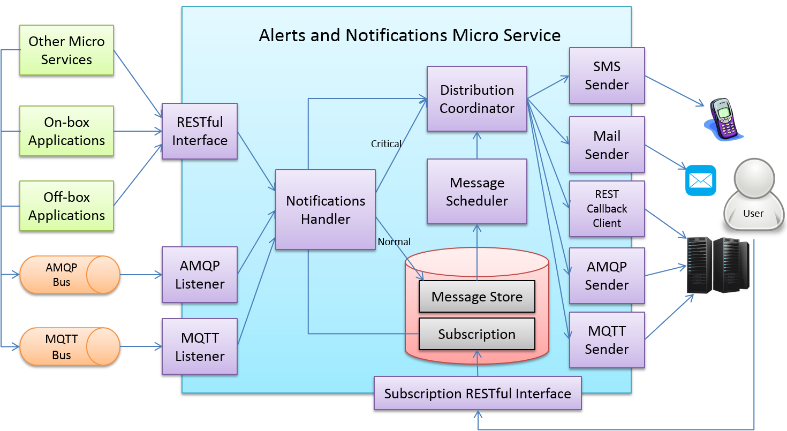
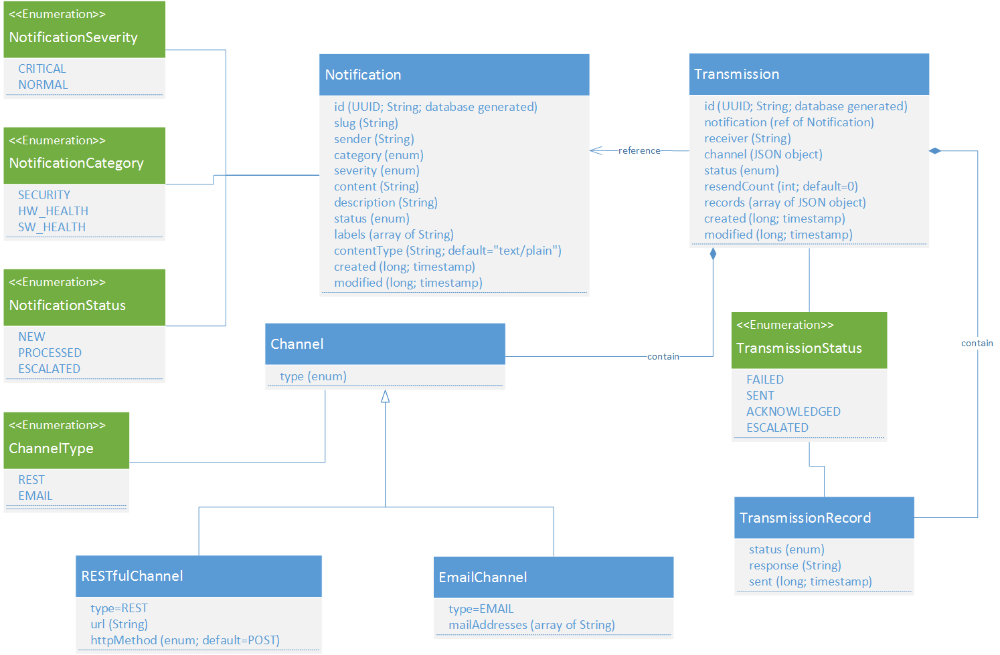
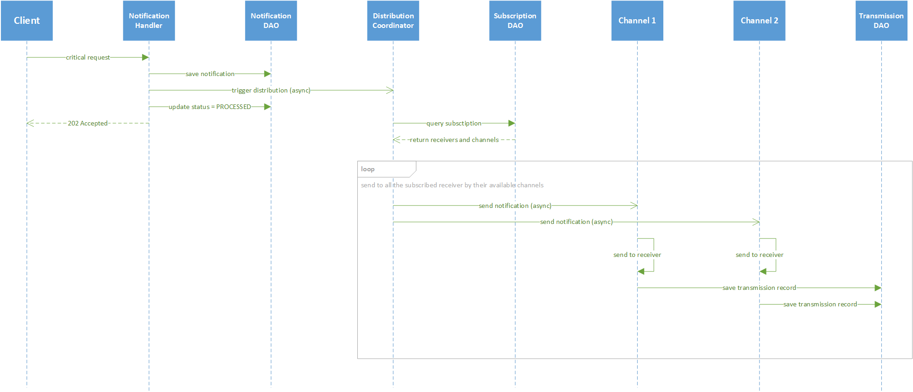
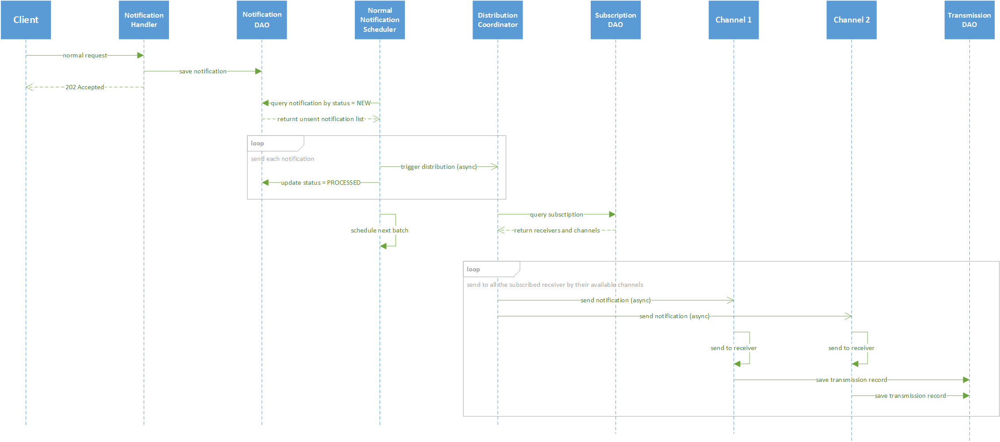
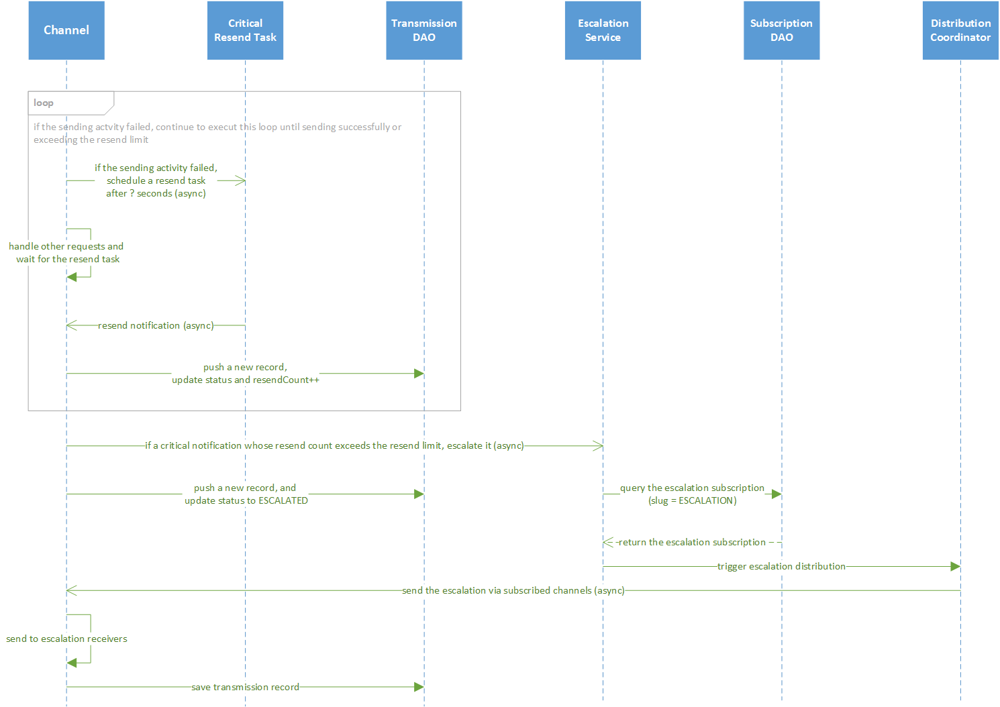
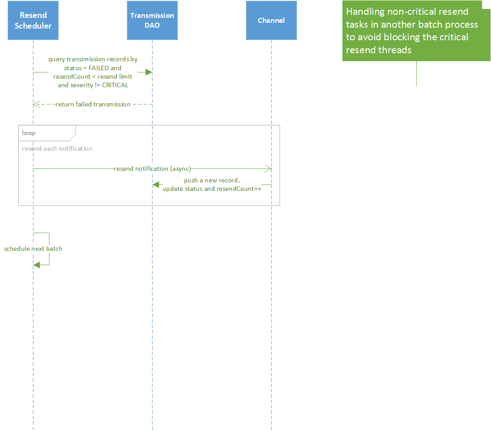
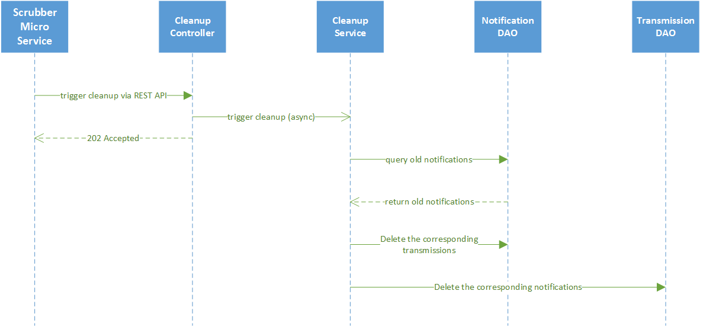

######################
Alerts & Notifications
######################

.. image:: EdgeX_SupportingServicesAlertsNotifications.png

============
Introduction
============

Introduction

When notification to another system or to a person, needs to occur to notify of something discovered on the node by another microservice, the Alerts and Notifications microservice delivers that information. Examples of Alerts and Notifications that other services could need to broadcast, include sensor data detected outside of certain parameters (usually detected by a Rules Engine service) or system or service malfunctions (usually detected by System Management services).
Terminology

**Notifications** are informative, whereas **Alerts** are typically of a more important, critical, or urgent nature, possibly requiring immediate action.

The diagram shows the high-level architecture of Alerts and Notifications. On the left side, the APIs are provided for other microservices, on-box applications, and off-box applications to use, and the APIs could be in REST, AMQP, MQTT, or any standard application protocols. Currently in EdgeX Foundry, the RESTful interface is provided.

On the right side, the notification receiver could be a person or an application system on Cloud or in a server room. By invoking the Subscription RESTful interface to subscribe the specific types of notifications, the receiver obtains the appropriate notifications through defined receiving channels when events occur. The receiving channels include SMS message, e-mail, REST callback, AMQP, MQTT, and so on.  Currently in EdgeX Foundry, e-mail and REST callback channels are provided.

When Alerts and Notifications receive notifications from any interface, the notifications are passed to the Notifications Handler internally. The Notifications Handler persists the receiving notification first, and passes them to the Distribution Coordinator immediately if the notifications are critical (severity = “CRITICAL”).  For normal notifications (severity = “NORMAL”), they wait for the Message Scheduler to process in batch. 

The Alerts and Notifications is scalable, can be expanded to add more severities and set up corresponding Message Schedulers to process them. For example, the Message Scheduler of normal severity notifications is triggered every two hours, and the minor severity notifications is triggered every 24 hours, at midnight each night.

When the Distribution Coordinator receives a notification, it first queries the subscription to acquire receivers who need to obtain this notification and their receiving channel information. According to the channel information, the Distribution Coordinator passes this notification to the corresponding channel senders.  Then, the channel senders send out the notifications to the subscribed receivers.

==========
Data Model
==========

MongoDB is selected for the persistence of Alerts and Notifications, so the data model design is without foreign key and based on the paradigm of document structure.

===============
Data Dictionary
===============

+---------------------+--------------------------------------------------------------------------------------------+
|   **Class Name**    |   **Descrption**                                                                           | 
+=====================+============================================================================================+
| Channel             | The object used to describe the Notification end point.                                    | 
+---------------------+--------------------------------------------------------------------------------------------+
| Notification        | The object used to describe the message and sender content of a Notification.              | 
+---------------------+--------------------------------------------------------------------------------------------+
| Transmission        | The object used for grouping of Notifications.                                             | 
+---------------------+--------------------------------------------------------------------------------------------+

===============================
High Level Interaction Diagrams
===============================

This section shows the sequence diagrams for some of the more critical or complex events regarding Alerts and Notifications.

**Critical Notifications Sequence**

When receiving a critical notification (SEVERITY = “CRITICAL”), it persists first and triggers the distribution process immediately. After updating the notification status, Alerts and Notifications respond to the client to indicate the notification has been accepted.

**Normal Notifications Sequence**

When receiving a normal notification (SEVERITY = “NORMAL”), it persists first and responds to the client to indicate the notification has been accepted immediately. After a configurable duration, a scheduler triggers the distribution process in batch.

**Critical Resend Sequence**

When encountering any error during sending critical notification, an individual resend task is scheduled, and each transmission record persists. If the resend tasks keeps failing and the resend count exceeds the configurable limit, the escalation process is triggered. The escalated notification is sent to particular receivers of a special subscription (slug = “ESCALATION”). 

**Resend Sequence**

For other non-critical notifications, the resend operation is triggered by a scheduler.

**Cleanup Sequence**

Cleanup service removes old notification and transmission records.

========================
Configuration Properties
========================

The default configuration file is in the  /src/main/resources folder of source code. When cooperating with the Configuration Management microservice, the configuration would be under /config/iot-support-notifications name space in Consul Key/Value Store.

+---------------------------------------------------------+-------------------------------------+---------------------------------------------------------------------------+
|   **Configuration**                                     |   **Default Value**                 |  **Dependencies**                                                         |
+=========================================================+=====================================+===========================================================================+
| application.general.readLimit                           | 100                             \*  | Read data limit per invocation                                            |
+---------------------------------------------------------+-------------------------------------+---------------------------------------------------------------------------+
| application.general.resendLimit                         | 3                               \*  | Resend count limit                                                        |
+---------------------------------------------------------+-------------------------------------+---------------------------------------------------------------------------+
| application.general.schedulerPoolSize                   | 3                               \*  | Thread pool size of scheduler                                             |
+---------------------------------------------------------+-------------------------------------+---------------------------------------------------------------------------+
| spring.data.mongodb.username                            | notifications                  \**  | MongoDB user name                                                         |  
+---------------------------------------------------------+-------------------------------------+---------------------------------------------------------------------------+
| spring.data.mongodb.password                            | password                       \**  | MongoDB password                                                          | 
+---------------------------------------------------------+-------------------------------------+---------------------------------------------------------------------------+
| spring.data.mongodb.host                                | localhost                       \*  | MongoDB host name                                                         |  
+---------------------------------------------------------+-------------------------------------+---------------------------------------------------------------------------+
| spring.data.mongodb.port                                | 27017                           \*  | MongoDB port number                                                       | 
+---------------------------------------------------------+-------------------------------------+---------------------------------------------------------------------------+
| spring.data.mongodb.database                            | notifications                 \***  | MongoDB database name                                                     |
+---------------------------------------------------------+-------------------------------------+---------------------------------------------------------------------------+
| server.port                                             | 48060                           \*  | Micro service port number                                                 |  
+---------------------------------------------------------+-------------------------------------+---------------------------------------------------------------------------+
| spring.cloud.consul.discovery.healthCheckPath           | /api/v1/ping                  \***  | Health checking path for Service Registry                                 |
+---------------------------------------------------------+-------------------------------------+---------------------------------------------------------------------------+
| spring.mail.host                                        | <empty>                        \**  | Mail server (SMTP) host name                                              |
+---------------------------------------------------------+-------------------------------------+---------------------------------------------------------------------------+
| spring.mail.port                                        | 25                              \*  | Mail server (SMTP) port number                                            |
+---------------------------------------------------------+-------------------------------------+---------------------------------------------------------------------------+
| spring.mail.username                                    | <empty>                        \**  | Mail server (SMTP) user name                                              |
+---------------------------------------------------------+-------------------------------------+---------------------------------------------------------------------------+
| spring.mail.password                                    | <empty>                        \**  | Mail server (SMTP) password                                               |
+---------------------------------------------------------+-------------------------------------+---------------------------------------------------------------------------+
| spring.mail.properties.mail.smtp.ssl.enable             | true                            \*  | Whether enable SSL on mail server. If set to true, use SSL to connect     | 
|						          |	         	                | and use the SSL port. Set to false for the "smtp" protocol and true for   |
|                                                         |                                     | the "smtps" protocol.                                                     |
+---------------------------------------------------------+-------------------------------------+---------------------------------------------------------------------------+
| spring.mail.properties.mail.smtp.auth                   | true                            \*  | Whether authenticate the user on mail server. If set to true, attempt to  |
|                                                         |                                     | authenticate the user using the AUTH command.                             |
+---------------------------------------------------------+-------------------------------------+---------------------------------------------------------------------------+
| spring.mail.properties.mail.smtp.socketFactory.port     | 465                             \*  | Specify the port to connect to when using the specified socket factory.   |
|                                                         |                                     | If not set, the default port will be used.                                |
+---------------------------------------------------------+-------------------------------------+---------------------------------------------------------------------------+
| spring.mail.properties.mail.smtp.socketFactory.class    | javax.net.ssl.SSLSocketFactory \*** | Specify the name of a class that implements thjavax.net.SocketFactor      |
|                                                         |                                     | This class will be used to create SMTP sockets.                           |		   
+---------------------------------------------------------+-------------------------------------+---------------------------------------------------------------------------+
| spring.mail.properties.mail.smtp.socketFactory.fallback | false                         \***  | If set to true, failure to create a socket using the specified socket     | 
|                                                         |                                     | factory class will cause the socket to be created using the               |
|                                                         |                                     | java.net.Socket class.                                                    | 
+---------------------------------------------------------+-------------------------------------+---------------------------------------------------------------------------+
| application.mail.subject                                | [No Reply] Auto-send from Fuse  \*  | The default subject of mail channel.                                      |
|                                                         |                                     |                                                                           |
+---------------------------------------------------------+-------------------------------------+---------------------------------------------------------------------------+
| application.mail.sender                                 | <empty                         \**  | The default sender of mail channel (in mail address format)               |
+---------------------------------------------------------+-------------------------------------+---------------------------------------------------------------------------+
| application.scheduler.normal.duration                   | 3600000                         \*  | Normal severity scheduler duration (in millionsecond)                     |
+---------------------------------------------------------+-------------------------------------+---------------------------------------------------------------------------+
| application.scheduler.normal.resend.duration            | 3600000                         \*  | Normal severity resend scheduler duration (in millionsecond)              |
+---------------------------------------------------------+-------------------------------------+---------------------------------------------------------------------------+
| application.scheduler.critical.resend.duration          | 60000                           \*  | Critical severity resend scheduler duration (in millionsecond)            |
+---------------------------------------------------------+-------------------------------------+---------------------------------------------------------------------------+
| application.cleanup.defaultAge                          | 2592000000                      \*  | The default cleanup age (in millionsecond)                                |
+---------------------------------------------------------+-------------------------------------+---------------------------------------------------------------------------+

| \*means the configuration value can be changed if necessary.
| \**means the configuration value has to be replaced.
| \***means the configuration value should NOT be changed.

=====================
Configure Mail Server
=====================

All the properties with prefix "spring.mail" are for mail server configuration. Configure the mail server appropriately to send Alerts and Notifications. The correct values depend on which mail server is used. 

-----
Gmail
-----

Before using Gmail to send Alerts and Notifications, configure the sign-in security settings through one of the following two methods:

1. Enable 2-Step Verification and use an App Password (Recommended).  An App password is a 16-digit passcode that gives an app or device permission to access your Google Account. For more detail about this topic, please refer to this Google official document: https://support.google.com/accounts/answer/185833.
2. Allow less secure apps: If the 2-Step Verification is not enabled, you may need to allow less secure apps to access the Gmail account.  Please see the instruction from this Google official document on this topic: https://support.google.com/accounts/answer/6010255.

Then, use the following settings for the mail server properties:

* spring.mail.port=25
* spring.mail.host=smtp.gmail.com
* spring.mail.username=${Gmail account}
* spring.mail.password=${Gmail password or App password}
* spring.mail.properties.mail.smtp.ssl.enable=true
* spring.mail.properties.mail.smtp.auth=true
* spring.mail.properties.mail.smtp.socketFactory.port=465
* spring.mail.properties.mail.smtp.socketFactory.class=javax.net.ssl.SSLSocketFactory
* spring.mail.properties.mail.smtp.socketFactory.fallback=false

----------
Yahoo Mail
----------

Similar to Gmail, configure the sign-in security settings for Yahoo through one of the following two methods:

1. Enable 2-Step Verification and use an App Password (Recommended).  Please see this Yahoo official document for more detail: https://help.yahoo.com/kb/SLN15241.html.
2. Allow apps that use less secure sign in.  Please see this Yahoo official document for more detail on this topic: https://help.yahoo.com/kb/SLN27791.html.

Then, use the following settings for the mail server properties:

* spring.mail.port=25
* spring.mail.host=smtp.mail.yahoo.com
* spring.mail.username=${Yahoo account}
* spring.mail.password=${Yahoo password or App password}
* spring.mail.properties.mail.smtp.ssl.enable=true
* spring.mail.properties.mail.smtp.auth=true
* spring.mail.properties.mail.smtp.socketFactory.port=465
* spring.mail.properties.mail.smtp.socketFactory.class=javax.net.ssl.SSLSocketFactory
* spring.mail.properties.mail.smtp.socketFactory.fallback=false

 

