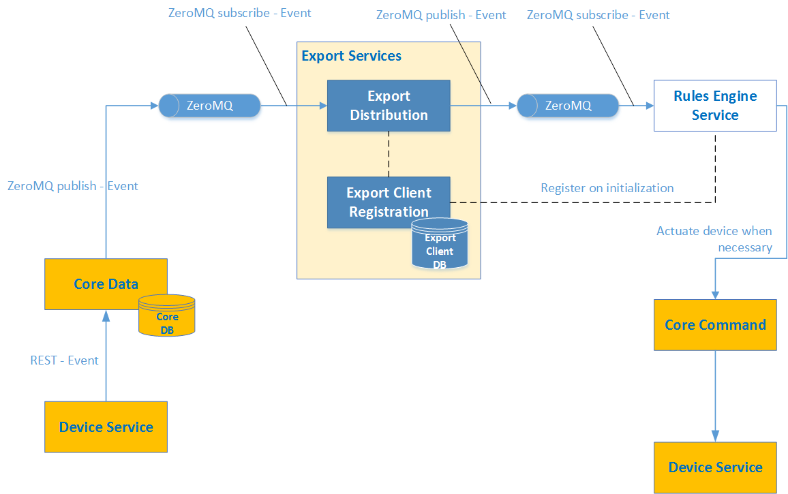
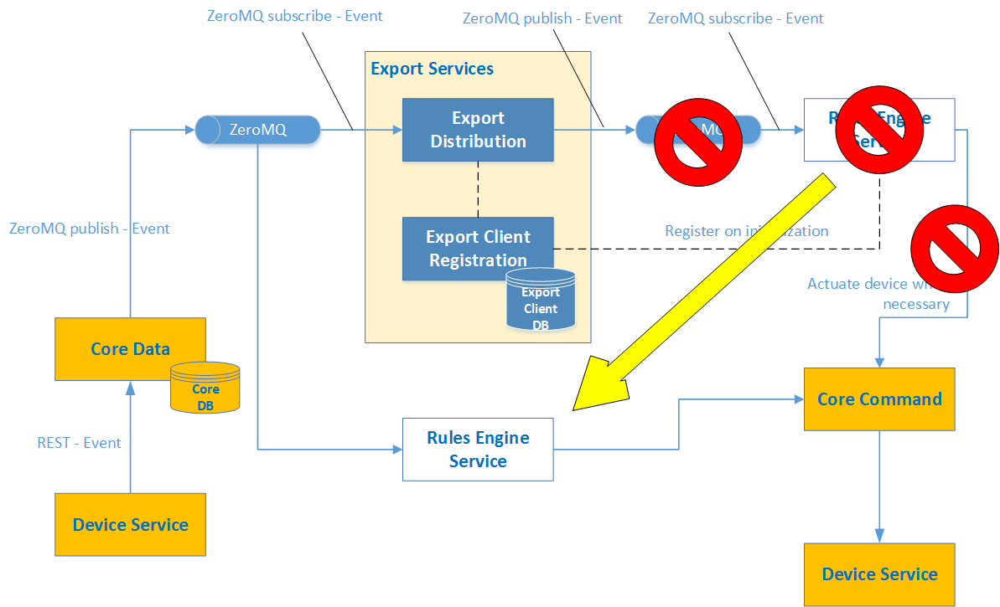
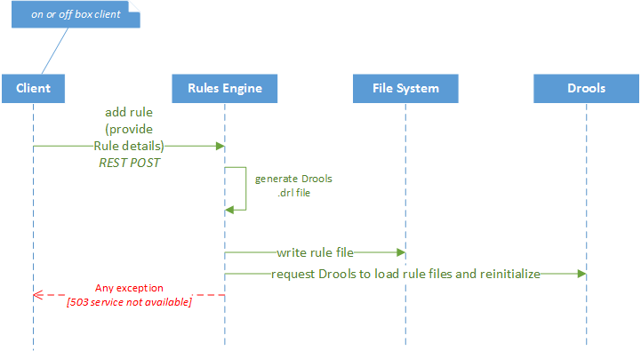
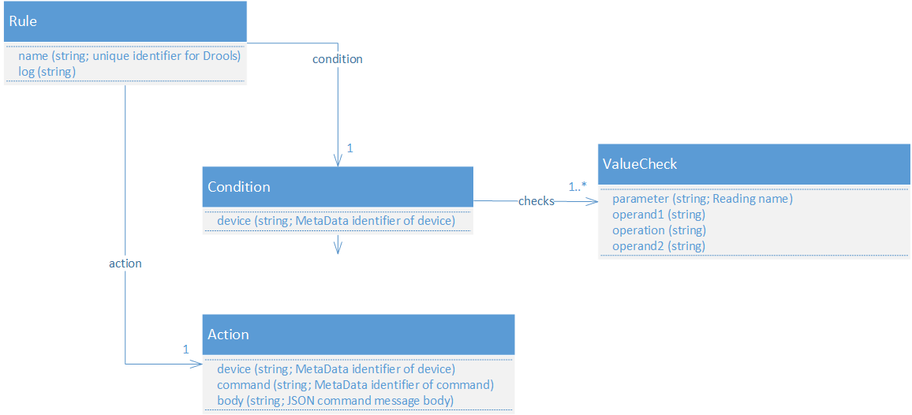

############
Rules Engine
############

.. image:: EdgeX_SupportingServicesRules.png

========================
Reference Implementation
========================

The Rules Engine microservice provides a reference implementation, edge-event triggering mechanism. The rules engine service monitors incoming sensor or device data for readings within target ranges and triggers immediate device actuation. Therefore, the rules engine provides "intelligence" at, or near, the network edge for faster response times.

The implementation uses a Drools (https://www.drools.org/) rules engine at its core. Drools is an open source rules engine provided by the JBoss community. This microservice is able to be replaced or augmented by many other edge-analytic capabilities provided by 3rd parties.

=====================================
Rules Engine as Export Service Client
=====================================

The reference implementation rules engine is an automatic export service client. When the service initiates, it automatically calls on the Export Client Registration microservice to register itself as a client of all device and sensor readings coming out of Core Data. As an Export Service client, the reference implementation rules engine receives all events and readings through the Export Distribution microservice. Based on data, the reference implementation rules engine is instructed to monitor each event and reading received through the Export Distribution microservice, and the rules engine triggers any actuation to a device through the Core Command microservice (which subsequently communicates the request through Device Service to communicate with the actual device).

========================================
Rules Engine Direct Connect to Core Data
========================================

In more time sensitive use cases or environment where a lot of data is being generated by the connected "things", it may be appropriate to connect the Rules Engine micro service to the data coming directly out of Core Data.  That is, to by pass the Export Services for purposes of rule-based command activation.

The rules engine has been programmed for this option.  By default, the rules engine micro service registers itself as a client of the export service.  This automatic registration can be turned off, and the rules engine can be connected directly to the ZeroMQ published data out of Core Data.  Note:  as the ZeroMQ pipe out of Core Data is a publish-subscribe mechanism, it allows for multiple subscribers.  When rules engine is connected as a subscriber, Core Data is actually publishing simultaneously to two clients or subscribers:  Export Services and Rules Engine.  In order to disconnect the Rules Engine from the Export Services (as a client) and connect it directly to Core Data, the following Rules Engine micro service configuration parameters (found in application.properties) must be changed:

::

  export.client=true    # this is normally false by default and is the indication to the Rules Engine micro service to register itself with the Export Services  
  export.zeromq.port=5563    # this port is set to 5566 when connecting to the ZeroMQ pipe out of Export Services.
  export.zeromq.host=tcp://[core data host]    # this is set to the export distro host when connecting to the ZeroMQ pipe out of Export Services

===============================================
Rules Client and High Level Interaction Diagram
===============================================

The Rules Engine microservice comes with a RESTful service that enables new rules to be added and removed. The RESTful API enables new rules, defined in JSON, to be dynamically added to the rules engine (through the REST POST). The JSON data provided is translated into Drools Rules files (.drl files) by the microservice. Each rule must be associated to a unique name that is used to identify the rule and the Drool file that holds it. Rules can also be requested to be removed by name. 

Note: Due to issues within Drools, a rule that is removed is only emptied of contents. The name of the rule (and the file that represents it) are still in the system. Therefore, rule names cannot be reused until the Rules Engine microservice is stopped and the empty Drool files are physically deleted.

===============================
Rules (Defined), and Data Model
===============================

Rules are provided to the Rules Engine microservice directly through the Rules Engine REST API or indirectly using the client UI. 

A rule is defined in 4 parts:  name, log entry, condition, and action.

**Name**

The name uniquely identifies the rule. 

**Log Entry**

The log entry, or simply log, is the text to be sent to the log when the rule condition is met and the action is triggered.

**Condition**

The condition specifies which data (from the Event/Reading supplied through the Export Service) to monitor. Specifically, the condition element of a rule specifies the device ID or name of the device to monitor, and the value checks (or simply "checks") to perform on sensor values collected on that device. The device ID or name must match the device ID or name specified in the Event object that is sent by Core Data to the Export Service and then relayed to the Rules Engine Service (through 0MQ).

A value check specifies a parameter of the sensor to monitor and test to apply to the parameter. The ValueCheck parameter must match one of the the Reading names associated to the Event provided by CoreData (and is also the name of a legal ValueDescriptor). For example, on a thermostat sensor, the Reading may be reporting the current temperature. Therefore, the Reading name would be "temperature" and in order for rule to test the data from this sensor reading, a value check for the same device must contain a parameter of "temperature" as well. The operand1, operation, and operand2 must specify an equation around the parameter that the Rules Engine uses to determine whether to trigger the action. For example, a ValueCheck that wishes to specify to the Rules Engine to check all temperature reading "value" for any temperature above 72 degrees would specify it as follows:

:: 

  parameter:  temperature

  operand1:  value

  operation:  >

  operand2: 72

Because the data in an Event's Reading may be reported in string form, the ValueCheck operands can and should be specified using Java syntax which is negotiated before the evaluation to create the appropriate type data for comparison. If temperature readings were represented as strings in Core Data, then the same ValueCheck would be specified as follows:

::

  parameter:  temperature

  operand1:  Integer.parseInt(value)

  operation:  >

  operand2: 72

Lastly, the action specified in a rule specifies which command to trigger on a device or sensor and which data or parameters to send to the device as part of that call. The actual call is made through the Core Command microservice in REST form. Therefore, the action must specify the following items:

* The device identifier (per Metadata) that is to be called on
* The Command identifier (per Metadata) to be executed against the device
* The data supplied as part of the Command call

Thus the data to be provided as part of the call is JSON data to be supplied in the body of the Command POST call.  An example of the action properties is as follows:

device: 56325f7ee4b05eaae5a89ce1  (the identifier of a device or sensor in Meta Data)

command: 56325f6de4b05eaae5a89cdc (a command ID associated to the device per Meta Data)

body:  {\\\"value\\\":\\\"3\\\"} (the JSON data supplied in the REST message body).

When creating a Rule in JSON to be POST submitted through the Rules Engine client, the entire Rule would be represented as shown below:

::

   {"name":"motortoofastsignal", "condition": {"device":"562114e9e4b0385849b96cd8","checks":[ {"parameter":"RPM", "operand1":"Integer.parseInt(value)", "operation":">","operand2":"1200" } ] }, "action" : {"device":"56325f7ee4b05eaae5a89ce1","command":"56325f6de4b05eaae5a89cdc","body":"{\\\"value\\\":\\\"3\\\"}"},"log":"Patlite warning triggered for engine speed too high" }

==========================
Rules Engine Configuration
==========================

The Rules Engine microservice has several configuration properties that are specific to rules engine operations.  Additional configuration, such as the microservice's server port, are standard among EdgeX microservices and won't be covered here.  The critical properties in the rules engine microservice are located in application.properties.  Note that the source code contains an application.properties file in the /src/main/resources folder that serves as the default for development environments (typically) versus the application.properties in the docker-files folder of the source that provides the standard default for the Dockerized version of the microservice.  The examples shown below are those from the /src/main/resources defaults.

**Automatic Rules Engine as an Export Distro client**

::
  
  export.client=true

When the rules engine microservice comes up, in order to receive data (the sensor Events/Readings) from EdgeX, it automatically registers as an export data client through the export client micro service.  If you do not want the rules engine to automatically receive that data from the export services (namely export distro), set export.client to false.

In particular, as outlined above, you may wish the rules engine microservice to receive data directly from core data versus the export services and thus may wish export.client set to false.

**Rules Engine Export Distribution Registration**

::

  export.client.registration.url=http://localhost:48071/api/v1export.client.registration.name=EdgeXRulesEngine
  #how long to wait to retry registration
  export.client.registration.retry.time=10000
  #how many times to try registration before exiting
  export.client.registration.retry.attempts=100

If export.client is set to true to have the rules engine microservice be a client of the export services, then additional properties need to be specified to indicate the location of the export client registration microservice (this may vary per environment – like in a development versus docker environment), and the name to use for the rules engine with the export client when registering the rules engine.

**Core Data’s Zero MQ Connection information**

::

  export.zeromq.port=5566
  export.zeromq.host=tcp://localhost

As already indicated above in the Rules Engine Direct Connect to Core Data section, if Rules Engine is to be connected directly to the data feed (ZeroMQ) coming from Core Data, additional properties must be provided to specify the port and address for subscribing to the Core Data feed.  Again, these may differ per environment (for instance local development versus a Dockerized environment).

**Location and Name of the Drools Template** 

::

  #Drools drl resource path
  rules.default.path=edgex/rules
  rules.packagename=org.edgexfoundry.rules
  rules.fileextension=.drl
  rules.template.path=edgex/templates
  rules.template.name=rule-template.drl
  rules.template.encoding=UTF-8

The rules engine is using Drools under the covers.  When creating new rules via the rules engine microservice APIs, the rules engine must have access to a base template (a Drool file with a .drl extension by default) for creating new rules.  The template carries certain imports and EdgeX device command call structure that is used by the rules engine to monitor the incoming data and actuate devices/sensors via the Command microservice.  The location of the template, name of the template file and other properties associated to the template must be specified in the configuration properties.  Typically, only the location of the template file changes per environment.

===============
Data Dictionary
===============

+---------------------+--------------------------------------------------------------------------------------------+
|   **Class Name**    |   **Descrption**                                                                           | 
+=====================+============================================================================================+
| Action              | The command that is executed when a Condition is met.                                      | 
+---------------------+--------------------------------------------------------------------------------------------+
| Condition           | The object describing the device and its ValueCheck condition that embodies a Rule.        | 
+---------------------+--------------------------------------------------------------------------------------------+
| Rule                | The object containing the Condition and Action that define the Rule.                       | 
+---------------------+--------------------------------------------------------------------------------------------+
| ValueCheck          | The mathematical expression evaluated for a Condition.                                     | 
+---------------------+--------------------------------------------------------------------------------------------+

