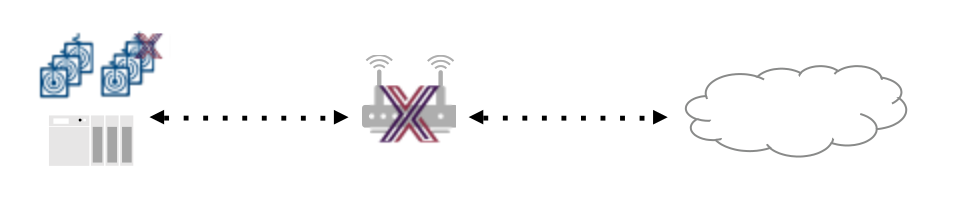

####################################
EdgeX Demonstration API Walk Through
####################################

In order to better appreciate the EdgeX Foundry micro services (what they do and how they work), how they inter-operate with each other, and some of the more important API calls that each micro service has to offer, this demonstration API walk through shows how a device service and device are established in EdgeX, how data is sent flowing through the various services, and how data is then shipped out of EdgeX to the cloud or enterprise system.

Through this demonstration, you will play the part of various EdgeX micro services by manually making REST calls in a way that mimics EdgeX system behavior.  After exploring this demonstration, and hopefully exercising the APIs yourself, you should have a much better understanding of how EdgeX Foundry works.

.. toctree::
   :maxdepth: 1
   :caption: Contents:

   Ch-WalkthroughSetup
   Ch-WalkthroughRunning
   Ch-WalkthroughUseCase
   Ch-WalkthroughData
   Ch-WalkthroughDeviceProfile
   Ch-WalkthroughDeviceService
   Ch-WalkthroughProvision
   Ch-WalkthroughCommands
   Ch-WalkthroughReading
   Ch-WalkthroughExporting

Next `Setup your environment 〉 <Ch-WalkthroughSetup.html>`_
