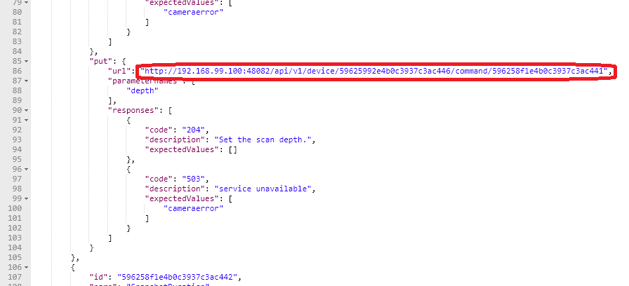

####################################
Calling commands
####################################

Recall that the Device Profile (the camera monitor profile) included a number of Commands to get and put information from any Device of that type.  Also recall that the Device (the countcamera1) was associated to the Device Profile (the camera monitor profile) when the Device was provisioned.

List the Commands
------------------

.. _`APIs Core Services Command`: https://github.com/edgexfoundry/edgex-go/blob/master/core/command/raml/core-command.raml

See `APIs Core Services Command`_

Now with all the setup complete, you can ask the Core Command micro service for the list of Commands associated to the Device (the countcamera1).

::

   GET to http://localhost:48082/api/v1/device/name/countcamera1

Note all of the URLs returned as part of this response!  These are the URLs that clients (internal or external to EdgeX) can call to trigger the various get and put offerings on the Device.

Check the Value Descriptors
^^^^^^^^^^^^^^^^^^^^^^^^^^^

.. _`APIs Core Services Core Data`: https://github.com/edgexfoundry/edgex-go/blob/master/api/raml/core-data.raml

See `APIs Core Services Core Data`_

See that the Value Descriptors are in Core Data.  There should be a total of 5 Value Descriptors in Core Data.  Note that Value Descriptors are stored in Core Data, yet referenced in Metadata.  This is because as data coming from a Device is sent to Core Data, Core Data may need to validate the incoming values against the associated Value Descriptor parameters (like min, max, etc.) but without having to make a trip to Core Metadata to do that validation.  Getting data into Core Data is a key function of EdgeX and must be accomplished as quickly as possible (without having to make additional REST requests).

::

   GET to http://localhost:48080/api/v1/valuedescriptor

While we're at it, check that no data has yet been shipped to Core Data.  Since the Device Service and Device are in this demonstration wholly manually driven by you, no sensor data should yet have been collected.  You can test this theory by asking for the count of Events in Core Data.

::

   GET to http://localhost:48080/api/v1/event/count

Execute a Command
-----------------

While there is no real Device or Device Service in this walk through, EdgeX doesn't know that.  Therefore, with all the configuration and setup you have performed, you can ask EdgeX to set the scan depth or set the snapshot duration to the camera, and EdgeX will dutifully try to perform the task. Of course, since no Device Service or Device exists, as expected EdgeX will ultimately responds with an error. However, through the log files, you can see a Command made of the Core Command micro service, attempts to call on the appropriate Command of the fictitious Device Service that manages our fictitious camera.

For example sake, let's launch a Command to set the scan depth of countcamera1 (the name of the single human/dog counting camera Device in EdgeX right now). The first task to launch a request to set the scan depth is to get the URL for the Command to "PUT" or set a new scan depth on the Device.  As seen above request a list of the Commands by the Device name with the following API on Core Command

::

   GET to http://localhost:48082/api/v1/device/name/countcamera1

Now locate and copy the URL for the PUT Depth Command.  Because of the IDs used, this will be different on each system so a generic API call will not suffice here.  Below is a picture containing a slice of the JSON returned by the GET request above and desired PUT Command URL highlighted - yours will vary based on IDs.

Copy this URL into your REST client tool of choice and make a PUT to that URL on Core Command with the new depth as the parameter with that request.

::

   PUT to http://localhost:48082/api/v1/device/<system specific device id>/command/<system specific command id>

::

   BODY:  {"depth":"9"}

Again, because no Device Service (or Device) actually exists, Core Command will respond with an HTTP 502 Bad Gateway error.  However, checking the logging output will prove that the Core Command micro service did receive the request and attempted to call on the non-existent Device Service to issue the actuating command.

::

   docker logs edgex-core-command

::

   INFO: 2019/02/15 19:32:13 Issuing GET command to: http://172.17.0.1:49977/api/v1/devices/5c6711419f8fc200010f4ada/scandepth
   ERROR: 2019/02/15 19:32:13 Get http://172.17.0.1:49977/api/v1/devices/5c6711419f8fc200010f4ada/scandepth: dial tcp 172.17.0.1:49977: getsockopt: connection refused

Next you can start `Sending events and reading data 〉 <Ch-WalkthroughReading.html>`_

