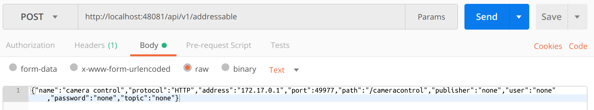

####################################
Defining your data
####################################

When a new Device Service is first started in EdgeX, there are many many tasks to perform - all in preparation for the Device Service to manage one or more Devices, which are yet unknown to EdgeX.  In general, the Device Service tasks when it first starts can be categorized into:

* Establish the reference information around the Device Service and Device.
* Make the Device Service itself known to the rest of EdgeX
* Provision the Devices the Device Service will manage with EdgeX

Reference information includes things such as defining the address (called an **Addressable**) of the Device and Device Service or establishing the new unit of measure (called a **Value Descriptor** in EdgeX) used by the Device.  The term "provision" is the way we talk about establishing the initial connection to the physical Device and have it be known to and communication with EdgeX.

After the first run of a Device Service, these steps are not repeated.  For example, after its initial startup, a Device Service would not need to re-establish the reference information into EdgeX.  Instead,it would simply check that these operations have been accomplished and do not need to be redone.

Creating Reference Information in EdgeX
---------------------------------------

There is a lot of background information that EdgeX needs to know about the Device and Device Service before it can start collecting data from the Device or send actuation commands to the Device.  Say, for example, the camera Device wanted to report its human and canine counts.  If it were to just start sending numbers into EdgeX, EdgeX would have no idea of what those numbers represented or even where they came from.  Further, if someone/something wanted to send a command to the camera, it would not know how to reach the camera without some additional information like where the camera is located on the network.  

This background or reference information is what a Device Service must define in EdgeX when it first comes up.  The API calls here give you a glimpse of this communication between the fledgling Device Service and the other EdgeX micro services.  

By the way, the order in which these calls are shown may not be the exact order that a Device Service does them.  As you become more familiar with Device Services and the Device Service SDK, the small nuances and differences will become clear.

Addressables
------------

.. _`APIs Core Services Metadata`: https://github.com/edgexfoundry/edgex-go/blob/master/api/raml/core-metadata.raml

See Core Metadata API RAML at `APIs Core Services Metadata`_ 

The Device Service will often establish at least two Addressable objects with the Core Metadata micro service.  An Addressable is a flexible EdgeX object that specifies a physical address of something - in this case the physical address of the Device Service and the Device (the camera).  While an Addressable could be created for a named MQTT pipe or other protocol endpoint, for this example, we will assume that both the Device Service and Device are able to be reached via HTTP REST calls.  

So in this case, the Device Service would make two calls to Core Metadata, to create the Addressable for the Device Service:

::

   POST to http://localhost:48081/api/v1/addressable

:: 

   BODY: {"name":"camera control","protocol":"HTTP","address":"172.17.0.1","port":49977,"path":"/cameracontrol","publisher":"none","user":"none","password":"none","topic":"none"}

and the Addressable for the Device (the camera in this case):

:: 

   POST to http://localhost:48081/api/v1/addressable

::

   BODY: {"name":"camera1 address","protocol":"HTTP","address":"172.17.0.1","port":49999,"path":"/camera1","publisher":"none","user":"none","password":"none","topic":"none"}

Note that for an Addressable, a unique name must be provided.  Obviously, these address are phony and made up for the purposes of this exercise.  This is OK and it will still allow you to see how your Device and Device Services will work going forward.

**Walk Through Alert!**

If you are using Postman, be sure that you are POSTing raw data, not form-encoded data.

If your API call was successful, you will get a generated ID for your new Addressable that looks like this:

::

   5b773ad19f8fc200012a802d

Value Descriptors
-----------------

.. _`APIs Core Services Core Data`: https://github.com/edgexfoundry/edgex-go/blob/master/api/raml/core-data.raml

See Core Data API RAML at `APIs Core Services Core Data`_

Next, the Device Service needs to inform EdgeX about the type of data it will be sending on the behalf of the Devices.  If you are given the number 5, what does that mean to you?  Nothing, without some context and unit of measure.  For example, if I was to say 5 feet is the scan depth of the camera right now, you have a much better understanding about what the number 5 represents.  In EdgeX, Value Descriptors provide the context and unit of measure for any data (or values) sent to and from a Device.  As the name implies, a Value Descriptor describes a value - its unit of measure, its min and max values (if there are any), the way to display the value when showing it on the screen, and more.  Any data obtained from a Device (we call this "get" from the Device) or any data sent to the Device for actuation (we call this "set" or "put" to the Device) requires a Value Descriptor to be associated with that data.

In this demo, there are four Value Descriptors required:  human count, canine count, scan depth, and snapshot duration.  The Device Service would make four POST requests to Core Data to establish these Value Descriptors.

**Walk Through alert!**

Pay attention to the port numbers. In the previous section you were calling the core-metadata service (port 48081), in these you will be calling core-data (port 48080)

::

   POST to http://localhost:48080/api/v1/valuedescriptor

::

   BODY:  {"name":"humancount","description":"people count", "min":"0","max":"100","type":"I","uomLabel":"count","defaultValue":"0","formatting":"%s","labels":["count","humans"]}

::

   POST to http://localhost:48080/api/v1/valuedescriptor

::

   BODY:  {"name":"caninecount","description":"dog count", "min":"0","max":"100","type":"I","uomLabel":"count","defaultValue":"0","formatting":"%s","labels":["count","canines"]}

::

   POST to http://localhost:48080/api/v1/valuedescriptor

::

   BODY:  {"name":"depth","description":"scan distance", "min":"1","max":"10","type":"I","uomLabel":"feet","defaultValue":"1","formatting":"%s","labels":["scan","distance"]}

::

   POST to http://localhost:48080/api/v1/valuedescriptor

::

   BODY:  {"name":"duration","description":"time between events", "min":"10","max":"180","type":"I","uomLabel":"seconds","defaultValue":"10","formatting":"%s","labels":["duration","time"]}

An error can occur when communication with the camera.  Therefore a fifth Value Descriptor is created for this eventuality.

:: 

   POST to http://localhost:48080/api/v1/valuedescriptor

::
 
   BODY:  {"name":"cameraerror","description":"error response message from a camera", "min":"","max":"","type":"S","uomLabel":"","defaultValue":"error","formatting":"%s","labels":["error","message"]}

Again, the name of each Value Descriptor must be unique (within all of EdgeX).  The type of a Value Descriptor indicates the type of the associated value: I (integer), F (floating point number), S (character or string), B (boolean), or J (JSON object).  Formatting is used by UIs and should follow the printf formatting standard for how to represent the associated value.

**Walk Through alert!**

If you make a GET call to the `http://localhost:48080/api/v1/valuedescriptor` URL you will get a listing (in JSON) of all the Value Descriptors currently defined in your instance of EdgeX, including the ones you just added.

Next you will be `Defining your device 〉 <Ch-WalkthroughDeviceProfile.html>`_

