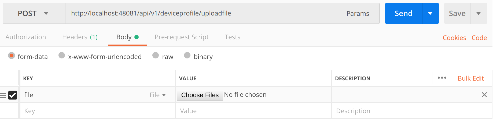

####################################
Defining your device
####################################

A Device Profile can be thought of as a template or as a type or classification of Device.  General characteristics about the type of Device, the data theses Devices provide, and how to command them is all provided in a Device Profile.  Other pages within these docs provide more details about a Device Profile and its purpose (see :doc:`../Ch-Metadata` to start).  It is typical that as part of the reference information setup sequence, the Device Service provides the Device Profiles for the types of Devices it manages.

Adding a Device Profile
-----------------------

.. _`APIs Core Services Metadata`: https://github.com/edgexfoundry/edgex-go/blob/master/api/raml/core-metadata.raml

See Core Metadata API RAML at `APIs Core Services Metadata`_ 

Our fictitious Device Service will manage only the human/dog counting camera, so it only needs to make one POST request to create the monitoring camera Device Profile. Since Device Profiles are often represented in YAML, make a muti-part form-data POST with the Device Profile file below to create the Camera Monitor profile.

::

   POST to http://localhost:48081/api/v1/deviceprofile/uploadfile

No headers

FORM-DATA:

   key:  "file"
   
   value:  :download:`EdgeX_CameraMonitorProfile.yml <EdgeX_CameraMonitorProfile.yml>`

**Walk Through alert!**

In this step you will want to use the `form-data` POST format in Postman, with a key named "file" of type "File". Download and use the provided :download:`EdgeX_CameraMonitorProfile.yml <EdgeX_CameraMonitorProfile.yml>` for this.

Each profile has a unique name along with a description, manufacturer, model and collection of labels to assist in queries for particular profiles.  These are relatively straightforward attributes of a profile.

Understanding Commands
----------------------

The Device Profile defines how to communicate with any Device that abides by the profile.  In particular, it defines the Commands that can be sent to the Device (via the Device Service).  Commands are named and have either a get (for retrieving data from the Device) or put (to send data to the Device) or both.  Each Command can have a single get and single put.  Both get and put are optional, but it would not make sense to have a Command without at least one get or at least one put.  The Command name must be unique for that profile (the Command name does not have to be unique across all of EdgeX - for example, many profiles may contain a "status" Command).

Understanding Command Gets and Puts
-----------------------------------

The get and put each have a path which is used by EdgeX to call on the specific Command get or put at the URL address provided for the service.  Hypothetically, if the address to a Device Service was "http://abc:9999" and the get Command had a path of "foo", then internally, EdgeX would know to use "http://abc:9999/foo" to call on the get Command.

Get and puts then have response objects (an array of response objects).  A get must have at least one response object.  A put is not required to have a response.  Responses might be "good" or "error" responses.  Each get should have at least one "good" response, but it may have several error responses depending on what problems or issues the Device Service may need to reply with.  Each response is made up of a code (which suggests if it is a good or error response), a description (human readable information about what is in the response), and an array of expected values.  For practical purposes, the code is usually an HTTP status code like 200 (for good responses), 404 or 503 (examples of bad responses).

The expected values in a response are an array of Value Descriptor names.  If a call to an get Command is expected to return back the human and dog count data, then the response's expected values would be:  [humancount, caninecount].  When the actual call to the Device Service is made, the body of the return response from the service is expected to return a value for each of the expected values in a map where the Value Descriptor names are used as keys.  Again, using the human and dog counts as an example, if the expected values were [humancount, caninecount] then the body of a good response from the service would contain a map that looks something like this:

::

   {

     humancount: 5,
     caninecount: 2

   }

Here is an example set of responses that might be used for a get Command in the camera example.  Note that one response is coded as the "good" response (code 200) while the other is for "error" response (code 404).  The expected values for the good response are the Value Descriptor names for the camera's count data.  The expected values for the "error" response is the Value Descriptor name for an error message.

::

   "responses":[

               {"code":"200","description":"ok","expectedValues":["humancount", "caninecount"]},
               {"code":"404","description":"bad request","expectedValues":["cameraerror"]}

              ]

          }

Understanding Command Parameters
--------------------------------

Commands are used to send data to Devices (via Device Services) as much as they are used to get data from Devices.  Therefore, any Command may have a set of parameters associated with its call.  Parameter data is added to the body of the Command request. Parameters are defined via an array of ``parameterNames`` on a Command.  

Here again, this array is just an array of Value Descriptor names.  Each Value Descriptor defines the name and type of information to be supplied as a parameter to the Command call.  For example, if a Command had a parameterNames array of ``[depth, duration]``, then the receiving command is expecting values that match the ``depth`` and ``duration`` Value Descriptors.  

Similar to the way expected values are used to set the keys of the response body, the paremater names are used as keys in a map to pass parameter values in a Command call that has parameters.  Here might be what is populated in the body of the Command call when the ``parameterNames`` are ``[depth, duration]``.

::

  {
    depth: 1,
    duration: 10
  }

If you open the :download:`CameraMonitorProfile.yml <EdgeX_CameraMonitorProfile.yml>` file, see that there are Commands to get people and dog counts (and a command called Counts, which provides both values).  There are also commands to get/put the snapshot duration and scan depth.  Also note the expected values for the Commands.  The expected values should match the name of the Value Descriptors from above that give context to the returned values.  In real implementations, the Device Profile may contain many more details (like device resource and resource elements) to assist the Device Service in its communications with Devices.

**Expected Values Alert!**

* Metadata does not currently check that the expected values match an existing Value Descriptor by name.  Therefore, make sure you provide the expected values array carefully when creating Device Profiles.

Next you need to `Register your Device Service 〉 <Ch-WalkthroughDeviceService.html>`_

