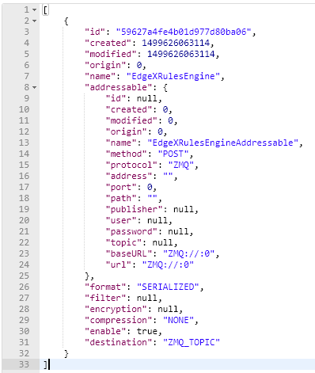

####################################
Exporting your device data
####################################

Great, so the data sent by the camera Device makes it way to Core Data.  How can that data be sent to an enterprise system or the Cloud?  How can that data be used by an edge analytics system (like the Rules Engine provided with EdgeX) to actuate on a Device?  Anything wishing to receive the sensor/device data as it comes into EdgeX must register as an "export" client.

Export Clients
--------------

In fact, by default, the Rules Engine is automatically registered as a client of the export services and automatically receives all the Events/Readings from Core Data that are sent by Devices.  To see all the existing export clients, you can request a list from the Export Client micro service.

::

   GET to http://localhost:48071/api/v1/registration

The response from Export Client is a list of registered client details - in this case just the Rules Engine is registered.

Register an Export Client
-------------------------

To register a new client to receive EdgeX data, you will first need to setup a client capable of receiving HTTP REST calls, or an MQTT topic capable of receiving messages from EdgeX.  For the purposes of this demonstration, let's say there is an cloud based MQTT Topic that has been setup ready to receive EdgeX Event/Reading data.  To register this MQTT endpoint to receive all Event/Reading data, in JSON format, but encrypted, you will need to request Export Client to make a new EdgeX client.

:: 

   POST to http://localhost:48071/api/v1/registration

::

   BODY: {"name":"MyMQTTTopic","addressable":{"name":"MyMQTTBroker","protocol":"TCP","address":"tcp://m10.cloudmqtt.com","port":15421,"publisher":"EdgeXExportPublisher","user":"hukfgtoh","password":"mypass","topic":"EdgeXDataTopic"},"format":"JSON","encryption":{"encryptionAlgorithm":"AES","encryptionKey":"123","initializingVector":"123"},"enable":true,"destination":"MQTT_TOPIC"}
   	 
 		 
Note that the Addressable for the REST address is built into the request.

Now, should a new `Event be posted <Ch-WalkthroughReading.html>`_ to Core Data, the Export Distro micro service will attempt to sent the encrypted, JSON-formated Event/Reading data to the MQTT client.  Unless you have actually setup the MQTT Topic to receive the messages, Export Distro will fail to deliver the contents and an error will result.  You can check the Export Distro log to see the attempt was made and that the EdgeX Export services are working correctly, despite the non-existence of the receiving MQTT Topic.

MQTTOutboundServiceActivator: message sent to MQTT broker:  

::

   Addressable [name=MyMQTTBroker, protocol=TCP, address=tcp://m10.cloudmqtt.com, port=15421, path=null, publisher=EdgeXExportPublisher, user=hukfgtoh, password=mypass, topic=EdgeXDataTopic, toString()=BaseObject [id=null, created=0, modified=0, origin=0]] : 596283c7e4b0011866276e9

###########################
Building your own solutions
###########################

.. _`SDK that generates Device Service`: Ch-GettingStartedSDK.html

Congratulations, you've made it all the way through the Walkthrough tutorial! 

Now that you understand how EdgeX Foundry works, you can get started building your own solutions using our `SDK that generates Device Service`_.

