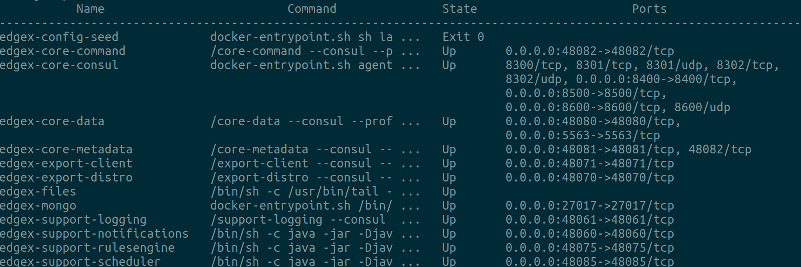

####################################
Running EdgeX
####################################

If you you have already followed :doc:`../Ch-GettingStartedUsers` you will have already downloaded and started these containers, and you can skip this step and go right to the the :doc:`Ch-WalkthroughUseCase`

--------------------------------
Download the docker-compose file
--------------------------------

After installing Docker and Docker Compose, you need to get a Docker Compose file.  EdgeX Foundry has over 12 microservices, each deployed in their own Docker container, and the Docker Compose file will make it easier to download and run them all. 

A Docker Compose file is a manifest file, which lists:

* The Docker containers (or more precisely the Docker container images) that should be downloaded, 
* The order in which the containers should be started
* The parameters under which the containers should be run

It is recommended that you use the lastest version of EdgeX Foundry. As of this writing, the latest version can be found here: https://github.com/edgexfoundry/developer-scripts/blob/master/compose-files/docker-compose-california0.6.1.yml

Save this file as ``docker-compose.yml`` in your working directory so that the following commands will find it.

-----------------------
Download the containers
-----------------------

Once you have downloaded the ``docker-compose.yml`` file, run the following command to download the containers for each of the EdgeX Foundry microservices.

+------------------------------------+-------------------------------------------------------------------------------------+------------------------------------------------+
|   **Docker Command**               |   **Description**                                                                   |  **Suggested Waiti Time After Completing**     |
+====================================+=====================================================================================+================================================+
| docker-compose pull                |  Pull down, but don't start, all the EdgeX Foundry microservices                    | Docker Compose will indicate when all the      |
|                                    |                                                                                     | containers have been pulled successfully       |
+------------------------------------+-------------------------------------------------------------------------------------+------------------------------------------------+

--------------
Starting EdgeX
--------------

For this Walkthrough you will need to run all the services with the exception of any device services, including the device-virtual.  The reason is that many of the API calls you make as part of this walk through are actually accomplished by the virtual device service - or any device service for that matter.  In this walk through, your manual call of the EdgeX APIs often simulate the work that a device service would do to get a new device setup and to send data to/through EdgeX.  

Run the following commands to start the core, supporting and export micro services of EdgeX.

+------------------------------------+-------------------------------------------------------------------------------------+------------------------------------------------+
|   **Docker Command**               |   **Description**                                                                   |  **Suggested Waiti Time After Completing**     |
+====================================+=====================================================================================+================================================+
| docker-compose up -d volume        |  Start the EdgeX Foundry file volume--must be done before the other services are    | A couple of seconds.  In the time it takes to  |
|                                    |  started                                                                            | type the next command it shoud be ready.       |
+------------------------------------+-------------------------------------------------------------------------------------+------------------------------------------------+
| docker-compose up -d consul        |  Start the configuration and registry microservice which all services must          | A couple of seconds                            |
|                                    |  register with and get their configuration from                                     |                                                |
+------------------------------------+-------------------------------------------------------------------------------------+------------------------------------------------+
| docker-compose up -d config-seed   |  Populate the configuration/registry microservice                                   | A couple of seconds                            |
+------------------------------------+-------------------------------------------------------------------------------------+------------------------------------------------+
| docker-compose up -d mongo         |  Start the NoSQL MongoDB container                                                  | 10 seconds                                     |
+------------------------------------+-------------------------------------------------------------------------------------+------------------------------------------------+
| docker-compose up -d logging       |  Start the logging microservice - used by all micro services that make log entries  | A couple of seconds                            |
+------------------------------------+-------------------------------------------------------------------------------------+------------------------------------------------+
| docker-compose up -d notifications |  Start the notifications and alerts microservice--used by many of the microservices | 30 seconds                                     |
|                                    |  Note: this service is still implemented in Java and takes more time to start       |                                                |
+------------------------------------+-------------------------------------------------------------------------------------+------------------------------------------------+
| docker-compose up -d metadata      |  Start the Core Metadata microservice                                               | A couple of seconds                            |
+------------------------------------+-------------------------------------------------------------------------------------+------------------------------------------------+
| docker-compose up -d data          |  Start the Core Data microservice                                                   | A couple of seconds                            |
+------------------------------------+-------------------------------------------------------------------------------------+------------------------------------------------+
| docker-compose up -d command       |  Start the Core Command microservice                                                | A couple of seconds                            |
+------------------------------------+-------------------------------------------------------------------------------------+------------------------------------------------+
| docker-compose up -d scheduler     |  Start the scheduling microservice -used by many of the microservices               | 1 minute                                       |
|                                    |  Note: this service is still implemented in Java and takes more time to start       |                                                |
+------------------------------------+-------------------------------------------------------------------------------------+------------------------------------------------+
| docker-compose up -d export-client |  Start the Export Client registration microservice                                  | A couple of seconds                            |
+------------------------------------+-------------------------------------------------------------------------------------+------------------------------------------------+
| docker-compose up -d export-distro |  Start the Export Distribution microservice                                         | A couple of seconds                            |
+------------------------------------+-------------------------------------------------------------------------------------+------------------------------------------------+
| docker-compose up -d rulesengine   |  Start the Rules Engine microservice                                                | 1 minute                                       |
|                                    |  Note: this service is still implemented in Java and takes more time to start       |                                                |
+------------------------------------+-------------------------------------------------------------------------------------+------------------------------------------------+

Run **"docker-compose ps"** to confirm that all the containers have been downloaded and started.  (Note: initialization or seed containers, like config-seed, will have exited as there job is just to initialize the associated service and then exit.)

Next we'll create an `Example Use Case 〉 <Ch-WalkthroughUseCase.html>`_

