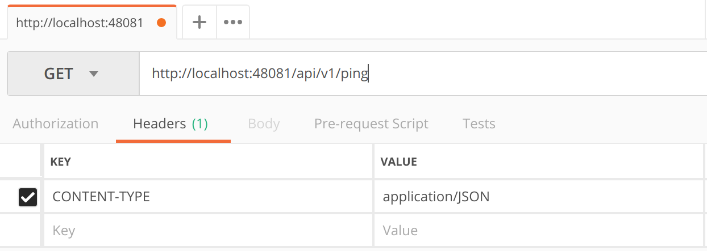

####################################
Setup up your environment
####################################

-------------------------------
Install Docker & Docker Compose
-------------------------------

To run Dockerized EdgeX Foundry, you need to install Docker.  See https://docs.docker.com/install/ to learn how to obtain and install Docker.  If you are new to using Docker, the same web site provides you additional information.  The following short video has is also very informative https://www.youtube.com/watch?time_continue=3&v=VhabrYF1nms

Docker Compose is used to orchestrate the fetch (or pull), installation, and the start and stop of the EdgeX Foundry microservice containers. See:  https://docs.docker.com/compose/ to learn more about Docker Compose. 

Docker Compose is automatically installed with Docker for Mac and Windows users. See: https://docs.docker.com/compose/install/ to determine if your Docker installation already contains Docker Compose, and how to install Compose if it does not.

You do not need to be an expert with Docker to run EdgeX Foundry.  The instructions in this guide provide you with the steps to get EdgeX Foundry running in your environment. Some basic knowledge of these two technologies of Docker and Docker Compose, are nice to have, but not required.

---------------
Install Postman
---------------

You can follow this walkthrough making HTTP calls from the command-line with a tool like `curl`, but it's easier if you use a tool designed for testing REST APIs. For that we like to use **Postman**. You can download the `native Postman app <https://app.getpostman.com/>`_ for your operating system.

**Walk Through Alert!**

It is assumed that for the purposes of this walk through demonstration

* all API micro services are running on "localhost".  If this is not the case, substitute your hostname for localhost.
* any POST call has the associated **CONTENT-TYPE=application/JSON** header associated to it unless explicitly stated otherwise.

Next, start `Running EdgeX 〉 <Ch-WalkthroughRunning.html>`_

