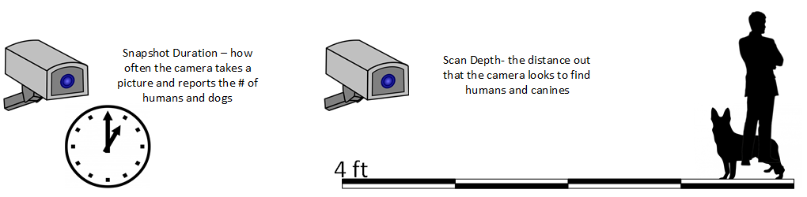
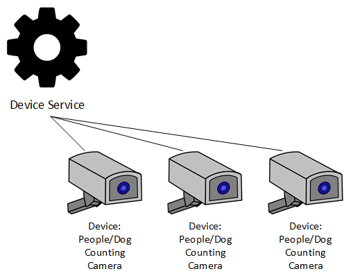

####################################
Example Use Case
####################################

Suppose you had a new device that you wanted to connect to EdgeX.  The device was a camera that took a picture and then had an on-board chip that analyzed the picture and reported the number of humans and canines (dogs) it saw.

How often the camera takes a picture and reports its findings can be configured.  In fact, the camera device could be sent two actuation commands - that is sent two requests for which it must respond and do something.  You could send a request to set its time, in seconds, between picture snapshots (and then calculating the number of humans and dogs it finds in that resulting image).  You could also request it to set the scan depth, in feet, of the camera - that is set how far out the camera looks.  The farther out it looks, the less accurate the count of humans and dogs becomes, so this is something the manufacturer wants to allow the user to set based on use case needs.

In EdgeX, the camera must be represented by a Device.  Each Device is managed by a Device Service micro service.  The Device Service communicates with the underlying hardware - in this case the camera - in the protocol of choice for that Device.  The Device Service collects the data from the Devices it manages and passes that data into EdgeX (into Core Data).  In this case, the Device Service would be collecting the count of humans and dogs that the camera sees.  The Device Service also serves to translate the request for actuation from EdgeX and the rest of the world into protocol requests that the physical Device would understand.  So in this example, the Device Service would take requests to set the duration between snapshots and to set the scan depth and translate those requests into protocol commands that the camera understood.

Exactly how this camera physically connects to the host machine running EdgeX and how the Device Service works under the covers to communicate with the camera Device is immaterial for the point of this demonstration.

Next you will be `Defining your data 〉 <Ch-WalkthroughData.html>`_

